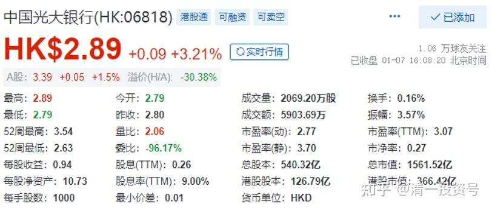
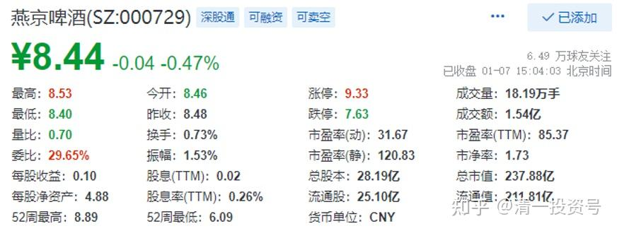
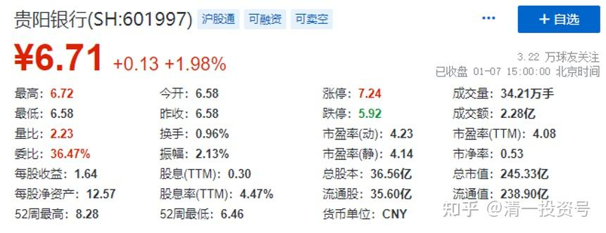
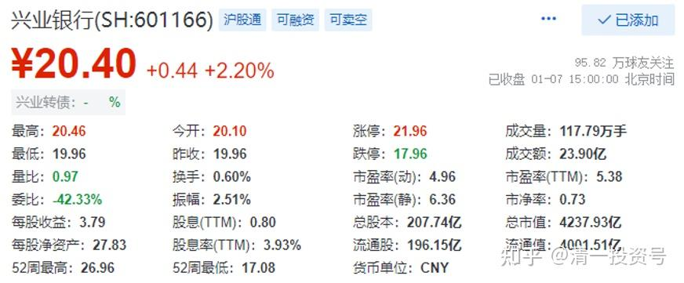

4篇.最佳的金融投资设计和容错空间

清一山长 2022年1月7日

**一、引子:光大银行**

山长 清一2022/1/6 22:01:21

截至2021年末光大银行制造业中长期贷款余额1376亿元，比年初增长46%。说明这家银行经营发展很不错。与此同时——这家银行的H股，分红都超过9%了，市净率才0.26，简直就是破产的价。这个市场，实在是疯了。**我看中国的这些大银行，还没有倒闭的迹象。**

*小雅2022/1/6 22:36:45

@山长 清一 非常抱歉，那么晚了还问您。实在是列出了好多问题写到本子上，本想这样去1.1-1.7日的财富课堂上，找机会，问山长老师的。可惜疫情不能去.还是掉进山长2016年的银行逻辑里，再来套一次看，能不能领会出什么，上次山长您发兴业的时候，就想请教您，光大如果按照2016年的银行思路，现价回报率和股息率都超过了，现金股：北京银行和农行银行，为什么不选兴业，光大？

**二、正文：最佳的金融投资设计和容错空间**

山长 清一2022/1/7 9:17:45

**最佳的金融投资设计就是：**

**在你预期的最差的情况下，你买的企业一直不涨，甚至还阴跌；甚至你还预计了你买入的企业，还可能像恒大一样意外破产的情况下，你的投资也不会失败；每年还能够拥有一笔稳定的分红，能够满足基本的生活日常所需；不用担心没钱用而流浪街头，也不用担心失业。**

**而你预计的最好的情况，就是同样是这笔投资，本金会翻几倍。**

**你只有做到了这种安排，你才是懂得“投资规划”的。才有底气去参与投资。否则，就只是赌博罢了。**

@*小雅“为什么不选兴业，光大？”

谁说我不选兴业？我原来就买了，后来涨了，卖了，现在又买了；光大也买了，现在账面是赔钱的。兴业，有可能是未来最好的银行，因为福建人最会做生意，也会做银行；北京银行，有可能是跌不下去的银行，但是不是未来涨得最好的银行，就不一定了。我的北京银行，作为现金股，已经没赚钱就卖掉了，因为燕京跌到了6元多，我到处筹钱买燕京。另外一个现金股是雅戈尔，我也卖掉了，特别是我被封掉之后，就使劲筹钱买燕京，增加了两百万股。

**所以，现金股是一种形态上跌不下去的股，不一定是高分红的股。涨了的股，就不再是现金股了。**

我的民生银行投资是失败的，亏损700多万了；我的华融是亏损的，也是几百万了；江南也亏掉几百万。甚至**这些股可能亏光，但我的配置依然是赚钱的，总的账户依然创造了新高，这就是我配置的功劳**——**我一直在准备，最差的情况下，我也不会赔钱。至于赚钱多少，先放后面。所以——我永远也不会去追热门股。因为安全系数太低。**

**燕京是我最看好的股票，甚至可以说，是我入市以来最看好的股票，所以我投资了相对最大的仓位。**居然变成了十大。我觉得这家公司找不到失败的理由，最多就是继续五年不涨。它已经15年没涨了，它没有经营失败的可能，因为它卖的东西其实没有技术含量，就像可乐一样简单。

**但我都没有敢全仓去拿燕京**，**更谈不上满仓、满融单吊燕京。它现在就算涨起来了，总市值也只是我总资产配置的四分之一还不到**。现在回过头来看，我很傻帽，白白失去了一次多赚上亿的机会。更多的钱在中国建筑以及其他不涨的股票上，在港股上耗着。

**但我的原则，就是万一我看错了燕京，这个股票退市了。我的总资产也不会失败，最多一两年就能够恢复原样。为了这个信念和原则，我需要付出上亿元的机会成本。我必须去买一些“不死不活”的，最保险的股。**虽然目前我多数风险投资是非常成功的，比如酒股，但我不敢全仓酒股，只敢拿风险金来赌，浮盈加仓，越加越多。

如果我把我买的保险股、收息股，全都换成全仓去投资我买的酒股，我这几年就大发财了。资产增值比现在多好几倍。但我不敢。所以，你们跟我的，总收益率超过我一点也不奇怪。比如你们全仓跟上我买酒股的节奏，大约资产会比我现在的回报高十倍。但——万一有一天看错了，就全完了。

**因为我用很多的资本来买了容错的空间，你们没有。**

*春丽 2022/1/7 12:11:51

@山长 清一 山长，您为了筹钱买燕京，把北京银行卖了。可否说说贵阳银行？

山长 清一2022/1/7 12:16:57

贵阳银行我被套住了，没有卖。原因是它的活性强，西部大开发对她很有利。贵阳的经济上的很猛。另外，现在看底部有收集迹象，底部平台阶段。所以没有卖了换股，我在赌她拿了配股充实资金后业绩反转的。安全性以及长期的发展，可能不如兴业。

*春丽2022/1/7 12:38:59

@山长 清一 感恩山长解答。我且拿着。跟随山长进退。

