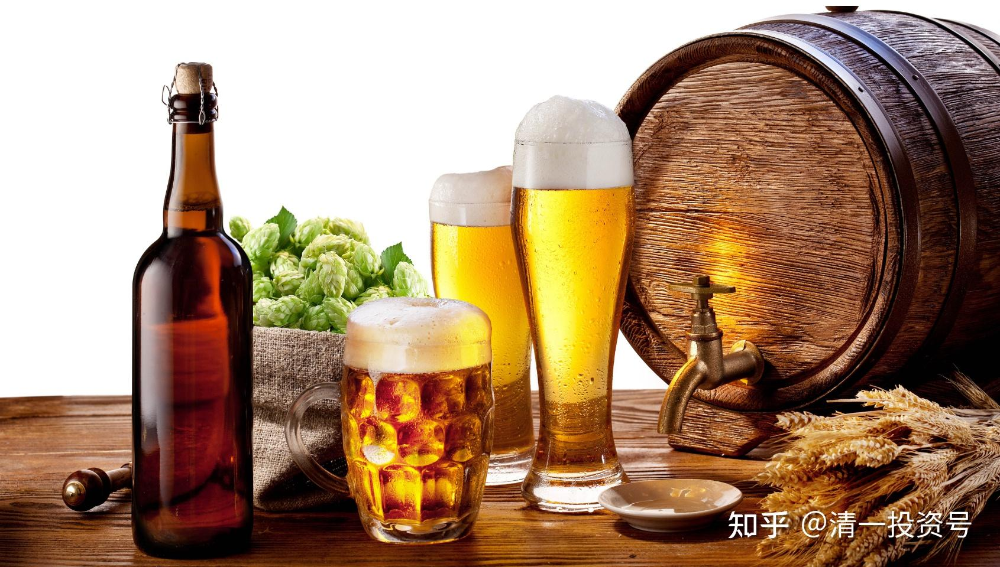
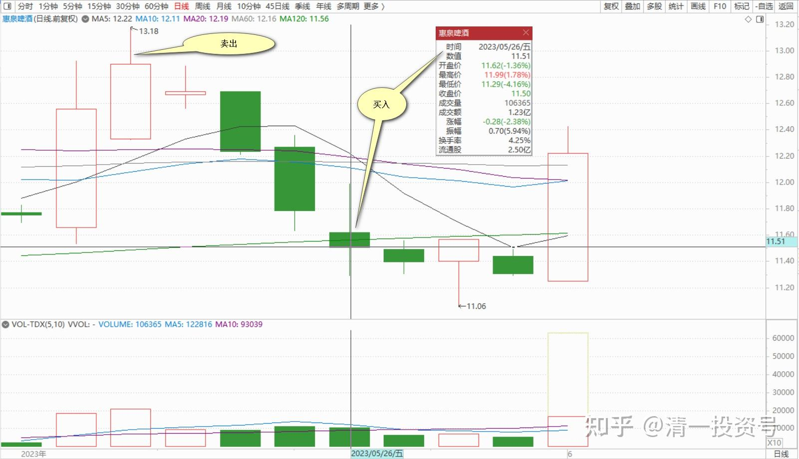

50篇. 持仓负成本的十大

清一山长 2023年5月26日

今天买回了27万股惠泉，买入均价11.51元。这是前几天冲13元的时候卖的，总共卖了60多万股，卖出价都在12.90元以上。现在的惠泉也挺疯的，我反正是涨了就卖一点，跌了买回来，做T了。惠泉的持仓成本是负数，这种负资产十大估计有点少见[微笑]。珠江有希望实现这一目标。

目前珠江的持仓成本是5.87元。问题是珠江一直在买，甚至快到9元都在买，一直没卖出。所以持仓成本和持仓数量都一路快速上涨。等以后有机会减仓的时候，成本就会快速下降了。

**参考链接：**

[39篇.抛掉珠江两年多后，现在我再度成为珠江的十大股东](https://zhuanlan.zhihu.com/p/590771192)

[45篇.惠泉冲击涨停的应对之策](https://zhuanlan.zhihu.com/p/628107462)

[46篇.珠江啤酒主力异动的联想](https://zhuanlan.zhihu.com/p/629339007)

[48篇.坚持持仓啤酒不放松！通过适当的切换品种做T，增加账面收益](https://zhuanlan.zhihu.com/p/631653956)

[49篇.啤酒行业探秘：散户是永远的输家（配图版）](https://zhuanlan.zhihu.com/p/632920800)
