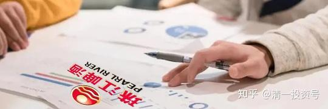
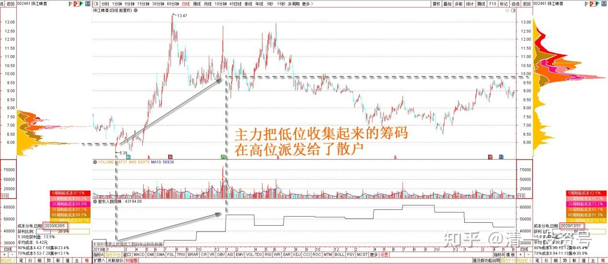
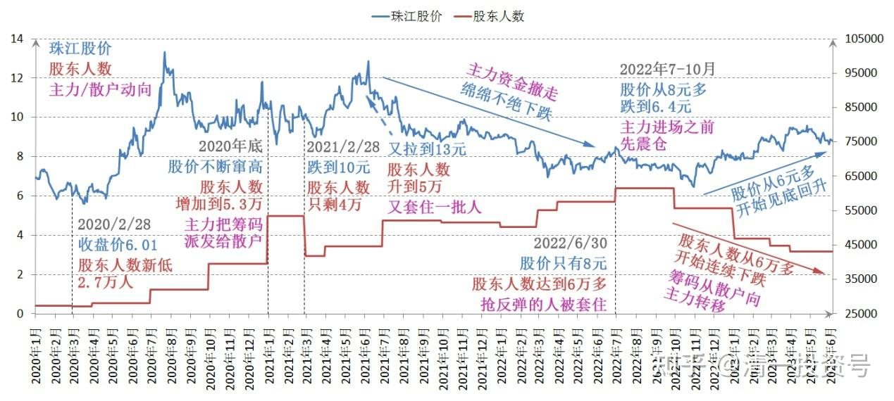
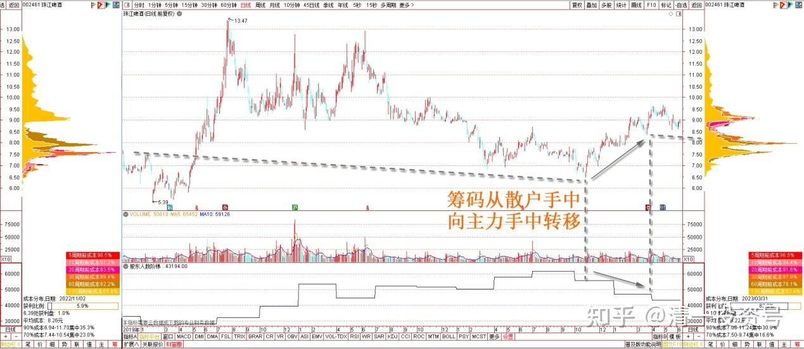
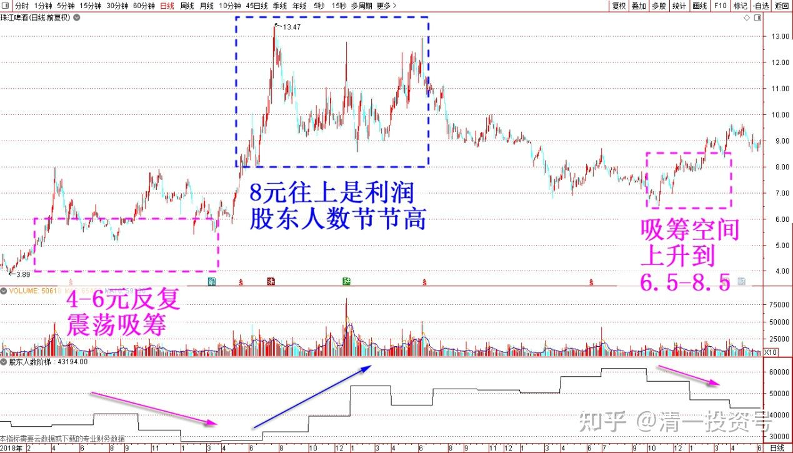
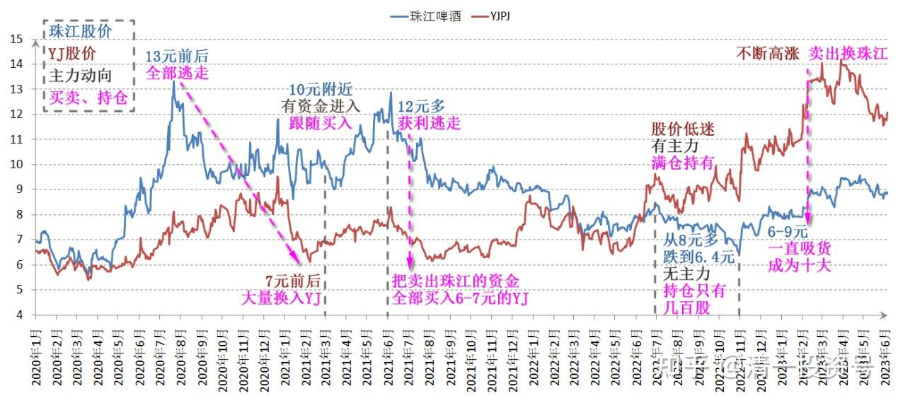

52篇.今日啤酒股普涨，盘后总结和思考！（配图版）（下）

清一山长 2023年3月31日

最后研究一下珠江的股东情况！特别有趣！说明一些核心情况正在变化！

2020年2月28日，珠江收盘价6.01元。股东人数新低——27000人！

随后，股东人数节节上升。2020年年底，从两万多股东增加到了5万3千多人，股价也不断窜高，说明随着珠江股价的高涨，散户大量涌进。主力借机把低位（5元左右）收集起来的筹码，在最高的13元上方，派发给了散户！

2021年2月28日，股东人数减少，只剩41824人了。股价也从13元，跌到10元的“底部”，这时候的YJ，才6元多不到7元。我上次当珠江十大时候的存货，在冲击13元前后，就全部逃走了。正好此时在7元前后的价格，大量换入YJ。不过，看到珠江跌到10元，构筑平台的时候，感觉有资金进入，我也跟随买了一些进去。后来三个月内，又拉了一轮接近13元的行情，我再次12元多，就全部获利逃走了。再次把卖出珠江的资金，全部用来买入“行情独立”，被市场抛弃的，价格还在6～7元底部爬行的YJ。珠江的股东人数，上升到5万多，显然这一轮上攻，又套住了一批人。

此后一年多，就是主力资金撤走了，不再理会珠江，珠江就开启了一两年的绵绵不绝下跌期了，从13元的高价，一路下滑，破掉10元的“铁底”，在2022年6月30日，股东人数达到新高——6万多人。但此时的股价，只有8元左右了。说明这些从13元的一路下滑中，认定主力还在，希望学我一样抢反弹的人，就这样一路套住了。

2022年7～10月，珠江的股价，从8元多连跌了四个月，一路跌到6.4元。这种跌法，应该吓坏了高位套牢的散户，所以这些人在底部争相逃命，割肉盘出清。其实，只是主力再一次入场的标志，进场之前，先震仓，给个下马威，破坏散户的持仓意志。之后拉升的过程中，这些被吓坏的股民，就会乖乖地交出筹码了。这段时间，YJ的股价也极其低迷。跟珠江差不多。但我知道YJ有主力，珠江已经被主力抛弃，因此没有想要同价YJ换珠江的想法，珠江和惠泉，这个阶段的持仓低到可怜的账上只有几百股。而YJ就是满仓持有——弄到钱都拿来买YJ。都快吃吐了。

珠江股价，此次杀到6元多的确是底部，后来也的确见底回升，股东人数从6万多人，开始了连续的下跌。半年后，只剩下4万多人了。说明这段时间，筹码正在从散户手中向主力手中转移，此时出清的，应该是解套盘和底部抄底获利盘。但是——股价也从6元多，缓慢上升到了9元区间。

别忘了——上一轮珠江股价从5元涨到10元期间，股东人数并未减少，反而是一路走高的。从2万多到5～6万。这一轮从6元往上，已经走到9元了，股东人数却是下降的。各位不觉得特别奇怪吗？

这说明：现在的珠江基本面，和2021年已经完全不一样了。主力的吸筹期间，他们可以接受的价格，已经升高了50%（上一轮主力是在4～6元之间反复的震荡吸筹的，8元多再往上就是利润了。因此往上走的时候就一路派发，股东人数节节新高）。这一轮，吸筹空间从4～6.5元上升到了6.5～8.50元——那么，可以预估的就是：未来珠江涨价的高度，理所应该也多50%吧。这样算起来，这一轮上涨。如果可以确认正常的话，应该比原来的13元高峰，要多50%。这会是多少呢？你们自己心中有数吧？

当然，我说了不算，主力说了才算，我只是猜猜玩罢了。反正也不花成本！不需投入啥风险。

以上根据过去的历史，看到的珠江股价和股东人数的匹配说明：主力永远与散户反向而行。现在这一轮，6-9元期间，就是这一轮主力的吸货期间。现在珠江已经完成吸筹的任务，进入到“拉升”阶段了。最令人兴奋，也是最容易跟庄的时期。这一轮，我很荣幸地跟珠江的主力同步了，也在6-9元之间一直吸货，吸成了十大股东。各位如果看到珠江一季报，会发现我的持仓，会比去年年底的公示仓位多了一倍。这是用一季度不断高涨的YJ换来的，成本极其低廉。最划算的一笔换股单，是14.25元出掉YJ，换入了9.03元的珠江！当然——如果拿住现金不动，等YJ跌到12元多拿回来更划算，可惜我没这么“有远见”。能换9元的珠江已经很满意了！

我换股的逻辑很简单：YJ的价格，已经到了主力换庄的价格。但珠江显然还只是主力持仓锁仓的价格，他现在还不肯卖。因此——相对而言，肯定是珠江更便宜。别忘了两年前珠江10-13元，YJ还在6-7元呢。现在YJ的股价超过珠江多多，两个股倒过来换仓，肯定是不吃亏的。至于是不是更赚？我就不知道了?也许YJ的题材很好。但我目前持仓的YJ数量依然超过珠江，只是退出了十大而已。因此——**怎么算我都可以接受的。以后谁涨我都高兴**。我两头站队。互相切换，谁高出掉换低的，这样是永不吃亏的跨品种做T。我的“特长”。

炒股很简单：**永远和主力站在一起，不要跟散户站在一起！**珠江刚公布年报和2月底的股东数据，我清清楚楚地看见：去年9月份以来，珠江的主力一直在买进，跟我一样。这样我就放心了。原来是看盘面猜的。现在是看到了数据证明的！

我等小散很可怜，只能看看盘面猜背后发生了什么。而主力，根本不用费脑子猜，每天的股东各种数据，他们全都可以看到。他们可以看到我们的每一张牌，甚至每一笔买卖。但我们只能猜他们手里有啥牌？信息优势、战场全场感知等等，是主力的优势，我们散户完全没有办法媲美。

我们相比唯一的优势就是：主力不像散户，他们体量太大。入水一定有动静。他们要组织一场战役，至少需要半年，甚至需要一年、两年，甚至三年以上的时间。我们凭借一些长期的迹象跟踪，聪明人就能猜出主力的动向。只要我们跟主力一样有耐心，主力吃肉，我们只要一点汤喝，主力就没意见了。吃干撇尽，不是主力的意思。他们也做不到。只要我们尽量不去干扰主力的操盘就行了。

现在是啤酒股“吹号角”的时候。以后声音会越来越大的。我跟着吹吹，帮忙热热场子。不过等以后大家都喝酒喝高了，吹喇叭越来越响了，我就不会说啥了。看破不说破。但我会在大家最嘹亮的喇叭声中，在股市新大V的吹嘘中，慢慢地卖掉手中的持股。不恋战。然后去找一只趴在地上的，被人抛弃的股。再陪着它慢慢成长吧！**我不求一夜暴富，我只求慢慢变富。或者我更希望的不是快速致富，而是“不要亏”**。**买趴在底部的股，最大的好处就是不怕亏。现在不断创新高的股，看起来令人兴奋，但跌起来也极其可怕**。

我原来有过教训的。买过3元的恒大（2015年买入几百万股），10元前后赚了钱跑了，用来买了两千平方的昆明恒大金碧家园的房子，当国内武道馆的培训基地。我还买了5元的融创，30左右就全卖光了，看它直冲50元而去。据说还要冲88.84的高峰。今天回过头来，真是后怕。现在这两只股，一元钱卖给我都不敢要了。现在连民企都不敢买了。恐高症刻在骨子里面。现在的啤酒，已经是开始一系列的“创新高”了，我也越来越怕了。但还是有些贪心，想继续等等，看看，**等到涨停连连，欢声笑语一片的时候，我就该默默地消失了**。你们也会从十大股东的进退里面，看到我进入和退出的痕迹。只是比我的真实行动，会晚几个月才知道消息！为了保护主力操盘的知识产权，我高位是不会说话的。现在中位，宣传普及阶段，勉强还可以说说信息。

参考链接：

[51篇.今日啤酒股普涨，盘后总结和思考！（配图版）（上）](https://zhuanlan.zhihu.com/p/634632415)

