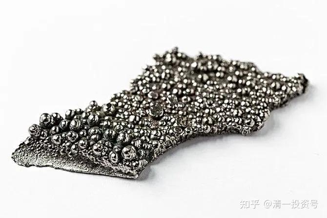
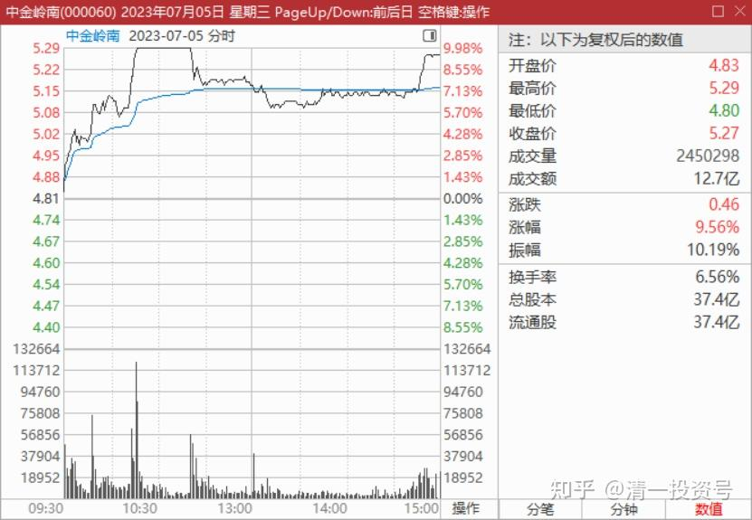
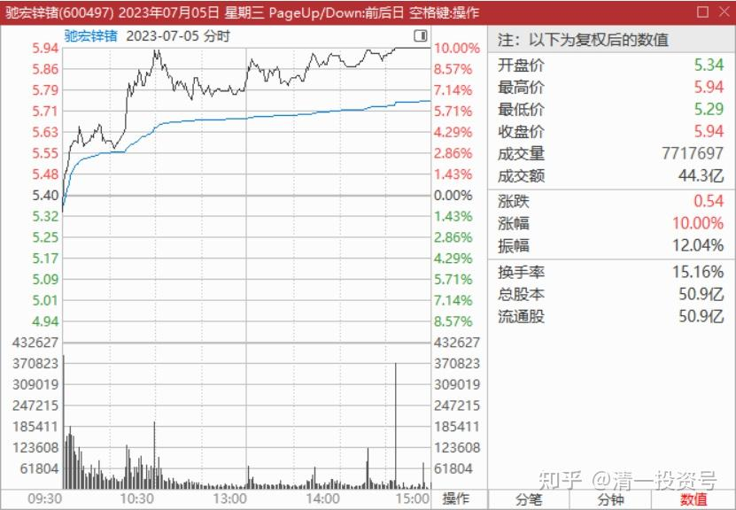

55篇.这些才是财富

清一山长 2023年7月5日

山长 清一2023/7/5 15:38:09

刚看到——今天我当十大的中金岭南，居然涨停了？我一天都没看盘。不然如果赶上了，起码要丢出两百万股来。看市场上抢的这么猛，总要表示一下心意吧？我表示不吃独食！大家一起发财[憨笑]

山长 清一 2023/7/5 17:32:52

从驰宏锌锗的表现来看，这次主力是建仓走势，不是出货出势。估计是因为消息太突然，因此昨天冲涨停后，被主力打下来，今天才建仓。底部放量是利好。今天，有更多资金冲进来，股价却一直不封涨停，但磨磨唧唧的，最终封了涨停。说明主力资金抢货迹象明显。不像是趁利好跑来出货的走势。当然，也有可能是尽快快退的游资。如果今天是一大早封涨停的走势，反而应该担忧了。不过就算抢筹，也不会一直涨上去的。后期有回落也很正常，甚至还回落不少。比如啤酒股就是这样的，只是趋势会慢慢的向上走。

另外一个中金岭南也一样。虽然我想不通我认为是铜业股的它，怎么也跟这个出口事件混在一起了。昨天冲高后回落到起点，让持股的股民以为没戏，涨了就抛了。昨天的成交量也没有放大。看起来像是假冲动。今年一路上行。不封死涨停，就是要尽量多拿货。成交了意外放大。因此——看样子岭南未来还有空间。我认为可能是这些有色股总体来说还是在低位，这个价格不怕拿。原来的基本面，就值这个价。现在如果有利好，也值得多个10-20%的价格持有。不过我不会追高的。只会看。反正拿的货也不少了。

另外我奇怪的是：如果封锁出口，而不是强行涨价。按道理对相关企业是利空，因为失去了欧美市场。即使是大幅涨价，但因为这两种有色金属产量都不高，就算销售价格涨了几倍，总体来说对企业的总利润影响也不大。似乎市场犯不着如此激动的反应。到底为啥呢？没想通！我就坐在车上继续想吧！大不了重新跌回来。反正也没指望赚这种钱！

[外交部回应对镓、锗相关物项实施出口管制：不针对特定国家](http://link.zhihu.com/?target=https%3A//baijiahao.baidu.com/s%3Fid%3D1770499008617611236%26wfr%3Dspider%26for%3Dpc)

[商务部、海关总署公告_出口_许可_物项](http://link.zhihu.com/?target=https%3A//gov.sohu.com/a/694688945_120205076)

山长 清一 2023/7/7 18:50:13

根据长江有色市场数据，7月6日，钴平均价到达30.3万元/吨，时隔三个月后，重新站上30万元的大关。以5月末钴价最低点计算，6月以来钴累计涨幅达到18.4%。对于电解钴价格大幅上涨的原因，主要与两方面的有关。一方面，近期市场上再度传闻国家收储金属钴。有报道称，中国正在利用钴价格暴跌的机会，增加用于电动汽车电池和航空航天合金的钴库存。储备机构国家粮食和物资储备局可能购买约2000吨钴。另一方面，海外钴价走强带动国内同步市场走高。（证券时报）

**这些东西才是财富。不是啥票子！**

[收储传闻再起，这种小金属价格大涨，6月以来累计反弹超18%，多只概念股股价自高点已腰斩_股票频道_证券之星](http://link.zhihu.com/?target=https%3A//stock.stockstar.com/SS2023070700009823.shtml)
