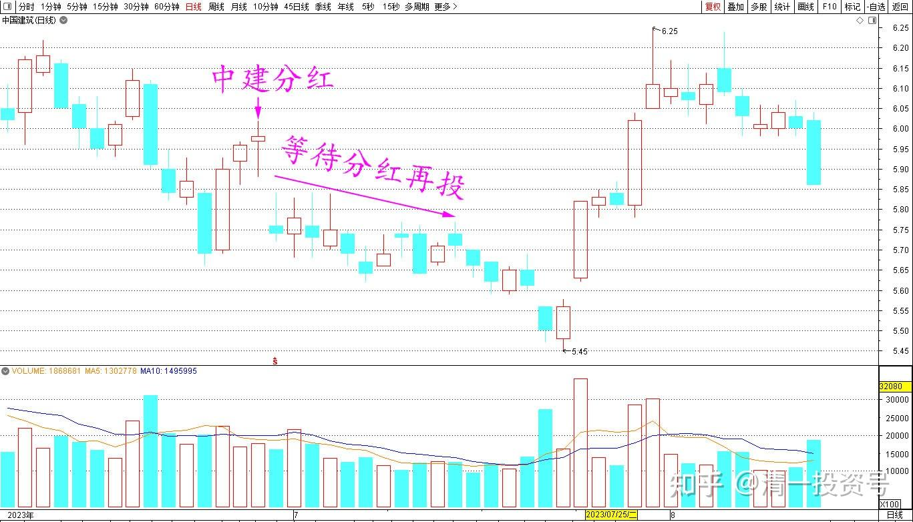
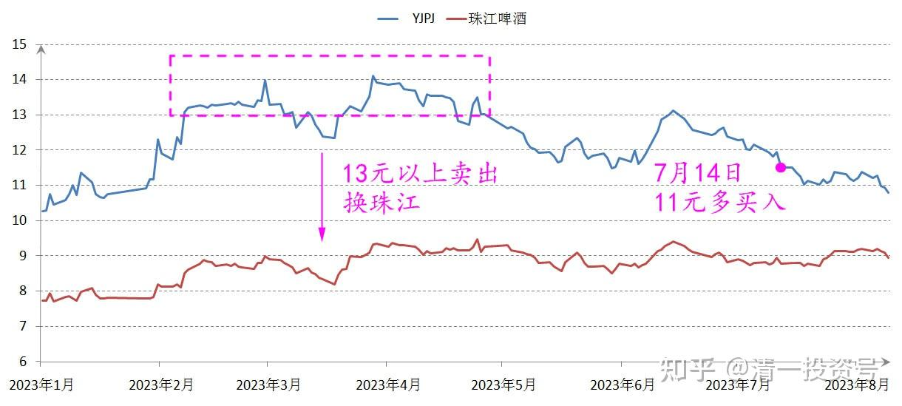
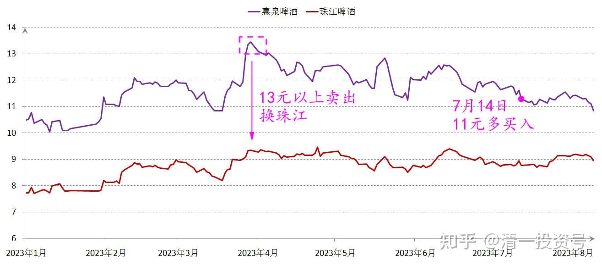
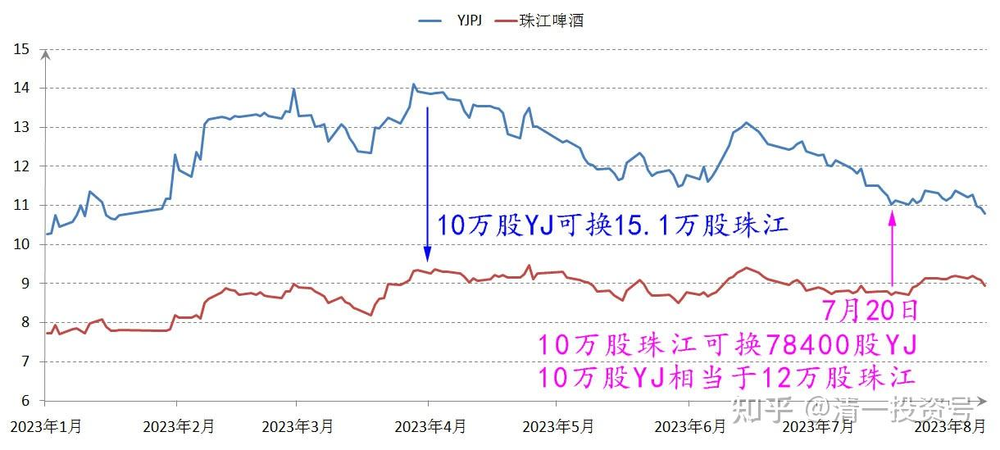
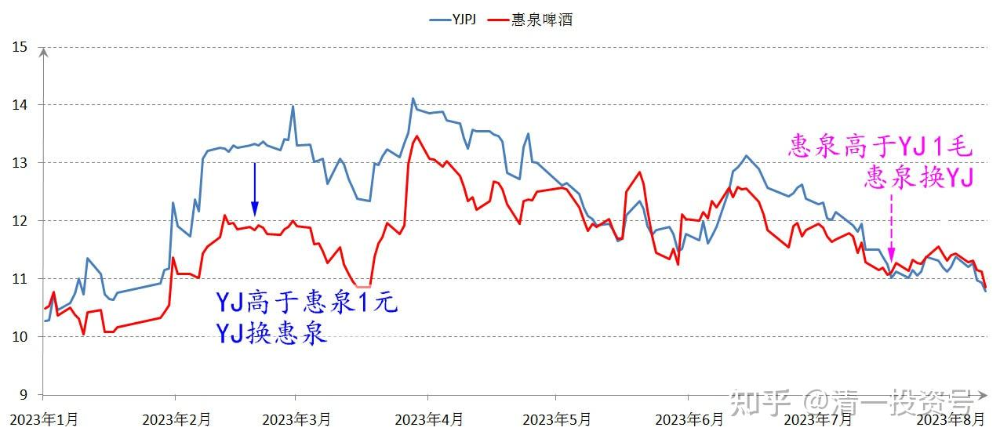
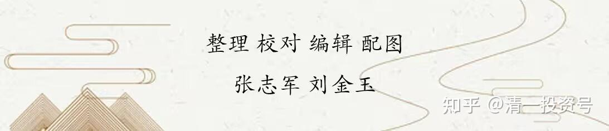

56篇.啤酒下跌，应机而动

**1.分红再投，买回啤酒**

清一山长 2023年7月14日

今天用中建的分红，买了6位数（股份数）的啤酒。本来这笔钱，是想分红再投买中建的，等这么多天，快到心理价位了。

没想到看到啤酒意外下跌，就买回啤酒了。11元出头的啤酒，对我还是很有吸引力的。反正是原来13元以上卖掉的头寸，现在不捡回来，有点心疼。当初高价换珠江的决策很正确，可惜换少了。现在还舍不得用现价的珠江换回来。就只能用分红再投了。**继续重仓中国啤酒，坐等产业消费升级**。

**2.适时置换，股票增多**

清一山长 2023年7年20日

今天用珠江、惠泉，总共换了20多万股YJ。最低买入价是11.02元。10万股珠江可以换入78400股YJ。当初我是用YJ换的珠江。记得交换比大概是10万股换15.1万股。现在的置换比是12万股多一点了。我肯定不吃亏！

由于今天的惠泉价格，已经高于YJ一毛多了。原来我是YJ高于惠泉一元换的股，现在重新换一点回来，算是赚了一元的差价。

**至于这几个股票。谁涨不涨的，我也不在意。我只在意我持有的股票多了一点点**[大笑]。反正也不想卖！原来两百多元的重庆啤酒，现在创两年来新低。YJ的股价还维持在多年来高位，该满意了。跟跌一点完全可以理解[大笑]。

**参考链接：**

[12篇.啤酒系列5：早期珠江啤酒、燕京啤酒的换仓记录](https://zhuanlan.zhihu.com/p/602033762)

[13篇.啤酒系列6：买卖操作后的富足之心](https://zhuanlan.zhihu.com/p/604162057)

[14篇.啤酒系列7：珠江的破位急跌，名曰跌停进货法](https://zhuanlan.zhihu.com/p/606062514)

[22篇.它很可能是下一个重庆啤酒](https://zhuanlan.zhihu.com/p/645392522)

[23篇.危机时刻好公司不用担心](https://zhuanlan.zhihu.com/p/646998882)

[24篇.守住筹码很不易](https://zhuanlan.zhihu.com/p/648860208)

