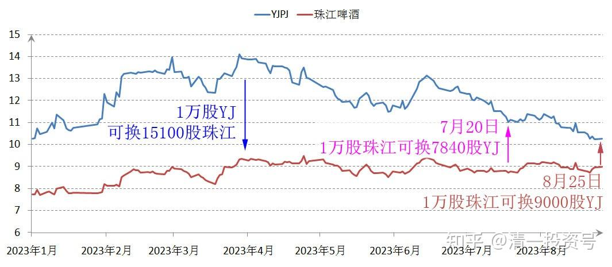
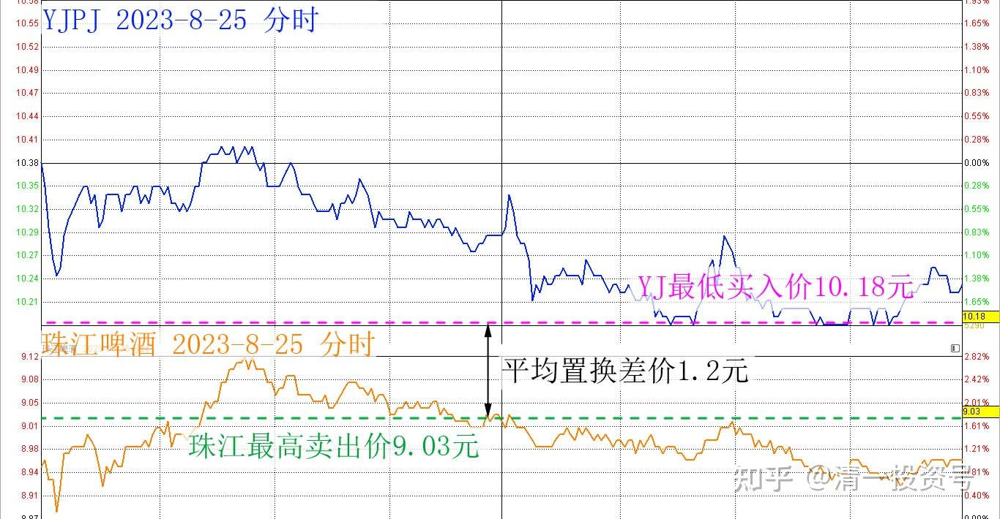

58篇.买回落难王子

清一山长 2023年8月25日

原来我用一万股YJ，换15100股珠江。现在用一万股珠江，换回来9000股YJ。这种生意，应该不吃亏吧[大笑][大笑]。继续学唐建华死守，真佩服这人，不动如山。他这几个月，两个亿的浮盈就没了，但他一点感觉都没有[发呆]。

今日操作记录：珠江最高卖出价9.03元，YJ最低买入价10.18元。目前平均置换差价1.2元，就是玩玩的。不赚钱，只赚股[抱拳]。珠江目前看盘面有上攻趋势。但我就不贪心了，原来换进来的珠江就卖掉，给点给别人愿意出钱的。买回落难的王子YJ吧！也许YJ会继续跌到9元多？与珠江平价吗？那这样，我就只好全换了。就像原来一样（如果YJ股价居然低于珠江，我就不会再持有珠江了）。

(标题、图片为编者所加)

**参考链接：**

[12篇.啤酒系列5：早期珠江啤酒、燕京啤酒的换仓记录](https://zhuanlan.zhihu.com/p/602033762)

[13篇.啤酒系列6：买卖操作后的富足之心](https://zhuanlan.zhihu.com/p/604162057)

[14篇.啤酒系列7：珠江的破位急跌，名曰跌停进货法](https://zhuanlan.zhihu.com/p/606062514)

[22篇.它很可能是下一个重庆啤酒](https://zhuanlan.zhihu.com/p/645392522)

[23篇.危机时刻好公司不用担心](https://zhuanlan.zhihu.com/p/646998882)

[24篇.守住筹码很不易](https://zhuanlan.zhihu.com/p/648860208)

[56篇.啤酒下跌，应机而动](https://zhuanlan.zhihu.com/p/649780980)

[57篇.省心省事，不多做](https://zhuanlan.zhihu.com/p/651191813)

