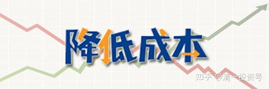
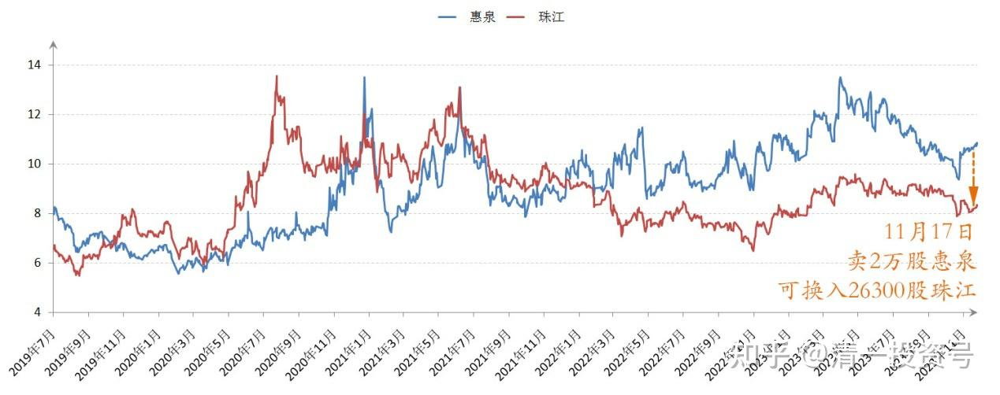
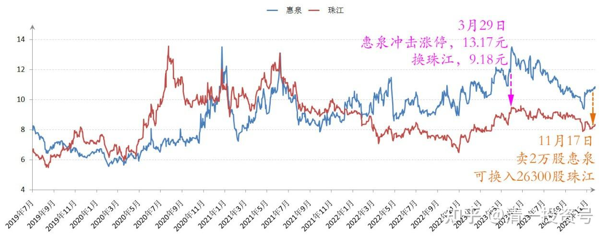
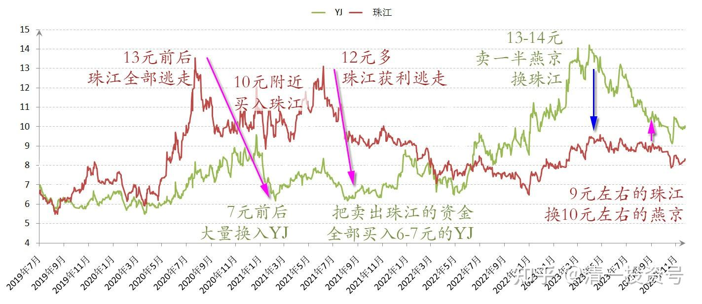
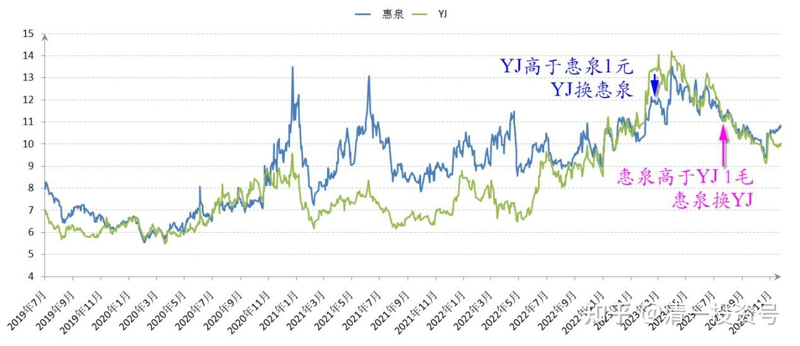

63篇.负成本——换股的功劳

清一山长 2023年11月17日

卖掉2万股惠泉啤酒，可以换入26300股珠江啤酒（10.89元卖出，8.11元买进）。增值的股数超过30%。这种生意似乎是划算的。虽然目前这种交换，总资产减少了一点点（起码少了相应的交易费和税金）。这几年，我在三大啤酒公司之间不断的转换，惠泉现在以负成本安稳当十大，就是换股的功劳。随着这种交换的时间次数的增加，将来争取其他两家公司，也做到这个成绩——低成本甚至负成本持有大量公司股票。

*2019~2023 惠泉、珠江 收盘价*

**附录：**

**一、惠泉和珠江之间的切换：**

**45篇.惠泉冲击涨停的应对之策（2023年3月29日）（节选）**

我看珠江今天几乎没有咋涨，就考虑用惠泉换一点珠江，锁定今天上涨的收益。于是，就开单挂出了10万股惠泉，以13.17元卖出。没多久就吃完了这十万股。后来就上下拉锯，我又再次分两单，挂出了三万股13.17元，因为我不想大量挂出来卖单，干扰主力的心情。这些股虽然卖完了。但——惠泉也不再维持股价，居然就慢慢地往下走了。我再想多卖一点，也卖不掉了。

我也不管，惠泉不涨停，就是涨不停的意思。好彩头。说明未来看好，我今天就不用操心卖股的事情了。于是就转手，分几次买入了13万股珠江啤酒，价格最低是9.18元，最高是9.19元成交。

*2019~2023 惠泉、珠江 收盘价*

**二、珠江和YJ之间的切换：**

**52篇.今日啤酒股普涨，盘后总结和思考！（配图版）（下）（节选）**

我上次当珠江十大时候的存货，在冲击13元前后，就全部逃走了。正好此时在7元前后的价格，大量换入YJ。不过，看到珠江跌到10元，构筑平台的时候，感觉有资金进入，我也跟随买了一些进去。后来三个月内，又拉了一轮接近13元的行情，我再次12元多，就全部获利逃走了。再次把卖出珠江的资金，全部用来买入“行情独立”，被市场抛弃的，价格还在6-7元底部爬行的YJ。

现在这一轮，6～9元期间，就是这一轮主力的吸货期间。现在珠江已经完成吸筹的任务，进入到“拉升”阶段了。最令人兴奋，也是最容易跟庄的时期。这一轮，我很荣幸地跟珠江的主力同步了，也在6～9元之间一直吸货，吸成了十大股东。各位如果看到珠江一季报，会发现我的持仓，会比去年年底的公示仓位多了一倍。这是用一季度不断高涨的YJ换来的，成本极其低廉。最划算的一笔换股单，是14.25元出掉YJ，换入了9.03元的珠江！当然——如果拿住现金不动，等YJ跌到12元多拿回来更划算，可惜我没这么“有远见”。能换9元的珠江已经很满意了！

**56篇.啤酒下跌，应机而动（2023年7月20日）（节选）**

今天用珠江、惠泉，总共换了20多万股YJ。最低买入价是11.02元。10万股珠江可以换入78400股YJ。当初我是用YJ换的珠江。记得交换比大概是10万股换15.1万股。现在的置换比是12万股多一点了。我肯定不吃亏！

**57篇.省心省事，不多做（2023年8月4日）（节选）**

YJ我其实13～14元跑了很多，但现在我都不太愿意全部捡回来（捡回来一部分了）。为啥：总觉得原来6～7元买的YJ，现在11元买有点傻。不如买别的。因此——导致错过一些好股。

当然，我只是卖了一半YJ，换了珠江。但跌了这么多，我都不是很想换回来。两股差价原来有四元多，现在只有两元了，我居然还不想换。就是这种心理的表现。不过——YJ还有一半，就等它表现吧。所以，为了省心省事，不多做。

**58篇.买回落难王子（2023年8月25日）（节选）**

原来我用一万股YJ，换15100股珠江。现在用一万股珠江，换回来9000股YJ。这种生意，应该不吃亏吧

**59篇.三季报隐藏的重大信息（2023年10月26日）（节选）**

只是我这段时间，都在用珠江换YJ。珠江的账面上少了几百万，你可以理解为我持仓的YJ，就增加了几百万。而这些YJ，就是我在13～14元期间卖掉大批，用来换珠江等的。所以，YJ退出了十大之后。珠江和惠泉都进了十大，所以，目前为止，我的啤酒仓位一点也没有减少。只是在不停的倒换。可惜珠江现在也跌了，不然会继续换下去的。否则，一直在9元左右的珠江，用来换10元左右的YJ，是很划算的买卖！

*2019~2023 YJ、珠江 收盘价*

**三、惠泉和YJ之间的切换：**

**56篇.啤酒下跌，应机而动（2023年7月20日）（节选）**

由于今天的惠泉价格，已经高于YJ一毛多了。原来我是YJ高于惠泉一元换的股，现在重新换一点回来，算是赚了一元的差价。

*2019~2023 惠泉、YJ 收盘价*

(标题、图片为编者所加)

**文章音频：**

[398篇.负成本--换股的功劳_清一投资号文章同步音频](http://link.zhihu.com/?target=https%3A//www.ximalaya.com/sound/690208929)

**参考链接：**

[12篇.啤酒系列5：早期珠江啤酒、燕京啤酒的换仓记录](https://zhuanlan.zhihu.com/p/602033762)

[13篇.啤酒系列6：买卖操作后的富足之心](https://zhuanlan.zhihu.com/p/604162057)

[14篇.啤酒系列7：珠江的破位急跌，名曰跌停进货法](https://zhuanlan.zhihu.com/p/606062514)

[22篇.它很可能是下一个重庆啤酒](https://zhuanlan.zhihu.com/p/645392522)

[23篇.危机时刻好公司不用担心](https://zhuanlan.zhihu.com/p/646998882)

[24篇.守住筹码很不易](https://zhuanlan.zhihu.com/p/648860208)

[56篇.啤酒下跌，应机而动](https://zhuanlan.zhihu.com/p/649780980)

[57篇.省心省事，不多做](https://zhuanlan.zhihu.com/p/651191813)

[58篇.买回落难王子](https://zhuanlan.zhihu.com/p/653368631)

[59篇.三季报隐藏的重大信息](https://zhuanlan.zhihu.com/p/664009422)

[60篇.中国建筑安心买入，珠江啤酒价格很香](https://zhuanlan.zhihu.com/p/667041164)

[61篇.投资养老新模式？比退休金更可靠的金融账户养老收益](https://zhuanlan.zhihu.com/p/668298628)

[62篇.YJ前三大股东研究](https://zhuanlan.zhihu.com/p/669500082)

