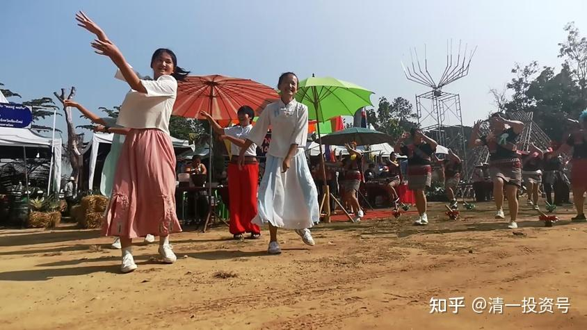
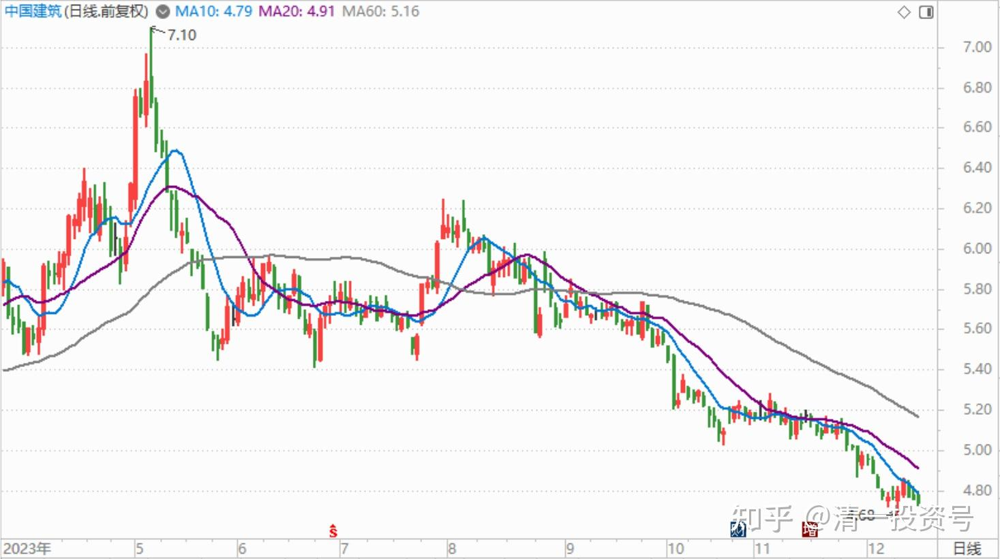
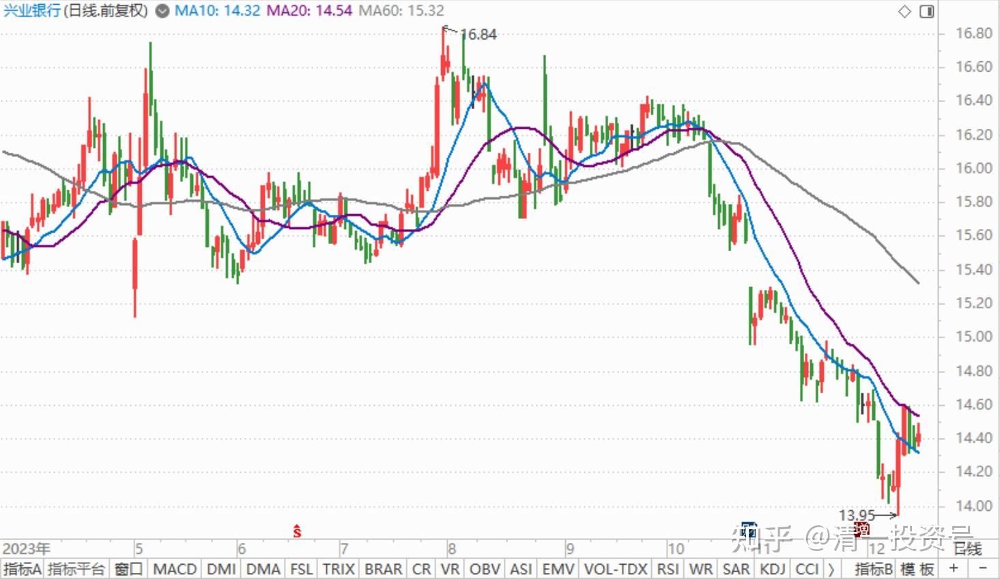
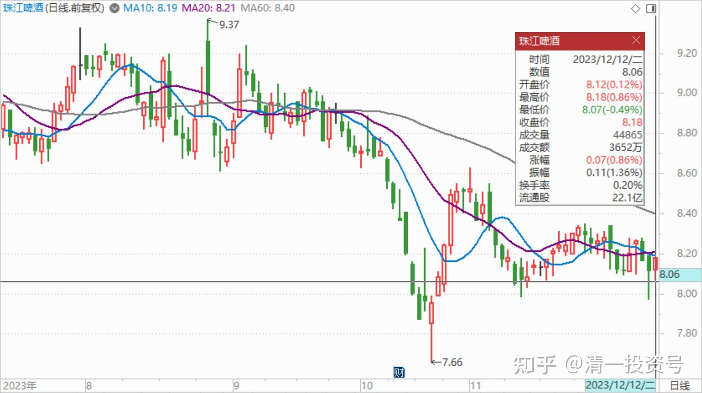

66篇.[金融理财？干嘛非要把简单的事情做复杂呢？](https://zhuanlan.zhihu.com/p/671666130)（配图版）

清一山长 2023年12月11日22:24 泰国

据说：**金融行业的主要存在价值，金融从业人员的主要目标，并不是帮客户赚钱，而是如何让有钱人手里的钱，拿到自己口袋里面来。金融就是让中产和富裕阶层的财富重新分配**。我看这种说法，很有道理！

“清粉”圈前段时间，也因为一位私募大佬[1]的基金清盘，导致很多富裕家庭财富大大缩水。怨气冲天的，还波及到我，认为我当年肯定过他，误导了他们（是的，没错，我当年的确说过，他十几年的投资成绩达到了我20多年的投资成绩，我当然佩服了，但我一分钱都没有投给他的基金，也没推荐任何人去买他的基金呀？其实我当年根本不知道“清粉”去买基金的事情。我自己坚持守住我的平淡业绩和平淡账户，不去期待别人的辉煌）。当年，一些“清粉”，看大佬的投资业绩靓丽，远远超过山长平淡无奇的投资业绩。根本就不理我“花钱买中国龙头企业的高分红股票，然后拿着死也不放，持股分红拿股息”的“傻瓜炒股法”，非要去追求百亿、千亿、万亿的财富。结果——现在两手空空！回过头来还骂我，我真冤枉死了！

也有一些“清粉”怪我——当年为啥我不出来，也和他一样开私募？如果我这样做了——他们的钱，就会全部都投给我了。就不会损失了，反而会多赚一两倍。就怪我不出来做私募，才让他们投给别人，自己赔惨了。

真无语！

我一直纳闷：干嘛人就是要去找抽呢？这些人，为啥不简单地守住股息过日子呢？总想赚大钱，结果亏大本。

不过，这个大佬，在自己的基金亏掉接近70%的时候，最终失去了信心，自杀了！其实大可不必——如果他重新审视自己的理念，还是可以重新恢复市值的。如果用我现在的价值投资方式，买一些铁定不会垮的优质国企，现在的市盈率才2倍多。理论上，买入后两年多企业的利润就可以回本了。来上两次循坏，五六年，净值不就恢复了？其实我过去的记录，比我说的这个更高。真正用心坚持10年的话，一般可以本金赚十倍。就算0.3的净值，涨回来也不就是涨两倍多吗？有啥必要【要死要活】的呢？我相信未来10年，如果操作良好，肯定不止回本这么简单。

我估计这个人选择离开，应该不是不可能回本。毕竟本金还有三折多。选好标的，5年、10年也就回来了。但他过于享受自己过去成功者的头衔，在没有回本之前，也许未来的5年、10年，周围人都会一直用对待失败者的眼光来看他，他承受不起这种压力！

另外——也可能是他自己原来坚持的投资信念崩了。当一个人失去信念的时候，也就失去了活着的意义。不过——也可以修改自己的理念，重新建立自己更新的，更完善的投资理念呀？干嘛要跟随过去失败的理念一起去死呢？

我现在最佩服的就是“[云蒙](http://link.zhihu.com/?target=https%3A//xueqiu.com/3037882447/248749100)”。我不是佩服她的投资水准，而是佩服她的投资心态，她的坚持不屈。她的私募净值，都[只剩0.15](http://link.zhihu.com/?target=https%3A//xueqiu.com/3037882447/270108934)了，还在顽强地坚持不肯投降，而且继续面对几十万粉丝分享自己的理念和研究，不去在意很多恶意的攻击和贬低。毕竟——这是一个用结果来评价人的世界，但她坚守了自己的信念：买低估值的银行，买低估值的招行！她就是相信中国的银行低估了，相信总有一天，市场会恢复正常的估值。**我也相信中国的银行未来将称雄世界**。真心希望她有能够熬到出头的这一天！这种**顽强坚持，永不放弃的人，真的值得尊重！**希望她永远不要爆仓退出。

**对别人面临的苦难，我们不要去幸灾乐祸。我们自己也身处各种陷阱的包围中**——包括某些身份贵重，看起来被种种呵护的人，也一样会被收割。只要不小心就完蛋！就会把一生创造的财富归零——你还找不到具体的责任人。其实责任人就是自己！

今天看到一则消息：“[国际明星章子怡”也中招了](http://link.zhihu.com/?target=http%3A//news.sohu.com/a/743130687_121769699)。多少亿资产没了！原来大佬也中招！

据说：最大的客户一下子损失50个亿。因为他拿来买理财——我是从来不买理财的！很多年前，我就认为**理财有点像赌博，赌赢了赚小钱，赌输了亏大钱。因此——基本就是智商不过关的人，才去买理财。不对——是财商不过关！**

章子怡如果几年前谦虚一点，用她吃一顿大餐的钱，来听我七天的财富课。当然，她豪气一点，也可以包场私教，每小时一万元。然后——她现在绝对可以避免多少亿的损失！我肯定会建议她不要买理财。而去买中国最好的公司长期持有的（好奇——这个损失最多50亿的财主，是不是她呢？按说应该有这身价的）。

大家看新闻吧：

据悉，12月6日有网友爆料称章子怡投资的某理财产品爆雷，资金亏损严重，几乎一片空白。

知情人透露，这次的理财产品爆雷让章子怡的老底几乎亏空，引起了一定的震动。或许正是因为资金缺口的原因，章子怡最近在娱乐圈表现得格外活跃，积极参与各类活动，努力填补理财亏损带来的经济缺口。

据悉，中植系的金融风波直接导致国内15万富有人士损失惨重，其中一位最大的投资者竟然向中植系投入了50亿。整个中植系的爆雷事件牵涉的总金额高达2300亿，单个投资人的损失从最大的500亿到最小的300万不等，而投资人数量超过15万人。

正面案例：“傻瓜投资法”

正好，今天我的一个亲戚，把房子卖了250万元。知道现金不保值，就来问我，想买股票，买什么股？什么时候买？

我当然会帮忙了。因为他们也不懂股票，不会操作，我就教他们“傻瓜炒股法”了。

正好这几天，我给老人家管理的账户，正好行情下跌，就刚把一千万全买进了。就是三个高息股票，都是通过港股通买入的（名字略）。如果你们要买A股，就买中国建筑和兴业银行。每年拿分红就够了。大概你们这样买了股票，就是死拿不放的话，每年可以拿到分红款：15～20万的样子，也许更多。应该每年都会增长，就相当于两个人的工资了。比你们指望儿女来养老要靠谱得多。你们就别指望发大财，守住现在的财富就够了。运气好一些的话，10年内可能就会超过1000万元了！到时候，你们每年拿股息就可以拿到50万甚至一百万。不比任何人的退休金强，比银行行长的收入都高！

我的老人养老账户，现在净资产是2000万元多一点。目前的股息每年可以拿到100多万元，其实怎么也花不完。每年的股票市值还会增长。这就是一笔永远也不会消失的资产——国运当头的情况下！如果国家不行了，当然——我们小小国民，也没法独善其身！但**我们真的要相信现在的国运真心很好！起码比美国的运要好。**

至于我——我今天买了一些才7元多的珠江啤酒。将来跌不跌我就不管，反正我也准备拿十年，看看到底会不会亏。按道理的话，如果运气爆棚，10年内的涨幅，说不定比上述的高息资产配置赚得更多。但是——不敢打包票。算是赌博的，还要看盘、操作、对付庄家。一般人做不到，就别赌这个股票了。**不该自己拿的钱就别拿！要安心数钱的话，就拿高股息的龙头国资股。**这里如果有人敢骗你的钱，大股东——国家就会用铁拳来教训这些蛀虫。所以，躲在惹不起的大股东后面，我们就能保证自己的安全性！

这篇文章，价值多少，看你的基数了。对于章子怡，给个上亿的咨询费都值。不过，对于大多数屌丝——可能一分钱都不值。

我近几年发现了：**不想付出的人，就算是我白送好处，他们都拿不到。再宝贵的东西，都跟他们无缘。人类，可能只有去花钱买到的东西，才会珍惜吧？就算是骗子的谎言，也比白送的真理更值得珍惜。**他们有眼无珠，认为骗子手中毫无用处的透明石头，都比农民美味鲜艳的果实更有价值。

比如：章子怡买的[中植系的理财](https://zhuanlan.zhihu.com/p/653533439)，她要付出大笔的管理费，委托一群根本就不知道如何创造财富的人去管理，这群人本质上都是骗子，因为他们玩的都是空手套白狼。但她反而觉得这群人很权威，愿意把自己的大笔财产交托他们去管。

而我——劳心劳力，免费送你真经，很多人还一副嫌弃的样子，用一副高高在上的眼神来打量！

人——真是奇怪的动物！

(标题、图片为编者所加)

[原文：山长 清一：金融理财？干嘛非要把简单的事情做复杂呢？](https://zhuanlan.zhihu.com/p/671666130)

**文章音频：**

[403篇.金融理财？干嘛非要把简单的事情做复杂呢？_清一投资号文章同步音频](http://link.zhihu.com/?target=https%3A//www.ximalaya.com/sound/694677116)

**参考链接：**

[57篇.省心省事，不多做](https://zhuanlan.zhihu.com/p/651191813)

[58篇.买回落难王子](https://zhuanlan.zhihu.com/p/653368631)

[59篇.三季报隐藏的重大信息](https://zhuanlan.zhihu.com/p/664009422)

[60篇.中国建筑安心买入，珠江啤酒价格很香](https://zhuanlan.zhihu.com/p/667041164)

[61篇.投资养老新模式？比退休金更可靠的金融账户养老收益](https://zhuanlan.zhihu.com/p/668298628)

[62篇.YJ前三大股东研究](https://zhuanlan.zhihu.com/p/669500082)

[63篇.负成本——换股的功劳](https://zhuanlan.zhihu.com/p/670185909)

[64篇.重庆啤酒的主力拉升分析（事后诸葛解析）（配图版）](https://zhuanlan.zhihu.com/p/671473163)

[65篇.惠泉异动，借机换股](https://zhuanlan.zhihu.com/p/672731534)
