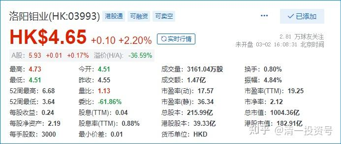
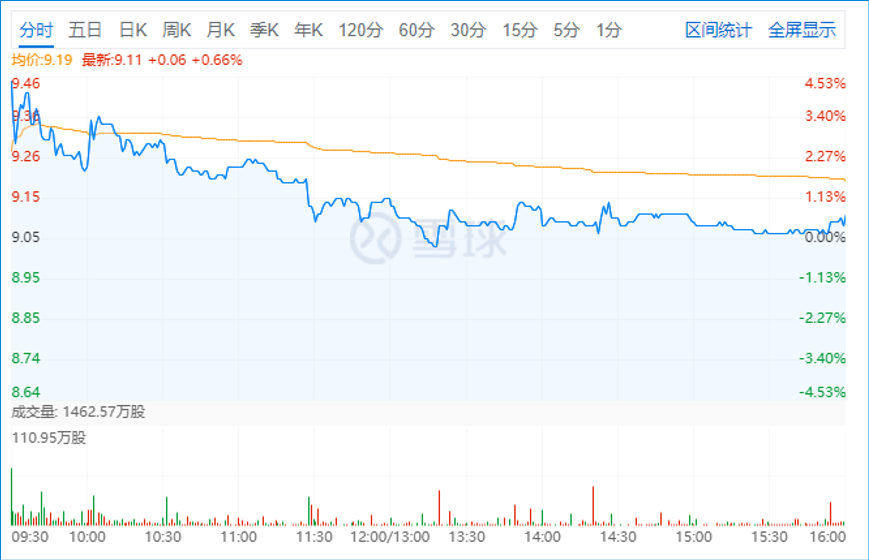
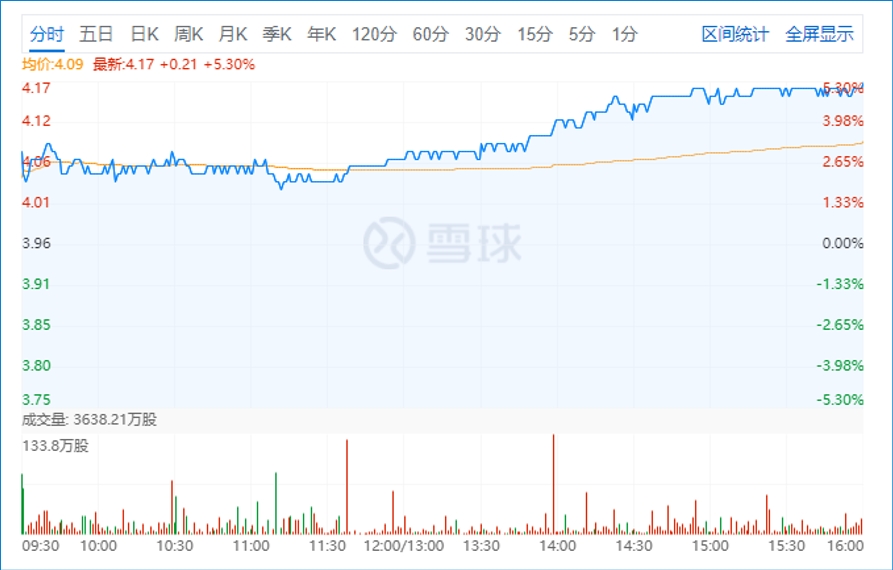
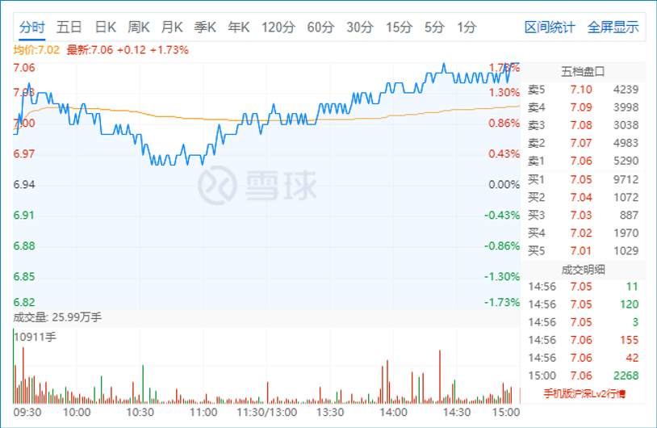

6篇.赚股：宏桥换洛阳钼业——未来有色金属会是我的重要长期选项

*中国宏桥 2022-02-12*

*洛阳钼业H 2022-01-12*

清一山长 2022年1月12日

今天做了一个小操作，是卖出了20万股中国宏桥，这是7元多补回来的一小部分头寸，换入了40多万股洛阳钼业H股，都是4.05元挂单买入的。一大早开盘就做的操作。做完交易后，10点多钟就带小公主们外出，去清迈国际会展中心玩去了。晚上回来看盘：宏桥居然下午就跌了一毛多。不过依然在9元上方稳住了。洛阳钼业下午就涨了5%。算起来，今天每股差价就赚了3毛多钱。目前来看，这笔转换还是比较成功的。虽然金额不多。

我换股的理由很简单——**中国宏桥跌到7元多的时候，洛阳钼业还5元多6元呢！A股更是冲到了8元的价格。**所以，面对当时的行情，**把A股冲8元的洛阳钼业卖掉，有资金就去重新买入7元多的宏桥**，是很正常的逻辑选择，现在中国宏桥再度上涨，**已经涨到9元多了，洛阳钼业H股却意外破4元**，不买一点回来，有点对不起这个股。所以，今天这种切换，自然要做的。

我的核心逻辑，就是**赚不赚钱不是重点，重点是“赚股”**，每次操作我要得到更多的股在手上，市值多少，不是我考虑的重点。所以，我往往一两年市值可能没啥特别的变化，但持股量增加了不少。一旦上涨就回原地，我就会获得比原来更多的利润。**中国宏桥如果涨回原价的话，我的盈利至少会多出一千万的。假如燕京啤酒涨回原价（10元），我就比2020年底的时候，多出数倍的啤酒利润。**因为去年一年的下跌，让我增加的仓位很多。

现在啤酒不买了。如果有钱腾出来，我认为现在去存一点相对低位的资源股，是很有必要的长期战略。涨不涨倒也不操心，不去管它短期走势怎样的。长期持有不怕就行，反而短期急剧上涨，就卖掉去换其他没涨的资源股，有色金属等，**未来有色金属会是我除了啤酒，建材以外的重要长期选项。**我没啥本事，找不到什么可以拿10年也不担心破产的品种，这些资源股算是拿10年不担心的品种。认为这个符合我们国家做制造业强国的规划。追元宇宙，我没本事，看不出谁好。有色和黑色，基础材料，我认为谁是第一我还是有数了。**钼业第一股，金钼股份，已经持仓过百万了。7元下买入的，过7元就不动了**。原来9元以上抛掉了的，都是没买多久就涨了，现在涨不涨不知道，涨了就算了，跌了就继续买。

*金钼股份 2022-01-12*

补充一下洛阳钼业今天抢进的理由：**前面几天，意外破位下跌，跌到3元多的价位，A股反而比较稳定。**我觉得有妖怪，正在观察，这两天有点涨，我认为前两天的杀跌是骗钱的。应该是有人看中他了，故意打压的，所以今天果断买入。其实，如果这股继续下跌，我也会买入的，因为我是左侧投资者，我也不担心这个股的基本面有啥问题，不像有雷的样子。今天的操作，其实我是做的右侧，买在右侧，也卖在右侧——这是短线高手的做法，不符合我的一贯作风，只是运气罢了，正好赶上了。说明一下！请勿模仿，右侧投资风险比左侧要大。是需要巨大的脑力和心力来应对的。一般人没这本事，所以别胡乱模仿。否则后果自负。**一般人，还是死拿燕京和中建要靠谱得多。**
