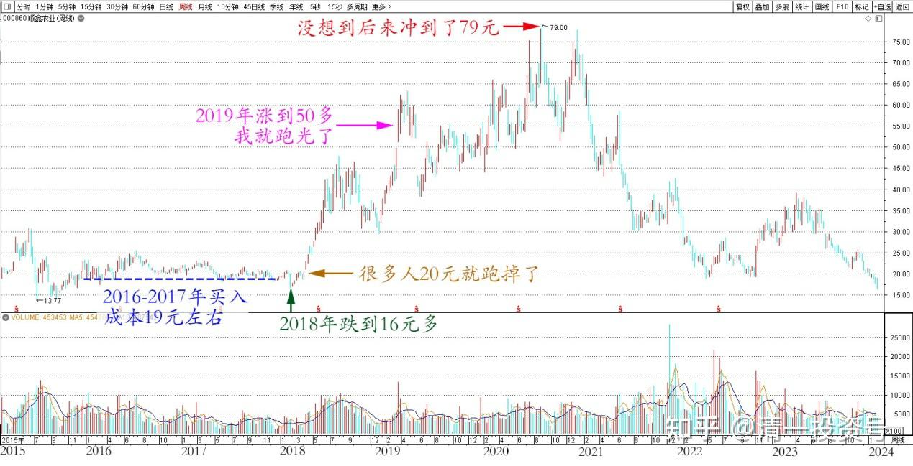
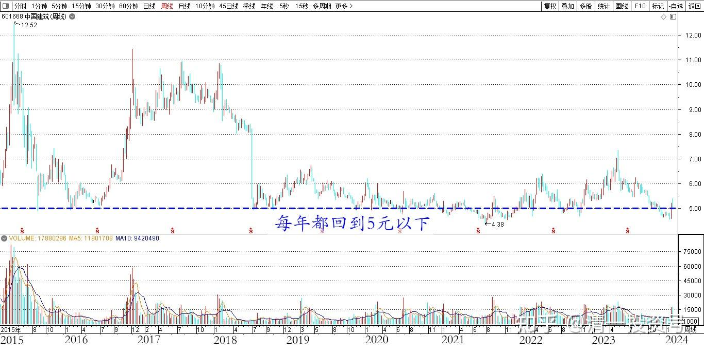
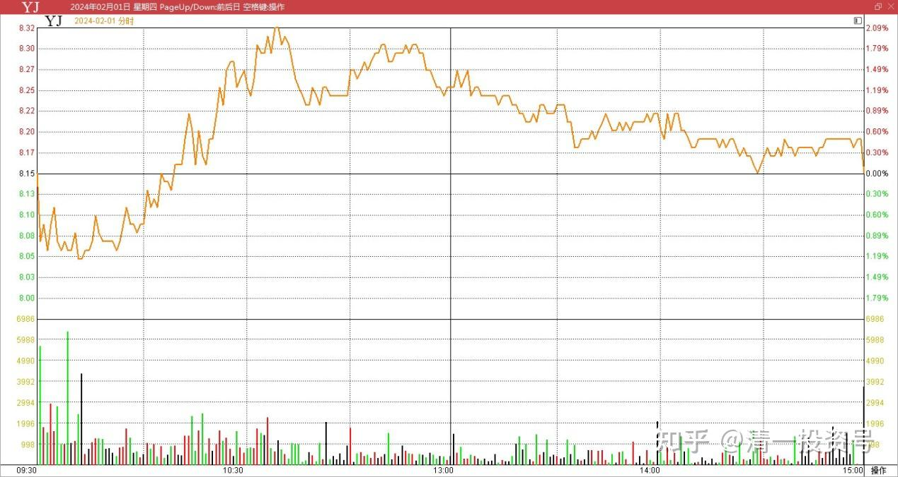
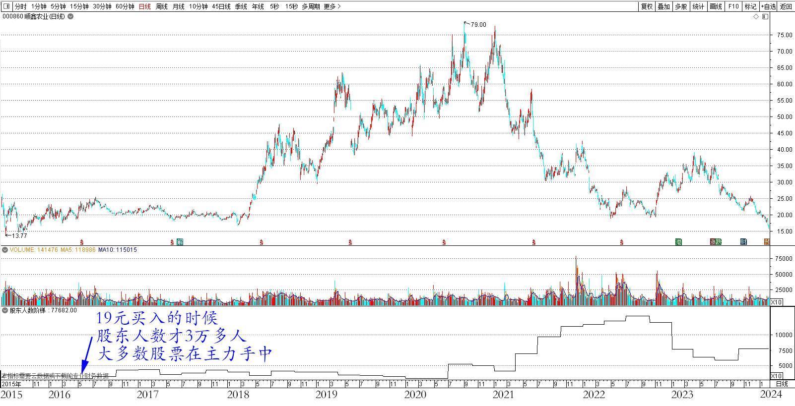

71篇.顺鑫农业现在还能买吗？（上）

清一山长 2024年2月1日

我在2016～2017年买入顺鑫农业的，算是相对大仓了，当时的买入成本是19元左右。持有两三年，不但没赚钱，还在2018年跌到了16元多，账面上亏了不少钱。当时是持股体验非常差的一只股，很多人拿在手里特别的煎熬，网吧里面天天在骂这只票。后来这些人自然涨过20元就跑掉了。我这个人有点迟钝，不太讲究持股体验，正因为拿着很煎熬，因此我30元都还没走。**我认为这种煎熬就是主力故意施加给你的。就像现在的燕京就很煎熬人，但我就一直拿。**

顺鑫煎熬时间不长，也就两三年。2019年涨到了50多，我就跑光了，首次从酒股上赚到了8位数的利润。现在看我的老账户上，居然只有3股，可知当初走的有多坚决。没想到后来顺鑫冲到了79元！成为当年的热股，是一只“被封神”的白酒股。

顺鑫农业2015～2024年周线

这一只股，是我首次重仓酒股，之后还重仓了伊力特、老白干、酒鬼酒等酒类股，也赚到了8位数的利润（三只加起来）。后来的白酒全涨了，我就全卖掉了，都换了三大啤酒股，赚到了更多的钱。

2015年以后，我的账面能够再次创新高，主要靠的就是各种酒股的贡献。我认为中国制造下行，靠消费类股票应该比较靠谱！其他的大蓝筹，算算看有赔有赚，总体来说对账户的贡献并不大！能够稳住阵线也不错了。就像中国建筑，也还是赚了一些钱的。就是股价稳如老狗，这么多年了，每年都能回到5元以下，所以也没法发大财。作为现金股总被我拿来当做“资产保险”玩。

中国建筑2015～2024年周线

今天看到顺鑫农业还跌破我当年的买价了。现在跌到16元多，很有诱惑力！很有点看不下去了，就下单买了两万股，算是勉强救救市。但是账上还躺着数百万资金——我忍了一忍之后——我还是把剩下的钱，都给了燕京。没别的想法，就是觉得燕京的确定性还是最好的！而且——这两家公司的控股股东，都是同一个呢！双方是亲戚。昨天下午收市的时候，我把剩下的全部资金都买了燕京，买入价我打的8.17元。3点后看到成交回报——全部是8.15元成交的。心想燕京明天又要跌了——主力显然就是不想它涨。

燕京啤酒2024年2月1日分时

顺鑫现在能不能买呢？答案就是——价值上，应该是能买了。其实它现在比我19元买的时候，基本面还更好一些。地产板块的拖累已经解决了，主业更突出了。这两年顺鑫的亏损，主要是地产板块带来的亏损。酒业股票还是赚钱的。以后轻装上阵，理应比2016年更好，股价甚至更低！

但是——从趋势上来说，现在又不能买。因为——似乎这个股是被抛弃的票。你去买入，恐怕要等更长的时间才能有收获，甚至可能多年就没有收获！就像2017年买入的时候一样。之前已经很多年没有人能够从它身上赚钱了！

**趋势怎样看？股东人数是最明显的了！**我当年19元买顺鑫农业的时候（差不多就是与唐建华开始买燕京进入十大同时），股东人数才3万多人。也就是说，大多数股票其实在主力手中的。2019～2020年3月，涨到了61元，股东人数反而萎缩到了2万多人。说明我当年卖出的股票，都给主力拿走了，散户这一轮并没有跟随进来。可见就算涨了三倍，主力也没有从中赚到真实的钱，只是赚到了“账面浮赢”。随后一年多，顺鑫被大量的信息“安利”，成为人人欢呼的“新一代民酒牛股”，2020年9月居然涨到了79元。股东人数也涨到了5万人左右，说明主力开始派发了。2021年6月，股东人数暴涨到了9万多人。但是——股价从79元的高价，跌到了42元左右。之后股东人数一直在增加，到了2022年9月30日，股东人数达到了历史新高——12万人，说明散户全进来了。此时股价已经跌回了我买入的价格区间——只有19元多了。因此，该股真正的派发期间，是从79元一直到19元一路派发下来的。俗话说：新手死于追高，老手死于抄底。顺鑫农业新手套了两万多人，老手套了7万多人。绝对是个中高手。这种冷僻的股票，一般来说也只有老手敢玩。这一路跌下来，多少一路抄底的老手都全爆仓了！

之后开始了一轮反弹，股东人数每个季度都在减少，似乎是有人开始收藏本股了。2023年6月股东人数到了5万8千多人，股价也从19元反弹到了35元。当时跌到19元的时候，我动了抢反弹的心，只是行动没有跟上。不然这一轮反弹，也可以赚超过50%的收益了。

这个时候，出来收藏顺鑫的人，我认为是原来就在顺鑫上赚了钱的冯柳——高毅资产管理人，三季度依然持仓三千多万股。算算投入的资产总值，应该在7个亿左右，有人说有9个亿？不知道怎样评估的买入价。目前来看——高毅的这一次进入是被套住了。三季都没有走，现在会不会是被迫卖出呢？过年基民撤资？

接下来，又是一轮下跌，顺鑫农业从35元一路下跌，股东人数也快速增加。到了7万7千人，又增加了两万！显然抢反弹的人都涌进来了，这一批是抢反弹的人。现在跌到16元多，破了前期的反弹低点，还没反弹。我相信股东人数是继续增加的，怀疑是一些抱团的资金被迫出让股票导致的下跌。因为目前这个价格，市场人没有人能够赚钱的，都是割肉盘！

(标题、图片为编者所加)

**文章音频：**

[419篇.顺鑫农业现在还能买吗？（上）_清一投资号文章同步音频](http://link.zhihu.com/?target=https%3A//www.ximalaya.com/sound/707160877)

**参考链接：**

[60篇.中国建筑安心买入，珠江啤酒价格很香](https://zhuanlan.zhihu.com/p/667041164)

[61篇.投资养老新模式？比退休金更可靠的金融账户养老收益](https://zhuanlan.zhihu.com/p/668298628)

[62篇.YJ前三大股东研究](https://zhuanlan.zhihu.com/p/669500082)

[63篇.负成本——换股的功劳](https://zhuanlan.zhihu.com/p/670185909)

[64篇.重庆啤酒的主力拉升分析（事后诸葛解析）（配图版）](https://zhuanlan.zhihu.com/p/671473163)

[65篇.惠泉异动，借机换股](https://zhuanlan.zhihu.com/p/672731534)

[66篇.金融理财？干嘛非要把简单的事情做复杂呢？（配图版）](https://zhuanlan.zhihu.com/p/672554704)

[67篇.A股破位下跌的奥秘](https://zhuanlan.zhihu.com/p/673876597)

[68篇.2023年最后一份持仓总结](https://zhuanlan.zhihu.com/p/675454059)

[69篇.股市大跌，中建换啤酒](https://zhuanlan.zhihu.com/p/680236538)

