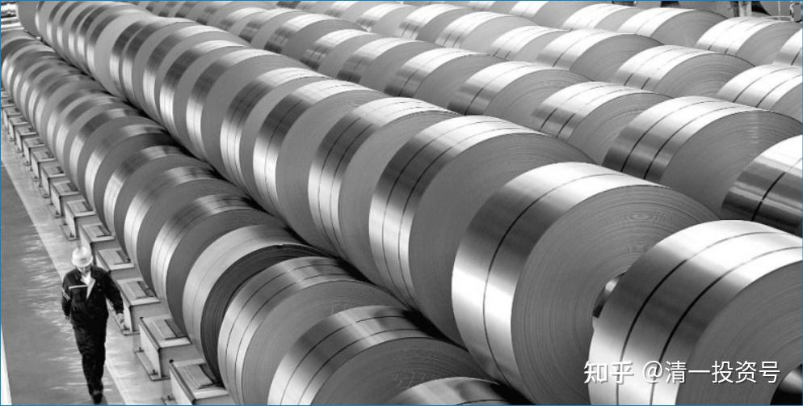
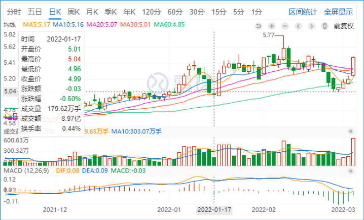
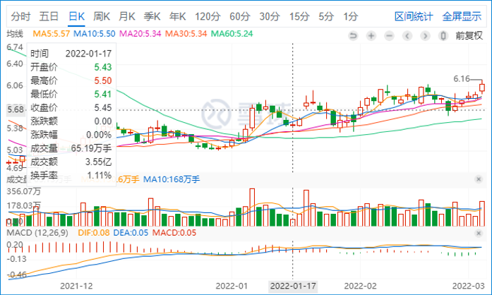
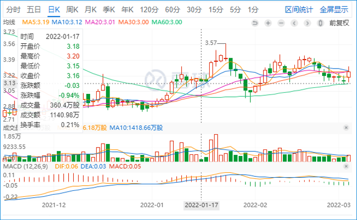
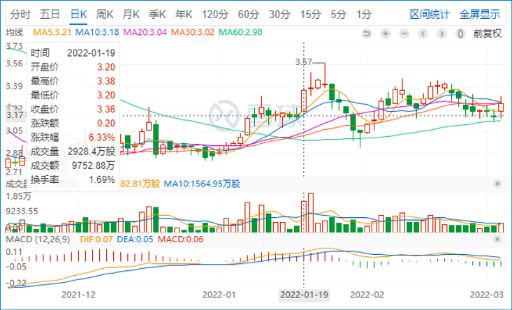
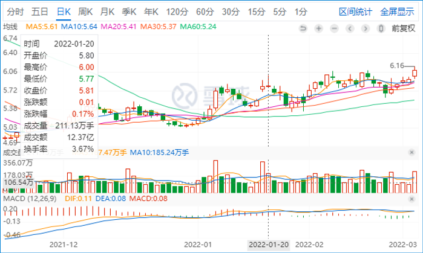
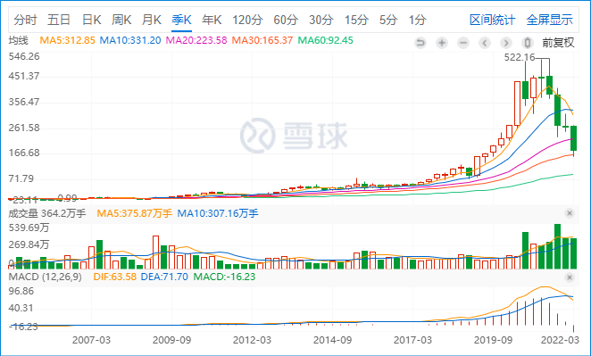

7篇.重新开始买钢铁股，有色股也正在接入

清一山长 2022年1月17-21日

*中国建筑*

山长清一 2022/1/17 16:36:36
说明一下：中国建筑这一次的高点，减持了200万股。倒不是看不上，而是想要换一点别的仓位，想要**买钢铁股，有色股。**就把前段时间4元多买进的200万股中国建筑卖掉了。结果：中建跌了，有色和钢铁都没跌，还略涨了。钢铁股买的是华菱钢铁，还有一些是马钢的H股。现在我正在犯愁：是卖掉有色，重新买回中建呢？还是什么都不做？在没想清楚之前，我决定什么都不做。反正中建的仓位蛮重的，也不差这两百万股。

*华菱钢铁*

*马鞍山钢铁股份(HK:00323)*

山长清一 2022/01/19 12:50:11

今天刚辅导完回来，看看盘面。重仓股马钢和华菱钢铁大涨超5%。开始脱离我的买入区了，所幸马钢入仓了已经数百万股。因为马钢已经被宝钢兼并，所以她绝无可能倒闭。同时宝钢有下属公司分红必须超过50%的要求，这样买马钢比宝钢划算得多，估值也更便宜，分红率更高，何乐而不为？

买华菱钢铁的原因，是她的竞争力似乎很强。汽车板、船板的制造供应，比宝钢还厉害，算是单项冠军吧！我喜欢长期持有这些冠军股。今年的钢铁股的分仓，看样子是成功的布局。

*马鞍山钢铁股份(HK:00323) 2022-01-19*

*华菱钢铁*

山长清一2022/01/21 14:50:01

*长春高新(SZ:000661)*

如果我在2006年，买了长春高新，15年后，它涨了200倍。从2元多涨到了500多元。这是不是超级大牛股？高科技的奇迹。这十几年，一直涨不停。不过，今年从500元多跌到187元，很多散户和机构爆仓了。我这么多年，从来没有买过它，连看都不看。**我不想占她的便宜，我实在看不懂她为何要涨。**我只知道：看不懂的钱不是我的。当然，现在她大跌，自然也就跟我没关系了。

**我的个人账户，如果从2006年算的话，也涨了100多倍了**，主要是2006年周期赚了十倍，2014-2015年牛市又赚了十倍，就自然100倍了。其他时间，负责赚股，不赚钱，维持住资本不丢失就好。这成绩，真心不算差了，再来一次十倍股行情，我就赚千倍了。但我这种方式，就稳健多了。干嘛每年都要去抓牛股？**每年去抓别人不要的垃圾股，就算不赚钱，股票肯定是越赚越多的。**这样涨一次，所有的收益全都回来了，就够了。

2005年我靠重仓买钢铁股，赢了很多钱。钢铁股是当年的垃圾股，这么多年，其实持股不动的话，这十几年，也没赚啥钱的。我当年看钢铁股变牛股了，就走了。回调后也一直没有买，因为别的股比它更低迷，更垃圾。但就是今年，**我重新开始买钢铁股，有色股也正在接入。**也许钢铁、有色，15年一个轮回。现在垃圾了十五年的钢铁股，也许有希望变牛股了[握手]。

**注意选择回避螺纹钢股。地产下行，螺纹钢不行的**。

**取向硅钢，以及板材，特钢**，**这一次应该机会更大。**

**另外——内循环，酒还是可以继续喝的**[大笑]
