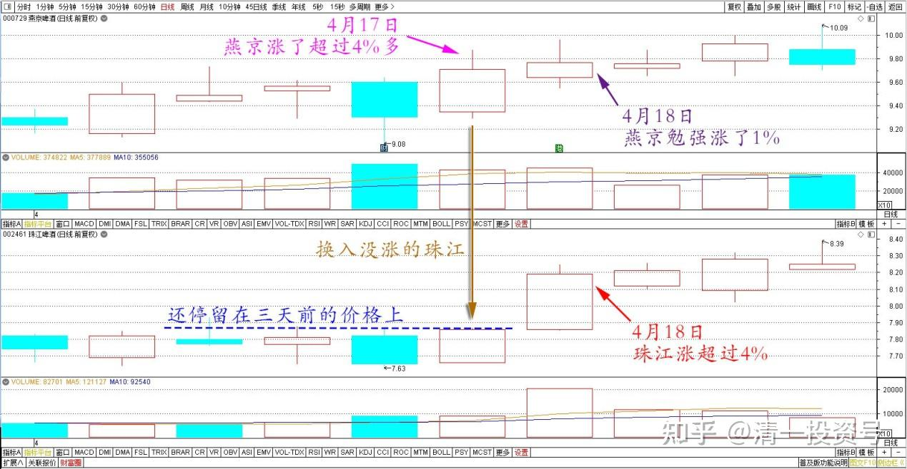
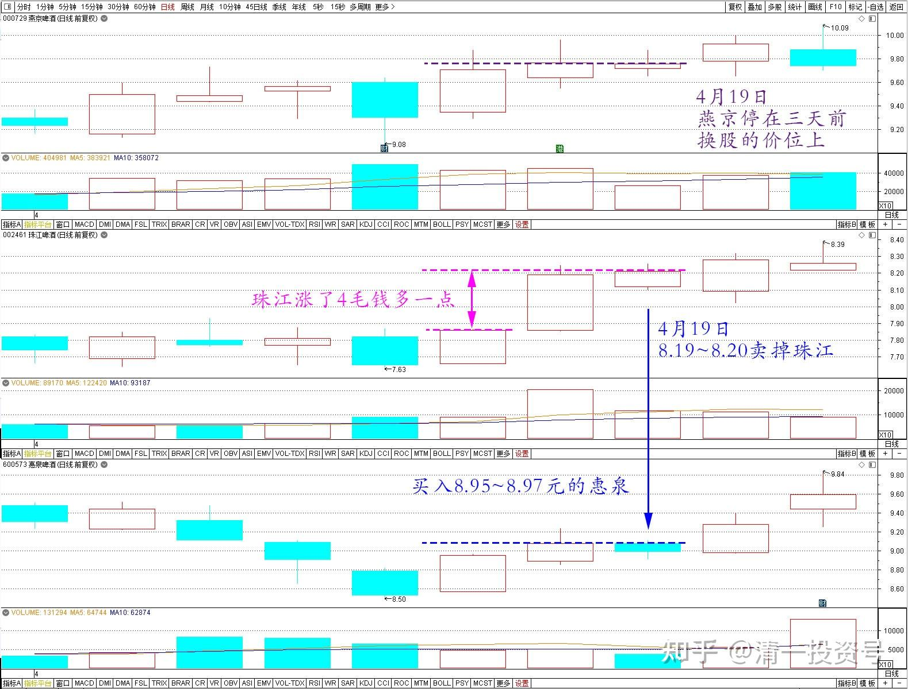
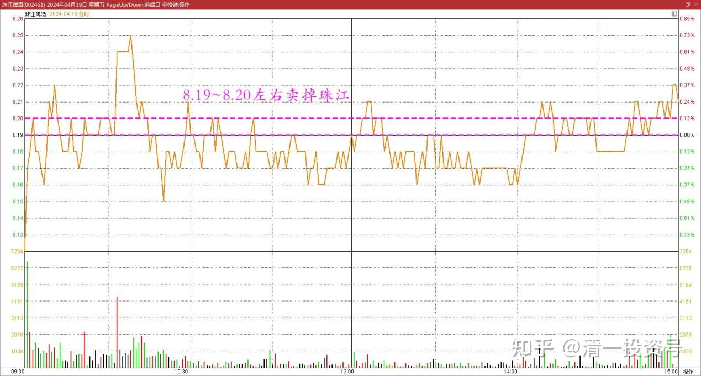
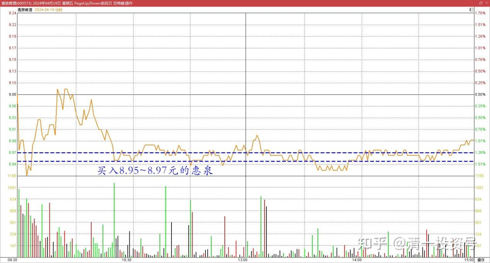

80篇.不要钱，只要股——啤酒股切换

清一山长2024年4月18日

昨天燕京涨了超过4%多，就开始换入没涨的珠江（还停留在三天前的价格上）。今天珠江就涨超过4%了，燕京勉强涨了1%。所以——这次换股，比三天前的账目上，多了30%以上的筹码（珠江每股价格低于燕京20%）。**看来，不要钱，只要股的策略是对的**。实际上——钱和股全都增加了！浮盈也增加了8～9%。**感谢市场先生的慷慨赠送**，为勇士们出征雅典颁发路费和奖金！

燕京啤酒、珠江啤酒2024年4月18日前后日线图

清一山长2024年4月19日

燕京今天停在三天前换股的价位上，珠江涨了4毛钱多一点，所以，今天8.19～8.20元左右卖掉珠江，买入8.95～8.97元的惠泉，平均差价0.76元。由于惠泉成交量很少，所以只能换20万股左右。就当玩游戏吧！如果以后差价变两元了，这笔交换，就相当于赚了一个普通工人一年的工资了！

燕京啤酒、珠江啤酒、惠泉啤酒2024年4月19日前后日线图

珠江啤酒2024年4月19日分时图

惠泉啤酒2024年4月19日分时图

(标题、图片为编者所加)

**文章音频**

[439篇.不要钱，只要股--啤酒股切换_清一投资号文章同步音频](http://link.zhihu.com/?target=https%3A//www.ximalaya.com/sound/725552666)

**参考链接：**

[70篇.金融战·中建换燕京啤酒](https://zhuanlan.zhihu.com/p/681428626)

[71篇.顺鑫农业现在还能买吗？（上）（配图版）](https://zhuanlan.zhihu.com/p/682697509)

[72篇.顺鑫农业现在还能买吗？（下）（配图版）](https://zhuanlan.zhihu.com/p/683344685)

[73篇.意外降价，买回惠泉（配图版）](https://zhuanlan.zhihu.com/p/682700319)

[74篇.A股要崩了？我还在买股票！](https://zhuanlan.zhihu.com/p/686286680)

[75篇.同为啤酒，敢否持有？（配图版）](https://zhuanlan.zhihu.com/p/684419681)

[76篇.年前最后一天，燕京换惠泉](https://zhuanlan.zhihu.com/p/688783385)

[77篇.年后第一天，看啤酒起落](https://zhuanlan.zhihu.com/p/688784278) [78篇.洛阳钼业换华菱钢铁](https://zhuanlan.zhihu.com/p/692417410)

[78篇.洛阳钼业换华菱钢铁](https://zhuanlan.zhihu.com/p/692417410)

[79篇.养老账户操作：燕京换珠江](https://zhuanlan.zhihu.com/p/693773038)

