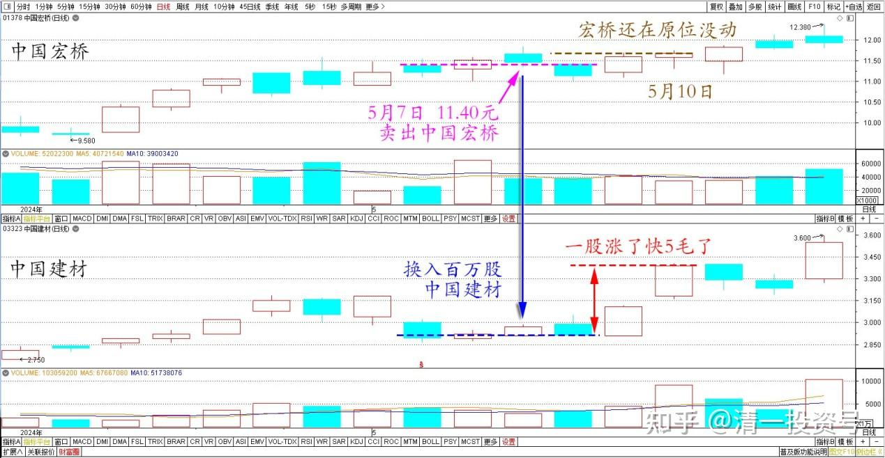

84篇.赚股——卖出涨得好的，买入趴地下的

清一山长2024年5月10日

前几天刚分享用中国宏桥11.40元卖出后换入百万股中国建材的想法，两天后就大涨了。今天居然是自选股涨幅第二名，一股差不多涨了快5毛了，而中国宏桥居然还在原位没有动。可是我还没有买够建材呢？原来我都是买了就跌的吗？现在居然反过来了？一买就涨？真不习惯！

中国宏桥、中国建材2024年5月10日前后日线图

算了，吸取教训吧：以后我自己还没有买完之前，就不能公开分享操作了，至少等自己买够之后再说。现在需要另外找换股的标的了，真够麻烦的！昨天换股，已经吸纳了另外某百万股级别的某高息中企股纳入囊中。**现在我的账户新高，需要卖出一些涨得好的品种，调整一些节奏，买入一些趴在地下的品种救救穷，我也多增加一些股份**！**核心是赚股，不是赚钱。看淡价格的涨跌，利用市场的波动来配置更多的中国优质股权**！

(标题、图片为编者所加)

**文章音频**

[447篇.赚股--卖出涨得好的，买入趴地下的_清一投资号文章同步音频](http://link.zhihu.com/?target=https%3A//www.ximalaya.com/sound/731119019)

**参考链接：**

[74篇.A股要崩了？我还在买股票！](https://zhuanlan.zhihu.com/p/686286680)

[75篇.同为啤酒，敢否持有？（配图版）](https://zhuanlan.zhihu.com/p/684419681)

[76篇.年前最后一天，燕京换惠泉](https://zhuanlan.zhihu.com/p/688783385)

[77篇.年后第一天，看啤酒起落](https://zhuanlan.zhihu.com/p/688784278) [78篇.洛阳钼业换华菱钢铁](https://zhuanlan.zhihu.com/p/692417410)

[78篇.洛阳钼业换华菱钢铁](https://zhuanlan.zhihu.com/p/692417410)

[79篇.养老账户操作：燕京换珠江](https://zhuanlan.zhihu.com/p/693773038)

[80篇.不要钱，只要股——啤酒股切换](https://zhuanlan.zhihu.com/p/695027042)

[81篇.惠泉跌破十元，再次进入十大](https://zhuanlan.zhihu.com/p/696066886)

[82篇.远离投机，踏实投资，才是正道](https://zhuanlan.zhihu.com/p/697366505)

[83篇.换股策略——高卖低买](https://zhuanlan.zhihu.com/p/698681371)

