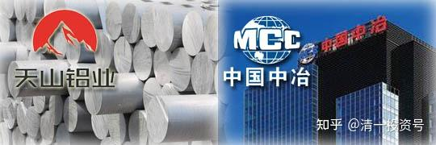
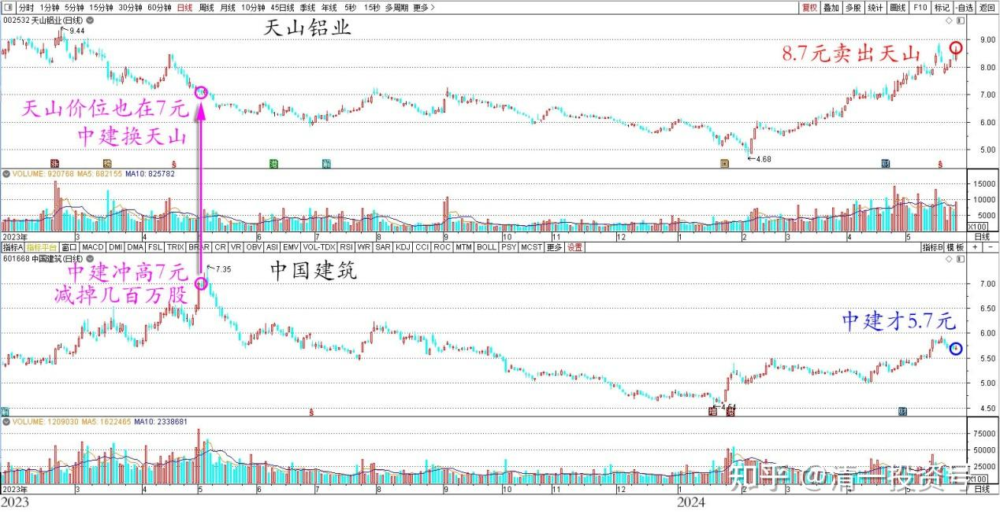
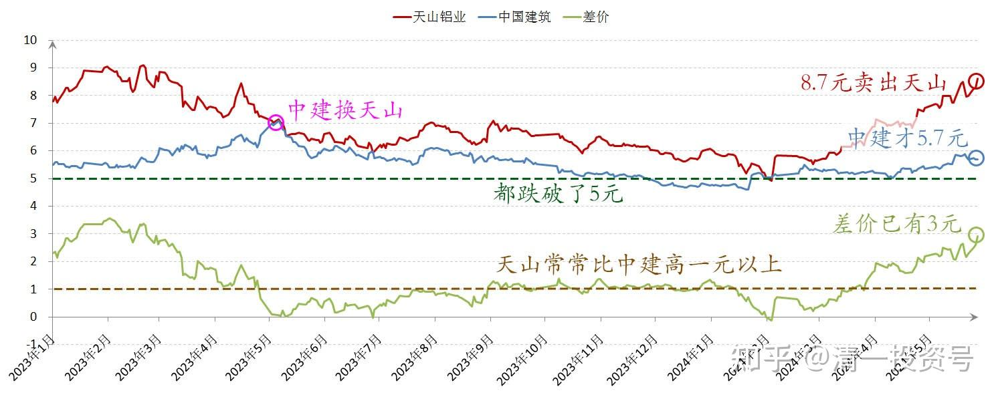
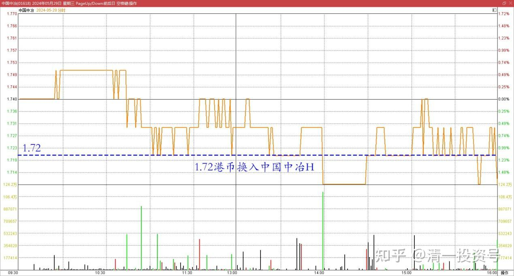
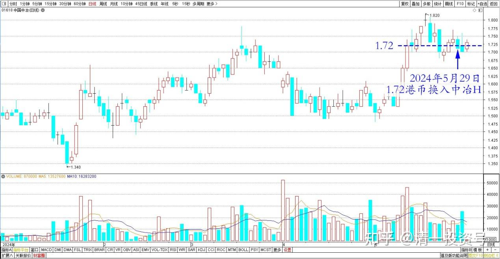
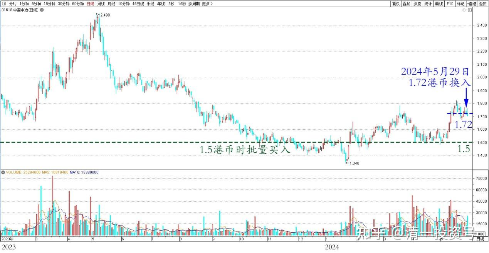

85篇.用涨了的天山铝业换没涨的中冶H

清一山长2024年5月29日

今天减仓了一批天山铝业，卖出价格是8.70元前后。这批货是中国建筑上次冲高7元区间减掉几百万股的中建仓位后换入的。当时天山的价位也在7元左右。我认为两者同价，显然是天山相对更低估，所以用中建换天山。之后，两只股都跌破了五元低价。当天山常常还是比中国建筑高一元以上。因此换股证明是划算的！后期我也一直在补入天山铝业，也有5元多买入的，因此持仓的成本是6.36元！

现在我在8.7元卖出天山，同时中国建筑才5.7元价位。当年同价的两股，现在差价已经有3元了。所以——我当时的换股证明是成功的。

天山铝业和中国建筑2023～2024日线图

天山铝业和中国建筑2023～2024年收盘价

那么——今天我应该重新换入中国建筑才对。不过考虑到**换股，就要换最便宜的股**。央企的建筑股，我看都可以换进来。我发现最便宜的，应该是中国中冶的H股，**正好中冶也拥有金属矿产资源，符合我现在要尽量投资大宗和金属品的目标。而且在这轮金属股大涨的局面下，它居然都没咋涨**。所以——**我拿天山铝业换所有优质铜矿股的中冶，肯定不吃亏**。今天我的换入价格才1.72元港币，总市值港币才358亿（RMB315亿左右），利润去年是86亿。相反——天山铝业去年利润是22亿。这个数据，只有中冶的四分之一，而且——中冶的矿业部分利润就有这么多利润了！可是天山铝业的市值比中冶高不少，是400亿人民币。我怎么算——都觉得中冶肯定更划算。所以——**今天就用涨了的天山筹码，又换了一大堆的中冶筹码**！

中国中冶H 2024年5月29日分时图

中国中冶H 2024年日线图

目前我还持有一半的天山股票仓位，计划上涨中就逐步的出掉。换低价的其他股。**以后天山涨到天上去，我也不要了。我更喜欢趴在地上的股票**！上次就已经做过一轮天山了，知道她的脾气有点急躁！

这就是今天的操作，供大家参考。说明：中国中冶的主仓位，我是在1.5港币的时候才批量买入的。**现在我只是换股行为，不是买入行为**。我的目的是增加股票，将来市场上涨中才不会丢失宝贵的筹码，因为我习惯常年满仓。**我的目的不是增加利润，而是增加仓位，所以我常常傻乎乎地会在高位买入股票**。比如在7元换股买入天山之类的笨事情，而不是等到跌破五元再动手。我不排除以后中冶跌破1.5元的可能，我也有预备队会在此时投入的！

**什么时候涨？我不知道。不涨我就拿着吃利息！反正跌了我就是不卖！高息股我怕啥？**

中国中冶H 2023～2024年日线图

(标题、图片为编者所加)

**文章音频**

[449篇.用涨了的天山换没涨的中冶H](http://link.zhihu.com/?target=https%3A//www.ximalaya.com/sound/732439843)

**参考链接：**

[74篇.A股要崩了？我还在买股票！](https://zhuanlan.zhihu.com/p/686286680)

[75篇.同为啤酒，敢否持有？（配图版）](https://zhuanlan.zhihu.com/p/684419681)

[76篇.年前最后一天，燕京换惠泉](https://zhuanlan.zhihu.com/p/688783385)

[77篇.年后第一天，看啤酒起落](https://zhuanlan.zhihu.com/p/688784278) [78篇.洛阳钼业换华菱钢铁](https://zhuanlan.zhihu.com/p/692417410)

[78篇.洛阳钼业换华菱钢铁](https://zhuanlan.zhihu.com/p/692417410)

[79篇.养老账户操作：燕京换珠江](https://zhuanlan.zhihu.com/p/693773038)

[80篇.不要钱，只要股——啤酒股切换](https://zhuanlan.zhihu.com/p/695027042)

[81篇.惠泉跌破十元，再次进入十大](https://zhuanlan.zhihu.com/p/696066886)

[82篇.远离投机，踏实投资，才是正道](https://zhuanlan.zhihu.com/p/697366505)

[83篇.换股策略——高卖低买](https://zhuanlan.zhihu.com/p/698681371)

[84篇.赚股——卖出涨得好的，买入趴地下的](https://zhuanlan.zhihu.com/p/699932996)

