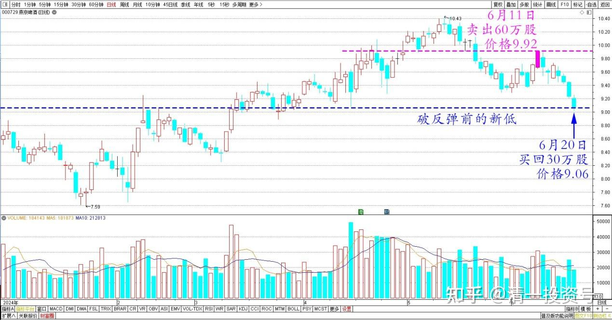

89篇.跌破新低，买回燕京

清一山长2024年6月20日

今天买回燕京30万股，每股买入价格9.06元。这是前段时间9.92元卖出的，首次开始买回行为。也就是赚点小钱罢了——我不明白为啥破反弹前的前低了。我看主力现在也不想涨的样子，没指望它很快反转，我反正没事干，就买回来算了。涨了再卖就是了！时不时进进出出的玩一下，每次都不亏就好！**耐心一点，筹码一旦丢了就认输。不去扳回来！心态好就无敌！**

燕京啤酒2024年日线图

（标题、图片为编者所加）

**文章音频**

[457篇.跌破新低，买回燕京](http://link.zhihu.com/?target=https%3A//www.ximalaya.com/sound/738275073)

**参考链接：**

[83篇.换股策略——高卖低买](https://zhuanlan.zhihu.com/p/698681371)

[84篇.赚股——卖出涨得好的，买入趴地下的](https://zhuanlan.zhihu.com/p/699932996)

[85篇.用涨了的天山铝业换没涨的中冶H](https://zhuanlan.zhihu.com/p/701250566)

[86篇.10元上下的啤酒操作](https://zhuanlan.zhihu.com/p/702432867)

[87篇.中国中冶的筹码分析](https://zhuanlan.zhihu.com/p/703727743)

[88篇.燕京、珠江轮动——增厚账面利润](https://zhuanlan.zhihu.com/p/705006495)

