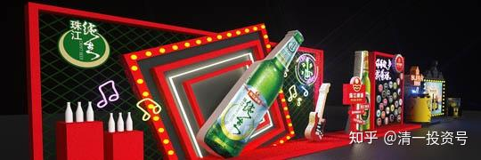
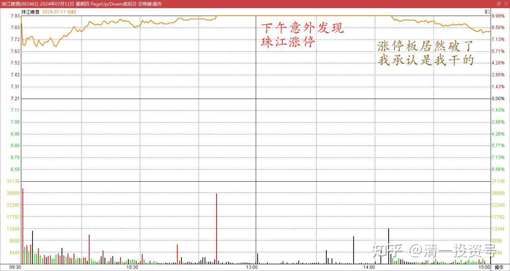
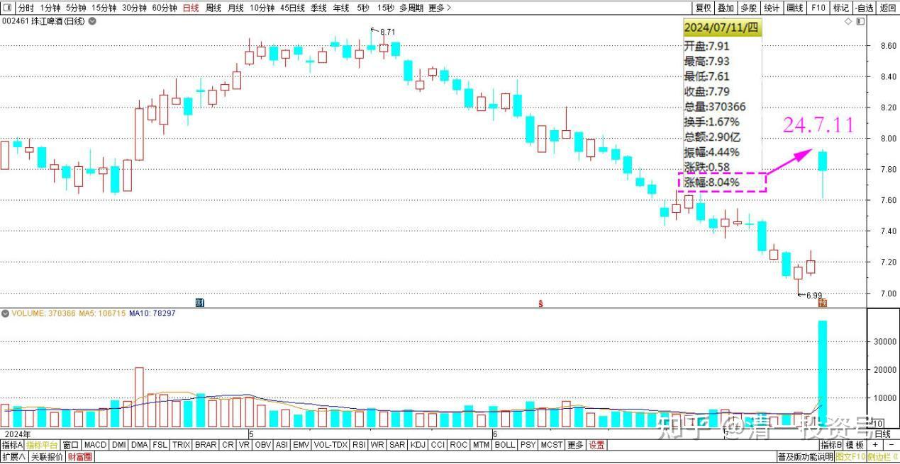
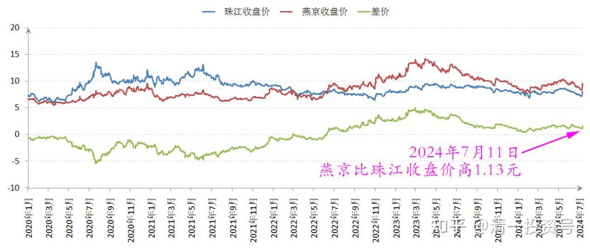
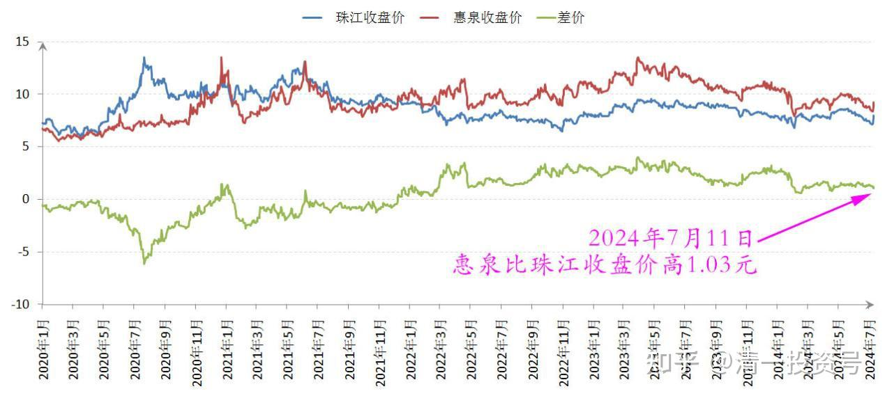

**91篇.珠江盈喜涨停，换燕京和惠泉**

**清一山长 2024年7月11日**

上午上完课，下午才意外发现珠江涨停。今天市值浮盈应该是创历史记录了。本来不想动的，但看到珠江与燕京和惠泉的差价，居然9毛钱不到了，这种价格，干嘛不换呀？虽然珠江不到8元，价格不算高，我也没赚到啥大钱，于是我就出掉了一点珠江，养老账户上的珠江就基本清零了。其他账户的珠江头寸甚多，仓位难以快速降低——也卖一点来冲冲喜。接下来——我看珠江的涨停板居然给破了——好吧！我承认是我干的，很抱歉。

珠江啤酒 2024年7月11日 分时图

珠江啤酒 2024年4月~7月 日线图

珠江和燕京 2020~2024年 收盘价

珠江和惠泉 2020~2024 年收盘价

燕京又重新回到持仓量第一位了，惠泉大约又挤进去十大了。啤酒持仓依然是高位。

闭市后，看了一下原因：大概是珠江盈喜带来的涨停。销量和利润都大涨，半年报预计大涨40%。如果珠江利润大涨，别的处在上升期的啤酒也会涨的——比如燕京——所以我应该换对了。等燕京的半年报消息出台，也许我又会收获一个涨停了！

（珠江啤酒《2024年半年度业绩预告》：本报告期，公司以实现高质量发展为主线，持续优化产品结构，积极开展降本增效工作，实现啤酒销量和营业收入同比增长，预计归属于上市公司股东的净利润比上年同期增长30%至45%。）

注意：此半年预报出台之前。珠江跌得好惨——都快跌破7元了，看起来公司都快破产了。只有我这种傻乎乎的人才敢继续买入和持有啤酒。我想业绩差就慢慢等——谁能想到是多年来的最佳利润成长，我们这个疯狂的市场，却给打了一个大叉叉呢？**如果你相信市场，就又被大大地骗了一次**。账面上当日盈利高高的数值，让我以为是不是在梦中，似乎我还没有一日之内赚过这么多钱——当然是假的——我如果要卖，马上就会跌了。**账面利润就是骗人的，别信**！

（标题、图片为编者所加）

**文章音频**

[465篇.珠江盈喜涨停，换燕京和惠泉](http://link.zhihu.com/?target=https%3A//www.ximalaya.com/sound/744458368)

**参考链接：**

[86篇.10元上下的啤酒操作](https://zhuanlan.zhihu.com/p/702432867)

[87篇.中国中冶的筹码分析](https://zhuanlan.zhihu.com/p/703727743)

[88篇.燕京、珠江轮动——增厚账面利润](https://zhuanlan.zhihu.com/p/705006495)

[89篇.跌破新低，买回燕京](https://zhuanlan.zhihu.com/p/706301925)

[90篇.珠江换燕京，天山换华菱](https://zhuanlan.zhihu.com/p/710097153)

