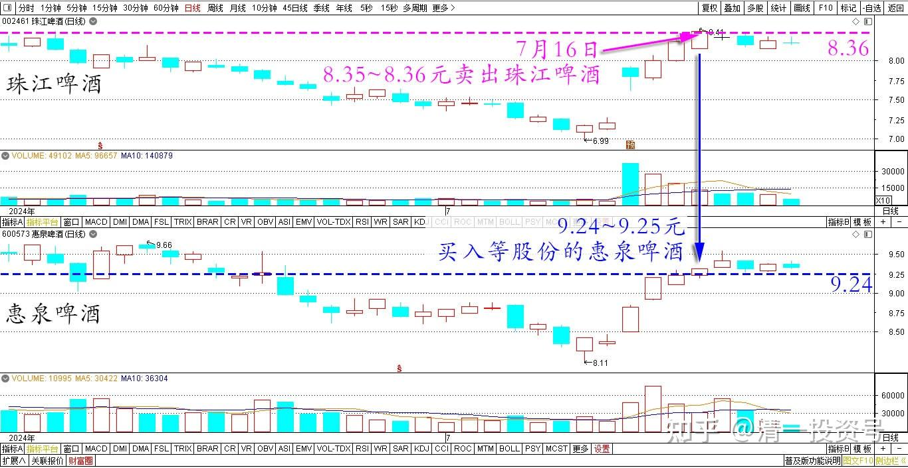
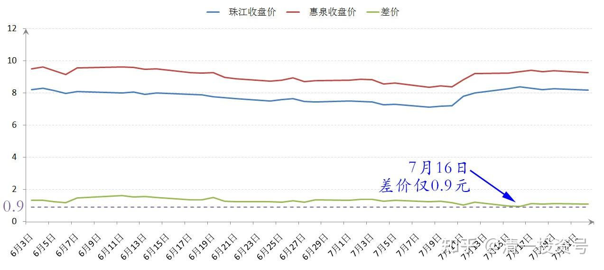
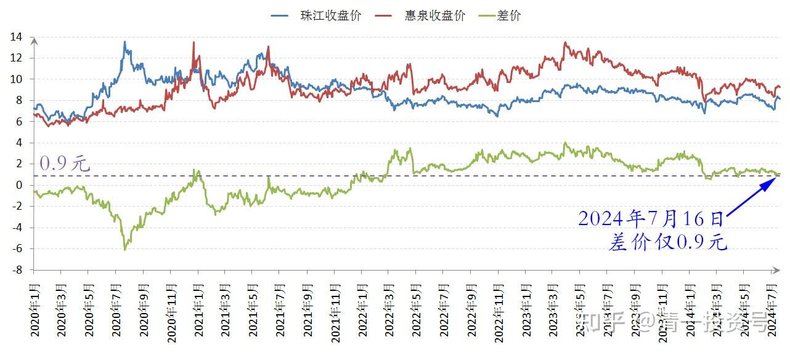
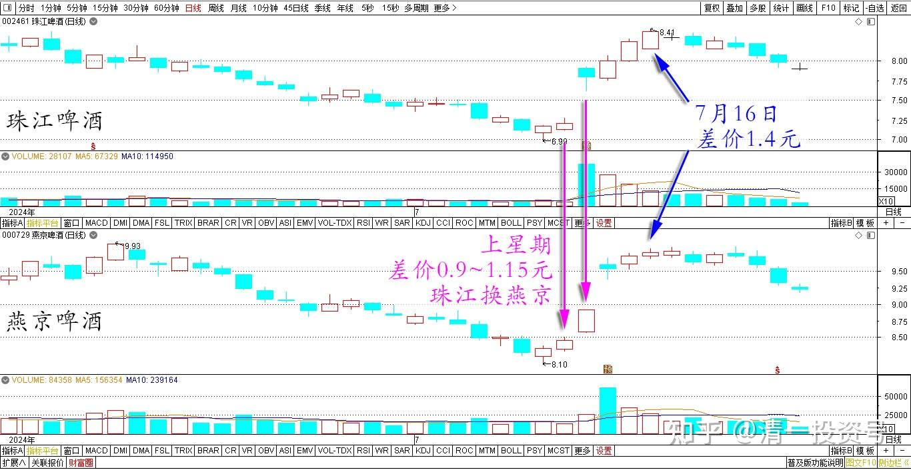
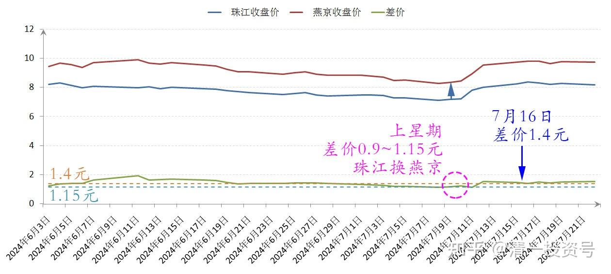
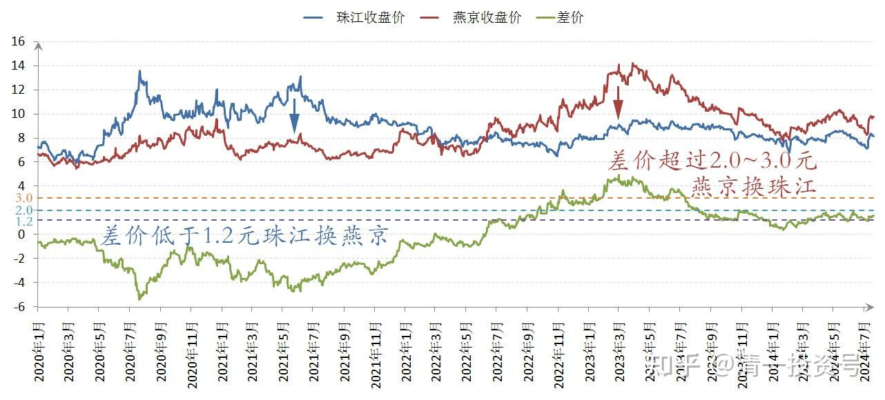

92篇.差价0.9元，珠江换惠泉

清一山长2024年7月16日

今日操作：8.35～8.36元卖出珠江啤酒，9.24～9.25元买入等股份的惠泉啤酒。理由：两股差价目前仅仅0.9元，很值得换！

珠江和惠泉2024年6月～7月日线图

珠江和惠泉2024年6月～7月收盘价

珠江和惠泉2020～2024收盘价

上星期两股差价达到0.9元～1.15元时用的珠江换燕京，目前两股差价已经1.4元了。**差价超过1.2元就停止换股。差价多过2.0～3.0元就反向换股！不断赚这种小小钱，集小胜为大胜！如出现涨停就开卖。大涨大卖，小涨小卖，不涨不卖！**

珠江和燕京2024年6月～7月日线图

珠江和燕京2024年6月～7月收盘价

珠江和燕京2020～2024收盘价

炒股其实很简单。随便玩一把差价，就赚了工人几年的工资。感恩金融资本市场提供的机会！

（标题、图片为编者所加）

**文章音频**

[467篇.差价0.9元，珠江换惠泉](http://link.zhihu.com/?target=https%3A//www.ximalaya.com/youshengshu/77991214/746231884)

**参考链接：**

[86篇.10元上下的啤酒操作](https://zhuanlan.zhihu.com/p/702432867)

[87篇.中国中冶的筹码分析](https://zhuanlan.zhihu.com/p/703727743)

[88篇.燕京、珠江轮动——增厚账面利润](https://zhuanlan.zhihu.com/p/705006495)

[89篇.跌破新低，买回燕京](https://zhuanlan.zhihu.com/p/706301925)

[90篇.珠江换燕京，天山换华菱](https://zhuanlan.zhihu.com/p/710097153)

[91篇.珠江喜迎涨停，换燕京和惠泉](https://zhuanlan.zhihu.com/p/711439700)

