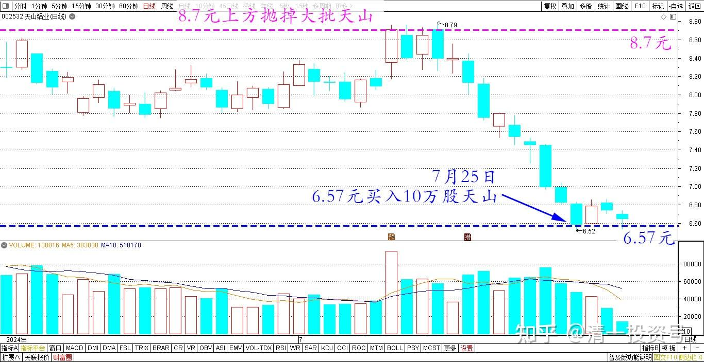
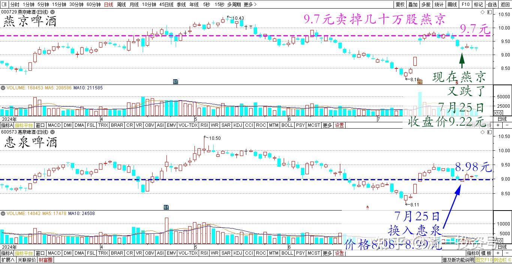
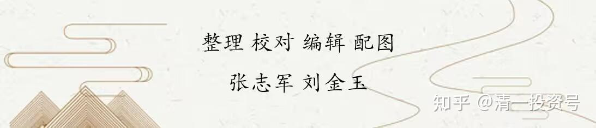

93篇.补回天山，换入惠泉

清一山长2024年7月25日

刚刚买入了10万股天山铝业，6.57元买入的。前段时间8.7元上方抛掉了大批的天山（M级别），没想到多赚了两百多万，现在良心不安，起码用利润补回来一点筹码。看趋势还会跌的，就逐步买入吧。其实——**当时卖出，也不是不看好天山后续了——就是觉得涨多了，就卖掉一些肯定没错的**。**反正市场还有一些没涨的股，我可以去慢慢买**。特别啤酒当时正在跌得狠。没想到天山居然逃了一个顶，啤酒抄了一个底。

天山铝业2024年6月～7月日线图

燕京也是一样的，我在9.7元卖掉了几十万股。**也是觉得涨多了就卖掉一点，不是觉得不会涨了**。当时惠泉没有啥卖盘，补回来的很少。现在居然燕京又跌了——今天换了一点惠泉进来。买入价格8.98～8.99元。**这价格差价7毛钱，我换股肯定不吃亏**。

燕京和惠泉2024年3月～7月日线图

（标题、图片为编者所加）

**文章音频**

[469篇.补回天山，换入惠泉](http://link.zhihu.com/?target=https%3A//www.ximalaya.com/sound/747780936)

**参考链接：**

[88篇.燕京、珠江轮动——增厚账面利润](https://zhuanlan.zhihu.com/p/705006495)

[89篇.跌破新低，买回燕京](https://zhuanlan.zhihu.com/p/706301925)

[90篇.珠江换燕京，天山换华菱](https://zhuanlan.zhihu.com/p/710097153)

[91篇.珠江喜迎涨停，换燕京和惠泉](https://zhuanlan.zhihu.com/p/711439700)

[92篇.差价0.9元，珠江换惠泉](https://zhuanlan.zhihu.com/p/711415396)

