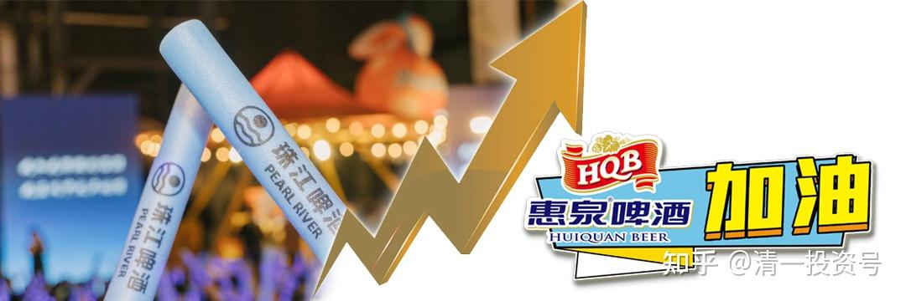
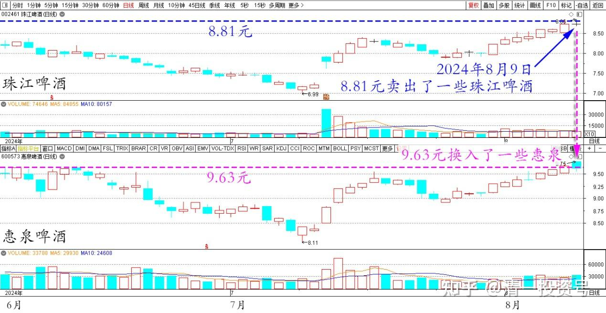
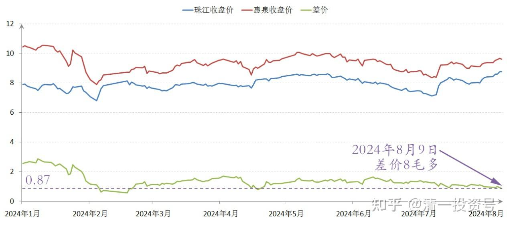
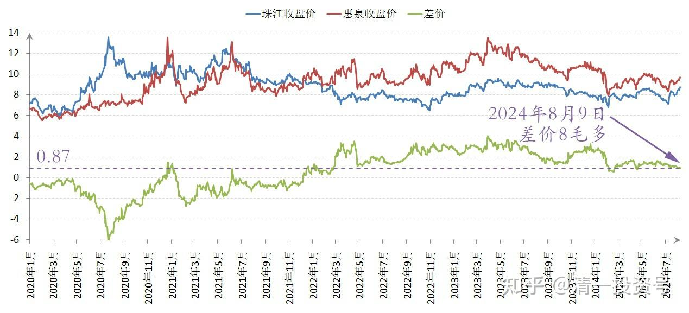

**95篇.差价8毛多，珠江换惠泉**

**清一山长2024年8月9日**

今天下午，8.81元卖出了一些珠江啤酒，9.63元换入了一些惠泉，差价8毛多钱！

珠江、惠泉啤酒2024年6月～8月日线图

珠江、惠泉啤酒2024年收盘价

珠江、惠泉啤酒2020～2024年收盘价

不过惠泉成交量太少了，所以不足的头寸，我换了其他一些我认为低估的消费股！还有高息！我认为是划算的。起码珠江7元左右的时候，我今天换入的股票，比现在价格还高两元多！一涨一跌，我应该赚了！

（标题、图片为编者所加）

**文章音频**

[473篇.差价8毛多，珠江换惠泉](http://link.zhihu.com/?target=https%3A//www.ximalaya.com/sound/751499200)

**参考链接：**

[88篇.燕京、珠江轮动——增厚账面利润](https://zhuanlan.zhihu.com/p/705006495)

[89篇.跌破新低，买回燕京](https://zhuanlan.zhihu.com/p/706301925)

[90篇.珠江换燕京，天山换华菱](https://zhuanlan.zhihu.com/p/710097153)

[91篇.珠江喜迎涨停，换燕京和惠泉](https://zhuanlan.zhihu.com/p/711439700)

[92篇.差价0.9元，珠江换惠泉](https://zhuanlan.zhihu.com/p/711415396)

