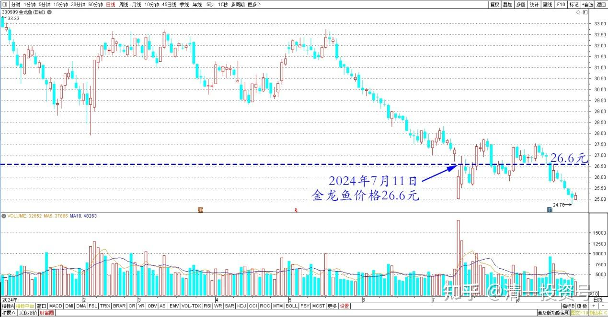
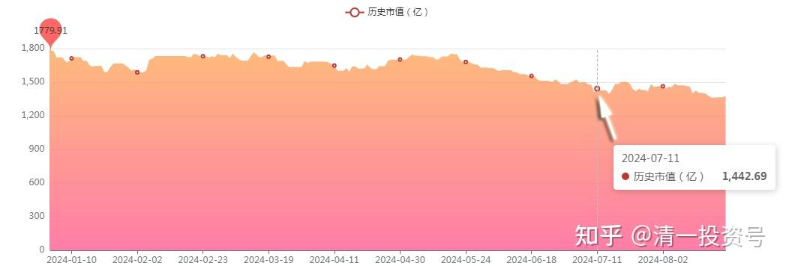
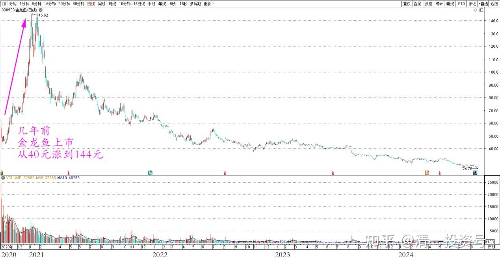
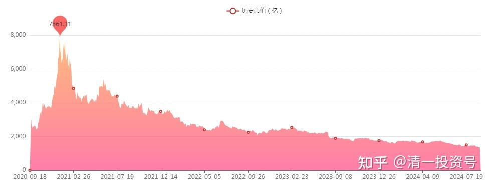
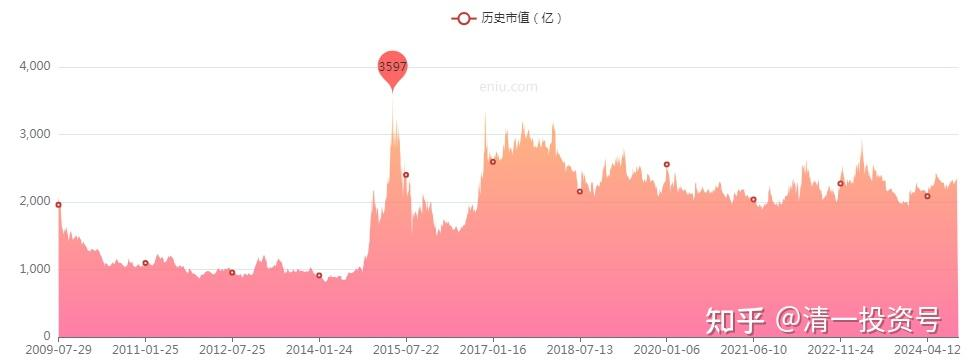
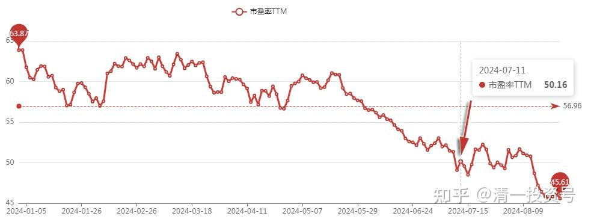
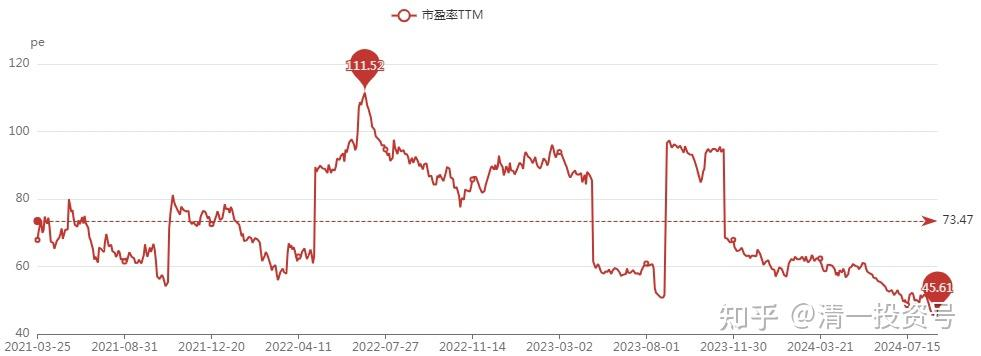

96篇.守低位风口，不天际追高

清一山长2024年7月11日

金龙鱼今天价格26.6元。总市值1440.4亿（这个市值很有意思）。

金龙鱼2024年日线图

金龙鱼2024年历史市值

几年前，金龙鱼上市，居然从40元一路涨到144元，最高市值超过万亿，是中国建筑的五倍以上。

金龙鱼2020~2024日线图

金龙鱼2020~2024历史市值

中国建筑2009～2024年历史市值

我当时持有的是啤酒和建筑，一直不涨。但我说：**我绝对不会去买这个企业，没啥技术含量。它做的东西谁都会做，不明白这个高的市值有啥意义。**即使是现在——这个市值都太高了。

炒白酒，好歹有个“无酒不欢，中国吃文化”的理由。炒金龙鱼——你家请客会用一箱金龙鱼油来款待客人吗？一个低利润消费品，值得万亿市值？脑子疯了吧？

所以——没有技术，没有市场，但国人居然捧的高高的，一路往上走。每天大量的成交量，让我觉得中国的钱就是不值钱！

很久没有看了，直到现在炒【[矿物油直接运输植物油](http://link.zhihu.com/?target=https%3A//www.sohu.com/a/792185532_120865506)】事件。才让我注意到早已忘记的金龙鱼——这几年一路下降。**现在的价格，居然都要50倍PE。未来人口下降，金龙鱼现价买入，靠本股票的业绩，50年还本。**你们谁买呀？

金龙鱼2024年PE

金龙鱼2021～2024年PE

在不懂思考和理性的中国，赚钱真容易。**守住一个低位的风口，绝对不去金龙鱼这样的天际追高，你要赢过普通人的机会太大了！**因为体制标准教育培养出来的普通人，就是一群韭菜。只要一切跟他们反做就行了！

（标题、图片为编者所加）

**文章音频**

[475篇.守低位风口，不天际追高](http://link.zhihu.com/?target=https%3A//www.ximalaya.com/sound/753168675)

**参考链接：**

[88篇.燕京、珠江轮动——增厚账面利润](https://zhuanlan.zhihu.com/p/705006495)

[89篇.跌破新低，买回燕京](https://zhuanlan.zhihu.com/p/706301925)

[90篇.珠江换燕京，天山换华菱](https://zhuanlan.zhihu.com/p/710097153)

[91篇.珠江喜迎涨停，换燕京和惠泉](https://zhuanlan.zhihu.com/p/711439700)

[92篇.差价0.9元，珠江换惠泉](https://zhuanlan.zhihu.com/p/711415396)

[95篇.差价8毛多，珠江换惠泉](https://zhuanlan.zhihu.com/p/712702963)

