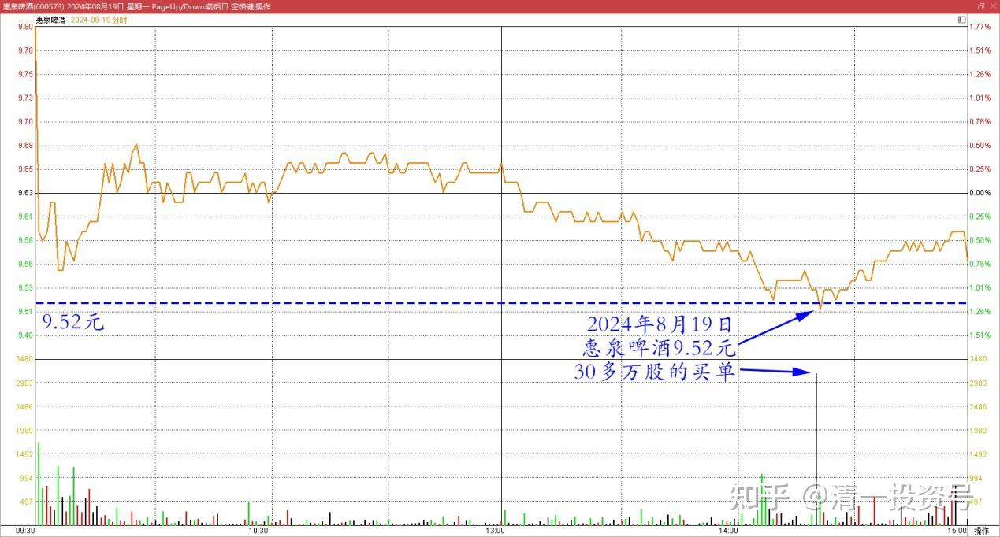
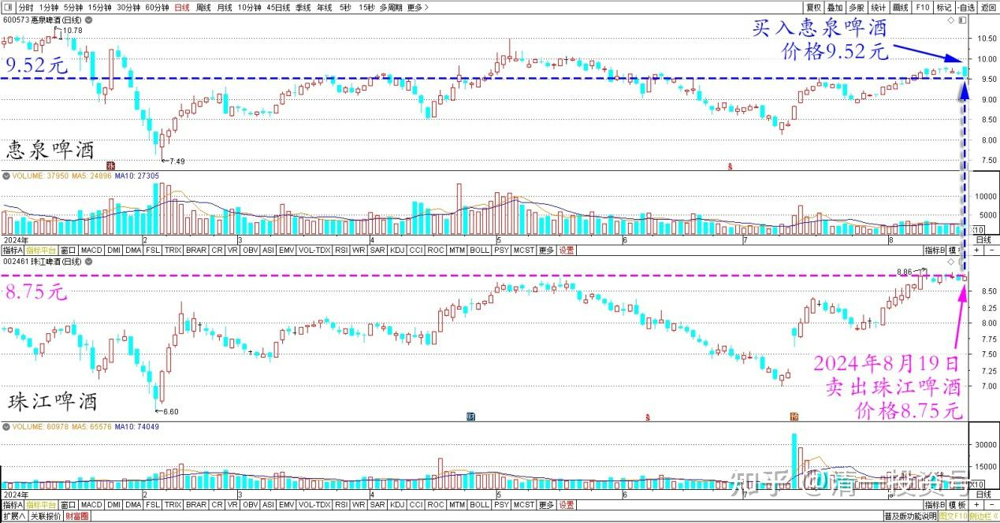
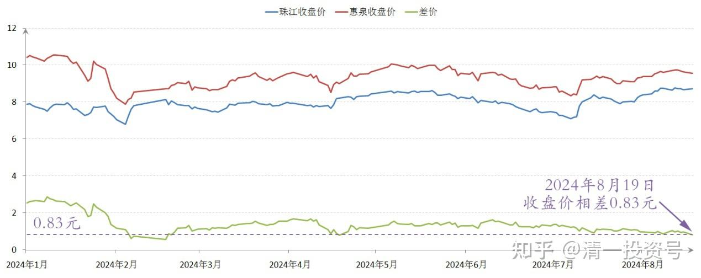

97篇.差价7毛多，珠江换惠泉

清一山长2024年8月19日

必须承认：今天惠泉啤酒9.52元30多万股的这一笔买单，是我干的！当日最大成交单。

惠泉啤酒2024年8月19日分时图

当时看到有大笔的股票在压盘，正好珠江今天上涨了，两股的差价才7毛多不到0.8元了。这不就是趁机换股的好时光吗？于是果断挂单一扫掉惠泉盘面上的大单压盘，另外在8.74～8.75元卖出珠江平仓对冲风险。后来惠泉就见不到大单了，连一万股的单子都很少。就放任它涨了几分钱，没有继续追高！

珠江、惠泉啤酒2024年日线图

珠江、惠泉啤酒2024年收盘价

申明：这不是买入惠泉，这只是做跨品种T入惠泉。惠泉现在的流动性很不好，只能长期持有。如果我不是珠江啤酒涨了有换股需求，否则根本不会理会盘面的！

思考：惠泉业绩良好，却不涨反跌，不正常。居然还有大单压盘往下打？所以——我不出反进。珠江也看到了有资金收集的信号！早干啥去了？这么高了来收集？我就发善心，送点筹码给你们好了！

（标题、图片为编者所加）

**文章音频**

[477篇.差价7毛多，珠江换惠泉](http://link.zhihu.com/?target=https%3A//www.ximalaya.com/youshengshu/77991214/755160285)

**参考链接：**

[88篇.燕京、珠江轮动——增厚账面利润](https://zhuanlan.zhihu.com/p/705006495)

[89篇.跌破新低，买回燕京](https://zhuanlan.zhihu.com/p/706301925)

[90篇.珠江换燕京，天山换华菱](https://zhuanlan.zhihu.com/p/710097153)

[91篇.珠江喜迎涨停，换燕京和惠泉](https://zhuanlan.zhihu.com/p/711439700)

[92篇.差价0.9元，珠江换惠泉](https://zhuanlan.zhihu.com/p/711415396)

[95篇.差价8毛多，珠江换惠泉](https://zhuanlan.zhihu.com/p/712702963)

[96篇.守低位风口，不天际追高](https://zhuanlan.zhihu.com/p/717712671)

