98篇.从消费数据看酒类投资前景

清一山长2024年8月28日

北京统计局数据，2024年上半年，北京规模以上餐饮业利润总额1.8亿元，同比下降88.8%，利润率低至0.37%。

限额以上住宿和餐饮业法人单位主要经济指标

[限额以上住宿和餐饮业法人单位主要经济指标](http://link.zhihu.com/?target=https%3A//tjj.beijing.gov.cn/tjsj_31433/yjdsj_31440/sy_31814/2024/202407/t20240731_3763890.html)

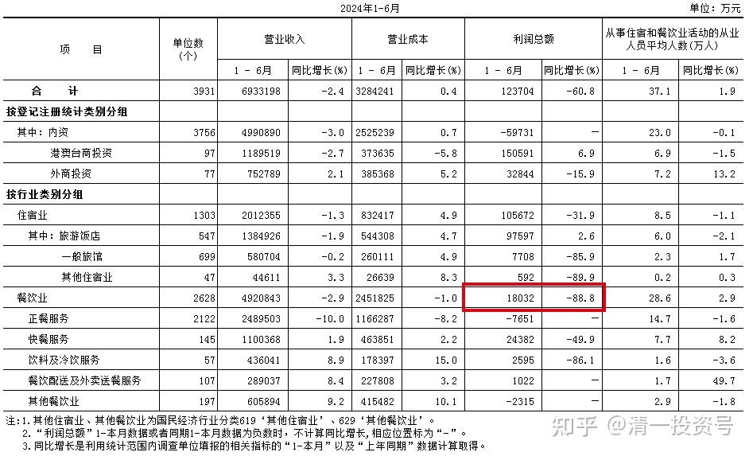

但另一方面，今年旅游业却非常火爆，2024年上半年，国内出游人次27.25亿，同比增长14.3%，出游总花费2.73万亿，同比增长19%。

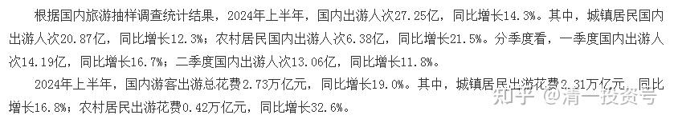

这个数字，挺古怪的——老百姓到底有钱还是没钱？

我猜测：是**商务消费**，**人情消费，拉关系讲面子的消费，都消失了。但老百姓的自我娱乐，里子消费，还是有的！**

国人不是穷了，而是财富和消费转移了！小商人肯定更难了！大商人和打工仔，估计没啥事！

**这种消费情况，对白酒，特别是高端白酒的消费是个很大的打击，但对啤酒似乎反而是利好**！从啤酒的半年报上看，的确啤酒没有啥影响，都是上升的。但白酒就不好说了——现在勉强用做账来平衡（我怎么都不相信今年茅台的销量居然还能上升两位数）。如果上面的数据是当真的，白酒业持股的股东，能逃跑的赶快跑，晚了就来不及了！

**啤酒、白酒主要会计数据和财务指标比上年同期增减**

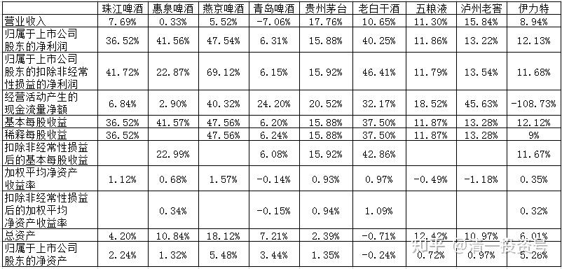

珠江啤酒2024半年报主要会计数据和财务指标

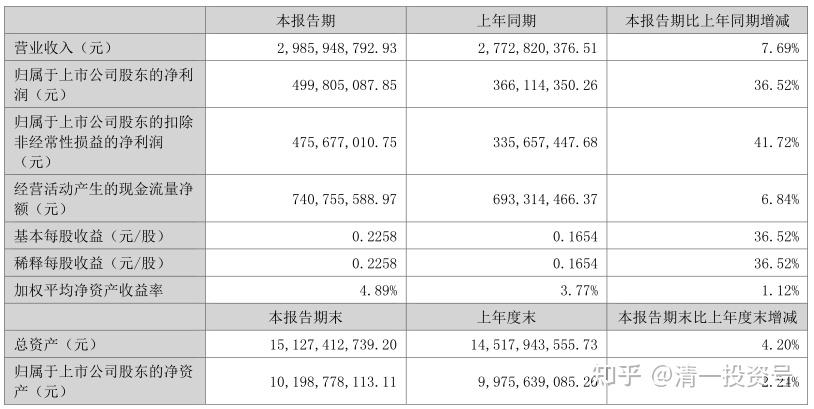

惠泉啤酒2024半年报主要会计数据和财务指标

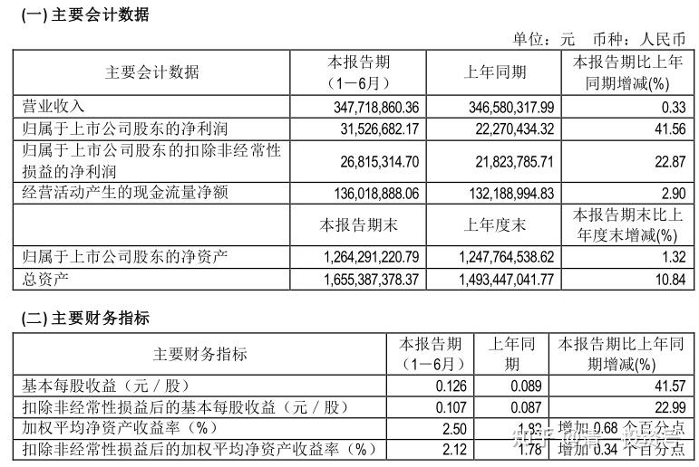

燕京啤酒2024半年报主要会计数据和财务指标

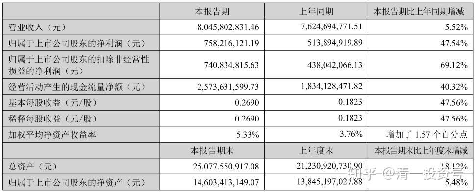

青岛啤酒2024半年报主要会计数据和财务指标

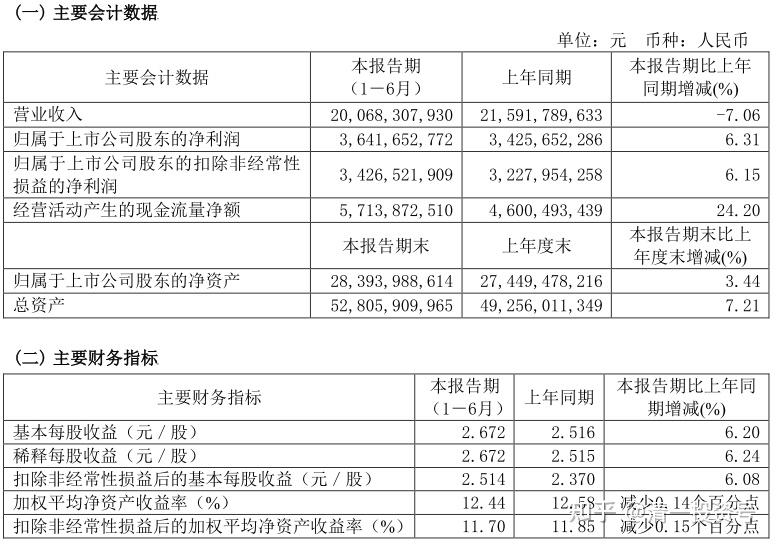

华润啤酒2024半年报财务概要

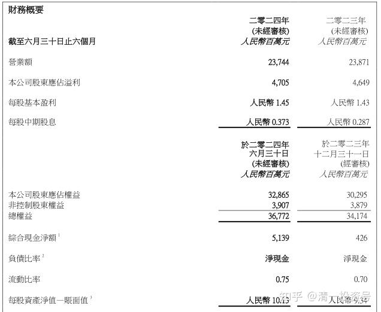

贵州茅台2024半年报主要会计数据和财务指标

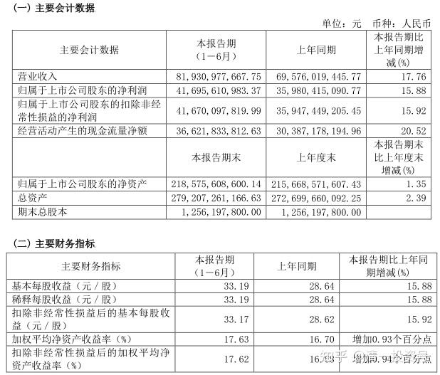

老白干酒2024半年报主要会计数据和财务指标

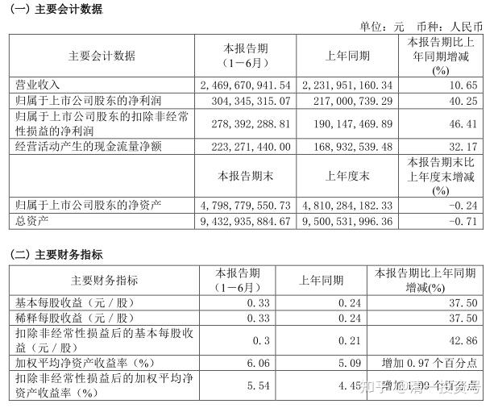

五粮液2024半年报主要会计数据和财务指标

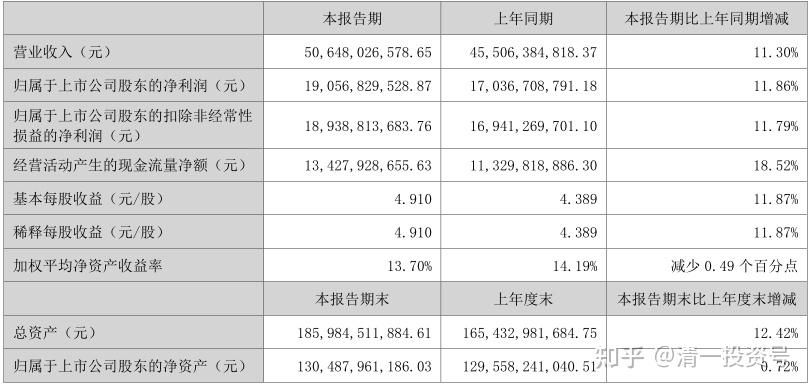

泸州老窖2024半年报主要会计数据和财务指标

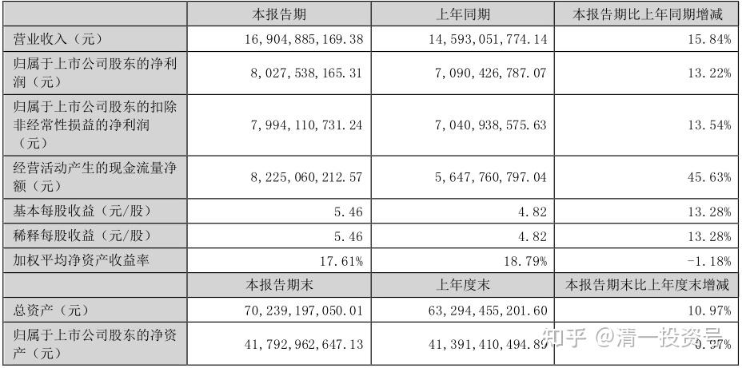

伊力特2024半年报主要会计数据和财务指标

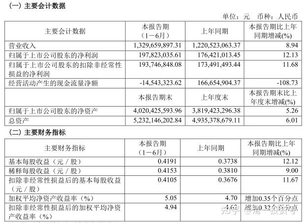

(标题、图片为编者所加)

**文章音频**：

[479篇.从消费数据看酒类投资前景](http://link.zhihu.com/?target=https%3A//www.ximalaya.com/sound/756865560)

**参考链接：**

[超低利润席卷北京餐饮业](http://link.zhihu.com/?target=https%3A//news.qq.com/omn/author/8QMf2nlY7YUevTbQ)

[88篇.燕京、珠江轮动——增厚账面利润](https://zhuanlan.zhihu.com/p/705006495)

[89篇.跌破新低，买回燕京](https://zhuanlan.zhihu.com/p/706301925)

[90篇.珠江换燕京，天山换华菱](https://zhuanlan.zhihu.com/p/710097153)

[91篇.珠江喜迎涨停，换燕京和惠泉](https://zhuanlan.zhihu.com/p/711439700)

[92篇.差价0.9元，珠江换惠泉](https://zhuanlan.zhihu.com/p/711415396)

[95篇.差价8毛多，珠江换惠泉](https://zhuanlan.zhihu.com/p/712702963)

[96篇.守低位风口，不天际追高](https://zhuanlan.zhihu.com/p/717712671)

[97篇.差价7毛多，珠江换惠泉](https://zhuanlan.zhihu.com/p/717710915)

