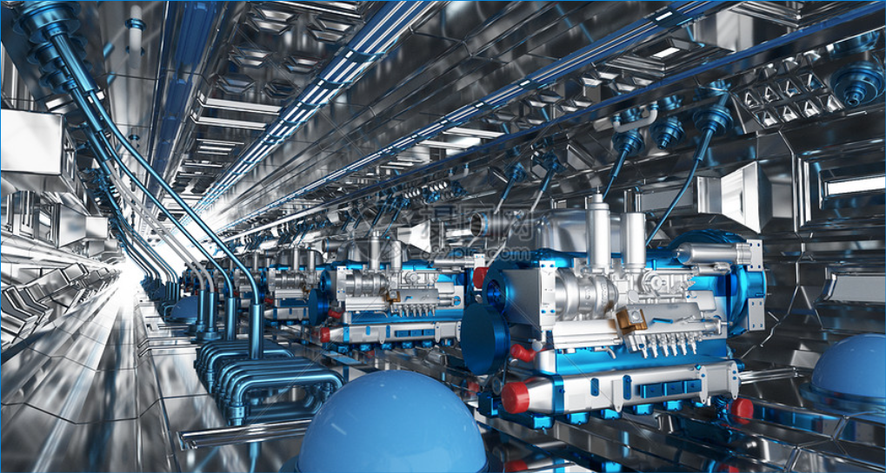
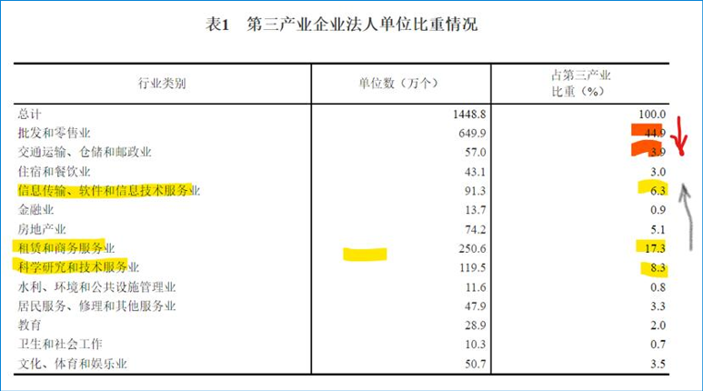

9篇.从制造业的现状看未来的投资方向

山长清一 2022年1月10日

转发——

世界上曾经制造业占比超20%的唯一国家是美国，持续下滑；

日本上世纪90年代，制造业产值达到世界产值的20%，持续下滑；

德国长期制造业产值占世界产值10%以内；

2009年中国制造业占世界产值18%，美国也是18%；

2018年中国制造业占世界制造业产值29.4%；

预计2025年中国制造业占世界制造业产值40%-45%；

不看这些数据，很难理解为什么中美贸易冲突会越来越激烈。

世界工厂这个名头，真不是盖的。

链接：

[http://www.sf88168.com/info/portal.php?mod=view&aid=72180](http://link.zhihu.com/?target=http%3A//www.sf88168.com/info/portal.php%3Fmod%3Dview%26aid%3D72180)

点评：这个信息，包含了各位未来的投资方向。不知你们看出来没有？**在未来中国制造业注定比例要下滑的，在下滑的过程中，我们应该投资什么才能获得最好的增长利润？以上指标，已经很明显地表达出来了。**[大笑]

*红军沈阳2022/1/10 11:23:12

未来制造业下滑，份额一定会转移到有活力的新兴市场和低估的发展中国家；还有制造业向新兴行业转移，其中，教育是永恒不变的主题；地球向人类不断发出信号，目前人性的两极分化很严重，急需高能量的导师引领人类发展。

*少洪狮城 2022/1/10 12:06:24

我们越来越注重第三产业。这是第三产业的细分变化。

图表的资料来源

[http://www.stats.gov.cn/xxgk/sjfb/zxfb2020/201912/t20191204_1767555.html](http://link.zhihu.com/?target=http%3A//www.stats.gov.cn/xxgk/sjfb/zxfb2020/201912/t20191204_1767555.html)

我国第三产业规模扩大结构优化——第四次全国经济普查系列报告之二（2019年12月04日）

*心学 贵阳2022/1/10 12:37:28

我在山长课上学到一种思维方式：道者反之动也，也就是与大多数人的思维反着来。从这段资料中，可以看到当大多数人认为制造业不行的时候，中国制造业是一个投资方向。在制造业里基建钢铁类是核心，因此我认为可以提前布局这些方向，未来可以获得很好的利润增长。

*有超深圳 2022/1/10 13:22:12

山长分享的这个信息，包含了未来的投资方向走向。在未来中国制造业注定比例要下滑的，在下滑的过程中，我觉得我们的政府一定像房地产行业一样做各种防范风险的手段；如供给侧等。控制新加入公司无序增长，控制已有公司的产量（兼并小公司），让已有公司利润得到明显增长；变成低估绩优股。我认为现在投资国企核心制造业公司（如中国神华、中国建材、中国中铁），未来一定会收获满满。

转发新闻——

国资委：进一步压实企业国有资产保值增值和风险防控主体责任 突出抓好国企改革三年行动

2022年1月9日，国务院国资委以视频方式召开地方国资委负责人会议暨地方国有企业改革领导小组办公室主任会议，总结2021年国资国企工作，明确2022年重点任务。会议强调，要突出抓好稳增长，坚持问题导向、目标导向，进一步压实企业国有资产保值增值和风险防控主体责任，指导企业加大提质增效工作力度，努力保持全年经济平稳运行，为国民经济增长贡献国资国企力量。突出抓好国企改革三年行动，全力以赴拔硬钉子、啃硬骨头，突出重点、把握关键、深入攻坚，确保三年行动务期必成。突出抓好国有企业科技创新，强化企业创新主体地位，完善创新体制机制，着力打造国家战略科技力量，大力推进高水平科技自立自强。突出抓好做强做优主业实业，把发展的着力点放在实体经济上，推进传统产业转型升级，为建设现代产业体系和促进产业链供应链畅通强基础。

链接：

[https://news.cctv.com/2022/01/09/ARTIij66WyLmYX111JlXkYGV220109.shtml](http://link.zhihu.com/?target=https%3A//news.cctv.com/2022/01/09/ARTIij66WyLmYX111JlXkYGV220109.shtml)

*华丽 2022/1/10 13:11:33

@山长清一 山长曾经在雪球上说【看过去，知未来】，下面这段文字是山长2015年分享，可能山长自己都忘了，但是我们现在再看一次，可以说是站在现在验证过去，山长的眼光，以2015年为站点的【十几年】前，估计是二零零零年以前了吧，已经如此精准，20多年之后的今天，我们肯定，山长的眼光更精准。感恩山长的分享，无论是几十年前，还是现在，还是未来，永远为我们示范付出、分享、创造价值。

以下为原文，加了编号，方便家人们对号入座，您想要跟随把这样的眼光放于何处——

**【往前看的眼光是无价的】**

1. 买房的眼光——我当时还是企业的老板的时候，然后我的经济是没有问题的。熟悉我、常看我博文的人都知道，我在2013年到武汉将我在武汉的20几套房子卖掉了。房子是什么时候买的呢？十几年前买的。也就是说那时候我就是有一定经济实力的人。

2. 进今日的眼光——那么办这个学校我是采取的什么态度呢？赔本办。我收的学费当年是1万5千元一年，包吃包住包学费，一切包啰！是不是比请个保姆还便宜呢？但是因为很多人没有眼光，他不知道这是一个礼物，他们甚至认为这可能是个陷阱，很多人根本看不起，后来等他们看得起的时候，就发现花钱已经进不来了。现在就算你花进耶鲁、哈佛的学费，也未必能进今日学堂，就像有些家长突然发现这样一个事实：进今日学堂比进清华、北大还难。没错，今日学堂一年最多只招二十名学生，清华、北大每年要招几千人，这肯定是不一样的。但在当年，只要是坚定支持我们的，你就可以入学，几乎是没有门槛，而且今天我们的门槛为什么抬那么高，是因为你当初没有眼光，到今天才有眼光，那么这个眼光到底值多少钱咧？

3. 教育孩子的眼光——这个眼光如果用在你的教育上用在孩子身上，你永远往前多看几步，看五年，看十年，那你的眼光是无价的。你值得用你全部的资产来购买它，如果你能够有这样的机会。用在其它方面，它的代价也是极其高昂的。

4. 股市的眼光——请大家想一想，我前年年底（2013年底），去年年初、年中，是不是一直都在告诉大家一件事情：中国金融市场是一个非常好的投资机会，现在要见底了，然后告诉大家无风险投资可获千万。当我做这样的事的时候你瞧不起，你轻视这样的事实，而这是公开的，一分钱不要教给你。而你不相信，现在的结果就是：你没赚到钱。很轻松的，中国这个时代送给我们大大的礼物，这个礼物只有少数人赚到了。这部分少数人，当然也不算少也有几百人，而这几百人成为了去年（2014年）全中国最赚钱，赚得最轻松的一批人，那么我们再想一想，在座的各位，我想你们一定在想，现在能不能重新回到2014年，你一定会想如果重新回到2014年，我一定砸锅卖钱去干这样一件事情，一定把自己房子卖掉，对吗？

5. 进今日的眼光——好了，我们再想想，如果你重新回到2003年、2005年，重新回到今日学堂刚刚创办的时候，你如果知道今日学堂1万5千元钱就可以来上一年的学，你会怎么说：你居然不送孩子来那是不是犯傻。你都不能原谅自己，对吗？这就是古人说的一句话：千金难买真知，万金难买早知道！

6. 投资的眼光——如果你明白了这个道理，那么今天我给大家的分享，给大家讲的课题就是这样一个千金难买、万金难买的机会，我们将观察这个时代的变迁，我们将去研究，判断、去看清楚未来的10年、20年这个世界会发生什么？而且我们需要在今天就为它做好准备，而不是到10年、20年后再去告诉它我想要重来一遍。今年你说你想要买去年两块伍一股的中国中铁，还有机会吗？没有了，以今天的价格算已经20多块多钱了。去年我告诉大家，去年我在武汉还讲过一次财富课的辅助课，其中说了中国高铁的机会，也特别强调了这一点的，而听懂的人收益特别大，没听懂的人今天也没机会了，没有了。

7. 事业的眼光——所以呢，你不要等事件已经发生了，你周围所有的人都知道了你再来做，等所有人都知道的时候就没有你的机会了。要在大家都不知道的时候你知道，这才是你要做的一件事情。中国的教育、未来的教育，中国的生活、未来的生活，以及你在中国的事业平台都会在未来10到20年时间发生你完全想像不到的变化，甚至是你不敢适应的变化。

8. 选地址的眼光——十几年前，我在会场外这条路上，原来关山是我的一个经营点，是我公司在这边的经营重点，当年这条街上的车是很少的，外面的民族大道，也就在仅仅10年前都不是今天这样的。那么这十几年的时间，武汉现在这里堵车堵得不得了，一个红绿灯要闪十次你才过得去。但如果十年前你能布局知道今天这个变迁，你随便买一处房子，它的增值空间有多大？我在十几前买的房子，每套房子都增值了10倍以上，而且我当时还是用20%～30%按揭买的。所以我的资金回报率来说是不是很高。

**——那么这就是你的眼光。**
