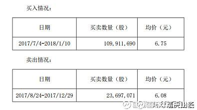

**原专栏20篇.燕京啤酒的庄家是谁？**

清一山长 2018年1月22日

[$燕京啤酒(SZ000729)$](http://link.zhihu.com/?target=http%3A//xueqiu.com/S/SZ000729%2522%2520%255Ct%2520%2522_blank) 我终于找到燕京啤酒的庄家了，我也知道，去年下半年燕京为何跌，以及燕京五元多破底的价格是谁干的了。我一直在纳闷，去年底是谁这么大方，砸出来这个多年不见的大坑，把所有买燕京的人，账面全都带上了厚厚的绿帽子？原来是——裘国根，对，就是他干的！

晒晒证据：

资料：在公告前的6个月，裘国根曾在2017年7月4日至2018年1月10日，买入109,911,690股燕京啤酒，买入均价6.75元。（7元多他也在大举买入。估计涨停价也是他拉的）。但是，谁在去年底打压燕京价格的？谁制造了5元多破位下跌，卖出的燕京股票？也是他！

看资料：2017年8月24日至2017年12月29日，裘国根又卖出燕京啤酒2370万股，卖出均价6.08元。从7元砸到5元多，平均价格接近6元，可见很多股票就是五元多卖出的。不是他制造的破位还有谁在卖的？他坐这个庄，真心不容易呀，要自己高价买，再低价卖。你说他的燕京账面能好看吗？我的成本比他低，账面都很难看，浮亏都达7位数。何况他的账面了，浮亏至少是9位数。因为他高买低卖，账面更绿。现在也没赚几个钱。以老裘的脾气，起码要十元以上，他才愿意卖（不排除他太有钱了会乱撒红包，有可能五元多就派给你们了，原来他就做过，难说以后也会送红包给大家。你们要学我一样，老裘撒红包的时候，要接住红包，别自己躲起来，不敢见人，当然就没红包了）。

裘总：您五元多买的燕京，我接了大几十万，接近百万股了。还不算原来被套牢的底仓。感谢您的大力支持。我以后就跟定你了！以后你拉高出货的时候，别忘了通知我一声。我会把五元多从你手上买的燕京筹码，再恭恭敬敬的还给你，帮助你实现控盘！

（纳闷：高价买，低价卖，难道证监会不会判他“操纵市场”吗？我可不敢干这事，胆子小，也没后台支持，还亏不起）
