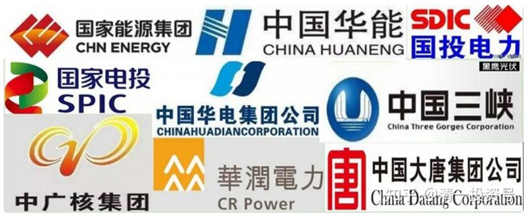

**原专栏22篇.也许该抽点时间，关注低估的电力股了。**

清一山长 2018年1月16日

消息：“四大发电集团就当前电煤保供的严峻形势向发改委递交紧急报告”。据报道，中国四大发电集团就当前电煤保供的严峻形势向国家发改委递交紧急报告。报告称目前五大发电集团在京津等地部分电厂煤炭库存可用天数已经低于7天的警戒水平。燃煤电厂面临全国性大范围保供风险，部分电厂电煤库存只可用2～3天。2018年各发电集团年度长协合同比例大幅下降，预计今年综合煤价较去年还要上涨不少。报告建议继续发挥进口煤的补充作用，并统筹好去除落后产能与先进产能释放工作。报告提请发改委尽快采取措施对煤价进行调控，尽快让煤价整体回归绿色区间。（路透社）

山长 清一 2018/1/16 20:58:24 内部发言

这种消息出来，就是电厂快活不下去了。去年上半年，华电H创新低，我说大家都不能碰华电、华能等。不要看漂亮的市盈率和分红率就买入。因为未来是电厂的苦日子。不如投资煤炭更靠谱。果然这些股票一直阴跌。

现在，显然电厂是日子过得苦极了，电厂们都集体找大领导去哭诉过不下去了，这个时候，可能拐点快来了。大家也许可以慢慢地布局一点电力行业了。由于电厂行业正好在估值的低谷，恐高的资金，可以慢慢进去试探买一点。过段时间我把我计划买入的电力类标的，分享给大家。

在中国做事情不用急，别明天就去买。就算领导有解决的意图，也需要很长时间才会出台新政策，现在肯定是：你们不许停电，亏本也给我死守。别急，亏掉了，以后给你们补贴。所以，什么时候反转？不知道，也许还要守两年。适合厌恶风险的资金进入。赚快钱的千万不要买。也许要等很长时间。
