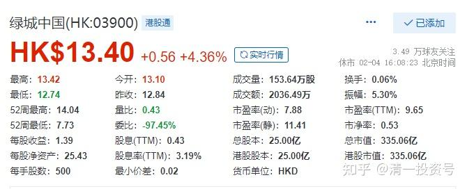

**原专栏23篇.绿城到底值多少？**

清一山长 2018年1月30日

[$绿城中国(03900)$](http://link.zhihu.com/?target=http%3A//xueqiu.com/S/03900%2522%2520%255Ct%2520%2522_blank) 消息：2017年全年，绿城集团累计取得总合同销售面积约827万平米，总合同销售金额约人民币1463亿元，同比分别上升了32.11%和28.45%。

这么多的营业额，赚了多少钱呢？按照2017年公布的房企的净利润率11.7%来看，绿城就算是很平庸，取中间值，去年也获得了170亿港币以上的利润，按现在的PE值来算，不到两倍的市盈率。如果说，绿城卖的房子是给高端客户，利润率比一般房企高，利润率应该更高才是。我看中海地产2016年的净利润是24%。万一绿城实现了这个利润率，绿城今年的销售结算后，市盈率就是1倍。就算是按照平均利润率，结算后也不到2倍。也就是说：拿住两年后，现在的绿城，就是白送的。

而且，2018年，绿城还有放量的趋势。还可以说：现价拥有三年后的绿城，就是等于买一个绿城，再送您一个绿城。涨四倍绿城也很便宜。因为现在这种股价，就是超级的低估！只要死拿两年等结算后，账面利润就“锁定”了。这种好股，现价买进，也不吃亏呀？等于企业半价不到就卖给您了。中交做大股东，不可能让公司垮掉的，国资一定是要“保值增值”的，所以安全性超高，目前还超级低估的房地产股票！

可是，您真要下手买进吗？且慢：请看最新的消息：根据绿城中国的公告，寿柏年已于2018年1月26日与第三方订立一份协议，以每股港币12.08元的价格出售其于公司之约174549783股普通股之权益，该股份约占本公司全部已发行股8.06％。问题是：寿柏年退休就退休，也没人逼他必须退股呀？持有的绿城，如此低估，拿住等分红就行了。卖掉干嘛呀？他还不至于缺这点钱吧？拿住等两年，21亿变40亿，甚至80亿，多爽。他拿绿城都熬了20多年了，再等两年就不行吗？如果他比现价低，都要卖掉绿城，就说明公司不值目前的现价！所以，宋卫平，寿柏年等，并不珍惜绿城的股票。起码觉得现价是应该卖掉的，而且他们真的卖掉了。

难道我算错了吗？很可能，因为我不懂房地产。很可能我以为能够赚的一倍，两倍的市盈率，就是假的。根本就不是这样算的。我承认：我不行，我算不出来。

所以：绿城中国，你买，还是不买？

我很纠结，决定现在就不加仓买了。但是，我也不想卖掉原来很不容易买进来的货。我就继续纠结吧。想好好的等两年，看结果如何。我反正钱少，也不急用这些钱。我就等两年后市盈率2倍的绿城。只要绿城不涨，就是这个结果---我以为！
