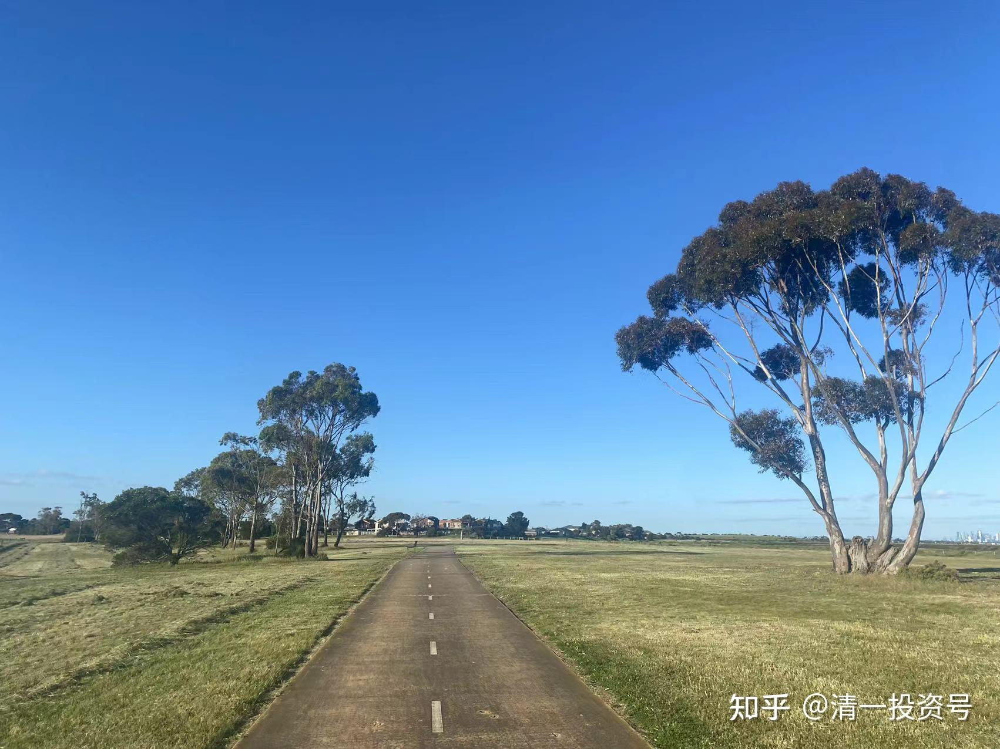

**原专栏5篇.当小散就要学“跟国王散步”**

清一山长 2017年9月18日

$复星国际(00656)$今天我的自选股，涨幅榜前两名是复星国际和花样年控股，正好也是我的相对重仓股，资金账户继续创新高。前段时间买了几十万股一直在四元的远洋，今天也排上了涨幅前五名。复兴国际，是我的五一财富课给学员的礼物，而且是我有意“免费提供”的标的。因为我一向不喜欢谈标的，但总有人找我是以为我掌握什么特别的标的。所以，我就干脆公开告诉大家我认为几乎不会赔钱的一些股票。

当时我说：“如果来见我，仅仅是想套点消息去赚点小钱的学员，根本就不用找我学习上课的。我就直接给你一个标的你拿走，不谢，直接就可以走人了。只要你相信我的逻辑，死死拿着不放，最终一定赚钱。不用上什么课的。”

因为我上课，是**讲财富的思想，讲生活的态度，不是讲股票，讲投资秘诀的，更不谈炒股了**。我当时说：相信有专业的人，比你更操心投资，比你更会投资。你的任务，就是无脑跟随这种人，跟投他的公司，就行了。

我当时说的就是这只股，复兴国际，最安全可靠的股。我说的投资人就是郭广昌。而且我还告诉学员，你们还可以抄马云的底（马云是20元买入的复兴国际，增发的）。当时我说话的时候，（五月一日）复兴价格11元多。现在回过头来一看，我告诉学员的时候，几乎就是17年的最低价格。我当时的看法，是这个股已经跌无可跌。我怕学员亏，所以只告诉学员最稳妥的标的，最不可能亏的股票。结果如何呢？现在半年不到（才四个多月不到五个月），复星国际今天的收盘价是16.76元。收益率是50%（如果学银行算年化收益率，就是150%的收益率，个个都超越巴菲特了）。虽然赶不上内房股的疯长，但远远超过其他股票的涨幅。信我的学员，有福了，不知道有多少学员傻傻的照单拿货了。

至于不信我的，甚至还黑我的，有几个有这个收益的？亮出来看看？今年的国庆节，我还可以送出一个“国家担保标的”。以后我恐怕都没东西送了。但是，**我教的财富思想，才真的是无价，是市场上买不到的货物，只适用于想要提升自我的人**。如果仅仅是想在股市上赚钱，很简单的，只要心态好一点，人品好一点，就行了。不用学这么多东西，费这么大力气的。祝福大家！！
