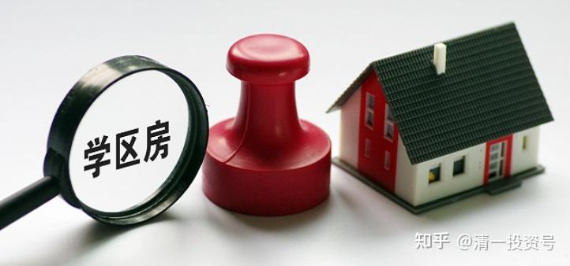

**原专栏56篇.学区房升温与文凭快速贬值：教育投资回报严重劣化！**

[清一山长](http://link.zhihu.com/?target=https%3A//xueqiu.com/9310099567/column)2020年1月21日

据教育局内部人士提供的资料信息，深圳某区教育局招聘2019和2020年毕业生情况：

2019年应届毕业生共333名，其中男生共53人，占比15.92%；女生共280人，占比84.08%；本科生共104人，占比31.23%；研究生（含博士）共228人，占比68.47%。

2020年应届毕业生共556名，其中男生125名，占比22.48%；女生431名，占比77.52%；本科生98名，占比17.62%；研究生（含博士）458名，占比82.37%。其中双一流、部属院校毕业生339名，占比60.97%，“泰晤士境外前100名院校”毕业生46名，占比8.27%，清华大学毕业生20名，北京大学毕业生35名。这些名校高学历毕业生大部分做小学老师。

原来看到了新闻报道，以为是深圳某区为了面子，专门派人去名校高薪挖人挖来的。找内部人员了解后才知道，不是这样的。答复是这个情况：已经远远超过了深圳教育局领导去招聘的预期。

下面是收到的答复：“深圳各个区招聘中小学老师的情况差不多，都是名校、高学历、女生为主（三个比例都超过80%），上面这个区并没有刻意去北大清华等985综合性大学招聘，并没有刻意追求高学历。招聘团去的，都是教育部直属的几个师范大学，主要是想招本科生，没想到那么多北大清华等双一流综合性大学硕士以上毕业生来到师范大学应聘点应聘，很多没有教师资格证就来应聘。招聘领导看到有更优秀的人来应聘，就答应这些名校高学历毕业生一年内考取教师资格证都可以。其实本科生、硕士生、博士生，不分毕业学校，不分去工作的是中学还是小学，每月到手工资（扣除五险一金等）基本上都不超过1万（有工作经验、有更高职称的除外，本科毕业生也就七八千），减去房租、生活费、交通费等，所剩无多，就是求个稳定。就这样的待遇，还竞争激烈，211以下院校的毕业生连参加竞争的资格都没有。可见找个稍好点的工作有多难。

这种情况，说明了最近一年来企业的情况很不乐观，全国就业的难度陡然提高。未来学历的竞争会更加激烈。现在，连世界前100名院校研究生毕业，包括北大清华毕业生，想在深圳找到小学教师岗位都不容易。

一句话：文凭现在就越来越不值钱了。家长们想要简单地通过考大学，让孩子随便拿个文凭，就可以舒舒服服的找个好工作的日子，已经过去了。即使你花大价钱出国留学，很可能投资回报率低到不可思议。未来大量的大学毕业生，很可能从毕业就“直接退休”，等父母发养老金去了。

转发我的内部回复：这个数据很重要，跟我寒假讲课的内容相关度很高。我的主要观点是：中国未来社会，能够提供的白领职位会很少。将来大学毕业以后，要找到一个稳定工作的难度会很高，现在已经出现这种情况了。所以学生没出路，就把注意力集中到去深圳的中小学当教书先生。但由于中国的总人口现在是快速下降的，全国的中小学未来还要大量裁员，只有深圳不一样，年轻人口还在成长。所以，未来的名校竞争会越来越激烈。以后孩子就算是名牌大学毕业，要找个中小学教师的工作，都很不容易。大量的大学生没出路。这种情况，发达国家都出现了。英国名校剑桥的毕业生，居然有25%找不到工作。差学校更不用说。日本，韩国也一样----上普通的大学，投资回报是负数。

未来的职业出路，现在有三条：

**第一条路，**是未来社会还是缺乏低端的劳动力，去做蓝领，技术工人等，学会干活，学会吃苦，社会还是很需要的。收入肯定超过白领，现在已经是这种趋势了。但这些职业，不需要多高的学历。你的孩子学多了，娇气了，还直接废掉。

**第二条路，**是去养老服务业工作，做个护工等（不是去当医生，未来的护士，很可能比医生更稀缺）。

**第三条路，**是稀缺专业的高级技术管理人员，这种人，总的需求很少，但待遇会很高。必须与未来的需求对口才有机会。新教育用“小语种三语职业和专业教育”的趋势，而且还兼容全球的大学专业教育模式，很容易考上名校，可以与世界的先进教育接轨。这种教育，培养了国家需要的人才，也解决了家庭未来的出路需要。是目前面对未来中国产业转移最可靠的教育方案，必将受到未来的热捧（未来家里不是官二代，权二代的，得成为“能力二代”才行，文凭现在就已经无用了。好好思考这些话——未来已经来了！

简单说一句，就是：1949年开启的中国，要“革命，造反有理”才有出路，不学无术没问题，有文化有水平反而很危险。但1978年以后，新一代要考大学才有出路，革命的“工农兵”开始靠边站。但这本念了40年的考大学的老经，现在已经失效了。未来的40年，要符合社会的需要，才会有出路！否则毕业就退休养老了。未来毕业的大学生们，就像30年前的下岗工人一样，必须重新研究市场，找对社会的需求，才能生存下去！祝福各位家长和孩子。我在清迈，继续关注国内动态中！
