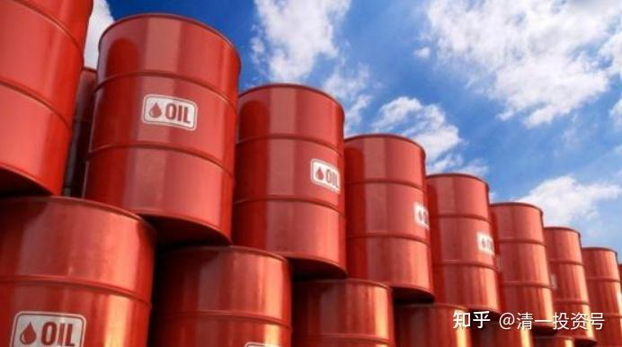

**原专栏63篇.石油交割价格居然可以是负数？**

[清一山长](http://link.zhihu.com/?target=https%3A//xueqiu.com/9310099567/column) 2020年4月21日

这一天，跌幅最多达300%，有多少期单持有者被清仓？

周一（2020年4月20日）投资者的再次见证历史，美国原油期货史上首次跌至负值。美油5月合约收跌171.7%，报-13.1美元/桶，盘中跌幅一度超300%，最低报-40.32美元/桶。5月合约将在周二到期。油价负数意味着将油运送到炼油厂或存储的成本已经超过了石油本身的价值。

在此之前，历史上从没出现过原油期货价格变成负值的情况。这意味着投资者在俄克拉何马州库欣进行原油实物交割将收到现金。标普全球普氏能源资讯分析师Chris Midgley表示，库欣是内陆城市，原油库容很可能在3周内填满，一旦填满，原油期货合约进行实物交割将更加困难。

说实话，我很难理解这种事情。我认为假如中国需要石油，这种买石油还有人给钱的单子咋不要？去买期货单，然后同意实物交割，然后运过来就行了这个价格，连运费都不要自己出了，别人都代付了。或者买下来这些石油，找个仓库存起来？

肯定我的办法是行不通的，证明我太不懂行。所以，期货超出了我的理解范围。因此很就简单了——我不能去做期货。赚了是运气好，赔了应该是正常的。因为我理解不了这种怪事，智商不够！
