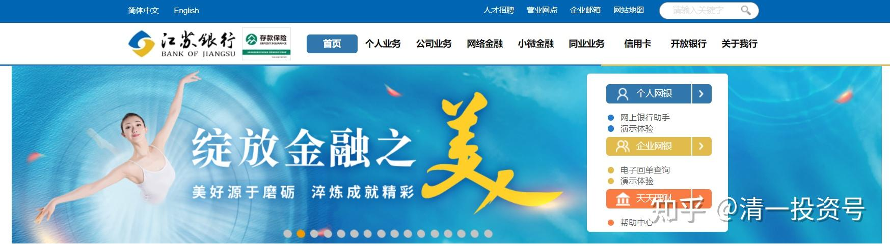

原专栏**92篇.江苏银行低价配股是利空吗？**

清一山长 2020年12月8日

在今天之前，本人从来没有买过[江苏银行](http://link.zhihu.com/?target=https%3A//xueqiu.com/S/SH600919%3Ffrom%3Dstatus_stock_match)。所以，我以为我的立场是中立的，不是因为持有股票而说好，没持有股票而说坏。本人就探讨一下股民容易忽略的一些常识。

[江苏银行](http://link.zhihu.com/?target=https%3A//xueqiu.com/S/SH600919%3Ffrom%3Dstatus_stock_match)七年来第一次启动配股，而且是低价配股。消息出台后，江苏银行的股价，就从6.5元上方，一路跌倒了6元以下。因为——市场显然把江苏银行配股消息看作是”利空“了，造成股民一听到配股就觉得要跑，而且舆论一直鼓励这样，造成这样的印象。所以——**没脑子只看新闻，是会被人操纵的。**我认为江苏银行背后有一盘棋，所以正因为这些异常，违背常识的地方，吸引了我对江苏银行的关注。

配股是不是利空？这个问题是伪问题。因为——正常的经营性质的配股（不是大股东抢劫小股东的财技），只是要全体股东都公平的参加。配股价格无论高低，都是公平的，都是股东支持企业正常运行的表现。因为公司拿了这笔钱，是去经营的，是在给公司输血。而您在二级市场的买卖，其实跟公司经营一点关系也没有。所以，对内就是大小股东一起支持公司，没毛病。对外来说，如果公司给大小股东的配股价格，是明显比市场价低的，而且是在市场最低迷的时候，以明显低于市价的价格来给你配股，其实这可以理解为是企业对自己的大小股东发红包，是友情支持。因为持有低价股，对公司的未来涨升赚到更多利润是有帮助的，所以我认为：对市场博弈来说，[江苏银行](http://link.zhihu.com/?target=https%3A//xueqiu.com/S/SH600919%3Ffrom%3Dstatus_stock_match)低价配股，是我们股民来说利好。小股民居然纷纷逃权跑掉，我认为就是狗咬吕洞宾，不识好人心！

所以，我认为：[江苏银行](http://link.zhihu.com/?target=https%3A//xueqiu.com/S/SH600919%3Ffrom%3Dstatus_stock_match)这一次，以4.59元的价格对全体股东配股，

**首先，是公平的；**

**其次，对企业是有帮助的；**

**第三，对股东的权益是有好处的。起码摊薄了资产的同时，拉低了整体的估值，股价会更吸引人；**

**第四，就是博弈思维了：**江苏银行，能够7年后首开配股，背后一定有大佬的谋划。实际上，我认为可能是一些实力派看中江苏银行，是入驻江苏银行的一种不费力气就大幅增加筹码的好办法。其实，[宁沪高速](http://link.zhihu.com/?target=https%3A//xueqiu.com/S/SH600377%3Ffrom%3Dstatus_stock_match)的管理层，第9大股东，不仅提出要全额参与配股，还要额外的买进10亿元的股票。这就是明显的看好江苏银行的表现。大佬看好，你凭啥看空？小股民跑啥？你跑，我当然要进了！

我这是受了阴谋论的影响：但是从市场上来看，我相信的确有一丝丝阴谋的影子在到处飞动。这个配股计划，不断炒作，结果导致[江苏银行](http://link.zhihu.com/?target=https%3A//xueqiu.com/S/SH600919%3Ffrom%3Dstatus_stock_match)价格不断下跌。而且推出配股时间也很紧张，也不宣传，似乎大股东不在意小股民参不参与配股，有些小股民根本不知道咋回事。我猜有可能小股民拿着股也不配，结果白白损失了差价。我没有看到如果小散放弃配股，大股东是不是包销。如果包销，就更说明实力派要股，不要钱。所以我自然有跟投。如果配股上市居然继续跌，我就要买更多。

实际上，从上市打新以来冲高接近15元，到现在5元多，[江苏银行](http://link.zhihu.com/?target=https%3A//xueqiu.com/S/SH600919%3Ffrom%3Dstatus_stock_match)已经快要跌去7成的市值了。2018年，我19元丢掉[兴业银行](http://link.zhihu.com/?target=https%3A//xueqiu.com/S/SH601166%3Ffrom%3Dstatus_stock_match)离开银行股的时候，江苏银行价格是8元左右。现在兴业银行超过超过了20元，而江苏银行趴下在5元多了。这个市场，咋讲道理？所以，我失去了兴业，补回江苏，这样算我觉得没亏。当然，江苏银行的地位，与兴业没法比。但架不住别人价格低呀？低到我难以放弃！

[江苏银行](http://link.zhihu.com/?target=https%3A//xueqiu.com/S/SH600919%3Ffrom%3Dstatus_stock_match)比[兴业银行](http://link.zhihu.com/?target=https%3A//xueqiu.com/S/SH601166%3Ffrom%3Dstatus_stock_match)还有一大好处，就是盘子小，也许炒起来更容易。所以，选择江苏银行，比较符合我“价值投机”的风格——在有价值的情况下，选择有投机博弈空间的股票去做。比如做惠泉就比做燕京，盈利情况好多了。

附注：今天除权登记日，尾盘以5.93元已经成功买入了[江苏银行](http://link.zhihu.com/?target=https%3A//xueqiu.com/S/SH600919%3Ffrom%3Dstatus_stock_match)，积极参与江苏银行的配售。
