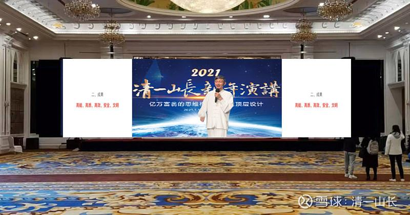

**原专栏95篇.跨年演讲：亿万富翁的思维模式与人生顶层设计**

清一山长 2020年12月27日

今年元旦，我将给国内的朋友分享高级的行为心理学：人跟人不同，是什么不同？亿万富豪和打工仔，到底有啥区别？很简单，就是他们思维模式的不同。上图是主办者发给我的现场测试的照片。

洛克菲勒说：“抢走他全部的财产，把他丢在沙漠上。只要有一队骆驼商队路过，他就可以重新东山再起，再度成为亿万富翁。”这句话不是骗人的，是真的。因为他拥有一个亿万富翁的脑袋，就算一分钱没有，他也可以快速重新崛起。**资本，仅仅是一个手段，影响的资产积累的快慢，但不可能影响结果。**

而相反：一个脑子里面装满了穷人思维模式的人，就算把他送到亿万富翁的位置上，他只会把公司搞破产。他拥有的资产多少，都不足以改变最损的结果，只是他衰败的时间可能长短不一。

所以，聪明的家长，从小就应该教孩子“亿万富翁的思维模式”，而笨蛋家长，从小教孩子的就是“亿万负翁”的思维模式。中国富不过三代，甚至我判断富不过两代的人会很多。因为中国第一批亿万富豪们，怎么富裕起来的自己都不知道，是潮水涨起来，胡乱捞到的钱。他们教自己的孩子，全是“亿万负翁”的思维和行为模式，让我觉得搞笑极了。但在泰国，我看**顶级家族的教育，的确是有章有法的！别人是“老钱”，我们是“新钱”。不一样！**

这种差别，就是“人生顶层设计——心理和思维设计”，我研究多年，我发现的人生奥秘，元旦分享给大家。我的孩子，从小就教她们这些亿万富翁的思维方式，我的商学院学生，也教他们亿万富翁的思维方式，他们现在都很受欢迎。假以时日，赚取亿万资产是不难的。我儿子管理的账户，今年已经赚到了千万。因为他重仓的是万华化学和白酒公司。

如果我说，我的分享演讲，价值千万。恐怕了解的人都会说太低估了。但我是免费出场的，不收一分钱的演讲费。

我的元旦演讲会总共三天，有多场演讲、分享、答疑活动。清一大学的学生们，也将现场参加活动。多位亿万富翁参与服务和组织工作。万亿U兄关善祥先生也将参与财富家族传承的内部分享。什么人可以参加？我不知道，因为不是我组织的，我只是受邀参加活动，不管他们怎么组织，我只负责内容！不过，场外看客估计是没机会参加的，因为一票难求。都是清粉们内部分配名额，都要抢才会有的。据说现场参与的机会，上千的会场名额，早早抢完了。一般来说，只有资深清粉和他们的好朋友，才有机会参加。这充分说明了：人脉，是很重要的。虽然免费，但比收费的还要昂贵。因为这种机会，你花钱都买不来。现场会有很多清一大学的家长们到场。如果想知道这所神秘的大学？问问这些家长们就知道了。

祝福大家：新年快乐！
