原专栏97篇.亿万富翁的心智模式解析 知与行

清一山长 2021年1月3日

本次新年，在普通人忙着吃吃喝喝，玩玩乐乐的时候，我和我的朋友们在忙着“送礼”，把一份“怎样才能做亿万富翁”的礼物送给大家。总共三天的分享会，汇集了来自全国的1400人参与。今天是第三天，我下午还要赶两场会议，要为学堂的家长们服务，解决他们关心的问题。而今天上午，是刘老师提供的家庭能量梳理工作，我有点空，就来写点东西，传几张现场照片，也让没有机会来现场的球友们了解一下。

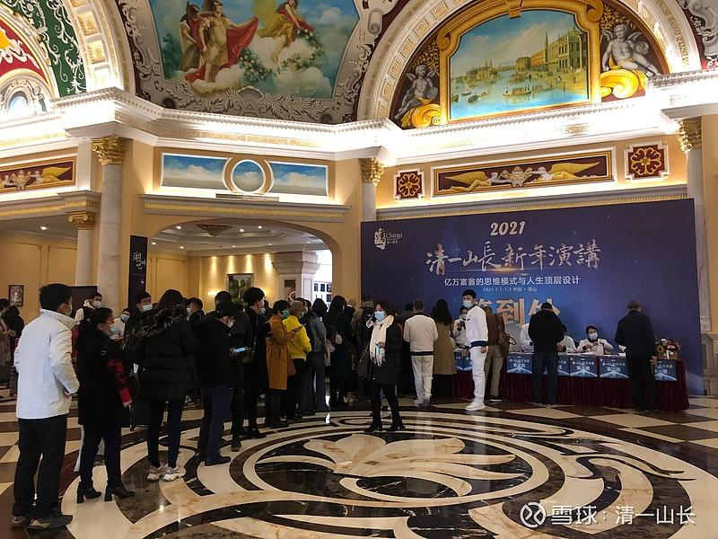

**嘉宾们正在排队，验票登记身份入场（一票难求，入场审核自然会比较严格[俏皮]）**

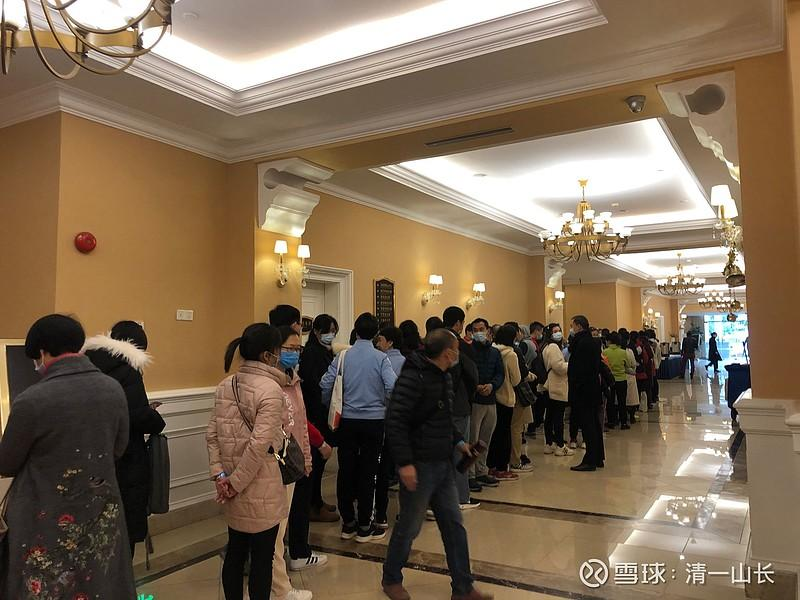

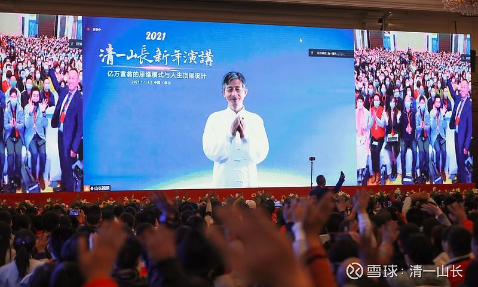

由于我人在泰国，疫情导致我没法回去现场参与这场早已规划很久的活动。不过现在网络视频会议系统已经很先进了，我可以在网上，直接与现场互动演讲，不影响效果。现场人们的反馈，就是“跟原来现场参与一样，没觉得有啥异样的”。

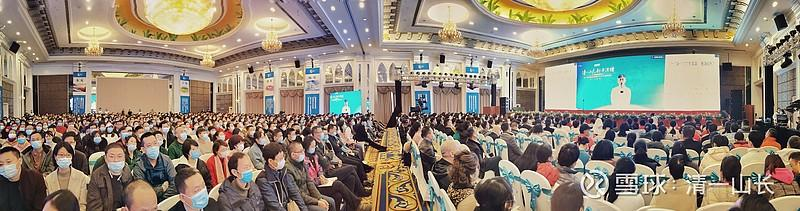

**这是会场全景图，总共有1400人现场参与活动。**

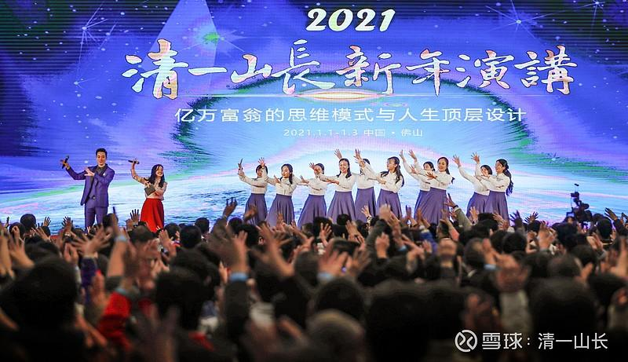

**正式开讲前的“热场活动”。**

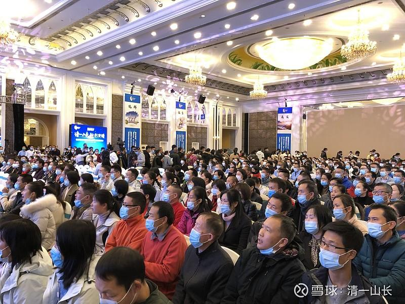

**现场听讲状况！**

由于本次我的演讲内容，有一些是不方便公开的内部信息，现场提问环节的一些问题，也比较尖锐，涉及当前的热点问题，因此不便对外公布出来。主办方为了防范“扩散不良影响”，就没有做我演讲内容的直播，**直播的都是一些“非主播内容”。未来两三年内，也不准备公开放在网上的，只有等敏感问题超过时限了，就会自然解谜吧[加油]！**今年10月，预期还有一次我要出来参加的类似的分享交流会。下一次来参会的每一个朋友，都可以得到这一次新年分享会的全部视频资料——主办方会在下一次为每个参与者，都送一个U盘，把这些本次价值千万的课程礼物（这是本次会议参与者的感叹），送给下一次参与的朋友，让您一次参会，就得到两次分享会的全部内容。

昨天的非主播内容中，清一大学的学生出场，西语的演讲、分享、介绍等，都赢得了一片彩声。他们演出的莎士比亚戏剧，是威尼斯商人中最精彩的片段。现场观众，对他们的演出赞不绝口，说他们的一口纯正的英国音，特别有范儿。同时，也为他们的演技逼真而惊叹：原来清一大学真的比北大外语系强。由于现场出演的男生居多，观众对他们主要的评价，就是“太帅了”！“别人家的孩子”等等。我们家的大女儿，是这些出台学生的带班老师，这次也作为领队去了现场。只是她当老师的并没有上场亮相，只负责场下指导。学生们用十天自己制作的清一大学介绍，会在以后发在B站供大家欣赏，到时候大家看看我们大学里面，这群很帅的小伙子和很靓的小姑娘，每天是怎样生活的。

分享会花絮很精彩，但演讲的内容效果如何？嘉宾们收到了礼物吗？

下面是我的弟子汇报的现场回馈：老师，这两天的课程非常圆满，报名有1200多人，实际应该有1400人。整个场域，每天虽排得很满，基本上没有人走动，很多人都说，自己从来没有长时间聚精会神地听过两三个小时的课程。大家也很佩服您的讲课能力，说您可以几个小时不用休息的。这边会场的服务人员也说，以前办活动，中间提供的饮料、点心、水果，基本都会被吃光。这次的活动，提供的茶歇基本没人来吃，整盘端出来的东西，他们又整盘的端回去了（注意力高度集中，以至于没空分心去吃点心）。您今天的课，全场笑声不断，经您一对比，大家发现——都觉得两种教育真的区别很大，也像棒子一样，敲醒了很多的人。我现在已经忙不过来了，很多人跟我申请加入清一基金会，来当义工。这两天的课程，除了今天下午有二十来个嘉宾因为要赶飞机提前走了之外，一直到结束，场域基本都是满满当当的。特别是刘老师这个收官收得非常好。两天的会议，感觉人与人之间的心灵都更加贴近了，更像家人了。

今天课后，我被人围堵了。很多人来问，怎么才能进国小；什么时候您会再开课；还有人问山长收弟子是什么条件，怎么才能申请加入清一基金会做服务……。

这样看起来，“顾客”还是很满意的，我送出的礼物，大家都很喜欢。这样就好！

本次课程主题，就是“亿万富翁的心智模式”。而且，是**由真正拥有亿万资产的人来讲的亿万心法，不是大学里面，只会背书的教书匠讲的“财富鸡汤课”。**自然，内容的可信度很高。本次活动，不仅仅台上的人是亿万富翁，台下有不少嘉宾，也是亿万资产的人。他们更关心的问题，是如何保住亿万资产，如何进行家族传承。这个场子的人，大多数都是有产阶层。因为穷人，一放假都赶快去消费、嗨皮去了。穷人才不会这么“傻”，不可能自己花钱坐飞机，住宾馆，来参加一个学习分享交流活动的。只有富人，才会忙着追课程，追学习，追朋友圈。

亿万富翁的心智模式到底是什么呢？其实我在这里可以一句话告诉你：

**穷人的心智模式**，就是：

**我来到这个世界上，是为了得到的（得到钱，得到财富，得到美女，得到房子，得到好吃好玩的，得到一切我想要的东西）。我得到的东西越多，我的人生就越成功。这种思维，是乞丐思维。既然是乞丐思维，自然您只能做穷人了。就算偶然挣到一些钱，也守不住，很快就会散去的。**

**亿万富翁的心智模式**，就是：

**我来到这个世界上，不是为了得到的（不是为了得到钱，得到财富，得到美女，得到房子，得到好吃好玩的），而是为了创造而来的，为了服务而来。我创造得越多，服务得越多，我的人生就越成功。如果我喜欢财富，我就可以去创造财富，去帮助别人获得财富；如果世人都喜欢钱，我就可以帮别人赚钱；如果世人都喜欢“好东西”，我可以尽力去创造出比他们想要的还更好的东西出来。我的一生，都将为了创造和服务而工作，我不会浪费时间，去追求俗人的吃喝玩乐。我认为这都是浪费生命的表现。只有创造和服务，才是我的人生目标和意义。**

这种思维和心智模式，就是亿万富翁的心智模式。**如果你建立了这种信念，并终身依据此信念而工作，您成为亿万富翁是迟早的事情。甚至您可以成为比亿万富翁更尊贵的人：您可以拥有比恒河沙数的金珠财宝更多的“宇宙级财富”，成为更高级的人上人！**

当然，只听我说了上面几句话，您就完全领悟，并能够身体力行，您就是上等根器的人。这种人，不再需要听我讲什么。我讲的一切，他全能懂。我做的一切，他全能做出来。他如果想要当亿万富翁，只需要给他一些时间，给一点机会就行了。

一些下等根器的人，听我说上面这些话，我诚意地告诉大家的这些财富秘诀，他们会大笑的，甚至还出跑来骂我是大骗子（我也不知骗了他们啥东西？）。我这些话，他们无缘得知和相信，注定还需要在底层人海中浮沉很多年，也许才有机会去慢慢的理解。这种人想要当亿万富翁，其实也不是不可能。据说去津巴布韦就可以了，还可以当“百亿富姐”[大笑]。

大多数中等根器的人，对此说法，是将信将疑的。觉得好像有点道理，也觉得不好理解，也不知道如何去实际地做出来。**做教育，就是要去教育这种人，帮助这种人真正的理解，并去做出来。你不帮助他，他就会迷失；你去帮助了他，他就会做出来。**

所以，**教育能够做的事情很少。**

**上等之人，生而知之，你不用教他，他自己会出来的。**比如乔布斯之流。

**下等之人，你费尽力气，也教不出来的。这种人只能当韭菜，当不了富翁的。**

**只有中等根器的人，你可以去教教！**

在金融股市上，这三种人都同时存在。大致上，是1%～5%的人，算是上等根器之人，他们基本上，入世以后资产会稳步增加，不会赔钱的，只是赚钱多和少的问题。其他中等根器的人，大约有20～30%的人，有时候会赚到钱，有时候会赔掉钱。若存若亡的，有时候灵，有时候不灵。至于下等根器的人，这种人大约60～70%，他们求财心重，入市就是想来大捞一把的。所以，他们进来之后，基本上就是只赔钱，不赚钱的人。

您可以很轻松地根据自己的账户，算出来您是什么人！我很早以前就说过：**您的账户，就是您的人格的记录。如果账户记录很差，起码就是您的良心——主要是“财富心”有点问题。您肯定是穷人的心智模式！要改！**

昨天，我们在泰国，小女和她的伙伴们，也去**“培养亿万富翁的心智模式”**去了。她们跟村长一起，一家一家地送新年礼物，每家送一袋米和一瓶油，给附近的村民。**“创造是我的能力，付出是我的本性。”**这就是亿万富翁的思维和行为模式。“**付出就是回报，创造就是收益。让您喜欢和尊重，就是我们的利润！**”

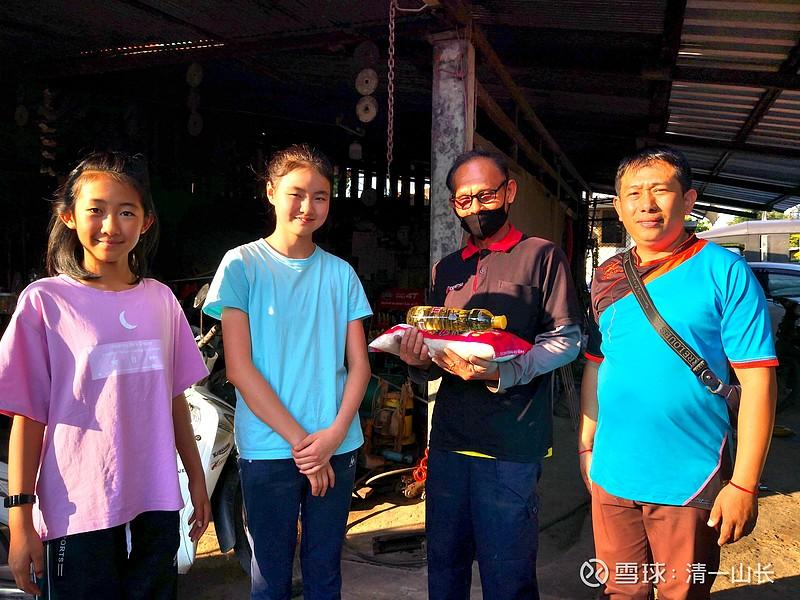

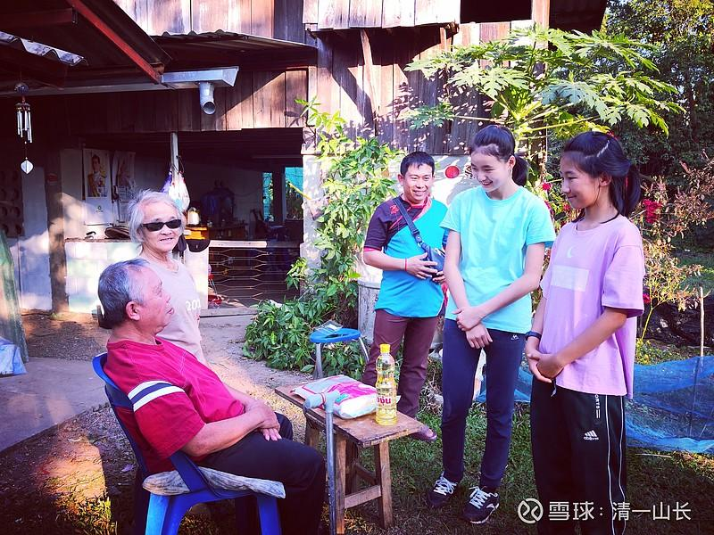

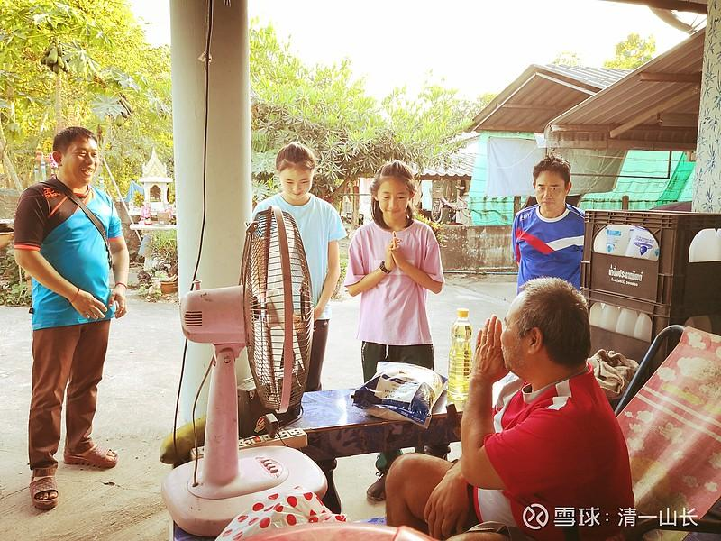

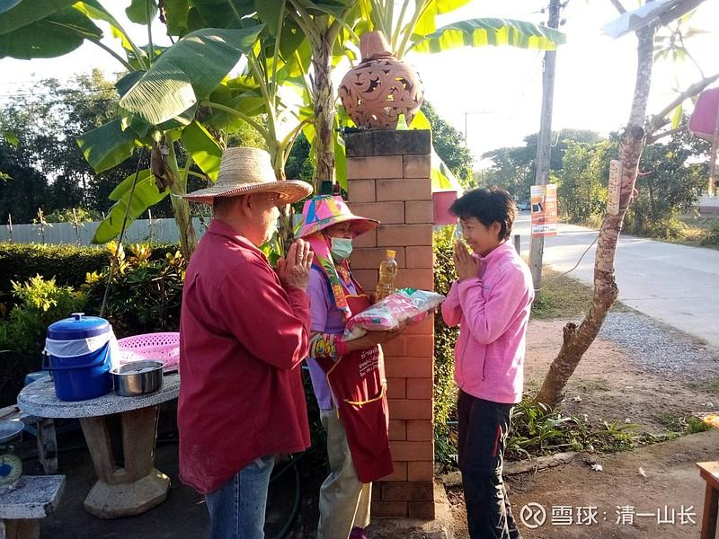

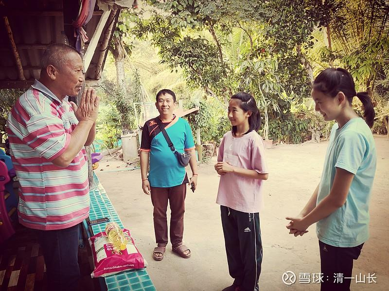

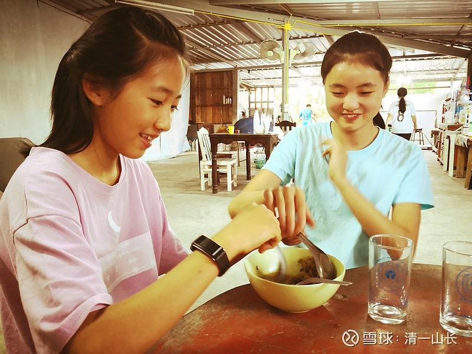

去泰国人家里面，主人请他们尝尝泰国菜，小公主们也大大方方的坐下来认真品味，还说：“真好吃！”
