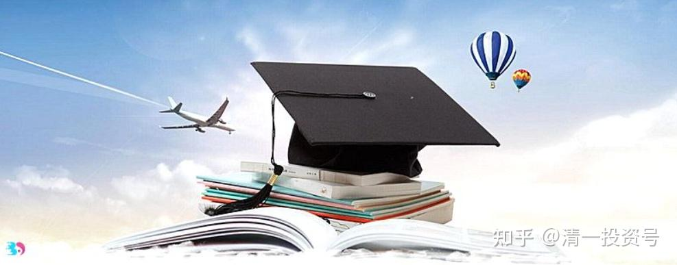
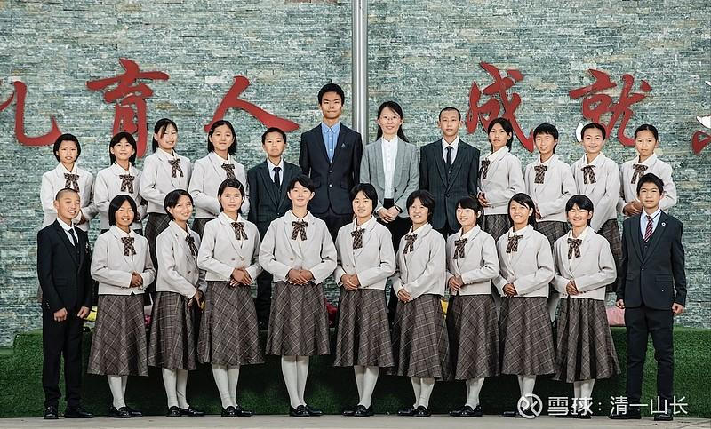

原专栏99篇.[花数百万买个当奴仆的机会？你傻了吗？](http://link.zhihu.com/?target=https%3A//xueqiu.com/9310099567/169428015)

清一山长 2021年1月21日

明明可以当家做主，明明有钱有能力，可以当上等人，为啥偏要送钱给外国人，去买一个当奴仆跟班的机会？脑子烧糊涂了吗？

离谱！亚裔女生嫁到墨尔本后长期失业，连续18个月求职未果！改成英文姓氏后，1个月找到工作！隐性歧视处处存在，好莱坞女星也逃不过…微信网页链接：

[https://mp.weixin.qq.com/s/A1Zk8WC46SRnjX679PzK-g](http://link.zhihu.com/?target=https%3A//mp.weixin.qq.com/s/A1Zk8WC46SRnjX679PzK-g)

李华丽墨尔本：

山长您好！最近开始采访一些澳洲私校的家长、高校大学生、已经毕业的华人。总体印象是华人在这里的子女教育投资很大、压力不小、阶级划分严重。华人来澳洲读大学，动辄几百万，但是，即使是在澳洲排名前一二的大学毕业，很多华人都不能找到对口的专业，更多的选择是销售员、收银员或其他“**身本家**”的工作。就算运气较好能挤进银行或其他像样的公司，进去就可以看到自己在这个工作上的未来：基本是在底层，中层可以看到一些印度人，但是高层绝对是清一色白人。另外，就像这个新闻一样，华人在澳洲找工作，连名字都印上了被歧视的身份。王、李、张、黄，这些一看就是中国人姓的简历，基本是投出去就深沉“大海”。有华人女子嫁了西人之后，把自己的姓改为先生的姓，找工作就容易很多。歧视不单是种族，还有区域。比如，对香港人身份就相对比中国大陆人的身份友好一些。比如曾经有李姓的人Li，投了很多次都被拒，后来把Li改成香港人的写法Lee,就收到了面试通知。后续我会整理详细的私校精英教育，高校毕业情况等，发上这里，希望能为大家提供参考。

清一山长回复[@1819李华丽墨尔本](http://link.zhihu.com/?target=http%3A//xueqiu.com/n/1819%25E6%259D%258E%25E5%258D%258E%25E4%25B8%25BD%25E5%25A2%25A8%25E5%25B0%2594%25E6%259C%25AC)：你说的事情，我早在30年前就知道是必然的。1989年我参加全国举办的第一次六级英语考试，我是文科生（研究生我读的哲学专业）第一名，而且是唯一通过六级的文科考生。理工生，也只有两个通过了考试。为啥我当年要努力学习外语？就因为当年家人，要我出国去读书，推荐人、担保人都找好了——国外有亲戚担保。但我认为：**出国肯定是找抽的，你必须比本国人更努力，才能获得一份比本国人差的工作，而且永远也不可能上升到高位。因为肤色问题，我的后代子孙，也不会有机会**。所以当年的我，就很不愿意出国，最终也没有去考留学。

但当年的确很缺钱，读书人没啥出路的。我怎么办：我选择了下海，而不是出国。其实当年我们的同学，很多人出国留学，是因为国外的待遇好，相对工资高很多。现在，国内外已经差不多了，再去出国，几乎就是钱多人傻找抽的货色。但**中国人骨子里面的奴仆意识很重，喜欢投靠强者，当强者的家丁，也可以装出自己是上等人的样子来。不愿意自强，自己做自己的主人。**其实去到国外，别人根本不当我们是啥人的，自己以为花钱买了国籍，别人就当你是自己人？太天真了。**中国人要获得国际地位，真的只能依靠自己的奋斗，自己的创造和发展。**要当高级打工仔，至少也要去自己种族的地方发展求职。比如去新加坡、东南亚。去白人国家，连比自己笨死了的白人，都因为皮肤比你白，就可以公然地歧视你，高高在上的样子。

其实，歧视链无处不在。多年前，我去香港，当时香港还没有闹事。我是投资移民、大学教师、私校校长。无论经济上、社会地位上，都不低。但香港的服务生，一听到我开口说话（普通话），就一脸的鄙视，觉得来服务我降低她的档次了。就对我翻白眼，服务态度极差。让我对香港留下了“很搞笑”的印象。也放弃了去香港买套房居住，当“正宗香港人”的想法。我明白了，我去香港，将不得不面对这些几十年前，自己或者自己的上辈人，就是个大陆跑过去的普通农民的歧视，我的孩子也将因为是“大陆妹”被歧视，就算学会了粤语也一样。当然，可能会比去澳洲好一些，起码生人认不出来。但熟人、朋友圈，知道你是大陆背景的香港人，一定有隐形歧视的。

可是，拥有我这个想法的人极少，**大多数大陆人，别人越歧视，越要加倍地努力给香港人送钱来买歧视**。比如**深圳每天数万学童过关去香港上学，就是典型的花钱买抽。**如果有一点点志气，把这些去上香港学校的钱集中起来，肯定可以办出不比香港人办的更差的学校。反正这些大陆人去的也不是啥真正的名校，名校也进不去的。花钱去上香港这些东拼西凑的学校，真的是大陆人花钱买歧视，然后转过来，又去歧视其他“没有机会被香港人歧视的大陆人”，真的太没出息了！

我不禁想起了鲁迅说的故事：阿Q得意洋洋的对伙伴炫耀说，昨天，赵老太爷跟我说话了。别人都很羡慕，觉得阿Q很有面子，赶快问：“赵太爷跟你说啥？”阿Q说，他一直站在赵老爷家门口等，看到赵太爷出来，对他说：“滚！”[大笑]

**如果连香港人，都歧视大陆的同胞，白人歧视全体的中国人、亚洲人，其实也再正常不过了。这是人类的“我大”的本性，是无法改变的。我们有本事，将来反过来“歧视”他们就够了。**

我推出**“三年学完美国十二年”**啥意思？为啥不去宣传说“三年学完中国十二年？泰国十二年？香港十二年？”，因为我就是要对最高高在上的白人们“反歧视”一下，用真本事来歧视白人教育的落后。所以，**我要求我们的学生，都要把击败美国人、击败白人作为目标。要做最好的中国人，没志气的学生我才不要你。**

**国人花几百万，去国外学着当奴才，我真的很瞧不起。没志气、没眼光、没出路。**所以，想上商学院，才必须要求家长按照国外大学的标准来交学费。这是自尊——我不承认国外的大学比我教得更好，但你也必须给我相应的学费才能来上学。如果中国人都像我一样，白人的歧视就会慢慢变成对中国人崇拜了。

昨天，一个朱拉（朱拉隆功大学）毕业的泰国律师来拜访我，我把我们的学生视频给她看了，她就一个劲要拉我来泰国办学校教泰国人，不要只是教中国人，说一切手续的事情她全包了，办起来很简单的，让我只要愿意来泰国办学教泰国人就可以了。我还骄傲一下，说：“要等我们的公主班学生大学毕业了，才有可能。因为我现在的教师，只会教中国人，不会教泰国人，现在招泰国学生也没用。”她就说，希望我们的学生早日出来教泰国人，泰国学生也很希望得到这样的教育。所以，只有国人自尊、自强，才能让别人不歧视。**现在当奴仆出去，别说一辈子，几辈子都毁了。我们的子子孙孙，全都拥有了低人一等的劣等民族意识，一辈子都要拼命证实自己。**

过去中国落后，还可以找到一点点“傍上了大款”的小蜜满足感。特别**在中国崛起的今天，再去西方国家讨生活，就是找抽的**。我们今天如果要去西方的国家，也要以“老板”的身份去。我的学生，将来肯定要在欧洲、澳洲开启建设新教育的国际学校。但我们是以老板的身份过来，做当家人。我们“教育”白人们学会尊重[中国教育](http://link.zhihu.com/?target=https%3A//xueqiu.com/S/CSI931456%3Ffrom%3Dstatus_stock_match)，当然，这需要实力！**我计划是每一届公主班，都培养一个针对不同国家的团队，学习不同国家的语言和文化。每去一个国家，都要成为这个国家的超级学霸团队，颠覆这个国家对于中国人的认识。**

我每一年，花一千万的奖金给学生，来为中国人争光，是很有价值的。我只要坚持这个计划20～30年，就培养出了20～30个国家的上层尊重我们，尊重中国的文化和教育，我就完成这辈子的任务了。

第一个目标，就是泰国：10年后，泰国的上层，教育界人士，将不再认为：中国人除了钱啥也没有。泰国的上层阶级，会争先恐后的来跟我们交朋友，会把孩子送入我们泰国公主班学生开办的泰国国际学校上学。现在，先吊吊胃口，只给他们看看视频。未来，每年都会有更多的国家接受和尊重中国的教育（可惜现在国家，只会拿钱来买国外的留学生上学，花钱还被人鄙视）。

*首届今日学堂“泰国预备班”师生的集体照*

这是首届“泰国预备班”师生的集体照。这些学生，将来的任务，就是两个人一组，要把泰国的知名大学全都覆盖掉，必须成为所在大学的学霸、校花！在泰国大学毕业后，集体回母校，正式开建首届专门针对泰国人的“清一大学附中泰国分校”的3.0预备教师，现在大家先认识一下。[笑]

回复二：把LI写成Lee不是因为香港拼法，而是因为LEE本身就是美国人的姓。如南北战争的罗伯特·李将军，他就是LEE。香港只是尽量能用国外的姓，就用国外的，一切尽量用国外标准，**港人骨子里面的奴性是很重的。**殖民百年了，这样子很正常，**现在的大陆人还花钱买文化殖民呢！**至于华人从澳洲第一、第二的大学毕业，只能去当“身本家”、当售货员、收银员很正常。因为成熟国家，早就完成了社会阶层构造，留给中上层的机会很少了。**未来的中国也一样的，没有家庭背景和进入某种圈子和平台，单打独斗，就不太可能找到管理工作、中上层工作的。甚至国外，要当正式的教师、文员、管理层，都很难。就算有少数的岗位空出来，一定优先照顾“自己人”。**所以，崇洋意识很重的国人，就把出国留学看成是出路的中国家长，我都劝他们，必须去国外读“工程技术”专业。这种技术工作，本质上也是打工，但收入和就业的机会，都要比去读外国大学的文科课程，非专业技术课程要强很多。起码算是“知本家”了，靠技术吃饭，不太受歧视。但要进入中上层社会，靠文化吃饭，依然没可能，除非自己创造文化平台。比如：我再厉害，想到泰国应聘，去泰国的顶尖学校教书，几乎没可能。最多去当个普通学校的教师，还要别人给机会。想要当负责的校长，去指挥泰国人，更没可能。最多最多，只能去当个国际学校的“中方校长”就算给脸了。还要我拼命去忽悠中国人来上学，他们坐收好处，才给我一点点机会。我想去指导教育改革、指导泰国学生的教学，根本就没门，泰国人绝对不会听你这个“外国人”的，你入籍了没用（我认识好几个这样的中方校长）。

但如果我自己出资来办学，自己聘用教师，就算是聘用泰国人、西方人来做“泰方校长”“西人校长”，就只是我们的打工仔。所以——**我们就算要出国，也必须要建设自己的平台，建立自己的标准，才可能有地位。否则，再大的才华，依然只能给外国人打工，还要被歧视！**所以，**我们中国人，必须学会团队作战，不能单打独斗。就算出国去发展，我们也必须拥有自己的平台去发展平台，不能丢了自己的圈子。我们有平台，要用外国人，白人也只能乖乖的给我们中国人打工！我们中国人可以去全世界赚文化和教育的“无烟外汇”、“环保利润”，不仅仅赚到了钱，还赚到了尊重，何乐而不为？**我们还可以挑三拣四地挑选最优秀的白人来给我们打工（如果不是疫情，我们选的白人大学毕业生，今年就已经来今日的学校正式参加工作了。而我给白人的工资，只有我们给自己教师的一半还不到，她也会感到被“歧视”的。不过教学岗位不一样，这些白人，显然无法承担我们2.0的教学岗位的，只是给我们的学生一个练口语，熟悉外国人的价值）

**评论回复：**

@黄妞回复@清一山长：也不知道我在校的时候山长老师还在不在武大，如果还在，错过了山长老师的课，巨大的损失[哭泣]！

清一山长[2021-01-21 12:20](http://link.zhihu.com/?target=https%3A//xueqiu.com/9310099567/169431533%3Fpage%3D1)回复@黄妞：别伤心，你肯定跟大多数人在一起[笑]，能上的都是少数。武大数万学生，每周只有80个人，能上我的周末私人课。就算大学里面的公开课，教四201教室，常常过道上都坐满了人，也不过两百多人吧[大笑]。

@路清净回复@清一山长：学习博主的资料感觉是学习英语的学校，想不通的是学了好几年的英语，结果不去欧美发展，去泰国，泰国神马经济水平啊(=ﾟДﾟ=)，真的好吗(✪▽✪)。同时求问**汇泉**[哭泣]

清一山长[2021-01-21 12:38](http://link.zhihu.com/?target=https%3A//xueqiu.com/9310099567/169433255%3Fpage%3D1)回复@路清净：您的回复，证明您的理解力极差。而且也非常的不善于观察和寻找线索就胡乱下结论，对结果不负责。这种人，注定是股市的韭菜，亏本是正常，赚钱是不正常的。建议您退出金融市场，好好去打一份工，老实做事去。实在钱多了烧手的话，要不就买家银行，死拿利息到底算了。江苏银行？建设银行？价格都不贵。另外，不许问我个股，进出。我不欠你答案，反正给你也不懂。连你买的股票的名字都弄不清楚，也代表你不尊重这只股，您居然还想从这个股身上大赚一笔？想想都替惠泉觉得冤枉[为什么]。如果想问我问题，想得到答案，就捐款一万元给上图中的学生们做班费，再来问我！我保证有问必答！[大笑]

[2021-01-21 13:21](http://link.zhihu.com/?target=https%3A//xueqiu.com/9310099567/169438226%3Fpage%3D1)

[ellhll李华丽](http://link.zhihu.com/?target=https%3A//xueqiu.com/3931532042)2021-01-21 14:18回复@清一山长：

感谢山长的分析，给我们指明在外国真正有属于自己地位的可能——平台。

在澳洲的华人圈中，香港人看不起中国大陆人；上海人看不起非上海的其他中国人；北京人觉得自己是天子脚下的，比人高一截；深圳、广州人觉得你们都是内陆的没我见识多……总之就是散沙，根本没有团队的意识，更别说平台了。

华人的受歧视不单只是工作，在孩子幼儿阶段就已经开始。在澳洲的私立精英学校，一般都是从幼儿园到高中的。幼儿小学阶段，孩子们虽然还没有阶级意识，但是因为孩子的交往都是需要父母陪同，所以，英文不流畅、不地道的华人父母，根本融不进西人圈子，白人家长排斥。到了中学，不用父母担当沟通了，西人的孩子却从父母那里习得了阶级之分，你是华人，和我不是一个阶级的，我不跟你玩。精英学校的孩子，从幼儿园开始补课，补文学，补数学，一对一，斗谁的教练高级，谁的贵。西人占有社会资源的优势，经济、政治上本来就高于华人，他们送孩子去精英学校更多的是家族传承，朋友圈的建立。他们的孩子的业余兴趣班学习时，开帆船，开飞机，高尔夫球；华人本来就没有太大的经济优势，也没有家族观念，孩子学的更多是游泳、网球。

这里有个特别的族群——印度。印度人其实在经济上、能力上没有华人的优势，但是，他们很抱团，团结，他们不和西人玩，就自成一派，自有势力。在美国，因为这样的团结性，印度人在政治上更有成就。在澳洲，他们更多的晋升到公司企业的中层，政治上也有较多的活跃。他们中一个人成功会很自然地照顾更多的印度人，一串地提携上去，然后又形成一个团体。如此良性循环，成为了美国西人、澳洲西人不敢忽视甚或歧视的团体。惹不起，也没必要惹。印度人优于华人的社会、政治、经济地位，根本原因是——团结，平台。

正因为看到这些，我才深感山长创建的清一新教育平台是多么的珍贵。我们不单团结，我们更有优秀中华传统文化做背景，有山长您的引领。印度人尚且能这样，我们立于新教育平台之上，将有如何卓越的成绩？在澳洲，我现在是依托于合一塾的帮助和引导来践行传播新教育，而合一塾是有清一新教育这个强大的平台，扎根于这个平台，我们感到了力量，也充满信心。感恩山长的无私付出！
