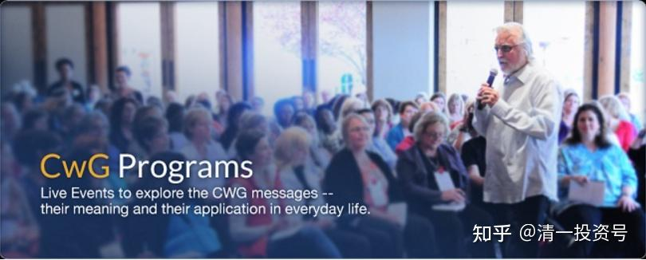

原专栏**130篇.财富的真正秘密：做最好的自己**

[清一山长](http://link.zhihu.com/?target=https%3A//xueqiu.com/9310099567/column) [2021年3月24日](http://link.zhihu.com/?target=https%3A//xueqiu.com/9310099567/175335325)

　　尼尔说：“不要尝试成为你公司里职位最高的那个人，也不要尝试去赚取你能赚取的更多的钱，不要再去想追求更大的房子，更漂亮的车子，你的生活跟这个没有任何关系，而是要尝试着去成为那个你所能够想象出来的、最好的、最伟大的人，然后去看一下生命将如何对此作出回应。”

　　我确定地知道：这是有效的方法，当你努力去做最好的自己，一切就随之而来。当我不计代价去打造最好的教育、最好的学堂，金钱、名誉随之而来。但你追求职位、等级，计较金钱得失的时候，你活得好辛苦，还往往一无所获。

**　　转发下面这篇文章，希望大家好好消化。这是真正的财富秘密，比会看K线重要得多。**

《与神对话》

作者：尼尔·唐纳德·沃尔什

财富的真正秘密
本文节选自公众号 “自然的恩典”，如有侵权，还请私信告之。

早上好，今天和大家汇聚一堂，我非常开心。我漂洋过海，不远万里从美国赶到中国，因为我相信我们大家都渴望去尝试一些新的东西，新的智慧。

你们知道，我有一段和常人与众不同的经验。大概在20年前左右，在这段体验之前，事实上我是一个非常成功的人。我在主播行业有一份很好的工作，同样的我也在一些大型机构中担任一些主管的角色。

所以从早年开始，我就在外在世界获得了巨大的成功。我从来不需要担心钱，因为我的钱一直都是足够的；我从来也不去追求个人权利，因为我从来都有个人权利；我也从来不需要担心我的人生有没有好的车子和房子，因为我已经都拥有了。

这一切的结果非常有意思，在我49岁的时候，我发现这个世界上没有任何事情可以值得去做了。那现在怎么办呢？我接下来这25年应该怎么办呢？我在45岁的时候就已经达成了我爸爸在我年轻的时候告诉我人生应达成的一切。

所以在某一个深夜，我就问神，现在该怎么办？这个就是全部了吗？那生命和生活除了物质成功外，就没有任何其他了吗？在我45岁的时候，生命整个就变成了一个打哈欠的过程，无聊到就要哭了。

然后神说，那你去弥补休整一下。于是我就发生了一场车祸，一个非常老且矮小的人在路上开着车，他比方向盘高出一点点，几乎都看不见。他转弯的时候撞到了我，这是一次非常严重的车祸，在事发现场，我的颈椎就被折断了，这个司机并没有严重的受伤。

医生说，事实上95%的人，如果颈椎折断，他们大多数都会死亡，通常那剩下的5%的人，如果没有死亡，也会终生瘫痪。可是我没有死，也没有瘫痪，医生说这真的是一个奇迹。

两年时间中，我一直在康复中心，我的脖子上一直24小时带着护颈，因为那是唯一可以支撑我脖子站立的东西。医生说，你想都别想把它摘下来，他说，你现在的头就像是一个大大的足球放在一枚别针上。

所以我当时也没有办法去工作，事实上那时候我还有一些积蓄。但是当你没有一点收入的时候，你的存款会花的特别快。大概八九个月过去了，我的积蓄全部花光了。

在美国，我们每个人都只能领到很有限的政府补助，当你的政府补助用完的时候，你就很不幸。当政府给我的残疾人保障资金全部花完了，结果最后我就生活在大街上，流离失所。

我没有钱，也没有去创造收入的办法和途径，我尝试找了非常多的工作，但是没有雇主愿意冒这个风险雇用我，因为我的颈椎断了。

我告诉大家这个故事的原因，是想让大家知道，我知道身无分文是怎样一种体验。我曾经在一年的时间内经历从拥有一切到一无所有，我花了整整365天的时间生活在大街上，去乞讨人们可能给我的一点点东西，我甚至从垃圾箱里去捡人们吃剩下的食物。

你可能以为，这就是我人生中最糟糕的时候了吧！但事实上，它是我人生中最好的一段时光。因为那段时光让我真正地领悟到，我们生活在这个地球上最重要的到底是什么。

我要通过去失去一切，来真正的体会到，其实任何一切我都没有失去。人生中有这样一段体验，它会让我们每一个人都深刻的去反思，在你人生面对这样的灾难的时候，你只可能做两件事情：要么你对神泄愤——为什么这个发生在我身上？我到底做错了什么？要么你也可以对这些灾难表示感恩。

我大概花了三个月的时间去从愤怒过度到感恩。前9个月我非常愤怒，我什么都没做错，我从来没有伤害过任何人，我从来都没有丢失过诚信，为什么这个会发生在我的身上？我问自己这个问题问了九个月，我于是得到了一个答案:

尼尔，这是你自己要来的啊！你自己说你当时无聊到要哭了，你在49岁的时候问自己：那接下来要怎么样呢？所以我就决定，向你真正地展示一下到底什么才是最重要的。让我给你的生活增添一点戏剧化的色彩吧！

大家在坐的有多少人曾经在生命中有过一段戏剧性的体验呢？当你能够把人生戏剧性的体验看成人生的恩典的时候，你就在朝着大师这条路迈进。

那现在，我们就来讲讲今天的主题：**富足和丰盛**。

我所认为的富足和丰盛，并不是停留在理论层面。它也不仅仅是我所有过的经历和体验，它是一个非常灵在的，并且存在意识状态很高的一种实相。

我在想如何把这句话以一种不那么骄傲的方式，以一种谦逊的方式说出来。我不想大家听起来感觉我在炫耀或者吹牛一样，我希望大家可以信任我，我没有必要在这里吹牛或者炫耀。

今天我已经赚了足够多的钱，但是这跟我以前做的一切没有任何关系。它就像花朵，像玫瑰花一样掉在我的身上，不带任何努力地掉在我身上。对于此，我想跟大家分享其中的秘密。

在我人生的前45年中，我做了一切的事情，尽我所能的让我自己相信——我可以变得丰盛和富足。我学校的成绩很好，我工作也很努力，事实上我的家人们都称我为工作狂。我从早上6点一直做到晚上7点，而且我做得一直都很好，就像我刚刚跟大家分享的，我一路被提升。

但是在我49岁的时候，我非常不开心。那个时候隐隐约约心里有个声音告诉我，这个世界上肯定有比富足更重要的事情。或者那个时候我在想，可能我把富足理解错了。

我们在生命中所追求的富足到底是什么呢？是钱吗？是个人名誉以及权力吗？是一个漂亮的房子或者车子吗？是想在你们工作上一路被提拔直到最高层领导层吗？那你对成功和富足的定义到底是什么呢？我可以告诉大家，我体验过一切，而这上述的一切都不是富足。

假设刚刚我所说的那些，都是你们生命中想获得的。假设你们工作非常努力，从早到晚，去尝试提高自己的收入，去尝试在自己工作的单位追求一些权利或者是个人名誉。假设这一切就是你在做的，如果你们以为我在这里是来告诉你们如何实现这些的，那你们就理解错了。

我在这里，不是为了告诉大家如何获得最高的收入；也不是如何在自己公司里成为最重要的人；也不是怎么样能买到漂亮的房子和车子。我来这个地方，不是为了分享如何在这个社会上获得物质上的成功和富足。

我来这里是为了告诉大家，不要这么做，我来这里是为了告诉大家，**不要把你的人生专注在追求物质的成功上**，这可以节约你很多时间。因为如果你以为物质上的丰盛能带给你一切的话，你就完完全全错了。但是我可以给大家分享的是，**如何能够不那么努力的去获得物质上的成功。**

首先，你要理解的是，**为什么你开始想获得这些丰盛？**世界上这么多人都想追求物质上的丰盛，追求金钱和个人名利一定是有原因的，因为他们以为这是通往幸福的通道，这是多大的一个错误啊！你们听到这里肯定会很惊讶，可是这不意味着你们听了我的教导以后，就不会获得物质上的成功。它仅仅代表着这两者之间没有多大的差异。

今天我想给大家分享的是这样一个观念：**无论你赚多少钱都没有多大的差异；无论你的名声有多大，这一切都没有多大的关系；无论你有怎样的好车和漂亮的房子，这一切都没有多大的关系。当你开始发现这一切都没有多大关系的时候，你就开始真正获得财富。**

可是为什么会有人会觉得，在这个世界上赚很多的钱、获得很高的职位是很重要的呢？为什么我们都想这样呢？因为我们以为只有这样的方式才能知道我们是谁。

其实在我们每个人的内心，我们都知道我们是无比的伟大。我们都知道即使是活着这件事情，它也是充满奇迹的。可是我们以为要体验到活着这样一个奇迹，是要通过物质上的成功这种方式，可是事实并不是这样。

以我作为一个例子来说，我之前获得了物质上的成功，可是我并不开心，我是如此的无聊，于是我对自己说一定有比这更多的。所以，当我在人生中一无所有的时候，我学到了宝贵的一课。

那个时候我就意识到了，我人生真正要寻找的，和我之前所做的没有任何关系。你可以通过你现在所做的方式来获得物质上的成功，但这一切没有办法带给内心深处你真正想要的一切。

所以即使你现在通过这样的方式获得了物质上的成功，但你正走向一条错误的道路。你通过物质的成功和丰盛也许会获得幸福，很多人通过赚大量的钱的确获得到了幸福，但是对此，我们有两件事情必须清晰。

第一、这是一种很艰难的方式。他们通常可能要花很多年的时间来实现。第二、它就像烟一样，随时随地可能烟消云散。所以你们会觉得，你们工作努力了这么多年，获得了短暂片刻的喜悦，然后就在一弹指间，生命就把这些喜悦感拿走了。

可能就在车祸中，你被折断了脖子，有谁又会知道这不可能发生呢？又有谁知道会以什么样的方式发生在你们身上呢？

在前一天，你可能还有很多的钱，你很喜悦、很开心，但下一天，你可能很悲伤。但今天，我想给大家说的这个财富，无论你发生了什么，它都不会离开你，那个才是真正的财富。

最神奇的是，**当你开始了解这些真正的财富的时候，外在的财富会自然而然不用任何努力地降临在我们身上。**

所以今天早上，我有一条很重要的信息想要传达：

这个可能比实际听起来更加神奇。最神奇的是，当你了解这种真正的财富，不是通过你做什么，而是通过你存在的方式的时候，外在的财富会自然地降临。

这就是我当年流落街头两年的生活经历，这段经历可能不是每个人都会拥有的，我把它称为人类最大的噩梦。这个噩梦对很多人来说就是生活在街头，没有任何地方可以去，甚至都没有办法去躲雨，生活中就只剩下两条裤子，三件衣服，一双鞋，没有其他。

所以我们怎么才能达到真正的财富和富足呢？让我们来看一下这个过程背后的原理。也许这个过程看上去很容易，事实上它背后的原理没有那么好理解。当你开始去做出你真正是谁的时候，去存在出你真正是谁的时候，真正的财富才会出现。

那么这也带来了下一个逻辑性问题：我到底是谁呢？我就是生命的一个物质性的显化吗？是和天空中的鸟、海洋中的鲸鱼没有差别的一种生物吗？可能比动物更高级一些，但无非也是一堆食物的组合而已吗？这是我吗？还或者我比这些更多一层呢？我除了我的身体还有更多的吗？除了我的头脑还有更多的吗？

让我来问你一个问题，你有没有发现我们时常会跟自己对话，在你自己的头脑中。有没有发现自己经常在倾听自己的念头？当然，每一个人至少会有一次倾听过自己的念头。

如果你真的曾经倾听过自己的念头，你一定会问一个关于生命的话题。是谁在倾听你的念头呢？是你身体中另外一个人在倾听你的念头吗？

可能你真正的身份就是那个倾听你念头的人，可能真正的你比这个身体所拥有的更多，比这个头脑所拥有的更多，可能你就是那个没有行动的、没有移动的移动者。

当你可以回答那个问题的时候，你就已经达到了富足。所以去倾听那个倾听你念头的声音，那个就是真正的你。那个部分的你，是没有任何定义的。

那也就是说，他没有女性、男性之分，没有大小之分，没有种族——白人或者黑人之分，不是同性恋或者异性恋，不是基督徒或者佛教徒，他事实上没有任何的身份和属性，这就是奇迹之处了。

没有任何身份属性的奇迹就在于你是无限的，当那个无限的你，在你有限的身体内显化出来的时候，你就真正获得了富足。

你们明白了吗？刚刚那个说法听上去就很玄乎，老师们可能一直都这么教导，灵性大师们也一直重复着这个话语，你生命中没有发现的那一部分在哪里呢？

当你无限的那一部分投射在你有限的身体里的时候，你就成为真正的大师了。但从来没有人告诉我们如何能够达到，或者我们可以如何通过学习达到。你们可能用10年、20年时间去达到，大部分的人花了大量乃至毕生的经历去探索如何能够达到。

接下来就是第二个宝贵的秘密了。你们不需要花十年的时间去学习如何能够达到；你们甚至都不需要花十个月的时间去达到；你们甚至都不需要花10天的时间去达到；你甚至都不用来上这个课程，你可以在一弹指间的时刻，就可以感受到内心真正无比的富足。就是如此之快，你只需要做的，就是完完全全的去觉知到你是谁。

现在我给大家分享的是，我与神对话时，神到底告诉了我什么？如何在弹指间去完完全全的觉知到你到底是谁？把它显化出来，把它送出去，让它通过你流经出去，并且成为你人生的唯一目的。

你们觉得我为什么会在这里呢？你们觉得我在这里是为了你们吗？错了，我来这里不是为了你们。它只是我出现在这里的一个边际效应而已，但不是我出现在这里、坐在这里的原因。

这就是我为什么有些困难接受大家的掌声。因为我来这里不是为了你们，我来这里并不是所谓的利他主义——为了你们；我来这里也不是为了赚取高额的讲师费，他们付给我的讲师费远远不够我所将分享给大家的秘密；我来这里也并不是为了追求那些所谓的更高更大的名声，对于我而言那些事情根本毫无意义。

那你们知道我为什么来这里吗？我来这里是为了我，但不是为了那个小我，那个小我，他可能想要钱、要名、要利，我来这里是为了那个大我，因为那个大我，他用我这个生命来展现我到底是谁。我体验到我自己是谁，只需要把它展现出来。

我来这里是为了展现我真正的身份，那也就是用一个字来形容——爱，以及爱所包含的所有的内容：智慧、清晰、明了、理解、耐心、觉知……那个才是真正的我。

但我想通过自己的体验来知道我自己是谁，当我用这一生去展现自己是谁的时候，当我用一生中每一个时刻去展现我其实就是智慧，就是爱，就是耐心，就是理解的时候，当我用我的生命去展现我真正的身份真正是谁的时候，我外在的一切都会随之而改变。

你们想知道我如何赚得成百上千万的美金吗？这跟我以前所做的毫无关系，不是努力工作，也不是努力的想去获得些什么，也不是说通过工作狂的形式，事实上，我也曾是我刚刚所说的那些工作狂等等。

但我也爱那样的自己，我有那样的自由去选择我想过怎样的生活。当你从你真正的存在方式去活出来的时候，当你运用你生命的每一分钟去展现你真正是谁的时候，智慧、清晰、理解、耐心、慈悲、善良、慷慨、爱、神性，当你选择以这样的方式度过每一分钟的时候，生命别无选择，它一定会以这样的方式回馈到你身上。

世界所反映的是你内心的那份纯净，这个就是台下坐着的这位伟大的人（寂静法师），他所给我们的教导。一定要仔仔细细地听他所讲的一句话，去完完全全地进入到你真正的那个身份当中。

不要尝试成为你公司里职位最高的那个人；也不要尝试去赚取你能赚取的更多的钱；不要再去想追求更大的房子，更漂亮的车子，你的生活跟这些没有任何关系。而是要尝试着去成为那个你所能够想象出来的，最好的、最伟大的人，然后去看一下生命将如何对此作出回应。

只需要去观察，如果你这么做了，即使你没有漂亮的房子和车子，对你来说也没有任何的差别，因为这样的方式你已经寻找到了你自己，而寻找到你自己，是你一直以来的心愿。

当你能够找到自我的时候，你就找到了幸福，因为你的幸福就是无我。你就明白真正的幸福不需要任何的事情，幸福无非就是满足当下你所拥有的一切，那就是无我，没有任何的身份。这很容易做到吗？不，直到在你做到之前。

一开始，可能会很难，因为我们已经被催眠了，我们的文化，我们的生活已经把我们催眠了，我们真的以为这一切都是真实的，我们都会以为我们生活在这样一个故事里是真实的，但它仅仅只是一个故事而已，它是头脑编造出来的谎言。但是有一个好消息，你可以去生活在这个故事当中，并且尽你可能地去享受这个故事。

你知道怎么去享受这个故事吗？那也就是尽可能的去享受。你们知道地狱是什么吗？在西方文化中，地狱是没有一个人想去的、最可怕的地方，你们这样想一想，地狱就是在这里要忍受我再讲一个小时，很幸运的是当你真正的开始去活出你的身份的时候，去了解你真正是谁的时候，你就可以充满享乐的呆在这个故事当中，不必要去忍受这些最坏的部分，可能外在的世界呈现的还是同样的条件。

我给你另外举一个例子，如果我真的要坐在这里再讲一个小时，可能很多人都会觉得痛苦了，这个人到底要讲多久啊！但是寂静法师就不会有这样的体验，他和你们一样坐在这个房间里，他的外在世界跟你们的外在世界是一样的。

那也就是说，尼尔还要在这里讲一个小时，当你们在忍受的时候，他却坐在那里完完全全的放松和平静。他到底知道一些什么我们不知道的呢？这是你们来参加课程的目的。

你们来到这里，不是为了去学习如何赚取大量的财富以及获取更高的职位，你来到这里是为了学习，在我再多讲一个小时的时候，没有任何的痛苦而完完全全的享受其中。

当然了，我刚刚开个玩笑。你们来这里真正想要学习的是如何能通过外在来发现自己真正丰盛的内在世界，也就是真正的财富的秘密。
