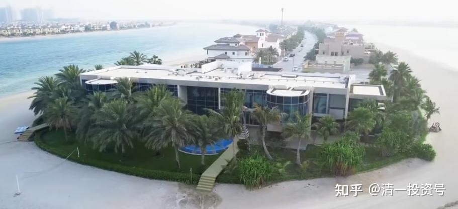
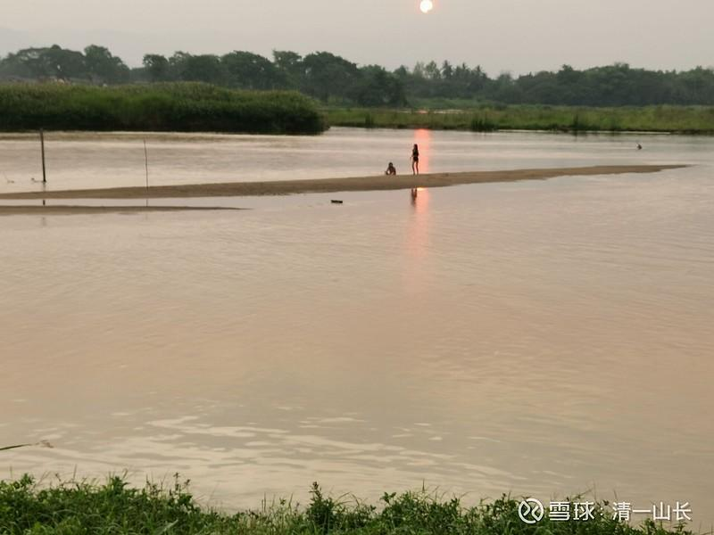
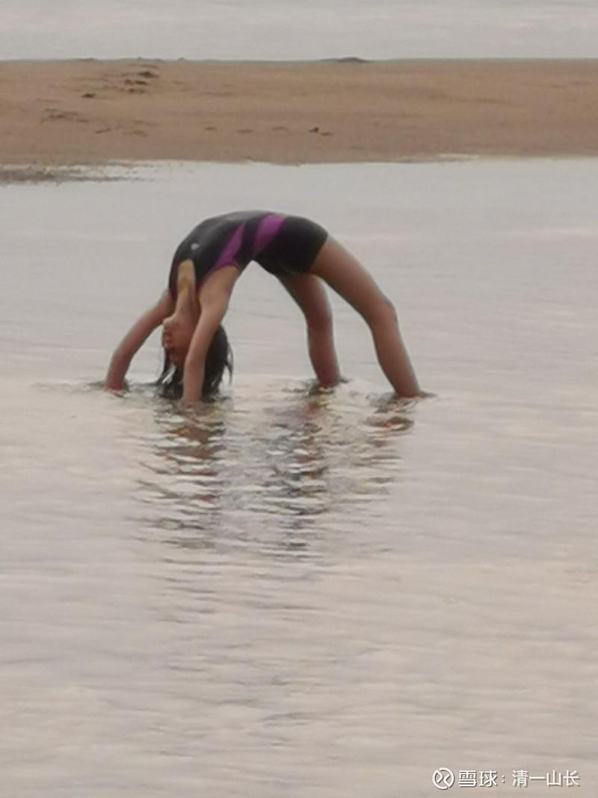
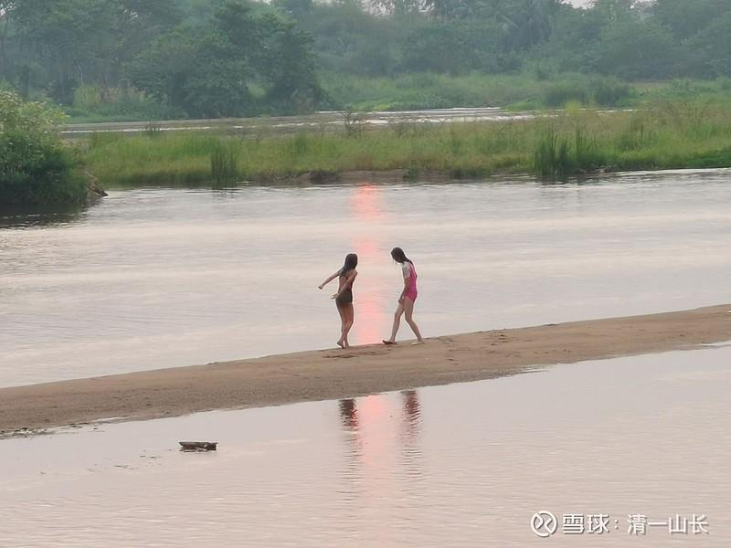
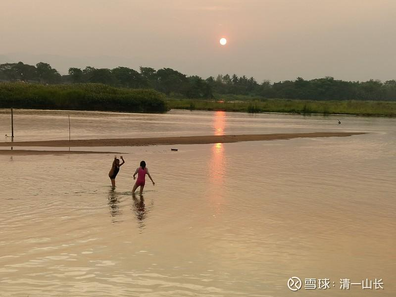
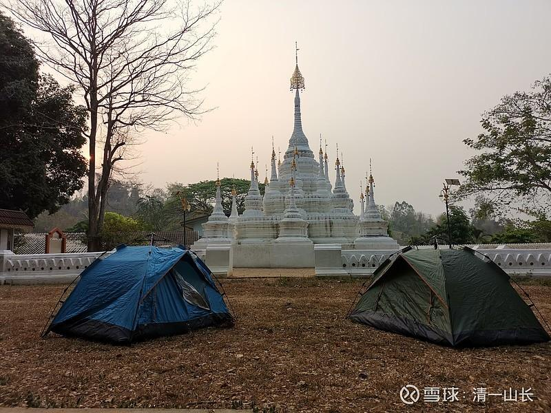
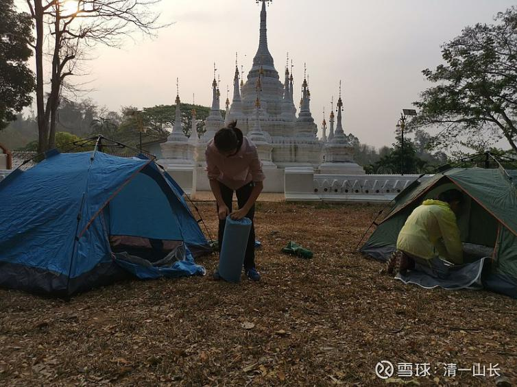
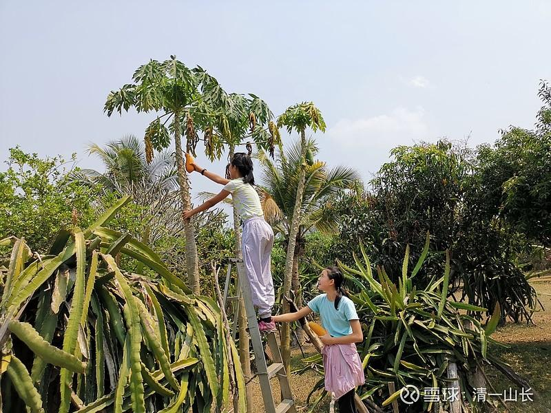

原专栏**133篇.拥有私人小岛，真的就值得羡慕吗？**

清一山长2021年3月29日

雪球上，有人发文：29万美金买一座私人小岛。住在房车里面，还有一栋20多平方的小房子，很多人羡慕。

如果去看看下面链接的私人小岛，更令人羡慕了。价值六千万的私人小岛豪宅：

哔哩哔哩网站链接《迪拜价值六千万美金的私人岛屿豪宅》

[https://www.bilibili.com/video/av15916240/](http://link.zhihu.com/?target=https%3A//www.bilibili.com/video/av15916240/)

可是，干嘛非要买下来才算“自己”的？可以用，**这一时，就是“自己的”；下一刻，给有缘的人就行了。我的房，我的车，甚至我们的人，都一样。都不是“我们”的，只是这一刻我们拥有彼此的缘分罢了。**

我现在住在泰国一个很漂亮的度假村里面。我是答应了要带女儿出来野营的。但我认为野外不安全，就只让她在度假村里野营，一家人订了有空调的房间，却不去睡，就在草地上搭帐篷睡，挺浪漫的。

我们来到这个大河边上，小女爱上了去附近的大河里面玩，有广阔的沙滩，沙子很细。有温暖、清澈和透亮的水，环境很干净，人也很少。我也很喜欢这地方，就连续几天都住在这里了。

度假村环境也很好，到处是果树。树上挂满了芒果。看得出维护得很精心，我看他们家的树篱，管理得很好。每年至少需要十几万泰铢来打理。

晚上睡觉，我们都嫌屋里太闷了，一家人都搬到草地上睡帐篷，空气很好。早上在鸟叫声中醒来。这种生活，很惬意。我们付出的价格却很低廉：这是一栋独栋的泰式小房子，总面积大约50平方不到，门口有大约20平方的门廊。不知道还能不能叫别墅？[大笑]肯定比上文中这个人的房车要大一些。空调、电视、网络一应俱全。每一栋小屋，一晚上才450泰铢。由于泰国现在没有游客，整个度假村就我们一家人。相当于我们家拥有了整个“度假村”。还有服务人员为我们服务，每天打扫，环境很干净。

“生而不有，为而不恃”。天下我们什么都带不走，我们能带走的，只有我们的体验！

小女儿在玩**“下腰水上行走”**！

小女与她的小伙伴艾拉在一起玩。这是一条通往曼谷，最终入海的大河，泰国的母亲河——PING（湄平河Mae Ping River）。由于阳光强烈，所以每天只是傍晚才带孩子们下水去玩。当地也有一些孩子会来玩，但人不多。如果中国有这种地方，肯定人满为患了。

第二天，我买了四个游泳圈，让她们去体验玩漂流。她们更是玩疯了！几个小时都不愿意上岸。

我在泰国的度假村里面，坐在宽大的，可以容纳几十个人的大餐厅里面，打开网络，接上电脑，看着国内我的股票，今天又涨了很多个450泰铢出来。我什么都不用做，只需要等着就行了。其实算算：每天我的分红就过万元。我是怎么花，也花不完的钱。干嘛要去买啥小岛？钱多烧疯了脑子吗？

**我们无法拥有地球上的任何东西，甚至我无法拥有我的女儿。但我可以拥有与她一起的生活和体验。**我相信：她长大后，会记得她小时候在河里疯玩，爸爸妈妈为了让她玩个够，就在河边度假村住了四天，让她开心的去玩。这种体验，不比我去操心买下一家度假村，或者去岛上建一个我自己的度假村，更有价值吗？

昨晚，我们决定多住一晚的时候，接待的主人很高兴的样子，说现在她一天只有我们一家客人！我们这样玩，自己高兴，别人也高兴。真的买下来之后，恐怕大家都没这么高兴了。我相信服务员看到“老板来了”，紧张更多过高兴吧？

我天天算：没客人，每天的开支都少不了，水费电费，员工工资。我也烦死了！

所以，我们需要的其实很少。但我们想要的太多。

我现在过的这种，你们看起来很惬意的生活，我相信大多数中国人都能过上，但你们都不要，你们只是想要去买一个小岛[大笑]！

这里的生活标准：一份泰国鸡油饭，猪脚饭，35泰铢。小女素食，就只要白饭，加上一碗菜汤，共10泰铢就搞定了。西瓜4公斤左右一个，40泰铢。很好的芒果，30泰铢一公斤。泰国青柚，很甜的，水分充足，10-15泰铢一个。如果您像我们一样住帐篷，连450泰铢的房费也省掉，生活费就更低了。每天去大河里面洗洗，挺干净的。傣族人、泰国人，就是这样的，不需要洗澡间！所以，人真的不需要太多。或者说，我们已经得到了很多【泰国的公共设施很多，很方便，要找有水、有电、有卫生间-安全-搭帐篷的地方很容易。如果玩穷游，是个很不错的地方】。

小女在我们住的度假村，去摘树上的木瓜。左边的“怪树”，是火龙果的树。看起来乱乱的样子。
