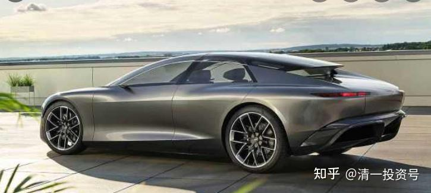
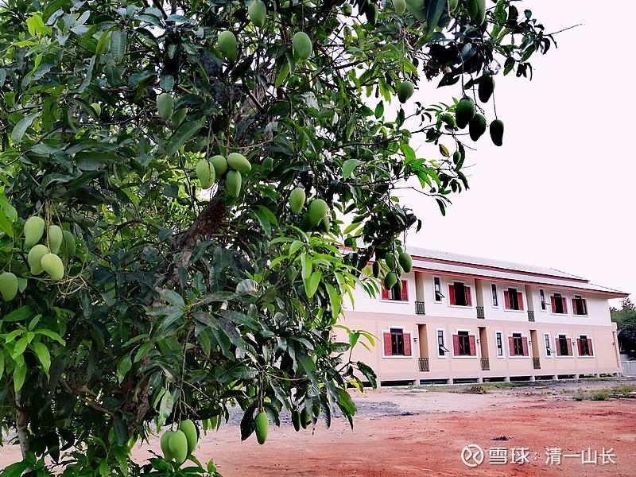

原专栏**[143篇.五年后，你买什么车？](http://link.zhihu.com/?target=https%3A//xueqiu.com/9310099567/177361148)**

[清一山长](http://link.zhihu.com/?target=https%3A//xueqiu.com/9310099567) 2021年4月16日

五年后，你买什么车？

我上次在国内买的车，是本田的URV。我说，这是我在中国买的最后一辆传统车。我估计将来国内要换车，肯定换自动驾驶的电池车了。油车，传统自驾车，10年后肯定都成老爷车了。

前几天，带小女外出玩，做她们的司机。我说：“等你满18岁的时候，爸爸送你一辆你喜欢的车，你就可以自己开车了。自己去考个驾照，像哥哥姐姐一样，很容易的。”我以为小女会很高兴的，拥有一辆新车，是很多年轻人的梦想，比房子更受孩子们的关注和欢迎！因为代表自由吧？

没想到，小女却没有高兴的感觉。而是有点坏笑地说：“等我长大了，可以开车的时候，不就你说，车就可以自己开了（自动驾驶）。我就不用自己开车了，当然，也不用买车了。”我想小女现在才12岁多一点。五年后？能成吗？

结果，今天看到了这个视频，华为的自动驾驶上路开车实景！比我想象的还要好。

五年后？该是啥样的情况？会满街都是自动驾驶车吗？技术的发展，实在超过我们的预期。

[华为自动驾驶实景开车的视频链接](http://link.zhihu.com/?target=https%3A//m.weibo.cn/status/4626323013636991%3F%23%26video)

这个东西出现之后，绝对改完人们的出行习惯，甚至改变用车习惯。这时候，大约人们不太会迷恋“我的车”。车，将不再是显耀的工具，而仅仅是一辆交通工具。网约车的费用，比你自己来开车，包养车的费用更低。因为未来人工贵，能用机器造的东西，都不贵。便宜而安全、有效。

我猜想，20年后，我老了，给孙子们吹牛，是说当年我开车如何去西藏的惊险故事。孙子会不会无辜地说：“爷爷，你干嘛要逞英雄，自己开车呀？这多危险，多么的不合常理！”

我猜，就跟我现在非要让孩子去捡拾柴火，自己烧柴火饭一样可笑。这是我小时候天天要做的事情。现在就算在农村居住，你要做的，也只是把米放进电饭锅，然后按一下！就没了。小时候，人们都很忙，小孩也要做很多家务。现在，似乎人人都很闲。家里需要做的事情很少了，麻烦一点的，就是打扫卫生了。连洗衣服，我小时候觉得很麻烦的事情，小女几岁就可以做了。不就是按个电钮吗？

忽然有种感觉：以后的人，将来会不会全都变废物了？除了成天拿个手机玩游戏、追剧之外，啥都不会做了？连自己玩都不会玩了？都要听机器的指令和设计安排，才会玩？（我看现在就差不多这样了）

万一这世界有一天居然没电了，他们会不会守住米袋子，直接饿死？

也许我想多了。

上图是我居住的院子里的芒果，预计1个月之内就熟了！我的院子里，有七颗芒果树，产量蛮大的。起码上百公斤吧？去年我院子里的一颗大龙眼树，结了上千斤的龙眼，怎么都吃不完。最后树上还有很多就没有要，送人也没人吃，周围的村民都吃多了。今年计划送给城里的大学生们去？
