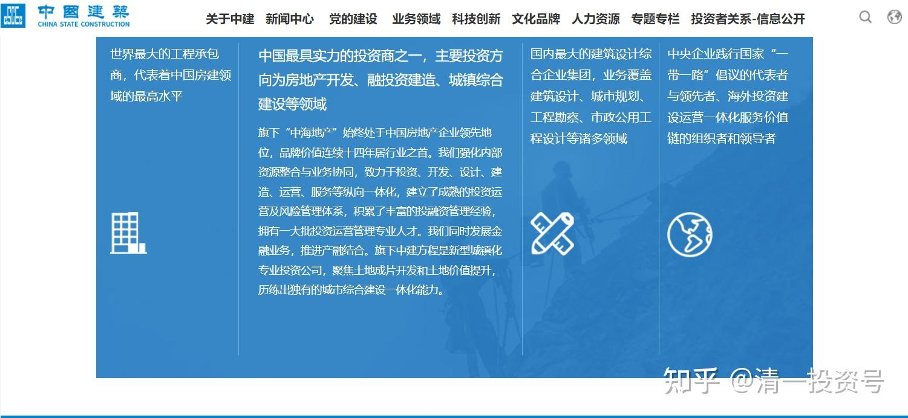
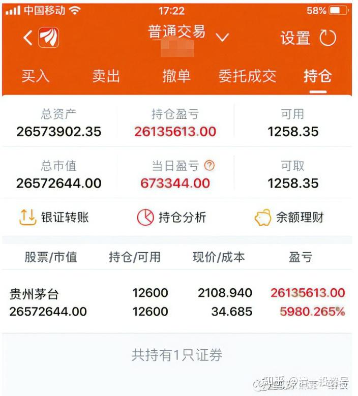

原专栏**[146篇.赚钱之人不用忙：持股12年赚60倍](http://link.zhihu.com/?target=https%3A//xueqiu.com/9310099567/178061167)**

清一山长2021年4月24日

网上看到一个分享：一个上海的股民，12年前40万元买了一万多股茅台，就一直守到今天，市值2600多万元。轻松实现千万财富的逆袭！

其实，拥有这种心态的人，基本上不会输的。**买入一个未来注定会涨的龙头股，不去追涨杀跌，自动就当富豪了。**

当然，贵州茅台是个案。12年涨60倍，也是靠现在的赛道股疯起来的。要稳定地获得十年5～10倍的回报，倒也不是遥不可及的事情。比如：你现在买企业每年利润，跟贵州茅台差不多的中国建筑（其实我认为中国建筑每年几百亿的科研开支，也算利润的一部分，加起来比茅台更牛）。但用价格，只是茅台的十分之一还不到的低价买到手。过十年之后，恐怕收益上十倍也不稀奇的。买了股票之后，你就放手，自己去找份喜欢的工作做，每年拿利息就够了。别**天天来看盘，为几分钱纠结，这是愚蠢的人**。

12年之后，中国建筑的总利润，应该是现在的3倍左右，高一点可能有4倍。估计和那时候的茅台也差不多。所以，就算是市场给的估值不涨，中国建筑的股价，也可以涨个三、四倍的。如果估值也跟随涨了，来了戴维斯双击，涨到10PE（真心不高的），你就可以收获10倍股了。万一真涨到茅台的估值（60PE）。你也有60倍可以拿的（只是我的理性认为，涨到60PE没可能，除非中国人全变股疯了）。

我最讨厌持有中国建筑的人跑来问我：现在能不能买？能不能卖？这种人，都不适合买股票，适合当韭菜，完全就是没脑子。没脑子其实也可以赚钱，无脑相信股市会给你钱，找个真正的龙头公司买入，耐心等待，拿分红去过生活就行了。就像上面这个持股茅台12年不放的人。**很多人偏偏还装得自己多聪明，总要自以为是，自作主张。天天追涨杀跌，一点下跌的亏都不肯吃，几分钱上涨的利润都不放过。这种人能赚钱，真是天理难容了。因为明显就是跟赚钱过不去的人。**

为啥我的第一重仓股中国建筑，我很少说啥？因为就没啥可说的。拿十年看看。虽然过去六年的记录不太好（六年没涨），但这六年，中国建筑的营业和利润涨了很多的。如果回到2016年年底的估值（我当时跑掉了，2015年、2016年分别跑了两次[俏皮]。去年才再度重新重仓进入的）。中建就是牛股一只。我不是说你一定拿十年（提前实现预期利润，提前走有啥不好的？），但要准备好拿十年不涨的心理准备，才能买中建。

当然，10年后，中国建筑还有没有这么多房子可以建？我就不知道了。我知道它有PPP。以后可以不干活就拿钱。如果仅仅是一家建筑公司，10年后怎样真不好说。问题就是：它不仅仅是一家建筑公司，它正在用现在赚的钱，来布局未来的战略要地。这个能力，是我们根本没有的，机会也是我们没有的。当然只能抱紧中建的大腿了。

还有，燕京啤酒，未来十年涨3～4倍，应该可能性也很大。因为未来是消费时代。它只要提提价，主品牌就不会亏损了。估值一下子加上去了。当然，这种未来不好说。未来10年，燕京不如青岛啤酒更靠谱。但也可能回报更高。这一点需要赌一下对燕京的信心。它过去10年不涨，蓄积了未来10年的上涨动力，有啥好遗憾的？

未来别指望房子涨10倍了，好像守房子一样守住好股票，才有可能拿十倍。

[晕娜](http://link.zhihu.com/?target=http%3A//xueqiu.com/n/%25E6%2599%2595%25E5%25A8%259C)本文投资持股的逻辑，请晕总指导[献花花]。您才是[中国建筑](http://link.zhihu.com/?target=https%3A//xueqiu.com/S/SH601668%3Ffrom%3Dstatus_stock_match)的投资研究专家[赞]。已经专注地拿了中建7年。

（以下内容为编者收录）

**评论回复：**

**唯宁静方能致远回复清一山长：**

经营现金流持续为负，很可怕的。

**清一山长2021-04-24 09:30回复唯宁静方能致远:**

你也不看中建的这些现金流，流动到到什么地方了[为什么]？只会呆说，呆算！所谓的呆会计[大笑]今日学堂连续18年现金流为负，这很可怕吗？没有这十几年的投入，就没有今天的竞争力！未来只需一年，就可以收回和抵消掉18年的负现金流，变成大大的正现金流。BTW，中建今年的现金流是正的200亿！流入。

**可乐dagdayup回复清一山长：**

山长您好，您之前提到新教育明年9月份开办走读班，具体是哪个城市？我有2个女儿，一个10岁、一个4岁，我想提前安排去这个城市，让她们进入新教育。

**清一山长2021-04-24 09:39回复可乐dagdayup：**

第一：这个城市在海外，不是国内的城市。但我们可以为学生和家长们解决长期签证问题（可以帮每个家庭都办永久居住的绿卡，自由跨行两国）。

第二：今日国际学校是私立学校，你必须有今日的学位才能上。不是你去这个城市就能上的。就像你来泰国，不是想进啥学校就能上的。跟你是否居住在这个城市没关系，跟其他条件有关[大笑]。

第三：今日的学位，凡是持有今日国际学校的学区房的家庭都可以上。这个比国外，比如泰国的国际学校就优越太多了。因为泰国好一点的国际学校，都要考选学生的。这是给家长们的福利。正因为是福利，所以想要的人很多，但能得到的人很少。首期只推出一百套房子。仅限清粉申请来获取资格。不对外（对内都供应不上的，更别说对外了。所以，各位别误会我做广告拉人，真不缺人。来雪球，只是分享，没有拉人的目的。）

**复利一生小伍哥回复清一山长：**

山长，这个学位房是您定的？还是当地政府要求的？

**清一山长2021-04-24 10:58回复复利一生小伍哥：**

一：今日国际学校是我开办的海外私立国际学校。一切的教育内容，教育政策，招生和毕业要求，都由我们自己制定。当然，我们将依据国际惯例来做。至于入学的学位许可，自然是我们的“内政”，跟当地政府无关。我们只管按章纳税即可。学位房，是我们自己盖的公寓楼，所以供应量有限，以后尽量提速！争取每年都提供一百套房子[大笑]。

二：中国国内的私立学校很倒霉，据说现在连选优秀学生的资格都没有了，必须由教育部门统一管理，统一使用。投资人拿自己的钱，来玩国家的游戏，这不是找抽吗？所以我不敢在中国投资办学。未来国内的私立学校，大规模破产是必然的事情。（没有好学生，没有好成绩，没有资金来源，怎么跟国立学校拼？）

三：中国的私立学校，被严格要求：非要按照国家教育大纲去教。如果我的教育跟别的学校一样教学，一样内容，家长凭什么送孩子来上学？都去免费的公立学校算了（其实是公民纳税的，不是真免费）

四：中国的国际学校，据说现在义务教育阶段，严禁录取中国国籍的学生入学。9年义务教育阶段，必须一切听从党安排。这个——很有道理。子民，自然要听父母官的教训。不过，我的孩子就免了，我自己海外教吧！国家目前还没有封杀少儿海外留学的道路。以后会不会限制义务教育阶段的孩子，就不能出国上学？我们就不知道了。所以，我们现在盖学区房，给家长拿海外的永居权。这样法律上，就没有任何问题了。将来还可以用侨生的身份，去考中国的985大学呢！门槛大大降低！当然，同时也通向国际任何大学。全世界都是我们的选择目的地。

**五：今日国际学校的学区房**，跟地理无关，地段无关。**跟我们的认证有关**。我们认证你属于今日的学区房，你就能上学。认证不是，你就是挨着我们盖楼，也进不来。就算只隔了一个围墙，就隔了一个“国家”，因为**我们的教育，是给“清粉国”提供的“国民待遇”**[大笑]。

**平凡--回复清一山长：**

老师，购一套学位房需要多少资金？

**清一山长2021-04-24 11:21回复平凡--:**

不知道。由市场来决定的，想要的人自由出价。选其中入选者中最低的一个人的出价，来作为大家统一的标准价。应该不会超过国内的房价吧！以后，就不好说了。每年推出一次。每批100套。

**C49n回复清一山长：**

山长，有没有您国际学校的网站介绍，宣传资料？了解下，多个选择。

**清一山长2021-04-24 11:25回复C49n：**

我们不设网站。因为我们是靠家长口口相传来招生的。不用对外做大外宣。目前的生源，多到录不了。您如果还不知道我们的学校是啥样的，您就不用忙了。提示一下：我们是**三年就学完美国12年课程**的国际学校，全世界唯一。但您应该没可能来上学的。不了解，想通过考入学，肯定是考不上的。不考学生直接入学的学区房，应该也轮不到您来挑的。早就有人排队了[笑]

**复利一生小伍哥回复清一山长：**

谢谢山长耐心解答。我有些想法，借宝地记录一下：

1.这就是自己定的学区房。必要性在于1）通过房产投资，拿永居权；2）肯定离学校近，方便孩子就读。风险在于：如果今日学校不办了，这房子没啥用处，出手都难。

山长办的事儿，是新事物，理论上说确实解决了现在大陆家长的一些痛点，应该会有市场。但是，毕竟是新事物，做成了众人捧，做砸了众人踩。

2.大陆的私立学校，以大连为例，$枫叶教育(01317)$就是从这里起家的，不过现在比较好的是嘉汇（主要是初中）。现在的政策是这样：必须面对所在区（中山区）招生，招满的情况下可以对全市招生。至于说优选学生，就不要想了，不公平[大笑]教育公平化、均等化，国家也很难，这还是要从国家的角度来理解。不过对于高端人群来说，我想高价买好货，国家不卖，这就挺头疼。国际上一些牛逼的私立校模式，在中国难以立足。这是两种价值的取舍，不做评价。

3.教育大纲一致，这个还是要的。否则且不是谁有钱谁说的算？

举例子说，山长万一在国外，给孩子灌输亲日教育、分裂思想，咋办？当然，第一山长不会这样，第二，山长真要这么干，中国教育部门还就真管不着。而国内私立教育，也得采取国家审定教材，其实也是这个意思。要培养社会主义接班人，总不能为港独培养接班人。

4.国内的国际学校，确实要求只针对外籍。展开说，我觉得不存在明明有正确路径故意不走，往往是被迫的政策。比如现在不让补课。

5.感想如1。

**清一山长2021-04-24 12:27回复复利一生小伍哥：**

第一、今日学区房，是位处在一个海外的特别保税区，重点发展旅游业，免税购物的。您认为将来房子卖不掉？只能看涨多快吧？[大笑]。

第二、如果您看到的今日示范班的教学成绩是真的。真的**3年就能学完美国12年**（真假教学，已经多年了，我相信买房的人会调查的，不是你们外人这么不调查就买的）。这种教育水平的学校，怎样会让它办不下去？我看只有**“看到的人都想要”**吧？所以，今日学区房，注定年年涨价的。**每年只提供120户**房子供应市场，固定的投入（为了跟学生的数量配套）。但市场需求，恐怕不是固定的，而是不断增长的。

**速隐刀回复清一山长：**

“要准备好拿十年不涨的心理准备，才能买中建”，这么长时间的资金成本、机会成本有几个人能受得了？千万以上资金量的大户，寻求的是资金安全、稳健增值，拿出一半资金买中建非常合适。而小散们就还是别尝试这种股了，去找从底部已经爬起来的票比较合适。

**清一山长2021-04-24 14:24回复速隐刀：**

认为不能买中建。看来您这种人，比较适合买高大上的茅台，您坚持再拿12年也行，也许再涨60倍？这是别人的成功经验喔[大笑]！
