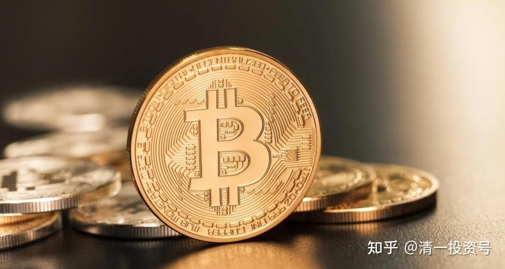
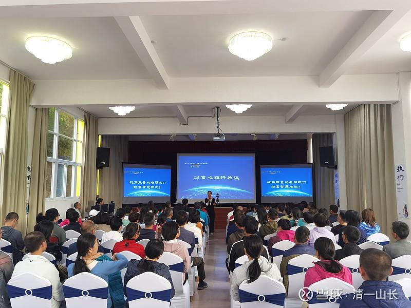
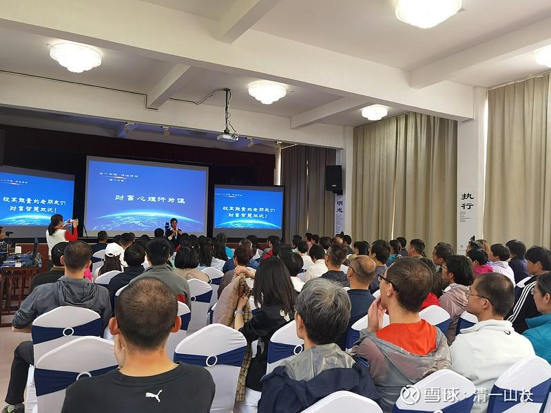
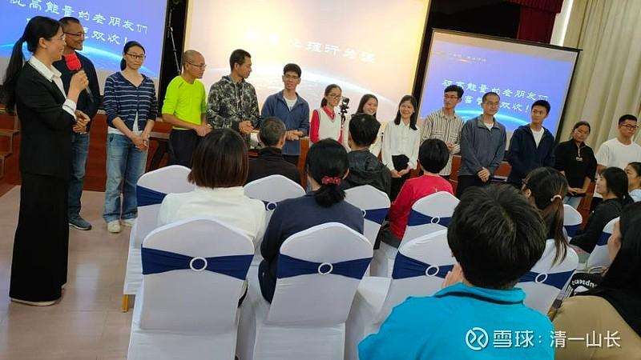

原专栏**[152篇.财富心理行为学：第二讲 金钱心理学](http://link.zhihu.com/?target=https%3A//xueqiu.com/9310099567/178818427)**

清一山长 2021年4月30日

今天学员们已经到场了。明天正式开讲。

这里是他们的现场交流情况，来自全国的朋友们齐聚一堂，研究金钱和财富的奥秘。别小看这些学员喔，很多都是很有身价的老板。有些还是上市公司的联合创始人之一。还有房地产公司的老板。

第二讲的作业先发上来，学员的金钱价值观解析

这是一个心理分析课，是学生拿自己的思想出来，我根据学生来解析。所以每一次课都不一样的，不是固定内容的。我儿子以及他的商学院同学，将是这批学员的助教。帮助他们学习。

**第二讲课前作业**

**作业一：假设你有足够的金钱去做你想做的事情，请你根据你认为真重要的事情，排列出10个你想要用足够的金钱，去实现的人生目标。**

**作业二：一分为二。阴阳表里。金钱如果会带来好处，也会带来坏处。请您列出你认为拥有大量金钱，有可能给你的生活带来负面影响的十种可能性。**

**作业三：如果你没有钱，上帝表示你没有赚钱的命，你依然要去做的十件事情是什么？**

**（可以与有钱去做的事情重复，但要说明为啥有钱没钱你一样做？有啥区别？）**

我上课很简单:就是跟学员，聊他们的作业就行了。备课都不用的[大笑]。然后，我的一批助教们，再帮助其他学员解析自己的思维和金钱心理。这样学习，才有效。只会听讲。记笔记，是很无效的学习方式。特别是学习心理学，基本无效。
