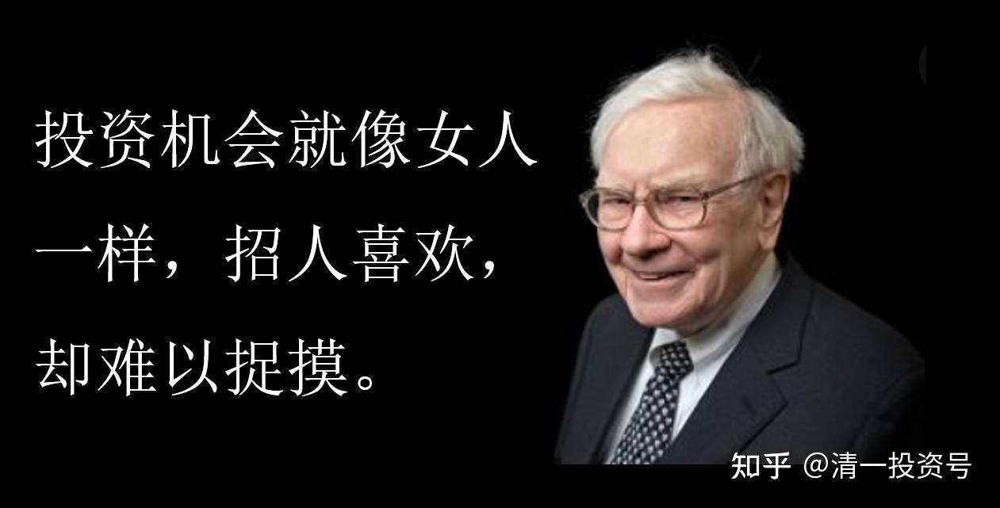

原专栏**153篇.财富心理行为学第三讲：巴菲特的投资和人生智慧**

清一山长2021年5月3日

财富心理行为学第三讲：巴菲特的投资和人生智慧。

**真正的聪明人，都会把一些大道理，用很普通、平实的语言讲出来。而一些自作聪明的人，却喜欢把简单的话语弄得很复杂。**华尔街和商学院、金融专业的人，基本上是后者。因为他们的主要目的，是骗人——装得很专业的人，专门去骗傻瓜。所以，**一旦有人跟你说一些特别漂亮、大词、高大上、专业术语等，而你又弄不懂的话，你要警惕：他八成是要骗你！**

以下是巴菲特在他的年会上给他的投资人讲的一些话（巴菲特给投资人的信）。看起来都很简单，请你去解读出这些语言后面的投资大智慧。如果对投资不懂，也没啥兴趣的人，就去放弃投资智慧部份的解读，只解读生活智慧，把这些语言，解读为你领悟到的人生智慧、生活智慧。而要学会投资的人，则必须两种模式都解读出来。

明天，我将针对每条语录，同时讲巴菲特的投资原则和人生智慧。让这些东西能够落地，成为你投资和人生行为的帮助，成为您投资和生活的现实行动指南。因为大道相通：**真正的智慧、投资的大道，是与人生的智慧、生活智慧完全相通的。只有蠢人，才以为各是各的道。**这就是西方金融和专业课程设置“分裂的学问，为啥不接地气”的原因——为啥教出来的人，都是傻乎乎的机器，只会干活，而不会生活。分科教育、专业教育，是西方的特长，也是西方的教育的短板。而**综合教育、复合人才，恰好是中国古人的特长。生活和事业一体化，是东方智慧的体现！**

01、关于分散投资，可以用著名学者比利·罗斯的话概括：你的后宫要是有70个女人，那么没有一个女人你能懂。

解读：

投资智慧解读：

生活智慧解读：下同

02、投资机会就像女人一样，招人喜欢，却难以捉摸。

03、市场就像上帝，帮助那些自助的人；但与上帝不一样的是，市场不会原谅那些不知道自己在做什么的人。

04、你划的是怎样的船胜于你怎样去划。当你遇到一艘总会漏水的破船时，与其不断白费力气去补洞，还不如把精力放在如何换一条好船上。

05、每个泡沫都有根针在等着它。当投机看起来轻而易举时，最危险。

06、几百万的资金才能利用的投资机会，对只有几千块钱的人来说没多大用。我年轻时对这一点感触很深。

07、错过一个人的能力范围之外的大好机会，不是什么罪孽。

08、基金就像漂在池塘上的鸭子，水（市场）涨起来时，鸭子跟着往上涨；水（市场）落下时，鸭子跟着往下落。

09牛市能使数学定律黯淡无光，但却不能废除它们。

10、人们宁愿得到一张下周可能会赢得大奖的抽奖券，也不愿抓住一个可以慢慢致富的机会。

11、世界上购买股票的最愚蠢的动机是：股价在上涨。

12、我有一个经常犯的错误，就是不愿意为非常好的企业出高价。

13、说到“投资经验加到一起都有几百年了”，我想起了一个段子：

有个人去面试，他说自己有20年的从业经验。他之前的老板说，不是“20年的从业经验”应该是“一年的经验，重复了20年”。

14、我们什么时候对，主要取决于股市的走势。我们到底对不对，主要取决于我们对公司的分析是否准确。换言之，我们集中精力研究的是将来会发生什么，不是什么时候发生。

15、我不会因为现在的情况变了，就去做我不懂的投资。有人说“斗不过，就入伙”，这不是我的作风，我是“不入伙，斗到底”。

16、我的一个朋友有句话说得好：想要的东西没得到，就得到了经验。

17、最佳的投资机会大多是出现在市场银根最紧的时候，那个时候你一定希望拥有庞大的火力。

18、并非不受欢迎或不被人注意的股票，或企业就是好的投资标的，反向操作有可能与从众心理一样愚蠢。

**真正重要的是独立思考而不是投票表决。**

19、既然找到好企业并加上好经理人是如此的困难，那为什么我们要抛弃那些已经成功证明过自己的投资对象呢？

我们的座右铭是：**如果你第一次就成功了，那就不要再费力去试别的了。**

20、当你读到头条新闻说“投资者们随着市场下跌而亏损”时，得笑容满面。

在你的脑子里，应把它编辑成“减资者们随着市场下跌而亏损——但投资者获利”。

尽管作者常常忘记了这条起码的常识。但，总有买家对应着卖家，而且对一个的伤害，必然帮助了另一个。

21、仅仅因为最成功的投资占据了投资组合中的绝大部分，就建议这个投资者必须廉价卖掉一部分，无异于建议芝加哥公牛队卖掉乔丹，原因是他在队伍中已经太重要了。

22、优秀的骑士会在好马、而不是衰弱的老马上充分发挥。优秀的经理在流沙中奔跑时，永远不会取得任何进步。

23、通货膨胀：

假如你放弃购买10个汉堡包，把这些钱存进银行，期限为2年，你可以得到利息，税后的利息可以购买2个汉堡包。

两年后，你收回本金，但这些钱仅能购买8个汉堡包，此时，你仍然会感到你更富有，只是不能吃到更多的汉堡包。

24、诺亚的原则：重要的是建造方舟，而不是预测风暴。

25、为什么潜在的买家还要看卖家准备好的预测，让我困惑不解？

查理和我从未看过它们一眼，相反却谨记有一匹病马的人的故事。在看兽医时，马主人问：“您能帮助我吗？我的马有时候勉强能走，有时却一瘸一拐。”兽医：“没问题。在它勉强能走时，卖了它。”
