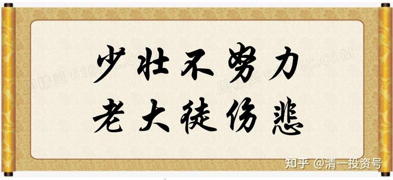
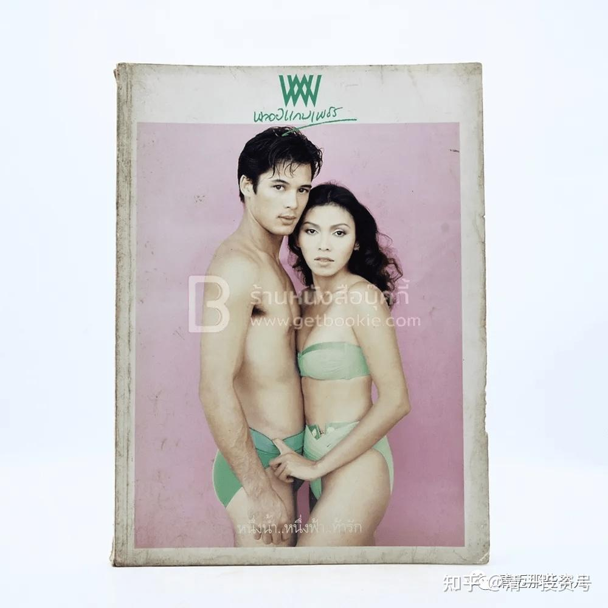
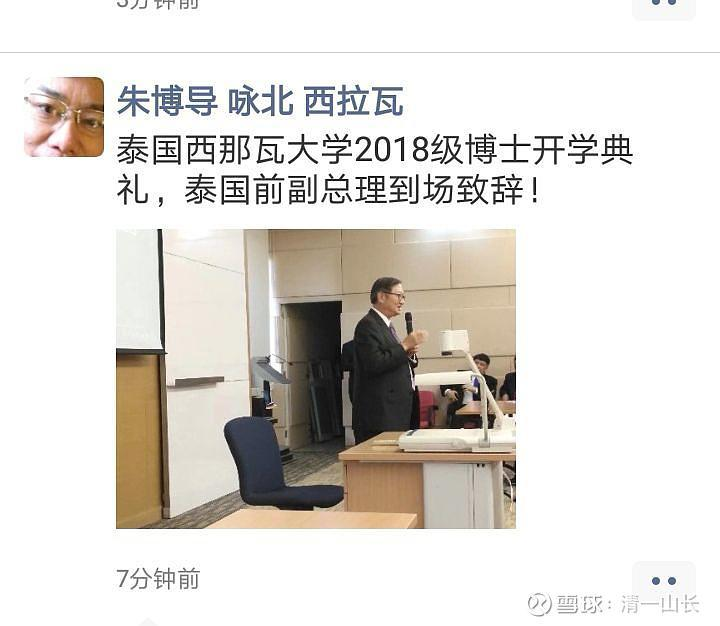

原专栏**161篇.曾经的英俊男神，现在送外卖每天换60元生活费！**

清一山长2021年5月15日

这个有德国血统的泰国小伙子，就是没有眼光，没有远见的案例：他是当年的明星。拍过很多电视剧，接过很多广告。但现在，他在送外卖，每天收入250泰铢。当年肯定是赚到钱了的人，但没有把钱投资用来保证生活，只是有钱就用光掉。现在年纪大了，靠做旅游度日，疫情导致行业不行。结果用了最后一笔钱买了一辆摩托车来做外卖，每天有250泰铢够活下来。再老了，跑不动了咋办？所以，**年轻时要珍惜福分，有钱的时候，珍惜钱财，不要浪费，买一些毫无意义的消费品。**供大家参考：[网页链接](http://link.zhihu.com/?target=https%3A//mp.weixin.qq.com/s/iRGXVuzAlKgnzKwFA1L3yQ)

[https://mp.weixin.qq.com/s/iRGXVuzAlKgnzKwFA1L3yQ](http://link.zhihu.com/?target=https%3A//mp.weixin.qq.com/s/iRGXVuzAlKgnzKwFA1L3yQ)

中国古人说：**少壮不努力，老大徒伤悲！**

上面这个故事，说明了现实的残酷。上面的男神，年轻时风光无限，钱也没少挣。但仅仅25年后，就沦落到了街头当外卖老哥，每天挣250泰铢左右，勉强够活的地步。某一天老了、病了，咋办？

这就是现实的残酷。

**当您受到上天眷顾的时候，请不要浪费您得到的资源。好好保护好老天给您的奖励，不要浪费，也不要被人骗走了，将来老了，也有一份保障。**

这位艺人，如果年轻的时候，买下一些真正的资产（无论是房子、土地，还是股票），长期持有不动，今天不至于如此狼狈不堪。

但通过这个故事，我看到了更可怕的未来：

中国的一些家长，自己赚了钱，就妄图永远不用干活了。自己的儿女，娇养的不得了，似乎比皇帝家更尊贵，从小孩子不会干任何事情——更糟糕的是，连书都不读。大了，考不上像样的大学，家长就花钱，送去国外读个海外大学，以后回来就可以骗人了。——其实，明告诉你：没有真才实学，你拿啥文凭，将来都没用的。

这些孩子，从小就没努力过，不是肯定比上面的这位艺人还惨吗？从来没有奋斗过的孩子，这一生是很悲惨的一生。家长以为可以养一辈子，但这个世界，会用各种手段，抢走你的钱财。你是不可能养孩子一辈子的。

我们家的资产，可以说，按照现在的购买力，可以养我的子孙数百个，都是没问题的。但我唯一的爱女，我依然要她各种干活，每天都要锻炼身体，甚至让她去捡拾牛粪，跟穷人家的小孩一样。**我要保证她：父母没给一分钱，她都能活下去！这就是我对她的爱。**不是拿钱养她，而是**逼她比同龄人更能适应生活，甚至是严酷的生活环境。**

难道她不会读书吗？现在才12岁，已经达到了三国，三种语言的母语水准。昨天她妈妈给我看她学习钱校长“明师荟”的笔记，密密麻麻的好多页。全是英文的笔记（我说过她的英文比汉语更好的）。妈妈说：钱校长是用汉语讲的，她似乎不需要翻译，就直接记成了英语笔记，我相信很多国内英语专业的大学生都无法做到。

就算如此，我依然要她干活，做事，磨练自己。原因就是：只**有这样，会读书，会做事，会做人，我们才能放心让她单飞。**

我相信：财力超过我们家的中国人，一百个家庭，未必有一个！但我见过的家庭，绝大多数就是比我们更宠孩子，家长摆出一副泰国国王的架势来，似乎自己的孩子就会受到全国的供养一样，根本不操心生计问题，这多可怕！

甚至更可笑的家长，以为只要花点钱，让孩子去拿个国内或海外的大学文凭回来，就可以去蒙人了，就可以接受天下人的供养了。这不是自欺欺人吗？

下面把我发在内部群的信息转给大家看看，希望大家清醒一点：**就算你是富人，一定要穷养！少壮不努力，老大徒伤悲！**

**转发：内部群讨论：**

我不认为这种极致学院是个很好的选择。**“无需高中文凭就可申请极致学院，并就读英美一流大学”**。这个措辞，就有忽悠之嫌。高中文凭，去找个私立高中上，是很容易的。关键是学习成绩。英美真正的一流大学，绝对需要强劲的学习力。**学习力不好的人，也可以去英美上大学，反正就是收智商税的。现在疫情导致到处封国，这些海外大学求生源都急疯了。但是你上完这种大学，依然是留学垃圾。**

说实话，今日高中的优秀学生，成绩可以考取美国前50名的学生，我都不支持去读英美的大学。因为**英美教育，是红海。去了，无论学习内容，还是费用，投资回报比都是很差的。**我认为就是出去交智商税，没啥性价比。欧洲的德国、法国、日本教育水平要高得多的（除了比美国一般人根本进不去，而且已经对中国封锁专业的一些真正的世界一流大学差一点以外），绝对强过绝大多数的英美大学。所以，我的建议是：**优秀的学生，宁肯去欧洲的真正的一流大学学习，也别去英美的非超一流的大学留学。如果不优秀的学生，不好好学习的孩子，根本就不要送出国，肯定变垃圾，不如去做点实在的事情更靠谱。**

昨天我给一个今日学堂14岁学生的家庭做了私人咨询辅导。这个学生的学习态度有问题，成绩时[好时](http://link.zhihu.com/?target=https%3A//xueqiu.com/S/HSY%3Ffrom%3Dstatus_stock_match)坏。她是西语班的，18岁要考取一个西语一流大学，其实也没啥难度。但我给家长的建议，就是这种**学习的态度，心思不定的人，不用心的人，就不要去上海外的大学。不如现在去劳动，上社会大学，去体验生活的苦。等彻底转变了态度，才能去上学、读书。**学做一点事情，家庭才不至于出废物。有志气的学生，才能出国留学，还必须选性价比高的地方。小语种地区，就业将来也比较容易。否则送英美，就是白白被收割的命运。

山长 清一 07:37:57

个人意见，你们做家长的，自己多想想，你们的命运自己做主。花的钱也不是我的，你们随意！

200119赖建芸 东莞 11:11:42
[@山长](http://link.zhihu.com/?target=http%3A//xueqiu.com/n/%25E5%25B1%25B1%25E9%2595%25BF) 清一 山长慈悲，说真话。[献花花][合十][献花花]

山长 清一 11:21:05

特别提醒一下各位家长：**凡是告诉你，入学没啥门槛的，什么条件都可以去的，除了钱，其他条件都好说的，都是国外的野鸡大学。不管叫啥名字，是公立、私立，政府认证不认证，啥包装，啥名头，啥背景。**家长千万别以为：您花钱，就能买到好大学的资格。更别指望您孩子去上了这种大学，就变得出息了。**孩子如果不好好读书，成绩不好的话，不如就不学了，去学做事去，起码不浪费你的钱**。这些学费（一年大几十万），不如拿来买靠谱的股票，将来靠利息，都可以给孩子发一辈子的基本生活费。拿去买个骗人的文凭，注定人财两空。

泰国总理他信家族办的私立大学（西那瓦大学），据说有国际排名，泰国排名，私立大学排名前十等等，很有名望。我一看：他们的招生有中文的网页，还表示可以专门开设中文讲授的课程，外语不好也没关系，没有门槛，都可以来上他们的大学。我就知道一样是野鸡大学。**去上这种大学就是去吃亏的。**

泰国的一些国立大学，我们见过的国际学生，也是基本上没啥基础，都可以去上大学的，只不过面子上，走走过场，上个预科班，假装补补课。其实就是花钱就能上，目标都是赚钱，补贴国内的教学收入。国立的、私立的，对国际学生都一样，不要求学生品质的。只有最顶级的大学要求严格一点。一句话：**千万别把国外的大学当啥“出路”，上普通大学，跟读一个中国的不入流大学、民办大学，是一样的结果。没有用人单位会认你这种文凭的，加上没学到啥本事，只能大学毕业，家长带回家继续养老。**

**我不希望新教育出这种败家子，更不希望新教育的学堂鼓励家长去海外败家。有本事，让国外的大学免费收你当学生**（欧洲大学，除了英国，就是这样的不收费上大学的。**法国、西班牙等国，只要你考过B2以上的外语成绩，就免费收你上大学，还是一流大学）。这种成绩，今日学堂学生一年多，最差的学生都能实现B2。你们的孩子，如果学个三年，都学不出来这种成绩，还去上个屁的大学，只能回家干活去！想骗人，自欺欺人，拿钱去糟蹋，我不反对。但我也不支持**，先说好。

今年内部，也有这种不成器的学生，不好好学习的，我们一般会尽量劝退回家，另外，还都统统告诉家长：要出国，我们送出去很容易，任何学生，我们可以保障你可以考上国外的正规大学，甚至是一流的大学。因为你拿钱上学，谁都欢迎，我们培养好了外语，就一切符合一流大学的入学要求。但是最终结果，**孩子不好好学习的，学习能力不行的，大概率上大学也是出废物的。我们作为教育者的良心，需要提醒家长这一点。一切责任、后果，家长自负！我们不骗你。你一定想要受骗，就自己骗自己去！我们就点到为止。**

0606王雯昆明 11:24:34

山长一直在教我们，天上不会掉馅饼，只能掉陷阱！遇到“好事”，需要想想为什么？国人都喜欢走捷径，真正的捷径就是“打铁还需本身硬”。

1281阮理明广州 11:47:27

山长说的西那瓦大学还招博士，面试入读，我们有认识的老师在那边带博士，问题是，学不到东西，只是拿钱换文凭，真心没必要去，但我有同学去读了，因为他本身在高校教书，需要混个文凭拿职称。

1281阮理明广州 11:48:04
[图片]

T0433王华赣州 11:49:23

山长苦口婆心，正的反的，一一剖析。我们做家长的，如果还不能看清、收起我们的“妄心”，还在到处追逐各种迷人的七彩泡泡，那真是“纵遇明师也枉然”，愧学了新教育，更关键的是，对我们自己、对孩子的一生都无益。良药苦口利于病，感恩山长一次次地示范怎样做真人。敬佩，钦服[献花花]。

山长 清一 11:52:51
[@1281阮理明广州](http://link.zhihu.com/?target=http%3A//xueqiu.com/n/1281%25E9%2598%25AE%25E7%2590%2586%25E6%2598%258E%25E5%25B9%25BF%25E5%25B7%259E) “他本身在高校教书，需要混个文凭拿职称”，这没毛病，他有职位，但要个面子。这些大学，提供在职博士的条件。而且文凭是中国国家承认，泰国也承认的。学啥不管，身份正宗，不是假的。但是——你的孩子去上这种大学的博士，然后去企业求职试试？绝对没门！[憨笑]，当然，你家里有人做官，有门路，可以拿个这种博士去装个门面的。但在同事里面。依然没地位的。别人一样瞧不起你！因为圈内都知道你的这种没门槛的博士是咋回事——合法出售的文凭罢了！
