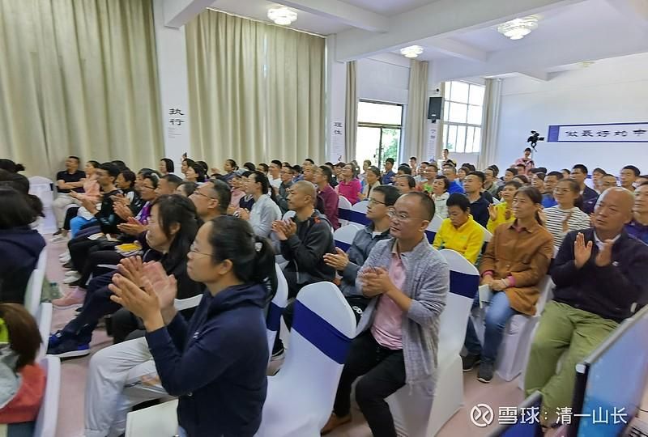

**

**

**原专栏162篇.真有“穷人之歌”？千万别唱！一辈子穷命！**

清一山长2021年5月16日

财富学员说有一首歌《等我有钱了》。我是懂信念系统的人，一看这个的背后信念系统，就发现是典型的**“穷命信念系统”**，注定永世发不了财的穷命，小人之命。大家千万别唱，唱了真的就一辈子穷命，劳碌命了，注定是金钱的奴隶，无法解脱的穷命，无论给他有多少钱，都是穷人一个。天上掉下一千万给他，你看他两年后，会跟现在一样穷。

后附学员的财富课大总结日记，欢迎围观！

《等我有钱了》

作词：冰耘

作曲：张勇

演唱：陈柏辰

监制：爱情小王子

发行：广州小贝影音文化有限公司
等我有钱了，先孝敬咱爹娘
父母的恩情比天大还要比地广
等我有钱了，生活要变个样
扔掉那些旧衣裳咱也换新装

为了这个梦想，我每天都在忙
想想生养我的爹娘苦累都自己扛
为了这个梦想我每天不敢忘
只为那些期盼的眼光，我都要活出人样

为了这个梦想，我每天都在忙
想想生养我的爹娘苦累都自己扛

为了这个梦想，我每天不敢忘
只为那些期盼的眼光，我都要活出人样

等我有钱了，要买车再买房
到哪儿朋友一大帮遇事心不慌
等我有钱了，回到我的家乡
开着汽车，载着爹娘到处去逛逛

为了这个梦想，我每天都在忙
想想生养我的爹娘苦累都自己扛
为了这个梦想，我每天不敢忘
只为那些期盼的眼光，我都要活出人样

为了这个梦想，我每天都在忙
想想生养我的爹娘苦累都自己扛
为了这个梦想，我每天不敢忘
只为那些期盼的眼光，我都要活出人样
啦…………啦…………啦…………

学员：深圳岳学明

**财富心理行为课大总结**

网络上流行这这样一首歌《等我有钱了》，这是歌的歌词大概是这样的：

“等我有钱了，先孝敬咱爹娘。等我有钱了，生活要变个样，扔掉那些旧衣裳。咱也换新装，挺起胸抬起头，走在人群的中央，总有一天我要找到漂亮的姑娘。等我有钱了，要买车再买房，到哪儿朋友一大帮，遇事心不慌。

等我有钱了，回到我的家乡，开着汽车载着爹娘，到处去逛逛。为了这个梦想，我每天都不敢忘，只为那些期盼的眼光，我都要活出人样。”

歌词唱尽了这个时代大多数人的金钱观，有钱就能孝敬父母、有钱能找到漂亮的姑娘、有钱就能有朋友、有钱就有幸福的生活、有钱就有面子，但事实真的是这样的吗？有钱你才能孝敬父母吗？看你有钱找到的漂亮姑娘真的喜欢你吗？有钱才有围着你转的朋友？用钱去撑起自己的面子？生活在这样的环境中，真的可以幸福吗？答案当然是否定的，现实生活中这样的例子有很多，我就不一一列举了。

那你可能会反问，没钱这些事怎么可能办到呢？我认为**生活中只需要一些钱保证必要的生活开支即可，与其用钱孝敬父母，不如用心、用行动；找一个拜金女，不如找一个真正欣赏自己的女孩；找一群消费的朋友，不如找一个知心朋友；用钱去撑面子，不如付出自己的价值与贡献；花钱买健康，不如锻炼身体不生病；用钱堆积孩子的教育，不如自己教。如果以上你不知道从何做起，那你可以了解新教育——健康、教育、养生、投资为一体的极致生活。**

本次五一山长给赠送我们9天的财富心理行为课，通过对巴菲特、芒格的解读，帮助我们看到金钱的本质、了解真正的富裕。

**金钱是用来服务我们的生活、我们的目标的。我们喜欢做的、想要做的很多事情并不取决于金钱，而是取决于我们是否真心想去做。**比如，**我们想要给孩子创造好的学习机会，不用买学区房，在哔哩哔哩网站就有免费的今日学堂示范班课程——“三年学完十二年的美国课程”，比中国任何重点学区房都牛吧！关键是你不用花一分钱。**而**大部分人都是围绕着钱打转，每天被金钱驱使，做着自己并不喜欢的工作。**

找到自己的理想，做自己真正喜欢、能够对他人有意义的事情，不被金钱左右，这样富足的生活你是否喜欢？而金钱从何而来？**巴菲特对于富裕的定义是有多少人喜欢你，你关心的人有多少人喜欢你，这个被喜欢的值就是你的财富**。如何理解这句话呢？什么时候你会被人喜欢呢？**你对别人有价值，别人自然会喜欢你，喜欢你的人越多，你的价值就越大**。比如大家都喜欢今日学堂，如果山长想用它的学位来换钱，那会有很多人来疯抢，这样就可以轻松地换到金钱。这就体现了别人对你的喜欢值，这种喜欢是让别人能够受益的，也能够换来金钱，这就是财富。

那我的喜欢值有多少呢？取决于我能帮助的人有多少。只有自己用心做好自己的工作，不断学习，帮助到更多的人，这个过程是不需要为钱焦虑、向钱看的，“只问耕耘，不问收获”。因为宇宙是公平的，我相信宇宙的运行规律，信不信由你？

放眼我们周围的一些国家，如美国、印度、泰国，这些国家的社会阶层已经固化，底层人民晋升阶层的机会少之又少。目前在中国虽然贫富差距也很大，但是社会的阶层没有固化，尤其是教育方面，我们国家是很开放的，只要你下真功夫，你可以从底层晋升到中层，那30年后、50年后呢？社会发展到一定程度，进程是相似的，为未来中国也会成为阶级固化的国家，我们怎么不沦落为底层人呢？我很庆幸可以遇见山长、遇见新教育，让我的家庭、我的孩子未来可以通过教育改心、改命。山长还苦口婆心的用不同的方式，让我们看到我们未来生活中的苦难，并一再用不同方式引起我们对孩子教育方式的重视——**强者信念与弱者信念。拥有强者信念的人自立、自强、理性，不会用情绪控制别人，自己也不会受周围的环境影响，而影响自己的情绪，更清醒的活着，并且新教育的强者们从小就有一颗服务他人的心，以能够帮助到他人为荣。而有弱者信念的人从小就被植入了一颗玻璃心，稍有不如意就有各种情绪、不开心，挑剔、审判、批评更是家常便饭，他们全然不能够为自己负责**，这样的人要如何适应未来的生活呢？

你会选择给孩子输入强者信念还是弱者信念呢？我判断孩子教育的方式是否正确时，我会把看孩子目前的情况的眼光放远10年、甚至20年，来推测未来他会是一个什么样的人。我坚信山长指引的强者信念就是让孩子卓越的指明灯，我看到了众多新教育培养的优秀的孩子，我全然相信山长、紧跟新教育。

感恩山长的指引，感恩山长创造的新教育平台，让我找到了自己喜欢的工作、让我在心灵上富足、让我看到了家族未来充满希望。

参考链接：

[清一投资号：121篇.千万大礼，送给穷人会是啥结果？](https://zhuanlan.zhihu.com/p/577842173)

[清一投资号：123篇.美团外卖的小哥，花钱订我一万元小时的咨询！](https://zhuanlan.zhihu.com/p/580123623)
