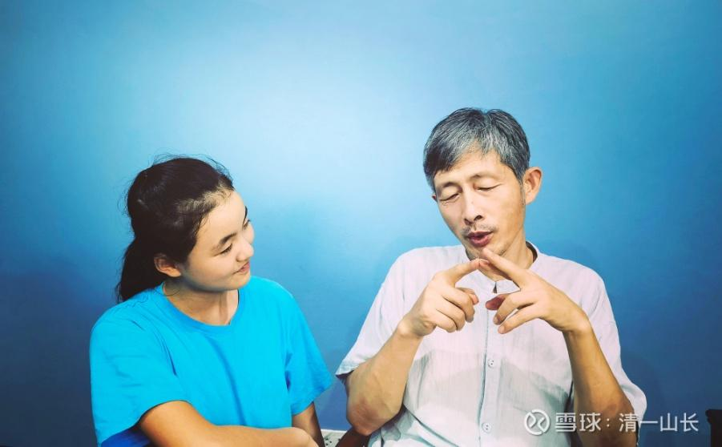

**

**

**原专栏197篇.[100年后的你，最需要的礼物是一顶头盔？](http://link.zhihu.com/?target=https%3A//xueqiu.com/9310099567/191232146)**

清一山长 2021年7月20日

**今天给学员上德鲁克的管理课，看谁有4年的眼光，以及40年的眼光，以及100年的眼光。**

测试什么是100年的眼光，我就开玩笑，拿艾拉上来说话，让她选礼物：

告诉她：现在我有两个礼物，一个礼物是10T硬盘，装载了世界上几乎所有的书籍文件，还有知名大学的一万门课件的视频，以及各种电影，学习资料等等。

另外是一顶特种部队使用的，结实的头盔。

我问她：假如让她为100年后的自己，从中选一份礼物，只准选一份，她会选什么？

她选了头盔。

她的理由很充分：如果我们的文明继续正常的发展，她根本就不需要现在的这个10T的硬盘。这一切，将来会以更方便的方式得到。

但如果我们的文明终结了，她就算拿着这一块硬盘，也毫无用处，根本没法播放出来。甚至就算留下了机器，也没有电力系统来维护和驱动，而且坏了也无法维修。所以——硬盘对于100年后的她，基本上是没有用处的东西。

但——得到一个头盔做礼物，倒是很有必要的。无论未来的文明社会，是否继续存在，拥有一个上等的头盔，总是很有用处的，起码练拳也可以用来做保护。我还开玩笑说：如果文明终结，回到了原始社会，她将来居然拥有这样的一个高级古传头盔，也许还可以当女族长呢！因为别人都没有[大笑]。

我突然发现：**这种思维方式，倒是很锻炼人，让我们能够发现身边，什么才是对我们更重要的东西。**

比如一个头盔，100年后比硬盘、苹果手机更重要！

一吨汽油，显然比一吨榴莲更重要，而且重要得多。

虽然一吨榴莲的价格，远远高于一吨石油的价格！因为石油是几百万年才能形成的宝藏，而榴莲每年都可以结果，根本就没啥稀奇的。

但显然，中国人的选择是相反的，会用一架包机来送[20吨的榴莲](http://link.zhihu.com/?target=https%3A//www.sohu.com/a/337381270_283674)回中国，把几乎相同重量的油料消耗掉。

我们会从[美国订购车厘子](http://link.zhihu.com/?target=https%3A//m.gmw.cn/baijia/2020-05/30/1301250011.html)，用飞机万里飞行，送到中国来，这也是一样的理由：**车厘子，比航空汽油的价格更高**，就算是消耗了几十吨汽油的钱，依然显得是一桩很划算的生意，当然值得做——用航空汽油换车厘子。

至于**法国的葡萄酒，更是一种很平凡的水果酿制的风味液体，我们也会用更多的石油来交换它——随机变成垃圾排泄掉。**

所以，我更愿意石油涨价十倍，来降低石油的消耗量，这样也许你们就不会做这样愚蠢的选择了，也许够用到我孙辈。当然，我这样说，会挨骂的！[大笑]

**我们人类，总是把不值钱的东西，当成有价值的，花费很大的代价去获取。**比如各种“宝石”、包包等。**而把最有价值的东西，当成垃圾一样忽略**，这实在太疯狂了。比如我们的宝贵空气，居然随意地去污染。

公共交通更节约资源，但我们都愿意花费更多来买私家车，**因为简单的欲望，地球就必须支付更大的代价。**

我想问各位：如果你想选择10种，现在这个世界上存在的，你可以找到的礼物，能够留给100年后的你自己，你会选什么留下？为了让你选的东西真的能够留下来，你现在应该做一些什么？（假如你选了想留一些汽油给100年后的你用，你最好现在就设法让大家少浪费汽油）。

如果是不相信轮回的人，你就选择另外一个目标：把礼物送给100年后你的子孙后代，你会送什么？（其实两种逻辑以及应对的方法，基本是一样的，说送给自己，也许你会更慎重一些[大笑]）

你们愿意来做这个题目吗？这也是我明天布置给我的学员的题目，愿意来测试一下你是否有一百年的眼光？以及找到你照顾的百年的事业？

看你们谁做的作业比较好、比较有创意，我给打赏！[俏皮]

如果你想送的礼物，跟我想送的礼物一样，我会邀请你一起来做伙伴。大家一起合作留下给后代子孙的礼物，必须是实实在在的东西。我做一下示范！

示范一：我想在远离中心城市、中心地区的地方，人少地多的地方，但不能是喜马拉雅的高山，我更希望是河谷地带，这里的土地肥美，气候水源良好，生态环境更适合人居的地方，留一块土地给子孙后代。比如10亩、100亩或者1000亩的土地（力所能及），给100年后的自己。

如果文明继续，这块土地用于观光、旅游、出租，甚至作为孩子们的夏令营，用来砍草、做极限训练，均无不可。也可以将来用于盖养老基地用。

如果文明崩塌，有一块可以耕作的土地留下来，对100年后的我，是很重要的。不然就只能流浪天涯了。有土地，至少可以耕读传家！奉行老庄时代的人生理想。[大笑]

第二到第十，就该你写了。
