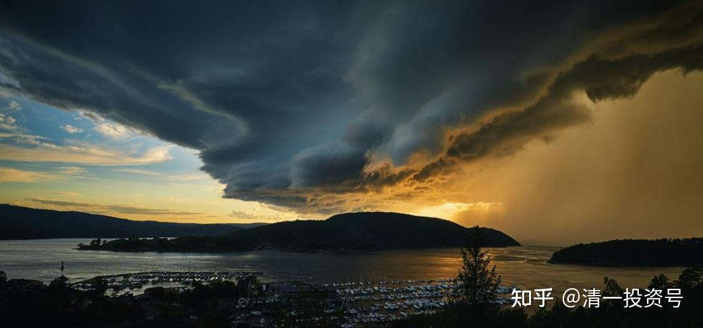
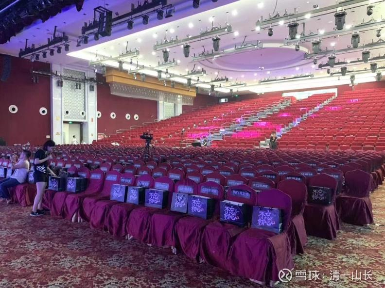

原专栏**205篇.[教育和财富的国策思考：大变局与大转弯](http://link.zhihu.com/?target=https%3A//xueqiu.com/9310099567/198335756)**

**清一山长2021年9月21日**

今年，有很多想不到的事情，正在不断的发生，这些事情，可能会永远改变我们的未来规划，也许，你今年更需要换一副新的眼光来看待世界了！

**一、教育大变迁**：谁也想不到，今年推出的教育新政，会让新东方等民办教育机构，各种培训机构，彻底失去生存空间，市值狂垮90%。而且政策的执行力度空前严厉，不是教育局在执行，而是政法系统在主要执行。说明：这肯定不是一个简单的教育问题，这是一个“重大国策”，未来教育大转向。教育目标大改变，是必然的趋势。

问题是——我们要转向何处？现在，在严格限制民办招生比例的规定下，很多成功的民校，都只能直接“赠送给国家”，转为公办。民办教育不仅失去了发展空间，其实连生存空间都几乎没有了。为啥会发生这种巨变？背后的核心逻辑是什么？这种教育格局的更改，对我们的下一代教育将产生什么样的深远影响？国庆三天，我将与参会者研讨这个问题。我们孩子的未来，就决定于你能够看清未来的变动方向。看不清，也许你重金投资的“教育股权”，也会像新东方等一样狂亏90%。

**二、财富大变迁**：钢铁、水泥、电力，双碳限制等严厉企业管制措施的出台，造成了国内传统企业市场巨大的变迁。各种产品价格剧烈的变化，产能严重的压缩，一夜之间就只能面临破产命运的企业，全国到处都是。这种大变局，会导致什么样的经济结果出现？未来的经济走向，如何观察和定义？你怎样才能抓住未来的财富空间？

**三、职业大变迁**：未来的职业选择，在教育大变局，财富大变局的双重压制下，肯定未来的职业选择，会发生极其巨大的改变。原来行之有效的职业设计，将来不会再有用。过去根本就不受重视的领域，可以成为未来的热点。你未来会失业吗？还是有望得到更好的工作机会？大量的职位快速丧失，会带来什么样的变化？

**四、世界第一的霸主地位，与世界第二的竞争者，矛盾是不可调和的**。老牌帝国已经用各种手段，干掉了前面的四个挑战者。这一次会例外吗？我们怎样才能置身其中，而不至于造成城门失火殃及池鱼？

实话实说：我对我现在观察和研究的结果，是非常的不乐观。未来的教育、职业、财富的投资逻辑，从现在看，都已经发生了本质上的变化，我们必须面对和改变。不然，我们只能出局！

今天是中秋节，我没啥可做的，我也不过节，照样跟学员上课、看书等。但我祝福大家节日快乐，圆满中秋，圆满人生！

【图片说明：以上是我的国庆演讲会场，我有三天的演讲任务。各位对这些问题感兴趣的人，可以申请参加。纯公益性质，非商业演讲。】

中美博弈的趋势与应对——2021年建设新教育行知团队联谊会公告

[微信网页链接](http://link.zhihu.com/?target=https%3A//mp.weixin.qq.com/s/0_dkn0qOk7u3qfiEbAUHGQ)：[https://mp.weixin.qq.com/s/0_dkn0qOk7u3qfiEbAUHGQ](http://link.zhihu.com/?target=https%3A//mp.weixin.qq.com/s/0_dkn0qOk7u3qfiEbAUHGQ)
