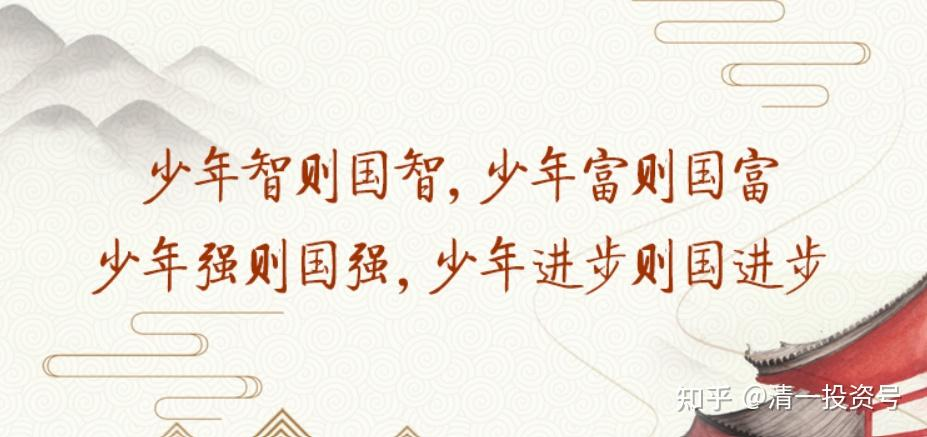
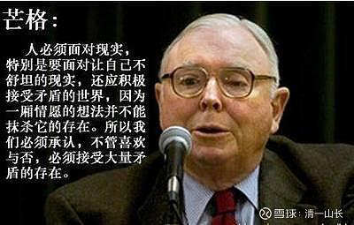

原专栏**[210篇.芒格智慧的少年班解读：作业分享男生版1](http://link.zhihu.com/?target=https%3A//xueqiu.com/9310099567/199251591)**

清一山长 2021年9月30日

上一期的作业，学生们已经做了6次不同的解读。我相信已经把文章读透了，为了写作业，找题材，不得不反复读文章，反复思考。你们有兴趣可以参考一下。

由于他们的作业评选，是由清一武道馆来评定的。所以让他们附上中文的作业，中英文双版本。你们如果想读读，就不会太为难了。还可以看看：这些学生的中文是否过关。[笑]这些少年班的学生，就是你们全国组队，击败他们，就可以拿到一千万奖金的。希望这些作业能够给你一些勇气。过几天，他们的老师，目前在武道馆训练的弟子明仪，将来深圳参加国庆新教育分享会，亲自与大家见面，你们有挑战勇气的人，可以现场签约，设法拿走这一千万！她会教你们：怎样才能拿走这一千万的。如果给她去选一批人的话，她相信2-3年就可以带出击败清一大学少年班的水平。毕竟——我们的学生样板数量太少，中国这么大，要选出一些精华人才来，培养两三年绝对超级牛！

**高中部小故事[大智慧](http://link.zhihu.com/?target=https%3A//xueqiu.com/S/SH601519%3Ffrom%3Dstatus_stock_match)第五集**

**男生班：**

【**宏亮&胡高阳**】

**小故事：**

有的东西，有的人学不会。有的人天生就比你强，你再怎么努力，也总有人比你更强。我的心态是：“那又怎样？”我们现场的这些人，有哪一个是非得站上世界之巅不可的吗？没那个必要。

**大道理：**

很多人听了芒格说“那又怎样”，心里估计会想：嗨，我还是安心躺平吧！芒格都是这么想的，那还有什么可说的吗？反正有人天生比我强，我何苦站上世界之巅呢？算了吧！

但奇怪的是，如果照这个逻辑，芒格应该是个平淡无奇的奥马哈钓鱼老人才对，无论是天赋、智商，还是家境，都拼不过那些天才。但事实上，他却在财富榜上一骑绝尘，远超华尔街在内的一众“天才”。我相信芒格诚不欺我，所以不由开始重新思考芒格的话是否别有深意。

这时我突然意识到，芒格是搞投资的呀！作为一个投资者，他大可不必成为乔布斯那样洞察人心的企业家，像埃隆·马斯克一样拥有卓绝的天赋；又或是像郭台铭那样成为百万工人的领导者——芒格可以选择投资这些顶级的企业家，同样能够和他们一起站上世界之巅。虽然做[可口可乐](http://link.zhihu.com/?target=https%3A//xueqiu.com/S/KO%3Ffrom%3Dstatus_stock_match)背后的男人不会被每个畅饮可乐的人记住——“但那又怎样？”

这便是我从芒格故事当中悟到的道理——我不一定做国王，但我可以做国王的朋友，跟他一起散步，跟他一起受益。

股市上如此，生活中亦是如此。几年后，我们都要走上社会寻找雇主。届时，又如何才能找到那个国王，与他一起“散步”呢？记得山长曾在财富课上解答过这个问题。上策是找一个靠谱有远见的人，像马云的十八罗汉，跟对了人，草鸡变凤凰；中策是找到“朝阳行业”，像山长常提到的人工智能领域，人才需求大，矮子里拔将军；下策是找到体系完整，能让自己稳步成长的企业，如通用公司——这三条路统统指向一点：跟优秀的在一起。

现在让我们回到开头，为什么很多人对这句话的反应是“如果你最强，而我不如你，那便没有意义？”这背后隐藏的信念就是：“最强的只能有一个”。

而这种非此即彼的信念，在我们自身也有体现。比如，今年的中秋节，我们玩了一个国战游戏。所有的同学都要分成“战国五雄”，进行国家模拟。一进游戏，我们便自然地沉浸在相互算计和坑害中，即使“联盟”，心里想的也是什么时候来个“背刺”。所有人都各怀鬼胎，只想着自己怎么胜出。最后，国战以各国小兵“遍体鳞伤”，国君大臣纷纷去世而告终。

虽然国战只是游戏，但体现出的问题却引人深思。我们心里想的都是成王败寇——让自己称王，让别人成寇——我们都觉得第一只能有一个，为此我们必须互相竞争。可每个人都这么想，结果谁都没有取得胜利。

而芒格作为投资者，给我们的启发就是：我可以通过与你合作的方式一起走向成功，而非局限在那种你死我活的竞争关系中。这背后体现出的合作思维，共赢思维，值得我们学习和模仿。正如英文partner一词，每个人都是整体的一个part，通过为整体创造价值，一起走向成功。而不像很多人都持有的限制性信念——走向成功的方式，只有打败别人这一种。

以上便是我们从芒格的故事中悟到的智慧！！！

**英文：**【**张书畅&黄晨希**】

故事：

总的来说，沃伦（指沃伦·巴菲特）和我，我们两个人从来没为了赚钱，忽悠傻子从我们手里接货。我们赚钱，靠的是在买的时候赚。如果我们卖的是狗屎，我们不会把狗屎说成包治关节炎。

**道理：**

在读这一段的时候，有一小句话吸引到了我：“我们赚钱，靠的是在买的时候赚”，这句话其实是芒格和巴菲特投资的秘诀。他们投资的基本思想就是用四毛钱买价值一块钱的东西，然后等待价格回升就好了。因此他们在买的时候就注定赚了。

所以**我们要赚钱，就一定要做确定能赚钱的事情。**

这时候有人就问了：“这哪是什么大道理呀！难道我会特意去做亏钱的生意吗？“

是啊！这道理我们都懂。

众所周知，所有买股票的人都是想赚钱；大多数结婚的人都希望自己婚姻幸福；基本上任何正常人都希望自己身体健康。但事实如何呢？很讽刺的是，大多人都是在亏钱、离婚、进入ICU。

大部分人没能获得最后的胜利，因为他们不是先确定自己胜利了之后才去做，而是先去干，再期待胜利的结果。

《孙子兵法》里提到过一个类似的观点——先胜而后战。我第一次看到的时候觉得很奇怪，我不应该是战了之后才胜利的吗？其实则不然。孙子的意思是，在战前要判断自己是否达到“胜”的标准，如果还没有达到，就进行弥补，让己方达到。这样再去打仗，才会达成胜利的目标。

例如山长在语言教学成果还没有出来的时候，就知道自然英语学习法的理论一定是可以超过体制的语言学习方法。虽然一开始相信山长的人不多，但随着不断的证实，最后成绩的出现，现在基本所有新教育圈的人也都相信了。只要运用自然学习法学习，就只用等待最后胜利的结果就好了。

这就是一个先胜而后战的典型案例。山长一开始就知道自然语言学习法可以成功，才让学生用这个方法学。

**何为先胜？其实就是事先符合胜利的标准，成为“胜利者”**。这样再做后面的事，自然就会胜利。像前面山长语言教学就是做到了语言胜利的标准——婴儿学习语言的方法。所以去做之后的获得胜利的结果是必然的。

那如果我们能力不够，无法知道某个领域胜利的标准是什么，怎么办？

最简单的解决方法，就是找到一个已经获得胜利的人，并模仿他做事的方式和背后的思维。因为已经胜利的人，肯定是符合了胜利的标准，所以才会成功。比如想成为有钱人就模仿芒格和巴菲特，模仿他们简单、专一的生活理念，他们价值投资的方式。当我们和巴菲特、芒格一样的时候，也就是做到了胜者的标准的时候，我们再去投资，自然就能赚钱。

这就是我从故事中悟出的道理！！！

现在就有一个现成的运用自身的机会：我想进入医道馆，那么我该如何做到先战而后胜呢？首先，我想进入医道馆的本质，其实就是想成为道医。而目前我接触到的道医就是刘老师，所以在我还不清楚地了解道医的标准的时候，我可以模仿刘老师的一言一行。当然肯定不是立马就模仿刘老师这个境界，应该有些我目前还做不到，比如一天吃一餐。我可以根据自身情况，慢慢改进，比如我就可以从吃素开始。

【**姚乃中&陈丁琦**】

问：在伯克希尔的致股东信中，您也写了伯克希尔的过去和未来，您讲到了伯克希尔之所以能取得成功的几个原则。我的问题是，伯克希尔作为一家控股公司遵守了一些原则，取得了巨大的成功和优异的记录，为什么其他公司不和伯克希尔学？

芒格：我觉得最主要的原因是学不来。例如，像[宝洁](http://link.zhihu.com/?target=https%3A//xueqiu.com/S/PG%3Ffrom%3Dstatus_stock_match)这样的大公司，它的固有文化、它的官僚作风，早已根深蒂固，你说怎么能把宝洁变得像伯克希尔·哈撒韦一样？这个问题可以直接分到“太难”一类。太难了，已经不可救药了。

人们还是没意识到官僚主义的危害有多大。伯克希尔能取得今天的成就，原因之一在于总部根本没几个人。伯克希尔没官僚主义的毛病。伯克希尔有几位内部审计员，总部有时候派他们出去巡查。总的来说，我们没官僚主义的毛病。

没有官僚主义，上层的管理者又头脑清晰，这是我们的巨大优势。

**智慧：**

这个故事给我们揭示了一个简单又实际的智慧：想要成功，我们就需要拥有独特的竞争优势。比如相比于宝洁公司，伯克希尔没有官僚的毛病。所以，它内部的运行会更加高效和灵活。

那我们应该如何建立起独特的竞争优势呢？拿打了长达60年的汉堡大战为例。汉堡市场当时最有垄断性的企业之一是[麦当劳](http://link.zhihu.com/?target=https%3A//xueqiu.com/S/MCD%3Ffrom%3Dstatus_stock_match)。但是它有一个致命的缺陷，即它们太庞大了。所有流程是固定的，所以产品自然也只能是标准化的。而当时的汉堡王就看见了背后隐藏的机会，发起了“Have it your way”的营销活动。允许客户选择自己喜欢的酱料，满足了顾客个性化的口味。这一反击策略让汉堡王获得了巨大的成功。

我们可以从这个案例中看出，在发展自己独特的竞争优势时，选择去跟竞争对手拼它的强项并不明智。就像假如汉堡王选择去跟[麦当劳](http://link.zhihu.com/?target=https%3A//xueqiu.com/S/MCD%3Ffrom%3Dstatus_stock_match)拼规模，拼产品的标准化，肯定是自取灭亡。真正有效的做法，是去找到竞争对手的空缺，转化成自己的优势；通过想办法弥补这一空缺，为顾客提供独一无二的解决方案。

但是，选择的路线一定不能是为了不同而不同，而是基于顾客的需求来决定。我们能为对方提供什么“额外的价值”。就像假设一天汉堡王不再生产含牛肉的汉堡，改为卖素食汉堡，结果将会怎样呢？肯定更有可能赔钱，因为它不符合西方大部分人的口味。

最后，在发展独特的竞争优势时，我们还需要去结合自身原有的优势。就像汉堡王的小规模看似是一种劣势，但它的反面就是灵活的流程。借助其优势，汉堡王能够为客户提供个性化的酱料服务，最终赚到了很多钱。

所以，要想建立我们独特的竞争优势，核心的3个要素是：错位竞争，需求和自身原本的优势。运用这个原则可以解决我们遇到的很多难题。

近期在和女生班的小故事PK中，我们原本都充满了自信，但结果在前两天输得很惨。当我们阅读完女生的故事后，很不理解为什么她们的排名比我们高。

而我们紧接着便开始总结失败的原因，制定进一步的“作战”计划。我们先从读者的需求出发，考虑到他们肯定喜欢对他们有启发的故事。通过仔细阅读武道馆给出的反馈，我们发现一个有启发的故事必须有新颖的观点、深入的论述和吸引人的表达。而女生的小故事，普遍观点比较新颖，表达也清晰易懂。男生写的故事则偏于老套且难以让人理解。

接下来，选择错位竞争。我们应该在女生相对薄弱的环节上，突出男生的优势。经过班级的讨论，我们发现女生的故事虽然观点新颖且表达有趣，但普遍在论述上不够深入。而思维又恰恰是男生的优势。所以，下一步的战略就不言而喻了。我们应该把男生的思维优势发挥出来，去深入地、多层次地论述我们的道理。同时，我们也要去补足我们的短板，比如表达不够清晰和有趣，不能让短板过度的拉低分。

在这样的战略下，男生班写的故事终于有了突破，在第三和第四天反超了女生的排名。

**发现他人想要的价值，并在竞争的空白点上，建立起自己独特的优势。这样，我们就让自己成为了稀缺的资源，就更容易在人生的竞争中成为赢家。**这就是我们从小故事中看到的[大智慧](http://link.zhihu.com/?target=https%3A//xueqiu.com/S/SH601519%3Ffrom%3Dstatus_stock_match)。

以下是 英文版 作业。

**宏亮 胡高阳**

Story:

The truth of the matter is that not everybody can learn everything. Some people are way they hell better. And of course no matter how hard you try there’s always some guy who achieves more. Some guy or gal. My attitude is ‘so what?’. Does any of us need to be the very top of the whole world? It’s ridiculous.

Wisdom：

Many people will read this and think to themselves, “what then is the point in striving to succeed?” The top investor Charlie Munger told us this, so what is there to say? If there are always going to be people stronger than me, why do I bother to work hard, trying to stand on top of the world? Might as well forget it.

But there is a logical error to this: If Munger lives by his word, he should be an anonymous old man fishing in Omaha or something, because he knows he is no match for those talented geniuses up there and would have given up trying to beat them many years ago. But in real life, he is riding high on the rich list, above countless "geniuses", and outcompeting many “geniuses” on Wall Street. Munger has never lied to us before, but this time, I couldn’t help but question his statements.

Hang on, Munger is in the investment business! As an investor, he doesn't have to be an insightful entrepreneur like Steve Jobs or Elon Musk, neither does he have to be a leader of millions of workers like Guo Taiming; Munger only needs to make well-judged decisions on which businesses to invest in, and let these companies lift him up to the top of the world. He will not be remembered by the consumers when they drink Coca-Cola (which he owns quite a significant share of)- "but so what?"

That's what I learned from Munger's story - I don't have to be the king, but I can be his advisor, learning wisdom from him and gaining experience with him. People won’t glorify me nor remember me, but so what?

Not only is this true in the stock market, it is also true in life. In a few years, we will all have to go out on our own and get ourselves employed. At that time, how can we find a “king” and become his “advisor” ? I remember that the Principal Zhang once answered this question in one of our economics classes: the best way is to find a reliable and insightful employer is through relationships, like how Jack Ma’s eighteen followers found him; the second best way is to find a "sunrise industry", an industry with great future prospects and high demands like the artificial intelligence industry; the next best way is to find a mature and stable business, work hard, and slowly rise through the ranks over the course of time. These three paths all lead you to the same destination: the chance to work together with the “king”.

Now let's go back to the beginning and think about why people want to win so badly. It all traces down to the common belief that "Only the champion will be remembered, no-one cares about the runner-up." The hidden belief behind this is: "There can only be one winner, everyone who doesn’t come first is a failure".

This belief is even reflected in our daily lives. For example, this year's Mid-Autumn Festival, our school played a Warring States game. All students were allocated to a “country” and we played a school-wide simulation. As soon as we entered the game, our “generals” were naturally immersed in alliances and betrayal, and even if our country was in a "pact" with a “foreign” empire, our generals would still consider "backstabbing" them. Everyone had their own agenda, they only cared about strategies that could bring them victory. In the end, the soldiers of each country were completely exhausted from fighting war after war, and the generals all had their brains fried from the innumerable strategies they had to consider non-stop.

Although this was just a game, the thoughts behind the actions are concerning. We all had the same goal of coming out on top, but in our minds there can only be one winner, and for that reason we must compete against each other. But if everyone acts as if everyone else is the enemy, ultimately, everyone loses.

The point Munger hopes to inspire us with is: we can work for each other in a mutually beneficial relationship, rather than fight to the death trying to outcompete each other. This is the most basic concept of cooperative thinking, which it is a skill worth learning. Everyone is a part of the whole, everyone is part of the human race, and so we are all responsible for our joint future. There are only different roles in society, there is no such thing as a “high” job and a “low” one!

The above is the wisdom we have learned from Munger's story, I hope you enjoyed it!

**张书畅 黄晨希**

English version

While reading this paragraph, a particular sentence appealed to me: "我们赚钱，靠的是在买的时候赚"。

This is their secret to investment. In Charlie's own words, he says: "buy one dollar bills for fourty cents." In this way, they are bound to make a profit.

So, in other words, do what can earn you money, and money will come.

However, one might argue: "isn't that obvious? I don't suppose anyone would do any different."

Yes, this is certainly commonsense.

It is true that although people buy stocks in the hope of making money; people who get married want to lead a felicific life; and basically anyone wants to be healthy, this is not the case. Ironically, most people are losing money, getting divorced, and going to the ICU.

Most people don't end up with what they want because they never do what it takes to acquire them first. Worse still, they then unreasonably expect these things to come out from thin air.

This idea is similar to something mentioned by Sun Tzu in <The Art of War> - wining before fighting. The concept may seem counterintuitive at first sight: the result should be known after the war, right? Yes, and NO. Sun Tzu means that we should first assess whether we have what it takes to achieve "victory", before leading our army to battle. If this is not the case, we should make up for our shortcomings first. In this way, victory is practically predetermined.

For example, before ShanZhang comfirmed the "natural approach to language" was effective, he already knew that the theory of the natural English learning method would be superior than that of the traditional. Although few people were optimistic in the theory initially, as valid results started flooding in, people's opinions began to change. Therefore, utilizing the correct appoarch, results will reveal in the wash.

This is a classic example of such philosophy. Shan Zhang knew from the beginning that the natural language learning method could be successful even before his students used it.

Winning before the war is to is to meet the criteria of victory beforehand. If you take the following actions under this circumstance, you will naturally win. In the case of the Yamaga language teaching, the criteria for language victory - the method of language learning of infants - was achieved. So it is inevitable that you will win.

So, what if we are not competent enough to know the criteria for victory in a certain field?

The simplest solution is to find someone who has already ”won” and imitate his way of thinking and acting. Because the person who has already won must have met the criteria for winning, that's why he or she is successful. For example, if you want to become rich, then imitate Munger or Warren Buffett, imitate their simple and dedicated philosophy of life, their way of investing. When we are the same as Warren Buffett and Munger, that is, when we have achieved the criteria of a winner, we can then invest and naturally make money.

That's what I learned from the story.

Now there is a ready-made opportunity to apply this philosophy: If I want to enter the medical school, how can I apply this philosophy? First of all, my purpose of entering medical school is to become a Taoist doctor, someone like Mrs.Liu. To apply what I've learned, I can try to imitate Mrs.Liu's in all aspects, especially when I don't yet clearly understand the standards of being a Taoist doctor. Of course, there are numerous difficulties in practice: such as eating one meal a day, something far beyond my level. Despite such difficulties, I can still improve slowly according to my own situation, for instance, start by eating a vegetarian diet.

**姚乃中 陈丁琦**

This story reveals to us a pearl of simple yet practical wisdom: to be successful, we need to have a unique competitive advantage. Compared to P&G, for example, Berkshire has relatively fewer bureaucratic problems. Therefore, it will run more efficiently and flexibly internally.

So how should we build up a unique competitive advantage? Take the instance of the burger war, a competition lasting for 60 years. One of the most monopolistic companies in the burger market at the time was McDonald's. But it had one fatal flaw, namely that they were too big. All the procedures were fixed, so naturally, their products could only be standardized. Burger King saw the opportunity behind this and launched a "Have it your way" marketing campaign. By allowing customers to choose their own sauces, they were able to cater to their individual tastes. This counter-strategy was a huge success for Burger King.

We can see from this example that it is not wise to choose to compete with a competitor's strengths while developing your unique competitive advantage. Just like if Burger King had chosen to compete with McDonald's regarding their scale and standardization of products, it would have been a definite defeat. The more effective approach is to locate a gap in the competition and convert it into your strength; by finding a way to fill that gap; and by offering your customers a unique solution.

However, the route chosen must not be different for the sake of being different but based on the needs of the customer. What 'extra value' can we offer them. For example, if Burger King suddenly stopped making meat-based burgers and sold veggie burgers instead, it would definitely have lost a great deal of money because it would not suit the tastes of most customers of the West.

Finally, when developing a unique competitive advantage, we also need to combine it with our existing strengths. Just as Burger King's small size may seem like a disadvantage, from a different point of view it could also mean more flexibility internally. Taking advantage of this strength, Burger King was able to offer its customers personalized sauce services, which ultimately made them a lot of money.

So, the three core elements to build our unique competitive advantage are stagger competition,market demands, and the utilization of our original strengths. Applying this principle can solve many of the challenges we encounter.

In the recent competition with the girls' class, we were very confident at the outset. However, we ended up losing on days 1 and 2. When we read the girls' stories, we couldn't understand why they were ranked higher in score than us.

We immediately began to discuss the reasons for our defeat and construct plans for the following race. We started with the needs of the readers, considering that they must like stories that inspire them. By carefully reading the feedback given by our fellow readers, we found that aninspiring story must contain an original point of view, in-depth analysis, and engaging delivery. The girls' stories generally had a more original point of view and clear and engaging expression. On the other hand, the stories written by the boys were difficult to understand, overall.

Next, in line with the aforementioned principle of stagger competition, we should build on the girls' weak points and put emphasis on our strengths. After a class discussion, we found that the girls' stories, while original and interestingly presented, generally lacked depth in their analysis of the wisdom. Logical thinking, in turn, happens to be a strength of the boys. So, the next step in the strategy was self-evident. We should bring out the boys' strengths of logical thinking to argue our case in-depth and on multiple levels. At the same time, we should also make up for our shortcomings, such as a lack of clarity and interest in expression, and not allow the shortcomings to reduce our score.

With such a strategy, the story was written by the boys' class finally made a breakthrough, completely overtaking the girls' ranking on the third day. Building our own unique strengths is the great wisdom we see in the little stories.

Discovering the needs of other people and developing our strengths on the gaps in the competition gives us a unique advantage. In this way, we make ourselves a scarce resource and are more likely to be winners in the competition of life. This is the great wisdom we see in this little story.
