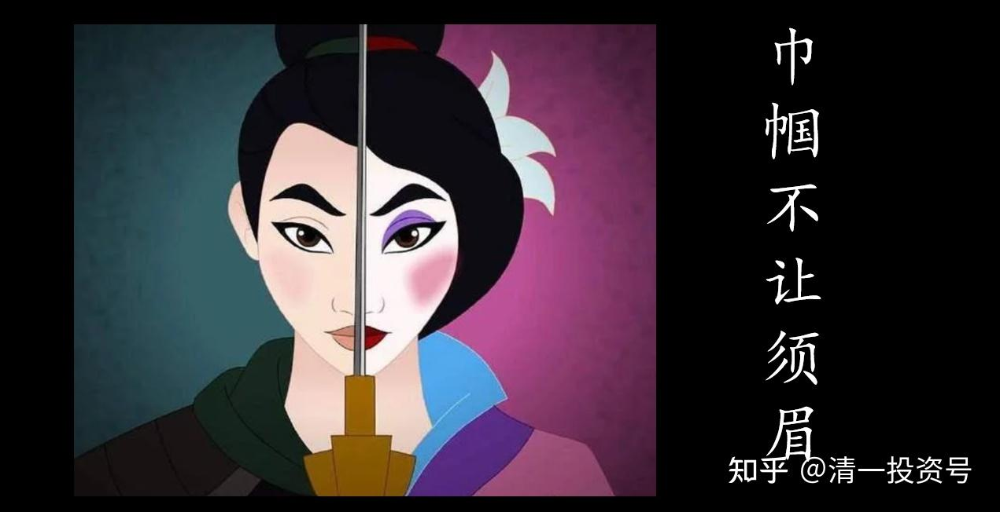
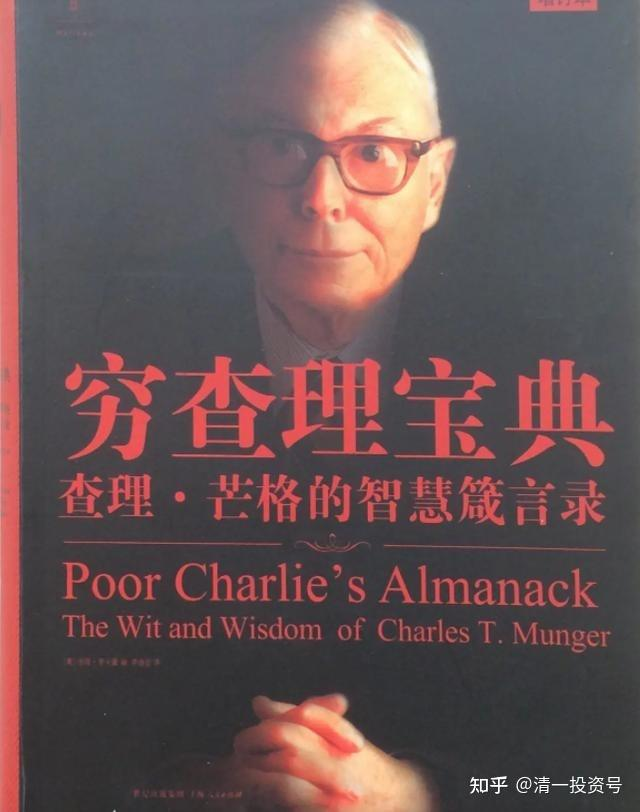

原专栏**[211篇.芒格智慧的少年女生解读](http://link.zhihu.com/?target=https%3A//xueqiu.com/9310099567/199252717)**

清一山长 2021年9月30日

清一大学 少年班

《小故事，大智慧》第六集

**女生班：罗琦&刘路**
小故事：

你们愿意听，我再讲两个小故事。下面这个故事是编出来的，但是很启发人。

一位年轻人去拜访莫扎特。他说：“莫扎特，我想写交响乐。”莫扎特说：“你多大了？”年轻人说：“我23。”莫扎特说：“你太年轻了，写不了交响乐。”年轻人说：“可是，莫扎特，你10岁的时候就开始写交响乐了啊。”

莫扎特说：“没错，可我那时候没四处问别人该怎么写。”还有一个关于莫扎特的故事。莫扎特可以说是人类有史以来最伟大的音乐天才。他的生活过得怎么样呢？莫扎特一肚子愤懑，郁郁寡欢，英年早逝。

莫扎特怎么活成了这样呢？他做了两件事，谁做了这两件事都足以陷入痛苦。莫扎特不知道量入为出，在金钱上挥霍无度，这是第一件。第二件，他内心充满了嫉妒和抱怨。谁要是挥霍无度，还充满嫉妒和抱怨，一定能活得又苦又惨，早早离开人间。想活的苦，想死的早，请学莫扎特。

那个年轻人请教莫扎特如何写交响乐，你们从这个年轻人的故事中也能学到一个道理。这个道理是：有的东西，有的人学不会。有的人天生就比你强，你再怎么努力，也总有人比你更强。我的心态是：“那又怎样？”我们现场的这些人，有哪一个是非得站上世界之巅不可的吗？没那个必要。
中文版：

说起这次智慧的由来还蛮有意思：上次想以莫扎特的故事来写个小智慧，由于段落的截取，我们以为这两个故事是真实的，于是就去查询“莫扎特的生平”，但却并没有发现像文中说的，莫扎特因为嫉妒别人，抑郁而死之类的。于是我们突然呆住了——故事好像是虚构的，那我们的大智慧该怎么写？

当初我们如此在意故事是真是假，但是，难道只有真实的故事才对我们有价值吗？只有真实的故事的道理才对我们学习和生活有帮助吗？如果不是，是编造的故事又有什么关系呢？似乎其实事实到底是怎样、故事是真是假并不重要，重要的是，我们从中能获得什么样的启示？

像我们现在学的《与神对话》，书中讲述的很多道理，只要去做，就能够帮助我们获得更加喜悦平和的生活。但很多人不去学习里面的智慧，反倒是竭尽全力证明里面的神”是假的，去怀疑尼尔是在自编自导。但这本书是编的又如何？难道里面讲的道理不正确吗？难道实践其道理不能够让我们更幸福吗？论证是真是假有何意义？我们将心思花在辨认真假这样无意义的事情上，反而会让我们忽略了书中的核心——向我们传递的智慧。

不光是“真”“假”，我们常常还会以“好”“坏”论事——日本是“坏”的，我们就不该学习日本，我们就要砸日产车，抵制日货……这些都是哪门子道理？就算我们觉得日本人曾经做了很多坏事，也不妨碍我们学习他们现在精益求精、遵守规则、礼貌待人等优良品质。其实，我们之所以会有这样的行为，是因为我们想要通过评判他人的方式，证明自己是最聪明的。假如我能够证明与神对话是假的，我就比尼尔更厉害！假如我抵制抵制日货，我就是最明智的！

但是用这种方式证明自己的聪明不见得很有效，就像在中国曾经有一阵抵制日货的热潮，有很多人砸日产车（很多其实是中国制造），其中的愚蠢不言而喻。再比如PK过后，若我们花大量的时间向裁判力辩解，想要证明自己比对手强，本质上并无法提升我们的实力，还只能向大家展示我们的小气。

关注“真假是非”，试图通过这种方式证明自己的聪明，而忽视核心，实则并非聪明之举；大智慧，不会将自己的时间精力耗在细枝末节上。若是舍本逐末，就好比大妈买菜砍价,因为菜贩子没有让那1毛钱,大妈很生气,没有买菜,饿了一天,进了医院……很搞笑！也很悲哀！

English version:

In fact, the origin of this story is quite interesting: once we wanted to write a wisdom from a story of Mozart, which we thought both story are real, so we went and serch "the life of Mozart", but had find out that he isn't like what had wrote in the article: something like jealous of others and did frustrated. We were shocked --the story might be invented, then how should we write our story?
At first we were so concerned about whether the story is true or false, but, are the stories suppose to be real in order to be valuable? Can only a true story help us in our study and life? If not, what does it matter if it's a fabricated story? It doesn't matter what the truth is, whether the story is true or false, what matter is what kind of inspiration can we get from it?

Like the book , which we are learning now, as long as we apply it, many of the principle in the book, can help us to achieve a happier and peaceful life. But many people didn't learn the wisdom inside, but instead try their best to prove that the "God" in the book is false, to suspect that Neil self-

directed the book. But what about the book? Isn't the wisdom right? Can't practicing the truth make us happier? What's the point of justifing the book? By thingking about the meaningless things like identifying the truth and false of the sotry, we ignore the core of the book, the wisdom that it conveys to us.

Not only is it "true" and "false", we often talk about "good" and "bad" - Japan is "bad", we should not learn Japan, we will smash Nissan cars, boycott Japanese goods ... What's the point of all this? Even if we feel that the Japanese have done a lot of bad things, it does not prevent us from learning the good qualities of excellence, rules and courtesy that they are now doing.

In fact, we do this because we want to prove that we are the smartest by judging others. If I could prove that talking to God was false, I would be better than Neil! If I resist boycotting Japanese goods, I am the wisest!

But proving your intelligence in this way is not always effective, as there was in China when there was a wave of resistance to Japanese goods, with many people smashing Nissan cars (many of which are actually made in China), and the folly is self-evident. For example, after PK, if we spend a lot of time to the referee to justify, want to prove that they are better than the opponent, in essence, can not improve our strength, but also to show you our smallness.

Trying to prove you're smart by focusing on "what's true and what's not" is not smart at all. Great wisdom does not waste its time and energy on details. It is like using silk to cover a donkey's skin. It is also like haggling over the price when buying vegetables. Because the vegetable dealer did not let the 10 cents, aunt was very angry, did not buy vegetables, hungry for a day, and went to the hospital... Very funny! Very sad too!

**蔡依君&李汶桔**

VER.CH

随着读这篇文章的次数增加，我们突然想到了一个问题：为什么巴菲特的名字出现了这么多次？好奇地去数了数，芒格竟然在分享中提了10次“沃伦”！这是什么概念呢？想象山长给我们上课，在大概40分钟内以很赞赏的态度提了10次某人的名字，足以说明山长非常欣赏这个人，不是吗？

不过巴菲特和芒格也确实是62年的老搭档和挚友了。虽然世人知道的更多是身为世界首富的巴菲特，但山长曾说过，他更欣赏芒格。因为芒格的建议，巴菲特才完成了投资理念的转型，如果用他曾经的理念，巴菲特将不会是现在的巴菲特。后来，芒格进入了巴菲特的公司，虽然是董事会副主席，但重要投资决策通常都是两人一起作出的，有人甚至说芒格才是伯克希尔真正的决策者。然而做出这么多巨大贡献的芒格并不出名，而在一些重要会议上一般也一言不发，一直是巴菲特在说话。

有没有发现芒格和巴菲特的友谊十分难能可贵？因为我们很难做到像芒格那样，对一个“似乎抢了自己功劳”的人不仅不嫉妒，还完全地支持。比如，当别人被选上作为代表去演讲的时候，你会不会希望站在台上发言的是自己？或者当你看到其他同学排名更高时，会不会不甘心？特别是你认为自己的水平不差时？起码于我而言，如果平日表现一般的同学作业排名比自己高，我就会很不爽，甚至觉得打分的人可能有点毛病。

然而芒格就能做到这一点，尽管他与巴菲特水平相当，甚至可能更胜一筹，但一个分享下来，他一直在对巴菲特表示支持和赞成。

但为什么我们没有办法做到这一点？不仅是因为我们比较自私，更重要的是，我们认为如果别人有了自己没有的，就会觉得是别人抢走了自己的东西。所以，我们不会想要去帮助和扶持别人，因为他有了，我就没有了。就像是当我们知道了助教的名额只有两个，我们就会觉得，只有把大家都给挤下去，这个机会才会是我的。

但是换个角度想想，别人的排名比自己高，说明他肯定有写得好的地方，如果我和他写得一样好，我的排名不就和他一样高了？其他人被选为代表上台演讲了，如果我和他一样有这么好的台风，不就也可以一起上台了？这么一想，好像也不是别人有了自己就没有了，这些东西我们都可以一起共同拥有。

是的，确实如此。别人的优秀不代表我就失去了什么，我也一样是优秀的，只是没有那么优秀，只是还缺少什么，当我拥有之后便可以一样优秀。甚至于，就算是我们没有获得最终的结果，比如成为第一，但也会有别的收获。比如和伙伴一起写小故事，我们可能会在意其中的分工占比。如果自己写的少，会觉得没能够展现自己的文采；如果写自己的多，则会觉得对方占了便宜。其实不管自己写多写少，双方的目的都是要写出一篇好文章。如果没能被选上，双方都尽力了，两个人都会有进步；如果被选上了，还超过了隔壁班级，最后这个团队得到的荣誉也会反馈到每个团队成员身上。就像我们看到好文章时，不会只看到是xxx，我们看到的是xx班的xxx&xxx。

相反，如果我们只抱有零和博弈的观念，比如我没成功就是别人在前面挡路，或者我没赚到钱就是因为别人抢了我的钱时，就没有办法与别人进行合作，只能孤军奋战，甚至于为了让自己获得最大利益而坑蒙拐骗，把别的人扯下去。而当社会上每个人都这么想的时候，所有人就会只顾自己、踩别人，踩来踩去，也踩不出一个最终的赢家，还把所有人踩的遍体鳞伤。

对于我们自己，如果不以共赢的角度去看待事物，只关注“自己”有没有得到最多，依旧还是中国大沙盘里的一粒小散沙。而如果人人都是散沙，即使有再多的沙，也无法合起来堆成一个坚固的沙堡。

VER. EN

As we read the article over and over, a question arose. Why did the name of Buffett appear so many times? Counting with curiosity, we discovered surprisingly that "Warren" was mentioned 10 times in the sharing! What is this concept? Just assume that someone’s name is mentioned 10 times by Principal Zhang in about 40 minutes! In class!! And in a very appreciative way!!! Don’t you think he appreciates the man pretty much?

In fact, Buffett and Munger have been partners and closest friends for 62 years. Although the world knows more about Buffett who is the richest man in the world, 山长 has said that he appreciates Munger more. It was because of Munger's advice that Buffett completed the transformation of his investment philosophy, which made him “the Buffett”. Later on, although Munger is the vice chairman of the company, but important decisions are usually made by both, some even say that Munger is the real decision-maker in Berkshire. However, Munger, who has made so many contributions, is not so famous. Even in some important meetings, it is usually Buffett who is talking, and Munger remains in silence.

Did you find the friendship valuable between Munger and Buffett? Because we can hardly do as Munger, be not jealous to a person who "seem to steal our own credit", but also completely supportive. For example, when someone else is chosen as a representative to give a speech, do you wish you were the one standing on the stage to speak? Or when you see other students ranked higher, will you be resentful? Especially if you think your level is not bad? For me, at least, I get upset if a classmate who normally performs worst ranks higher than I do on an assignment.

And yet Munger was able to do that, despite being on the same level as Warren Buffett(maybe even better), he kept showing his support and approval for Buffett in the sharing.

But why are we not able to do this? Not only because of our selfishness, but more importantly, we think that if someone else has what we don't have, we feel that someone else has taken it from us. So, we won't want to help and support others because if he has it, I don't have it. It's like when we learn that there are only two spots for TA, we feel that the only way to gain is to squeeze everyone out.

But think about it from another perspective, someone else's ranking is higher than your own, which means he must have written well. If I write as well as he does, wouldn't my ranking be as high as his? Others were chosen to speak on stage, if I can do as well as he does, can't I also go on stage together? When you think about it this way, you will understand that there’s possibility of win-win.

Yes, indeed. Other people's excellence does not mean that I have lost something, instead, I might lack of something. Even if we do not get the final result, but there will be other gains. For example, when we were writing a short story with our partner, we may care about the share of the work. If you write less, you will feel that you are not able to show your own literary talent; if you write more, you will feel that the other party has taken advantage of it. In fact, no matter how much one writes or how little one writes, both sides aim to write a good article. If it didn't get chosen, both sides tried their best and both will improve; if it got chosen and also surpassed the next class, the honor will be fed back to each team member in the end. Just like when we see a good article, we don't just see that it's xxx, we see that it's xxx&xxx of class xx.

On the contrary, if we have been holding the concept that as long as others have it, I do not have it, such as I did not succeed because someone blocked my way, I did not earn because others robbed my chance, we’ll never be able to cooperate with others, we can only fight alone. Even, in order to get the maximum benefit for themselves, they cheat and lie, in order to pull others down. And when everyone in society thinks in this way, this society will become a pile of loose sand, all only care about themselves, step on others, step back, and there will never be a winner.

For ourselves, if we don't see things from the perspective of win- win, and only focus on whether "we" have got the most, we will still be a small grain of scattered sand in the big sandbox of China. And if everyone is scattered sand, even if there is more sand, it can not be combined into a solid sand castle.

**尹心悦&刘芳菲**

**小故事**：关于炼金术士与聪明人的故事。

不要总是试图找到“更聪明”的答案，而是满足于最简单的道理，并把它实行出来。

几百年前，炼金术士幻想把铅变成金子。炼金术士想得很美，他们觉得买来大量的铅，施一下魔法，把铅变成金子，就发大财了。刚才说的这家投资公司，没比几百年前的炼金术士高明到哪去，它不过是妄想把铅变成金子的现代翻版，根本成不了。

**大智慧**：

看完炼金术士的故事之后，大家有没有产生一个疑惑？那就是：为什么有许多明显是常识的事情，还会有很多人违背呢？古代有成千上万炼金术士，一生都坚信他们终将点石成金，最后却大都死于贫困。而在今天，众人一边餐餐大鱼大肉晚晚加班迟睡还不运动，一边天天吞下许多药片和保健品，妄想靠这些保证他们的健康，最终还是痛苦地拖着病体跑去医院挨宰！

更匪夷所思的是，做出这些违反常识的事情的人，似乎有不少是那些比较聪明的那一批。比如我们都知道的、开创微积分、发现重力的牛顿，居然花了三十多年研究炼金术。这跟他花费在思考科学与数学定理的时间差不多，甚至更多！

为什么会出现这样不可思议的现象？是什么使得聪明人总是做出一些蠢事？其实很简单：因为他们太聪明了。聪明到不愿意走简单的路，总觉得前方肯定还有一条“聪明人走的路”等待着被发现。所以他们即使知道真相，他们的第一反应还是想要寻找更快、更聪明的捷径。就像炼金术士虽然知道每天工作能挣钱，但总觉得还有什么办法能够直接把铅变成金子，轻松躺赢走上人生致富之路。像现代人虽然知道健康的饮食和运动有益于健康，但总觉得吃那些原理难以理解的药丸和保健品更轻松，不必忍受运动节食之苦也能不生病。

这样的误区同样存在于我们的身上。比如，你是否曾经在备考的时候，苦恼于自己的分数无法提升，因此病急乱投医一般地到处报班、找老师和搜学习方法？你是否曾经在练习某个动作的时候，因为一直领会不到要领，因此四处问同学诀窍，甚至觉得自己永远无法练会这个动作？你是否曾经纠结自己的作业排名低，讨论的时候想不出观点，因此课下找老师和同学请教希望找到思维好的“黄金秘籍”，或者干脆破罐子破摔地在讨论时不说话了？

它们的错误是共同的：我们总是想要寻找那些可以弯道超车的捷径，殊不知这样只会更慢。很多时候，笨方法也是最有效的方法。例如在备考上，与其花大量时间学习技巧，不如提升自己的英语实力，轻松考高分。在运动上，与其问来问去，不如自己多练习，多体会。因为功夫并不是嘴上练出来的。在思维上，与其心急地马上想要成为班上思维最好的人，不如多提问、思考、总结。每次认真改进作业中存在的问题，积极参与讨论，思维自然会逐渐提升。

当然，不要总是试图找到“最聪明、最轻松”的答案，不代表我们要走入另一个极端：根本不思考方法，两眼摸瞎就往前冲。理性的分析在确定方向之前也是非常重要的，否则我们与一只无脑乱撞的苍蝇别无两样。但一旦我们的理性分析出了答案，无论它看起来是多么简单，我们都应该只要认定了方向就不动摇，坚定地往前走下去！不要自作聪明地说：“看，那多么简单，肯定还有更好的办法吧？”

最后总结，我从这个故事中得出的智慧就是：不要总是想找“最聪明”的捷径，满足于简单朴实的道理，并把它实行出来，往往更有效！

**英文版：**

Of course what they were looking for is the equivalent of the alchemists of centuries ago who wanted to turn lead into gold. They thought if you could just buy a lot of led and waive your magic wand over and it turned into gold, that would be a good way to make money. This counseling shop was looking for the equivalent of turning lead into gold and of course it didn’t work.

After reading the story of the alchemists, most of you may have a question: why are there so many people who deny things that are obviously common sense? There were thousands and thousands of alchemists before, spending all their lives convinced that they would eventually turn lead into gold.

Ironically, most of them died of poverty. In present days, people continue to eat excessive fatty meat every meal, work overloaded and sleep late every night, and they don‘t even exercise. But in the meantime, they take loads of pills and health care products every day, thinking that this can guarantee their health, eventually, they found themselves painfully dragging their sick body to the hospital to be ripped off!

What's even more surprising, is that the people who deny common sense seem mostly to be the ‘smarter ones’. For example, Newton, who we all know, who pioneered calculus and discovered gravity, has been studying more than thirty years studying alchemy. It's about as much time as he had spent on studying the science and mathematical theorems, or more!

Why does this incredible phenomenon happen? What makes a smart man always do stupid things? It's simple: because they're too smart. Smart enough not to take the simple road. They always think that there must be a "smart man's road" ahead waiting to be discovered. So even if they knew the truth, their first reaction was to look for the faster, smarter shortcuts. Just as although alchemists know that they can make money by working every day, but still feels that there must be some way to earn easier. Like directly turning lead into gold, so they can win easily and ’lie down on the road to prosperity‘. And as modern people, though aware that a healthy diet and exercise are good for their health, they always find it easier to take pills and health products with confusing theories, so that they are free of having to endure sweating and diet change.

Such misunderstanding also exists in us. For example, have you ever been preparing for an exam when you are distressed that your scores won’t improve, so that you desperately report classes, runs for teachers, and search learning methods? Have you ever practiced a movement over and over again, and because you haven’t been able to grasp the point so that you ask classmates all around you for instructions and even feel that you will never master the movement? Have you ever been anxious with your low homework ranking, anxious when you can’t think of ideas when discussing so that you find teachers and classmates to ask for a ‘golden secret’ of developing thinking abilities? Or just simply give up and stop engaging in the discussions?

The mistakes are common: we always want to find shortcuts so that we can surpass others quickly, but in fact, it's only going to be slower. Stupid methods are also the most effective methods many times. For example, when preparing for an exam, rather than spending a lot of time learning the techniques of examining, we should improve our English ability, getting high scores easily. In sports, rather than asking questions, it is better to practice more. For Kung fu is not practiced on the mouth. In learning, rather than anxiously wanting to become those people with the best thinking abilities in class, it is better to ask more questions, think more, and summarize more. Every time we improve the problems in our homework, every time we actively participate in discussions, our abilities will naturally improve.

Of course, not always trying to find the ‘smartest and easiest’ answer doesn't mean we're going to go to the other extreme: not thinking about our plans at all and just charging ahead blinded. Rational analysis is also very important before we determine our direction and method. Otherwise, we are no different them a brainless fly. But once our rational analysis forms the answer, no matter how simple it seems, we should just determine our direction and firmly go forward! Don't try to be smart and say, "Look, how easy is that. There's definitely a better way.”

Finally, what I’ve learned from this story is: don't always try to find the ’smartest‘ shortcut, be satisfied with the simple and plain truth and put them out! This is often more effective!
