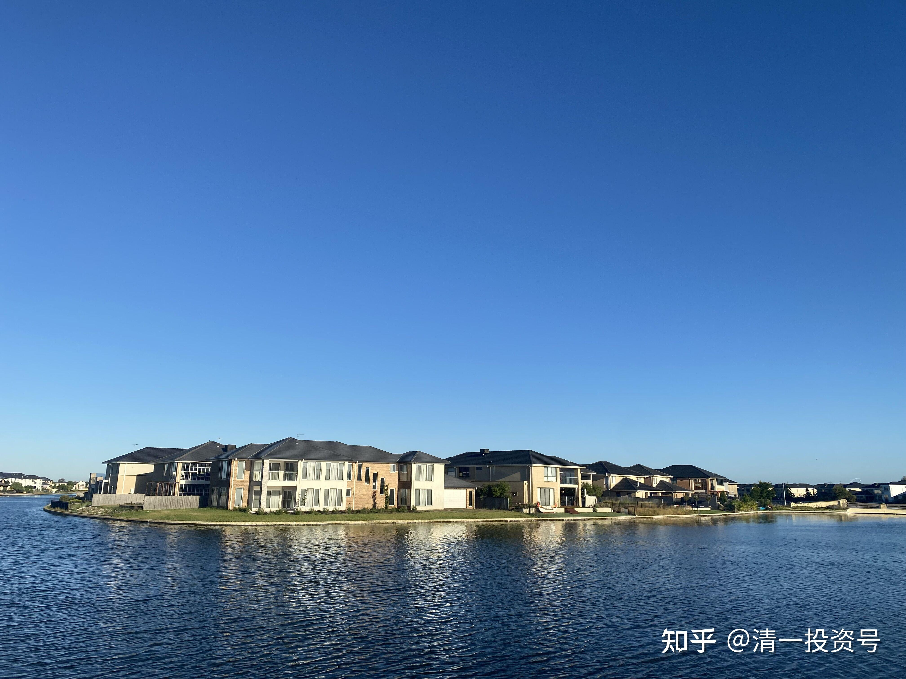
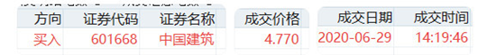
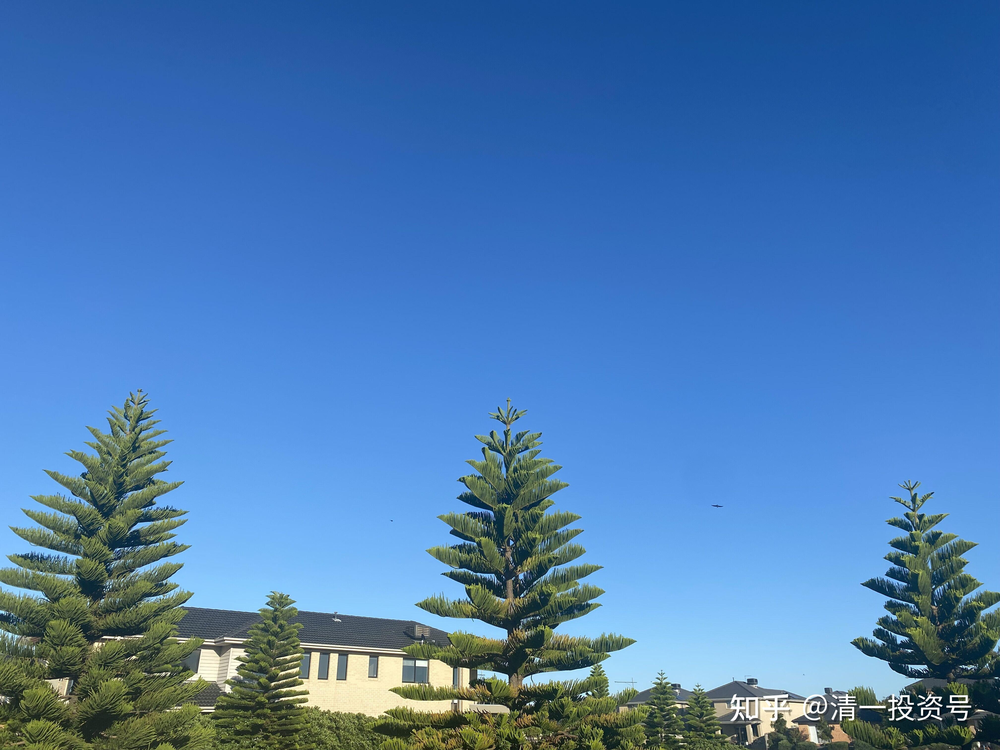
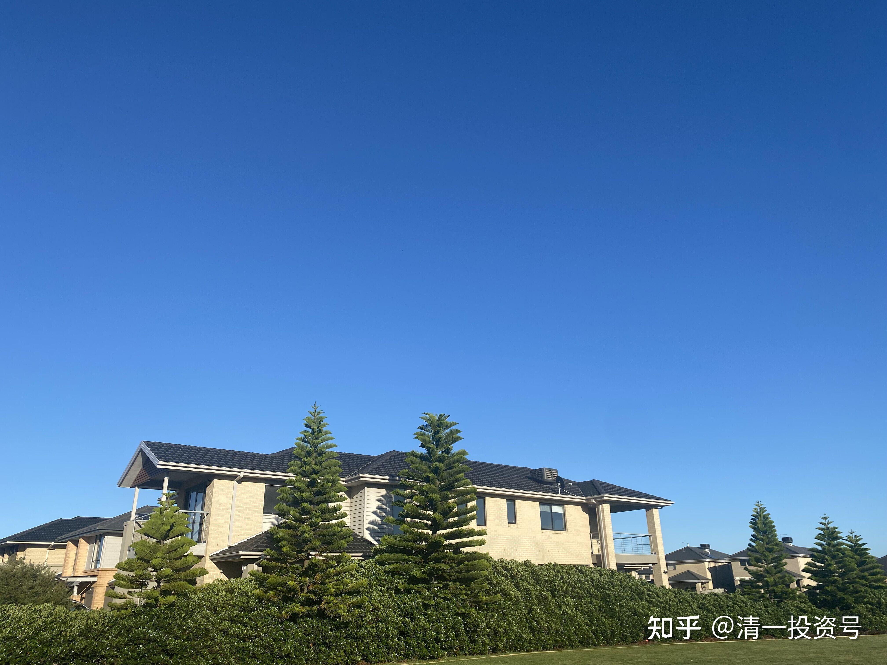

原47篇.中国建筑对话录：不养独子

清一山长 2020年7月2～3日

清一山长雪球非专栏帖子整理文章 第47篇《中国建筑对话录：不养独子》

[晕娜](http://link.zhihu.com/?target=https%3A//xueqiu.com/n/%25E6%2599%2595%25E5%25A8%259C)· 2020-07-01 14:07

**分红再投（备查）**

**【注】**：投资中建6年了，吃股息7次了。

**【结语】**：还是那句老话，每年业绩创新高、分红创新高，吃股息就挺好，这就能养老。[$中国建筑(SH601668)$](http://link.zhihu.com/?target=http%3A//xueqiu.com/S/SH601668)

[清一山长](http://link.zhihu.com/?target=https%3A//xueqiu.com/9310099567)2020-07-02 14:05

很赞！

[晕娜](http://link.zhihu.com/?target=https%3A//xueqiu.com/1845773477)2020-07-02 14:44回复[清一山长](http://link.zhihu.com/?target=https%3A//xueqiu.com/n/%25E6%25B8%2585%25E4%25B8%2580%25E5%25B1%25B1%25E9%2595%25BF)：

市净率：0.80

[清一山长](http://link.zhihu.com/?target=https%3A//xueqiu.com/9310099567):回复[晕娜](http://link.zhihu.com/?target=https%3A//xueqiu.com/1845773477)2020-07-02 14:57

你的中建资料和说明，是我这段时间不断买入，超仓买入（个人而言）的重要支撑。感谢！0.8PB，是个重要的分水岭。

[清一山长](http://link.zhihu.com/?target=https%3A//xueqiu.com/9310099567)2020-[07-02 15:05](http://link.zhihu.com/?target=https%3A//xueqiu.com/9310099567/152865983)

[$中国建筑(SH601668)$](http://link.zhihu.com/?target=http%3A//xueqiu.com/S/SH601668)两天就完美填权。仅需两天，就把跌了七周的失地全部收复。慢慢跌，磨的是持有人的耐心和信心，给的是有心人买入的机会。感谢中建，给了我好几周的安全建仓时间，虽然仓位满到不好意思再买，不然就觉得我太贪婪了。但我依然不愿意它现在就太早开涨。我最理想的配置，是一个月之后，中建再开始涨。这样我在酒类的大仓位，就可以全换建筑了，现在有点头痛，酒类大涨了换啥？如果找不到换的，就只好死拿持仓当酒鬼，现金不想拿。全球放水，现金可能不太值钱了。

啤酒今天看盘：珠江明显出货痕迹，但控制良好，主力不想下杀出货，未来随消费潮流上涨应该问题不大。燕京啤酒走势非常稳健、良好。惠啤酒泉也走势良好，有机会。未来都会很好，继续守望中。

[晕娜](http://link.zhihu.com/?target=http%3A//xueqiu.com/n/%25E6%2599%2595%25E5%25A8%259C)回复[清一山长](http://link.zhihu.com/?target=http%3A//xueqiu.com/n/%25E6%25B8%2585%25E4%25B8%2580%25E5%25B1%25B1%25E9%2595%25BF)：

0.70xPB之下，累计只有21个交易日。只出现过一次，是在2014年6月分红除权后。当时对应股息率：4.72%。

[清一山长](http://link.zhihu.com/?target=https%3A//xueqiu.com/9310099567)[2020-7-02 16:28](http://link.zhihu.com/?target=https%3A//xueqiu.com/9310099567/152875460)回复[晕娜](http://link.zhihu.com/?target=http%3A//xueqiu.com/n/%25E6%2599%2595%25E5%25A8%259C)：

市场这东西，低估起来，会低估了又低估，地狱下面还挖个地下室，涨起来也一样，刷新了又刷新。总是超出人的意料，才不管你的历史数据。“相信数据”也会投资失落，只有“守望”才有希望。“守”住自己的投资原则，“望”着远处中建必定会去的高山。至于路径？峰回路转？随它去吧，想咋走就咋走。反正你是0.7PB不卖中建，0.5PB也不卖中建，1.2PB还是不卖中建。所以，我们的中建投资方程式就是：0.5PB=1.2PB。糊涂账，糊涂算，也许这样算账更安心。

[就不帅](http://link.zhihu.com/?target=http%3A//xueqiu.com/n/%25E5%25B0%25B1%25E4%25B8%258D%25E5%25B8%2585)回复[清一山长](http://link.zhihu.com/?target=http%3A//xueqiu.com/n/%25E6%25B8%2585%25E4%25B8%2580%25E5%25B1%25B1%25E9%2595%25BF)：

给一个目标本轮上涨见到20元[清一山长](http://link.zhihu.com/?target=https%3A//xueqiu.com/9310099567)[2020-7-02 16:39](http://link.zhihu.com/?target=https%3A//xueqiu.com/9310099567/152876549)回复[就不帅](http://link.zhihu.com/?target=http%3A//xueqiu.com/n/%25E5%25B0%25B1%25E4%25B8%258D%25E5%25B8%2585):

20元嘛！肯定没问题的。到2030年，应该有机会。本周之内，您只要给我6.5元，我就全倒给你了！剩下的14元，都是您的。

[晕娜](http://link.zhihu.com/?target=http%3A//xueqiu.com/n/%25E6%2599%2595%25E5%25A8%259C)回复[清一山长](http://link.zhihu.com/?target=http%3A//xueqiu.com/n/%25E6%25B8%2585%25E4%25B8%2580%25E5%25B1%25B1%25E9%2595%25BF)：

您是想说，股市里，红烧头尾的钱好挣。对吧？没意见，赞同！资本都是逐利的，由风险高的地方，向风险低的地方流动的。

[清一山长](http://link.zhihu.com/?target=https%3A//xueqiu.com/9310099567)[2020-07-02 17:05](http://link.zhihu.com/?target=https%3A//xueqiu.com/9310099567/152879234)回复[晕娜](http://link.zhihu.com/?target=http%3A//xueqiu.com/n/%25E6%2599%2595%25E5%25A8%259C)：

是。

说个笑话：如果股票是情人。历史数据，就是提醒你要特别珍惜0.7PB时候的中建小情人，因为她愿意以这种彩礼，就与你私奔了。平常她的门槛太高，娶她进门也不容易。你这次以4.77元的价格娶她入门，就是你懂得珍惜中建。但将来，小情人可能不安心，到处显摆，有豪门大户高价求你转让，你也不妨高风亮节，忍痛出让挚爱，让她嫁给豪门，去过幸福生活。因为你知道放手也是一种爱，也要珍惜放手的机会。因为这种时候，相对也一样难得。我在2016年以11.35含泪卖出中建，也一样不舍（拿着一只热门股，万众热捧的概念股，内心成就感多好呀！就像今天有人没拿茅台，就觉得自己不配炒股一样），**高PB时刻，也要克服自己的贪恋，要学会放手，果断回归平淡。**这似乎更难得做到。**两者都难，因为难，所以头尾都美好！**

[晕娜](http://link.zhihu.com/?target=https%3A//xueqiu.com/1845773477)2020-07-02 17:15回复[清一山长](http://link.zhihu.com/?target=http%3A//xueqiu.com/n/%25E6%25B8%2585%25E4%25B8%2580%25E5%25B1%25B1%25E9%2595%25BF)

跟中建的走势的确很像，跌了五年。

中建是横盘了五年，不是跌了五年。

中铁、铁建、交建，都是跌了五年。

[清一山长](http://link.zhihu.com/?target=https%3A//xueqiu.com/9310099567)2020-07-02 17:20回复[晕娜](http://link.zhihu.com/?target=https%3A//xueqiu.com/1845773477)：

本轮买入，我还有一个核心逻辑，就是后疫情时代，中建可能更值得拥有。因为我算不清疫情会怎样影响经济和身边的环境，更算不清如果世界金融危机，影响到企业的盛衰。未来几年的经济不好，喝酒的人还会这么多吗？买手机的人会减少吗？会去旅游吗？甚至私立学校的学费，会有人放弃交钱吗？交通建设会继续有大量订单吗？这些我都不知道，所以都是暗雷。感觉现在到处都是雷！但只有中建，似乎性质最简单，好算帐。它似乎是很难得的【疫情无影响概念股】，就是您说的“长期稳增长”。2020能够有10%稳增长，已经是太难得了。能有5%我都会满意极了，因为我判断大多数企业，今年明年都会“负增长”。

[投月资产](http://link.zhihu.com/?target=http%3A//xueqiu.com/n/%25E6%258A%2595%25E6%259C%2588%25E8%25B5%2584%25E4%25BA%25A7)回复[云中](http://link.zhihu.com/?target=http%3A//xueqiu.com/n/%25E4%25BA%2591%25E4%25B8%25AD)：

这个山长只是个中短线炒家，你确定跟他？

[清一山长](http://link.zhihu.com/?target=https%3A//xueqiu.com/9310099567)[2020-07-02 17:31](http://link.zhihu.com/?target=https%3A//xueqiu.com/9310099567/152881740)回复[投月资产](http://link.zhihu.com/?target=http%3A//xueqiu.com/n/%25E6%258A%2595%25E6%259C%2588%25E8%25B5%2584%25E4%25BA%25A7)：

中建你们要跟的大V是[晕娜](http://link.zhihu.com/?target=http%3A//xueqiu.com/n/%25E6%2599%2595%25E5%25A8%259C)[猪先生666](http://link.zhihu.com/?target=http%3A//xueqiu.com/n/%25E7%258C%25AA%25E5%2585%2588%25E7%2594%259F666)等，别跟我。强烈推荐各位球友读读他们的投资逻辑，我都是跟他们的。我是上个月才投机进入本轮的中建新人。

[方大虎](http://link.zhihu.com/?target=http%3A//xueqiu.com/n/%25E6%2596%25B9%25E5%25A4%25A7%25E8%2599%258E)回复[清一山长](http://link.zhihu.com/?target=http%3A//xueqiu.com/n/%25E6%25B8%2585%25E4%25B8%2580%25E5%25B1%25B1%25E9%2595%25BF):

看来山长对情人转让很熟练啊！

[清一山长](http://link.zhihu.com/?target=https%3A//xueqiu.com/9310099567)[2020-07-02 17:32](http://link.zhihu.com/?target=https%3A//xueqiu.com/9310099567/152881813)复[方大虎](http://link.zhihu.com/?target=http%3A//xueqiu.com/n/%25E6%2596%25B9%25E5%25A4%25A7%25E8%2599%258E)：

**我不跟股票谈恋爱！**

[晕娜](http://link.zhihu.com/?target=https%3A//xueqiu.com/1845773477)2020-07-02 17:33回复[清一山长](http://link.zhihu.com/?target=http%3A//xueqiu.com/n/%25E6%25B8%2585%25E4%25B8%2580%25E5%25B1%25B1%25E9%2595%25BF)：

疫情，对所有行业都有影响，影响大小的事。个人看法，对建筑业央企，影响不大。另外，国家政策面对建筑业，尤其是基建方面，政策倾斜力度还是很大的（说的是央企，民企不了解，不好说。）。

[一切有道](http://link.zhihu.com/?target=https%3A//xueqiu.com/7931021123)回复[清一山长](http://link.zhihu.com/?target=http%3A//xueqiu.com/n/%25E6%25B8%2585%25E4%25B8%2580%25E5%25B1%25B1%25E9%2595%25BF)：

现金不想拿？山长您之前不是说不大看好下半年，个股要见好就收留出弹药吗？

[清一山长](http://link.zhihu.com/?target=https%3A//xueqiu.com/9310099567)2020-07-02 17:36回复[一切有道](http://link.zhihu.com/?target=https%3A//xueqiu.com/7931021123)：

谁说的，我留了现金，很多现金。泰国割了一轮韭菜，现在基本全兑现了。我等变盘。中国的钱，就不敢留在手中了。因为我每一次回国，都发现周围的一切都在涨价。泰国似乎千年不涨的样子，街上的东西总是一个价（除了房价）。

[清一山长](http://link.zhihu.com/?target=https%3A//xueqiu.com/9310099567)2020-07-02 17:44回复[晕娜](http://link.zhihu.com/?target=https%3A//xueqiu.com/n/%25E6%2599%2595%25E5%25A8%259C)：

我观点一样：疫情将改变世界。未来风险因素太多，现在寻找不会跌的避险标的很困难。上涨我就不期待了。

中建最重要的，就是在手订单就足够三年的缓冲了。就算国家不给特别的支持，也不会太影响业绩。国家如果给政策，是保底了未来五年以上的稳增长。其他几个“建”就难说（不知道稳不稳）。小公司，今明两年，会倒下一大批的。

[一切有道](http://link.zhihu.com/?target=https%3A//xueqiu.com/7931021123)回复[清一山长](http://link.zhihu.com/?target=http%3A//xueqiu.com/n/%25E6%25B8%2585%25E4%25B8%2580%25E5%25B1%25B1%25E9%2595%25BF)：

山长，现在牛市声音鹊起，请问您看好今年A股走牛吗？我心疑惑较大。因为美股高起甚至有创新高势头，然而美国疫情却比美股一开始崩盘时严重了很多倍，叠加种族歧视风波，美国经济必定大不如前，所以经济和股市不相匹配，美股岌岌可危，如果下半年美股崩盘，A股也不能独善其身吧！

[清一山长](http://link.zhihu.com/?target=https%3A//xueqiu.com/9310099567)2020-07-02 18:00回复[一切有道](http://link.zhihu.com/?target=https%3A//xueqiu.com/7931021123)：

我又不是养牛的，咋知道牛市在何处？你还是去问五年前12元买中建的人，他们知道牛在哪儿。你找前几天4.77元卖中建的人，他们也知道熊在哪儿。我啥都不知道。[晕娜：](http://link.zhihu.com/?target=https%3A//xueqiu.com/1845773477)回复[清一山长](http://link.zhihu.com/?target=http%3A//xueqiu.com/n/%25E6%25B8%2585%25E4%25B8%2580%25E5%25B1%25B1%25E9%2595%25BF)：

中建，利润后置，很明显（山兄如果需要，我可以提供数据）。投资首要的是不能踩雷，这个事太大。

山兄：其实我想表达最重要的观点，上半年，喝酒、吃药、酱油、科技，都疯炒一轮了，下半年，还能疯到什么程度再告一段落？板块轮动，哪里是热点？山兄是老江湖，我就不多说什么了。

[清一山长](http://link.zhihu.com/?target=https%3A//xueqiu.com/9310099567)2020-07-02 18:28回复[晕娜](http://link.zhihu.com/?target=https%3A//xueqiu.com/n/%25E6%2599%2595%25E5%25A8%259C)：

谢谢，数据我就不看了。你看了中建6年，相信你比我自己去看数据更靠谱，我就偷懒了。

中建的确利润后置，地产以及PPT等项目，都有这个特征。我还认为中建藏了一些利润，不过没明确的证据，可能在研发费里面，或者坏账计提准备金里面。以后开始释放利润了，就是该走的时候了。今年有些银行得到通知，削减红利，这些都是上头不鼓励“炒”的迹象——现在还不是大盘动的时候。该动的时候，中建会当仁不让的。我甚至猜想：中建可能是国家队未来示范走势的先锋官。

至于短期热点怎么切换，下半年谁上？我还真算不出来。我只有最笨的办法：找到一个未来热点必经的大坑，比如中建这种五年的坑，先把自己埋起来，装死，然后等热点到来。

[晕娜](http://link.zhihu.com/?target=https%3A//xueqiu.com/1845773477)2020-07-02 19:04

中建涨跌，跟标题内容关联度不大。

上半年疯炒过后的高风险股，下半年是否也该转换到低风险股了，跟这个关联度较大。[$基建工程(SZ165525)$](http://link.zhihu.com/?target=http%3A//xueqiu.com/S/SZ165525)看看这个指数吧，下半年伊始，连开两枪了。

[清一山长](http://link.zhihu.com/?target=https%3A//xueqiu.com/9310099567)2020-07-02 19:09

**中建有连跌五年就上涨的周期性规律吗？**

来自[清一山长的雪球原创专栏](http://link.zhihu.com/?target=https%3A//xueqiu.com/9310099567/column)

[$中国建筑(SH601668)$](http://link.zhihu.com/?target=http%3A//xueqiu.com/S/SH601668)本轮，我买入[中国建筑](http://link.zhihu.com/?target=https%3A//xueqiu.com/S/SH601668%3Ffrom%3Dstatus_stock_match)的投资逻辑，不是看简单的报表和历史数据、估值等因素来买的，而是主要看中建的“历史周期规律”来买的。**一般在股票的这种周期性规律上，又会叠加股票的内在价值估算，低估极限位置等。两者如果叠加到一起了，我认为就是最好的买入机会，我就敢大仓买入这种股票了，也敢大胆介绍其他人买入中建。赢的概率极高，持有被折磨的时间也最短。**这就是最近几周我做的事情，不断买入中建（这就是我自称**“价值投机派”**的意思，我**在价值计算的基础上，叠加趋势和市场的周期影响因素，选择最佳的市场趋势变动机会，实际介入标的（买入或者卖出）。**

我观察到的中建，似乎存在五年一个大涨跌周期的运行规律，它一般会开涨后连跌五年，不断创造估值新低。然后，来一个快速的估值修复，大涨一两年。然后，又继续慢慢的，继续跌五年，让持有者空欢喜一场。全靠企业的内在价值不断增长，来勉强弥补投资者的失落。中建上市是2009年，一直到2014年，这五年，中建无论价格还是估值，都是一年比一年低。价格2009年的高度7.98元，2014年创新低，2.71元，跌了一大半。尽管每年中建的收益和利润均在大幅增加，但无论价格还是估值，五年来就是不断创新低的过程，这五年坚持持有中建的人，可能哭都哭不出来。假如上市就持有中建，五年后没有赚钱还赔钱。只能每天安慰自己拿了股息，过过日子，数数股票一股没少，就算了。所以，长持中建的收益，远远不如跟随它走大周期，高估就卖出，反复进退的收益高。

2014年下半年，中建迎来估值修复，很快就涨了一倍多。我很幸运，在2014年年中，3元多一点买入中建的，一买就是除了银行股之外的最重仓。当时市场上种种质疑中建，不看好中建的声音。我买入后不到半年，居然就开始涨了，套的时间并不长。最终我在2015年，10元以上全部逃走了（没能在最高点12元走掉）。2016年5元再度买进，年底11.35元再度跑掉，这回几乎是最高点走的。后来奉行破五就买的策略，又进出了几次，仓位不算大，赚点小钱就走了。算算我持有中建的时间，基本上没有超过半年，就一定涨一次，我把走掉的资金用于干其他的事情，不跌回五元就是不回头。但中建一直给我回头的机会，一直到现在。估计以后不会有破五的了。

最近五年的走势（2015年年中至2020年年中），中建无论是不除权的价格，还是复权的价格，都是一直在创新低的，4.77元，就是五年来的最低价。更别说估值的低估了，不断刷新和考验持有人的信心和耐心。虽然这五年，我一直宣称“破五就买”，做了好几个来回。但最近一个月的破五，估值才是最低的。比2016年的破五，以及2017年的破五，估值都要低得多。很像是2014年的局面，一直在跌，所有看好中建的人都不断被打脸。我认为，正因为这样，中建的最佳买入时间已经到来了。这个股，今年正好达到一个大周期性的极限底部了（中建的五年周期性规律）。所以，我这一次买入的中建，仓位最大，买入的信心也最强，安全感最高。五年的上涨周期来到，套了也就最多套半年，干嘛不买？难得的投资、投机双重机会。也许，大周期就要启动了，戴维斯双击就在眼前。本轮如果启动的话，我就不会6元以上就跑掉了。如果中建重复过去的经验，涨幅最低也会有一倍。我要开始学长持了，坚持到2030年（不排除快速的大涨还是会跑的，我有大涨恐惧症），但保证会至少持有100万股不动。等着看【[中国建筑](http://link.zhihu.com/?target=https%3A//xueqiu.com/S/SH601668%3Ffrom%3Dstatus_stock_match)2030悬念】[@晕娜](http://link.zhihu.com/?target=http%3A//xueqiu.com/n/%25E6%2599%2595%25E5%25A8%259C)预测的，中建万亿市值的实现（好像是中建管理层在2030年规划中提出来的）。

**古人云：万事万物，盈虚[有道](http://link.zhihu.com/?target=https%3A//xueqiu.com/S/DAO%3Ffrom%3Dstatus_stock_match)，否极泰来。没有绝对的破股，也没有绝对的好股。**茅台好到极处，可能会带来不好的结果。中建连跌了五年，烂股票烂了五年，可能会变身好股票了。就是差不多否极了？下面的“泰”就要来了？**根据西方的方程式和电脑算账，不如用中国道家的思维方式，用能量的转动变化周期来说明，更容易理解！中国的五和七，都是一个奇妙的数字，代表自然和周期的变化循环。**

本轮买入，我还有一个核心逻辑，就是后疫情时代，中建更值得拥有。因为我算不清疫情会怎样影响经济和身边的环境，更算不清会怎样影响到企业的盛衰。未来几年经济不好，喝酒的人还会这么多吗？买手机的人会减少吗？会去旅游吗？会卖更多空调吗？甚至私立学校的学费，会不会有人放弃交钱？这些我都不知道，所以都是暗雷。到处都是！但中建似乎最简单，好算。它似乎是很难得的【**疫情无影响概念股**】。您还能找到第二家这种【**疫情和金融危机无影响股**】吗？

[清一山长](http://link.zhihu.com/?target=https%3A//xueqiu.com/9310099567)2020-[07-02 21:22](http://link.zhihu.com/?target=https%3A//xueqiu.com/9310099567/152898276)

养一个独子，要寄托全部的心血，操心太大，真不容易！

我觉得不如**多养几个不同类型的儿子，只要优秀就行，不一定“十项全能，都最优秀”。不需要是全才，太难遇到。东方不亮西方亮。这样做，起码心不累！**

另外，**养老要求不高，很容易实现。但要对得起自己手中代管的金钱，让金钱在我不需要养活的时候，依然能够发挥帮助别人的价值。这就需要敬畏市场，敬畏的方式，就是永远认为自己的判断可能是错的。所以，我永远不敢只重仓一只股。我对自己的信心很不足。**

[好拉投资](http://link.zhihu.com/?target=https%3A//xueqiu.com/haola)回复[晕娜](http://link.zhihu.com/?target=https%3A//xueqiu.com/1845773477)：

当初买入中国建筑，认为它是基建股，后来发现原来是地产股。

我当年为什么要投资中建，这说起来话就长了。

[晕娜](http://link.zhihu.com/?target=https%3A//xueqiu.com/1845773477)2020-07-02 23:54回复[好拉投资](http://link.zhihu.com/?target=https%3A//xueqiu.com/n/%25E5%25A5%25BD%25E6%258B%2589%25E6%258A%2595%25E8%25B5%2584)：

哈哈！当年中建推出第一期限制性股权激励，我认真研究了中建三个月，决定开始投资他。

当年，也没有打算长期投资中建。长期投资中建，是后来慢慢对中建有了更多的了解后，才做的决定。

中建是个大金矿，我的认知，也是个慢慢认识的过程，慢慢积累的过程。

晕娜2020-07-03 18:09回复[清一山长](http://link.zhihu.com/?target=http%3A//xueqiu.com/n/%25E6%25B8%2585%25E4%25B8%2580%25E5%25B1%25B1%25E9%2595%25BF):

中建股价严重低估时，我多推介一下中建的价值，就是这个意思吧！换言之，我现在持有的要是茅台，我一定会闭嘴的。就是这么个道理吧！山兄可能误会了。

[清一山长](http://link.zhihu.com/?target=https%3A//xueqiu.com/9310099567)2020-07-03 18:29回复[晕娜](http://link.zhihu.com/?target=http%3A//xueqiu.com/n/%25E6%2599%2595%25E5%25A8%259C):

我原来就说过，以后牛市来了，我就退出雪球了。道理跟你一样的，不想在股神遍地的时候出来说话。中建ROE15%，现价持有，你的资金实际享受20%的ROE。就算千年不涨，你当然也千年不卖。如果3PB你再持有它，相当于当时您的资金，只有5%的实际ROE。我才不相信你会坚持继续持有3PB的中建来“养老”的。你持有的标的，如果没有10%的内涵增长率，你不会接受的。当然，是在你找得到10%以上增长率的备胎情况，周边都找不到更好的标的。当然只好继续持有，博傻算了。我很关心资产实际的回报率，而不是涨幅。所以，我不会买茅台。因为，就算买了茅台也早卖掉了。所以，当不了股神！

晕娜2020-07-03 18:40回复[清一山长](http://link.zhihu.com/?target=http%3A//xueqiu.com/n/%25E6%25B8%2585%25E4%25B8%2580%25E5%25B1%25B1%25E9%2595%25BF):

在十多年前，我58元买过茅台，也没挣几个钱，就跑路了。当时对价值的理解还很生疏。中建，未来股价定位，与它的分红率正相关。十年后，分红率要是跟法国万喜接轨（分红率50%），股价定位在3XPB，也是合理的。山兄，可不要低估我对中建的野心呀！哈哈！

[清一山长](http://link.zhihu.com/?target=https%3A//xueqiu.com/9310099567) 2020-07-03 19:05· 来自雪球回复[晕娜](http://link.zhihu.com/?target=http%3A//xueqiu.com/n/%25E6%2599%2595%25E5%25A8%259C):

【分红率50%，股价定位在3XPB也是合理的】

如果中建届时你只拿到了15%ROE的六分之一，区区2.5%的股息，比现在的股息率还低，这点钱就把你收买了？额，你要求的确太不高了。也许您应该多看看世界给您提供的机会。

几个月前，我买了一只泰国房地产股——LPN，PE3倍，PB0.4倍，价格3.6B，我买了3个多M的仓位。买后一个月，年度分红，每股分了1.5B。按照我的买价，大约是40%的分红率（年度分红）。分红前就大涨，分红后没多久，我就卖掉了这个股，是5.5-6.0B卖掉的。原因就是：我不懂为啥涨这么多。短期内就赚了接近一倍，很满意了。卖掉的价格，1PB都不到。今天又跌到4.58B了，还是三倍多的PE。一年前的价格，8B多。2018年价格，13B。每年都分红，最低的一年是0.5B。我的价格买入，最差的年份也有15%的分红，最好的年份40%以上。我想：就算是8B买的它，分红今年也有快20%了。你喜欢分红吃息，干嘛不买4B的这只股？而要坚持抱3PB分红2.5%的中建？真谈上恋爱了吗？

晕娜2020-07-03 22:22回复[清一山长](http://link.zhihu.com/?target=http%3A//xueqiu.com/n/%25E6%25B8%2585%25E4%25B8%2580%25E5%25B1%25B1%25E9%2595%25BF):

（1）茅台分红率50%，市净率是多少？（茅台：市净率：12.99）

（2）十年后，中建PPP进入运营的权益资产，应该会超过1万亿元，ROE只有15%？ 山兄：我说的是十年后，不是明年。

[清一山长](http://link.zhihu.com/?target=https%3A//xueqiu.com/9310099567)2020-07-03 22:35回复[晕娜](http://link.zhihu.com/?target=http%3A//xueqiu.com/n/%25E6%2599%2595%25E5%25A8%259C):

10年后的3PB，股价大约是80～90元吧！真有这一天，恐怕我真守不住。

晕娜2020-07-03 22:57回复[清一山长](http://link.zhihu.com/?target=http%3A//xueqiu.com/n/%25E6%25B8%2585%25E4%25B8%2580%25E5%25B1%25B1%25E9%2595%25BF):

2030年：中建净利润在1200～1600亿元之间。

届时股价定位，就看分红率是多少了。

我置顶的帖子里，都有说。置顶帖子，未来十年不更改。

中国建筑：2030年悬念[网页链接](http://link.zhihu.com/?target=https%3A//xueqiu.com/1845773477/131037914)。

