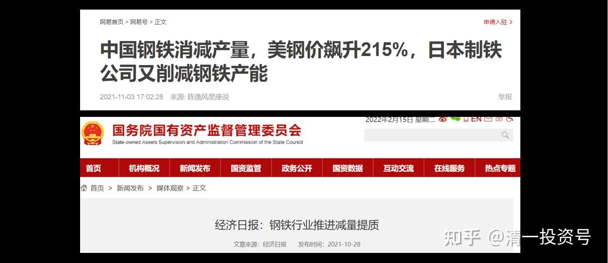
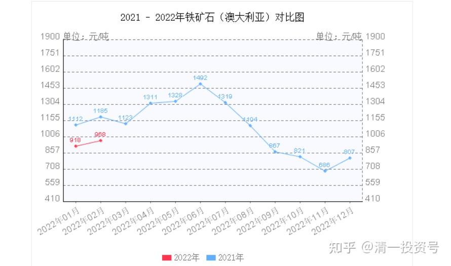

*降低钢铁产能相关信息*

**14篇.从产量中心向利润中心转变——降低产能的聪明决策**

清一山长 2021年5月-10月

[爱学习的井底之蛙](http://link.zhihu.com/?target=http%3A//xueqiu.com/n/%25E7%2588%25B1%25E5%25AD%25A6%25E4%25B9%25A0%25E7%259A%2584%25E4%25BA%2595%25E5%25BA%2595%25E4%25B9%258B%25E8%259B%2599%2522%2520%255Ct%2520%2522_blank):回复[清一山长](http://link.zhihu.com/?target=http%3A//xueqiu.com/n/%25E6%25B8%2585%25E4%25B8%2580%25E5%25B1%25B1%25E9%2595%25BF%2522%2520%255Ct%2520%2522_blank):

美国的货币手段是无法替代需求和生产力的，拜登说完大搞基建，那么铁矿石的价格最近大涨，结果会导致他们的输入性通胀！

[清一山长](http://link.zhihu.com/?target=https%3A//xueqiu.com/9310099567%2522%2520%255Ct%2520%2522_blank) 2021-05-13 09:45 回复[爱学习的井底之蛙](http://link.zhihu.com/?target=http%3A//xueqiu.com/n/%25E7%2588%25B1%25E5%25AD%25A6%25E4%25B9%25A0%25E7%259A%2584%25E4%25BA%2595%25E5%25BA%2595%25E4%25B9%258B%25E8%259B%2599%2522%2520%255Ct%2520%2522_blank):

对哦。中国突然出台政策，严格限制钢铁产能，主动降低发展速度，其实是让老美去背锅涨价的负担。中国不帮澳洲输血了。宁肯降低国内的基建发展速度。会影响一些房产和基建的速度的。大量基础材料其实中国有余，产能限制下去了，物价上去了。干活少了，赚钱还多了。享受国际升值福利。

**所以，手上有资源的企业，要赶快拿好了。**

[清一山长](http://link.zhihu.com/?target=https%3A//xueqiu.com/9310099567%2522%2520%255Ct%2520%2522_blank) 2021-05-13 11:36

[$宝钢股份(SH600019)$](http://link.zhihu.com/?target=http%3A//xueqiu.com/S/SH600019%2522%2520%255Ct%2520%2522_blank)

中国大幅压减钢铁产能，对中国的出口企业，整体而言，是很有利的。即使是低端产品的出口，也能换取更大的利润。由于铁矿石上游资源，掌握在美国人、澳洲人的手里。中国没有发言权。所以，一旦中国出口商品大增，他们就用铁矿石涨价来收割我们，我们勤奋干活，也讨不了好，记得十几年前，我买武钢的时候，全中国全部的钢铁厂加在一起，还不如淡水河谷一家赚钱多。别人赚大钱付出了啥高技术？就是最简单的挖矿罢了。技术难度比炼钢简单多了。中国人干活还没好处。西方用提高矿石的价格，压低钢铁最终的产品价格，两头控制，轻易就收拾了中国。让中国做一个廉价的打工仔，勉强活着，牺牲大量的资源和环境来为西方人提供产品和服务。

现在的国家，就聪明多了，在疫情严重，全世界依赖中国供应的时候，中国出口大涨，美澳联手大涨铁矿石价格，妄图再次收割中国。中国干脆压减钢铁产量。不玩这游戏了。最终结果：**必然导致全球的钢价大幅上涨（原来是铁矿涨，但钢价不涨，熬死中国人）。中国人的最终产品价格，各种出口商品，也可以跟随大幅上涨。国外的消费者迫于形势，不得不掏这钱来买高价的产品，全球通胀拉开帷幕。**

谁是受到损失的人？美澳！他们不得不出更高的价格来买中国的产品，不得不降低铁矿石的价格来获取平衡。

当然，中国也付出了代价：**经济规模**必然受到限制，但经济的品质提升了。未来很多技术条件差的企业必然倒下。但新的，技术升级强化的企业获得了更好的发展空间。

**人民方面**：通胀是必然的，物价上涨是必然的。不过，国家赚到钱了，工资也会涨的。坏处就是：以后的大学生工作更难找了。因为降规模，提升品质。985就更难进了，就业更难了，降本争效。原来大水漫灌，人人有份的模式改了。

**在投资上**，也一样：没有特色和竞争优势的中小企业，在原材料涨价，工资涨价，以及产品升级方面，将会受到越来越大的压力，大量的企业难免破产。而有技术和优势的企业，会发展越来越好。**您抓住了龙头企业，您就抓住了未来的钱罐子！**

转发@[7X24快讯](http://link.zhihu.com/?target=https%3A//xueqiu.com/5124430882%2522%2520%255Ct%2520%2522_blank) [发布于2021-05-15 07:07](http://link.zhihu.com/?target=https%3A//xueqiu.com/5124430882/179905527%2522%2520%255Ct%2520%2522_blank)

[https://xueqiu.com/5124430882/179905527](http://link.zhihu.com/?target=https%3A//xueqiu.com/5124430882/179905527)

**【美国和欧盟将就金属贸易争端达成临时性关税休战】**

知情人士透露，美国和欧盟最早将于下周一宣布与欧盟就金属关税争端达成“停战”协议；该争端始于2018年，当时特朗普政府以美国国家安全受到威胁为由，对欧洲，亚洲及其他地区的钢、铝加征关税。此后，欧盟宣布反制措施，计划6月1日起将一系列美国产品的关税提高一倍至50％；消息人士称，按照与拜登政府的协议，欧盟将暂不提高这些关税，双方将就钢铁产能过剩问题进行对话；谈判人员正朝着最终取消关税而努力，但还未为此做好准备。

[清一山长](http://link.zhihu.com/?target=https%3A//xueqiu.com/9310099567) 2021-05-15 11:22

**【双方将就钢铁产能过剩问题进行对话】**

中国的领导太英明了。国际钢铁产能过剩，中国抢钢铁产能，特别惹人恨。但中国自己压减钢铁产能，给别人一口饭吃。不够的我们进口，给别人钱。这样产能过剩的国外钢厂，就不得不消化矿价上涨带来的利润压缩，只能做苦逼的炼钢人。

中国可以进口国外的钢铁来使用，制造出产品，反向再供应出去，没必要自己全产业链背锅被黑。这样我们还旱涝保收。还免得贸易保护导致中国受压。其实，等于把原来给澳洲的矿石的钱，转给其他欧洲国家买钢铁了。反正两头在外，我们只是制造大国。这样，我国跟欧洲的关系就更好了。反正澳洲是白眼狼，养不乖的。

欧洲、澳洲他们原来是一家亲，现在联合坑中国，就坑不上了，他们内部会去协调钢铁和矿石的价格产能的，中国怎样做，都不吃亏（如果钢价继续上涨，我们的产品出口价格自然跟随上涨，不吃亏），国际上不能骂我们输出通胀，因为是他们自己拉上去的价格。国外如果不想输入通胀，欧洲自己会打压澳洲的钢价，因为他们要做钢铁出口创汇的。如果他们联手打压矿价，我们也可以坐收渔利。

**好主意！钢铁压产能，的确对中国有利。对钢厂，就不一定了**。开工不足，能赚钱吗？看不清。涨价的钱肯定赚到了，损失产能的钱，会不会赔回去？不知道。

清一山长 [2021-09-14 11:27](http://link.zhihu.com/?target=https%3A//xueqiu.com/9310099567/197672771%2522%2520%255Ct%2520%2522_blank)

钢铁限产，肯定会严格执行。

影响最大的，应该是低端房地产市场，比如三线四线的房地产，这些地方的房价不足够消化涨价的空间。高端制造其实不太影响。但会推升全球的通胀。让全世界一起背锅。不像原来：中国企业卖出一斤钢铁的价格，还不如一瓶矿泉水。这种畸形市场肯定要改变。未来物价上涨肯定是常态。

猜想下半年全国房地产企业的开工情况会大大降低吧？为了配合政策，现在水泥也大量减产。如果不减产的话，估计也就大量的压价，赔钱微利生产了。因为按照原来的份额，生产出来估计也没人要。现在螺纹钢销售其实已经不好了，反映了建筑市场在走下坡路。就是基建的问题不好想：会减少吗？还会维持，增加？拉动？

清一山长 [2021-10-02 12:39](http://link.zhihu.com/?target=https%3A//xueqiu.com/9310099567/199346878%2522%2520%255Ct%2520%2522_blank)

[$道琼斯指数(.DJI)$](http://link.zhihu.com/?target=http%3A//xueqiu.com/S/.DJI%2522%2520%255Ct%2520%2522_blank)

技术分析：9月20日的大跌，最高跌幅接近千点，收盘跌幅600多点。上一次大跌，是7月19日，也是跌一千点，收盘跌幅700点，但第二天就基本收复原地。这一次却没有收复上一交易日的跌幅。第二天阴跌，之后用两天时间，收回全部跌幅，但未创新高，9月28日又跌了500多点。周四又跌了600多点，累计跌幅已经超过一千点。昨天涨480点，阳线并未覆盖上一天的阴线，成交却大过昨天。显然抛压不轻。现在，美股依然是处于弱势。技术上没有反转。

其实，从基本面来看，美国现在，除了印钞票之外，似乎也没有啥有效的提高美国经济竞争力的手段。没有真实的创造价值，只是一味的拉高股市，发钞票。傻瓜都知道迟早要完。**中国股指虽然处于低位，但现在果断压产能，限制经济过热，显得特别的有底气。脑子正常一点，都知道未来的投资是中国更靠谱。**美国经济的未来，几乎注定只有下跌的一条路。股市不知道，华尔街可以操纵市场。

但中国的大量减产，万一导致全球商品价格暴涨的话，美国绝对是冲击最大的地区。年底消费旺季到来。货架空空的美国，会对老白姓的心理打击很大的。因为他的产业空心化太严重了。大多数日用品都靠国外输入。自己做的话，不仅仅是成本高，其实配套的企业跟不上，单独的厂家基本无法完成任何简单商品的制造。偏偏自己的底子不够，还要找他日常生活最依赖的中国下手。中国当然不愿意配合，看你现在有啥好日子过。

中国其实不缺煤炭。缺石油。要放开电力供应并不难，只是中国放开产能和能源大力廉价生产，对中国真没好处。

**高科技可以卡脖子，低科技也可以卡身子。看谁卡的到位[大笑]。**

[清一山长](http://link.zhihu.com/?target=https%3A//xueqiu.com/9310099567%2522%2520%255Ct%2520%2522_blank) [2021-10-02 13:43](http://link.zhihu.com/?target=https%3A//xueqiu.com/9310099567/199348309%2522%2520%255Ct%2520%2522_blank)

原来是中国储量多的东西，就低价，中国缺乏的资源，就高价；现在中国降产量，结果全世界高价。这种电力能源倒推的产业政策，会把中国的优势发挥得更好，国外在高能源限制下，想要与中国的产品竞争，难度也很高。世界围剿中国的计划就只能落荒了。**中国未来将成为制造业的利润中心，而不是原来一样，只是产量中心，**利润都被欧美拿走了，自己过好日子，我们却是在极其辛苦而低利润的地方的打工仔。

**以后，降低干活的产量，提高价格，让价值留在国内。好对策！**

**这是美国逼出来的结果，好事！**

*澳洲矿石2021年1月-2022年2月变化*
