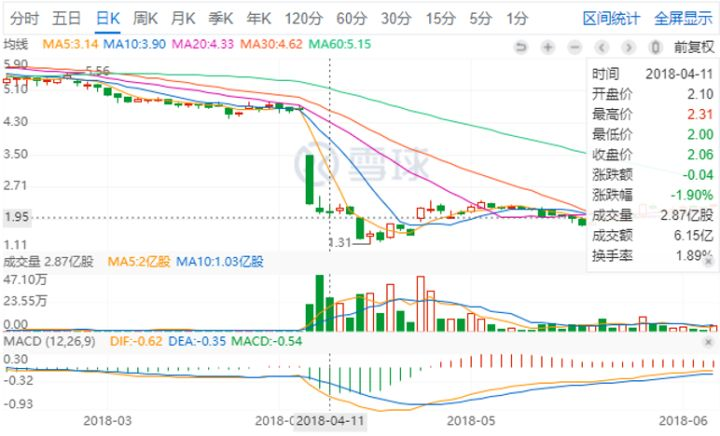
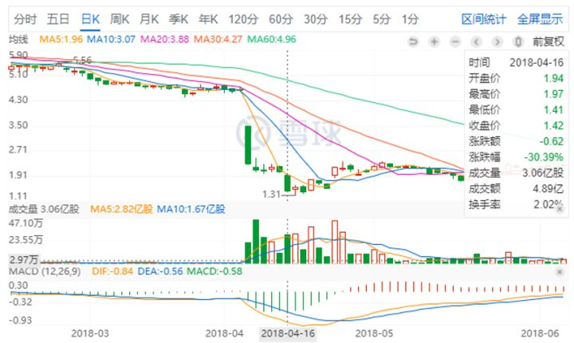
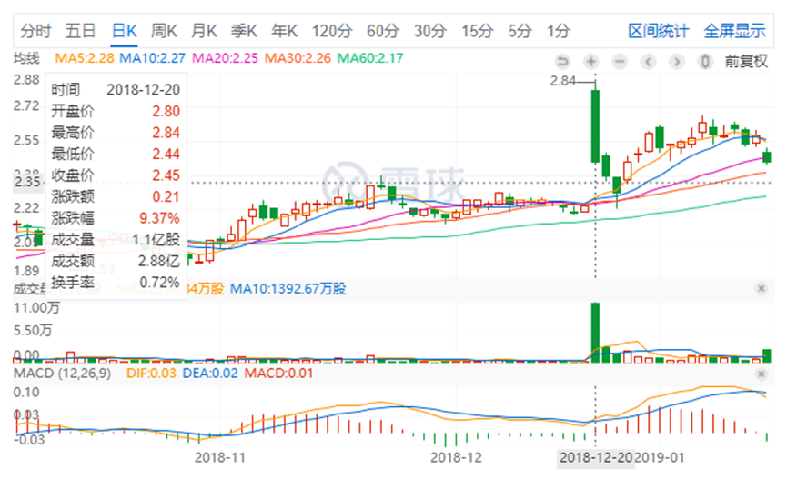
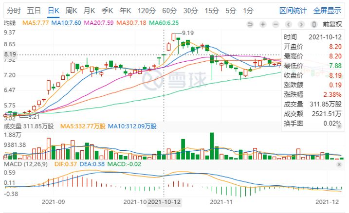
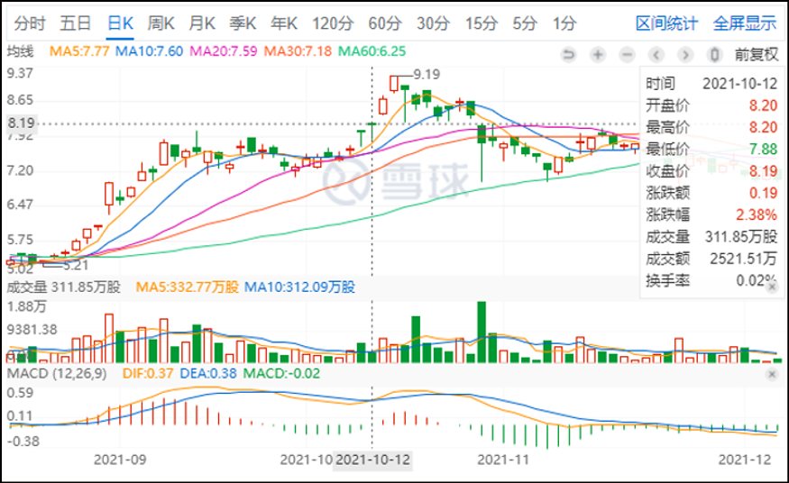

清一山长2016年～2021年

**一、背景：**

清一山长：铝业00486准备等坏消息将来进一步发酵的时候，计划继续买入一些。很遗憾9元多没有出货，不然现在成本就很低了，也是负成本了，才2元拿的货[滴汗]。

——2022年2月28日《85篇．德国及欧元区19国PPI高位传递的信息》

**二、正文：**

1.破产次序

[鳥蠅](https://link.zhihu.com/?target=https%3A//xueqiu.com/5178752245)[2016-01-08 22:45](https://link.zhihu.com/?target=https%3A//xueqiu.com/5178752245/63296087)

破产次序**[https://xueqiu.com/5178752245/63296087?page=2](https://link.zhihu.com/?target=https%3A//xueqiu.com/5178752245/63296087%3Fpage%3D2)**

清一山长2016-01-10 18:34回复[鳥蠅](https://link.zhihu.com/?target=https%3A//xueqiu.com/5178752245)

**等MEI铝破产了，才轮到00486破产。00486破产了，才轮到**601600**破产，要等它等都破产了，恐怕才轮到宏桥破产吧**？这帖子，恐怕搞反了破产次序。宏桥这个配股价格很奇特，似乎就是不想要小散参与配股的。如果宏桥明天开盘下跌，10以上，本人就继续买入，与大股东共存亡。就不等中铝破产了。

2.俄铝2元宏桥3元多时，选择宏桥

高处看海2017-07-17：

$(00486)$

《外资精点》花旗：升00486评级至买入，目标价升逾九成至6．1元

文章链接：

[https://xueqiu.com/S/00486/80700701](https://link.zhihu.com/?target=https%3A//xueqiu.com/S/00486/80700701)

清一山长2017-07-17回复高处看海:

**00486，2元左右的时候，宏桥3元多4元不到**。当时我在到底选谁的时候，花了很多心思。**最终还是选了全球的龙头——宏桥，**特别是从pb来看，00486并不占优势。电力方面，水电也不是00486的，它也是用电户罢了，成本上宏桥比俄铝更有优势。

没想到今天看到，00486的升幅，远远超过宏桥了。外资投行也大幅提高00486的预期价格。却在中国做空来打压宏桥的股价，居心如何？00486卖的是黄金，宏桥做出来的就是垃圾吗？

不过，我逻辑也很清晰：连非龙头都有3pb以上的价格预期，我拿的龙头，如果要等3pb，就还有3倍的涨幅。耐心慢慢的等好消息吧。我更加佩服张世平长期停牌的做法了——利用未来铝业价格上升周期的预期，拖死空头！不战而胜！

3.2.02元买入00486，套牢

清一山长2018-04-11 15:56

00486 2018年4月11日

$(00486)$**挂单2.02元买入00486，30余万股。**居然全部成交了。今天居然敢去接下跌的飞刀，的确有神风突击队的精神[大笑]。

不过，我相信：00486作为一家除了中国企业以外全世界最大的电解铝生产商，还用的是别人无法复制的，00486卖不出去的水电来产生，还拥有铝土矿和氧化铝，这样全产业链的企业，MG是没法弄得它破产的。但是有可能这一两年的利润泡汤了。

为了对冲，找点心理平衡，就把前几天8元多进的宏桥，9元多卖了几万股出去。**算是维持铝产业投资池的平衡[大笑]。当年00486，2元的时候，宏桥才三元多四元不到。我放弃了00486，选宏桥，表达中国人买中国股的骨气。现在00486重新又给我2元的机会，但宏桥已经是9元多了。**就换一点小仓玩玩，赢的概率应该会大一些。（当然，也很可能两面挨耳光）。认了！

月亮的未来2018-04-11:回复清一山长:

高人[牛]我都数不清您有多少股票了，如何关注得过来，又每每买对，卖对。说来惭愧，入市第一股抄了您的作业，燕京，5.89开始，慢慢加到6.65，却在7.01的时候卖了。然后，就上不了车了。

清一山长2018-04-11 20:06

回复月亮的未来:今天我清掉了两只股，一股都没留。赢利了，就走了。买入了三只从来没有买过的股。00486，你们已经知道了。其他两个就不说了。**因为已经十年没有涨了，怕你们跟进，再等十年你们就骂我十年，你们等不起[大笑]。**

我也不知道以后会不会涨，就是想投机一回，就当穿梭回十年前买。起码我赚了这十年的时间。所以，有资本慢慢熬[赚大了]。比守了十年的老股东幸福多了。

管我财回复2018-4-13雪盈证券:

【雪盈证券雪盈证券官方账号:温馨提醒：目前该股票暂时不支持下新仓，原因是这个股票被制裁了。】

连盈透也不能下单，这下可以放弃研究了。未来$(00486)$估计只有C级小券商能提供买卖，不会再有任何的基金买家了，小散们塘水混塘鱼[吐血][吐血][吐血]

清一山长2018-4-13回复管我财:

可不可以认为：正是因为现在的很多重量级买家都不被允许购买俄铝，消除了大牌的竞争对手。不仅如此，还让这些人亏血本，不计代价的卖出。是不是给了我们这些不急于用钱的小散们，一个长期投资的好机会呢？[大笑]

清一山长2018-4-16清一山长:

【(00486)$挂单2.02元买入俄铝30余万股。居然全部成交了。（2018-4-11）】

呵呵，终于套牢了。我就知道有今天！所以，大家别跟我。我买后会下跌，卖后会上涨。我是反向指标[大笑]

00486 2018年4月16日

明达野老2018-06-07回复清一山长:

山长宏桥的操作真棒[很赞]。

我是一股没卖，一直坐着过山车[滴汗]，也是手里唯一一支没做投机的股。

宏桥是门非常好的生意。我手里所有的持仓公司，还没有看到过能超越张董带领的宏桥的（从老板到公司，我还真有点挑不出毛病）。我记得我最初买入是两年前了，4HKD左右，现在经营了两年，才卖8HKD+，还是在张董大幅增持的价格下方，我忍不住这周也买了一点（增加了大概10%的仓位），大概8.3hkd（继续不涨，我不排除卖掉只有一些底仓的三一等进行换股）。

PS：前两天看到看海兄高处看海，转发的宏桥和兴业的消息，宏桥也表明了自己主要目的主要就是为了参与汽车轻量化的上游市场，张董真是好眼光，无论从原材料还是到产品，眼光和经营都非常厉害，忠旺看来要遇到劲敌了。忠旺股价如果提前迈步向上，我也不排除会减持换入没涨的宏桥上（从经营的扎实性而言，我更相信张董）。

清一山长2018-06-07 18:36回复明达野老:

支持[赞成]。不过有人会认为我们把4元买的东西，现在8元做广告，是忽悠人抬轿的[大笑]。

不过，我对宏桥买入行为，应该是一种“怀旧情结”，似乎不完全是理性的投资行为。**如果真要进行价值比较的话，长期投资铝行业，8元的宏桥和2元的00486，到底谁更有优势？我似乎更倾向于00486。**它的水电资源，会对宏桥的上下游一体化优势相比，有很大的对冲。当然，**今年下半年俄铝的业绩应该很难看，MG制裁完全打乱了它的生产节奏，会造成很大利润损失的。但是长期来看，水电这个优势实在太强大了。**电解铝的主要成本，其实就是电！特别是在煤炭涨价的未来前提下，水电铝的优势更大。

美丽的邂逅2018-7-25回复清一山长:

呵呵，都是最近一个多月开始搞的。其实应该说微赚，也就是盈亏边缘。不过也只是随口提一下，抄底的人，随时做好被套的准备。事实上，如果10元可以买到，是件好事。A股我也是分散持有，第一仓也就个位数仓位。

你抄底的水平，很牛，最近印象时的是俄罗斯铝业。还需向你学习[笑]

清一山长2018-07-25 19:19回复美丽的邂逅:

谢谢。00486不是很“成功”的，我2元买了后就跌到1.6元了[哭泣]。我只是坚持不动，才获得正收益的。上周2元出头，又加仓了一些。我的逻辑是：**大多数人都不能买它的情况下，**我拥有能够买它的账户去买一些，应该大概率是不贵的[大笑]。

**4.00486涨了不买，买4.5元的宏桥**

清一山长2018-12-20 15:10

00486 2018年12月20日

$(00486)$今天突然看到俄铝涨了不少，才发现原来是解禁了。**我2元买它的主要理由，就是MG过于霸道，不让别人自由买卖00486股份。因此会造成该股的价值被低估。**现在涨了这么多，是不是该卖掉了？先别急，等它回复原价再说。这家公司，其实值得长期持有的。

既然00486以后看来是没法买了（因为涨了），怎么办呢？我就默默地再买十万股中国宏桥吧。**4.50元的价格，也足够有吸引力了**。其实这个价格，显然比三年前我入手成本在3.79元左右的宏桥更便宜。这两三年宏桥赚到手的钱，都远远超过目前差价了

5.四倍净收益

00486 2021年10月12日

清一山长[2021-10-13 15:06](https://link.zhihu.com/?target=https%3A//xueqiu.com/9310099567/200010279)

[$(00486)$](https://link.zhihu.com/?target=http%3A//xueqiu.com/S/00486)很久没有打开香港账户了，今天课程结束了，有空看看，以为已经跌惨了，没想到两个不同的账户都还是正收益。账上多了三百多万的现金，由于原来肯定是满仓的，这些现金显然是一年多来的分红收入。**市值上升的主要贡献是俄铝，我买入的成本2.05元，现在8.19元。当年MG制裁的时候抢买的，买入了70多万股。现在居然涨了四倍了。**也许我会继续放着，难说会成为我拿着不放的第一个十倍股。原来的习惯，都是涨了就跑，涨了四倍不跑的股，好像还没有做过。这个股已经坐了很多次过山车了，才第一次拿到四倍的净收益，全仓没有减持的收益。

我的港股投资，就是摸着石头过河。原来在A股的成功经验，在港股几乎无效，甚至是负面的经验，所以，**只能用最笨的方法投资：买入一些肯定不会垮的世界级龙头公司，然后死死地拿股息，实在涨高了就卖掉，不涨就拿股息不放手。另外，也不加融资。**把自己彻底看成就是笨蛋一个，用傻瓜战略买股。这样我看勉强能够在港股生存下去。我第一次出海，居然还能赚钱，已经谢天谢地了。原来我的港股投资战略是分散，但我看分散策略也不好，很多股票是亏的。我现在准备清理一下港股持仓，把一些没有前途的股票清掉，**集中买入一些未来肯定不会出问题的实力派国企股票，然后锁仓睡觉去。**我看这样港股的安全系数才够用。

现在我的胆子是越来越小了，主要是港股教会的。仅仅在A股玩，28年来都太顺了，容易学会狂妄自大——似乎自己啥都懂，买什么都行。来了港股，发现自己好无知。动不动就跳坑了！很多吸引人的小股票，很容易把钱吸走。**现在只敢买国有蓝筹，虽然总是不涨，但起码不是大陷阱。**民营的企业，老千股，估值看起来很有吸引力，但永远不会兑现的很多，偶尔会让你赚大钱，个别的案例而已。香港股市的坑，实在太多了，防不胜防。养活了一大堆的骗子。我们还是躲着一些的好。**不要碰看不懂的股。**

**未来A股可能港股化，估值分化会很严重。大家也要小心——才能行万年船。**

[追求進步](https://link.zhihu.com/?target=http%3A//xueqiu.com/n/%25E8%25BF%25BD%25E6%25B1%2582%25E9%2580%25B2%25E6%25AD%25A5)回复[清一山长](https://link.zhihu.com/?target=http%3A//xueqiu.com/n/%25E6%25B8%2585%25E4%25B8%2580%25E5%25B1%25B1%25E9%2595%25BF):

我觉得铝价已太高了，影响实体经济，山长觉得[$(00486)$](https://link.zhihu.com/?target=http%3A//xueqiu.com/S/00486%2522%2520%255Ct%2520%2522_blank)的前景怎么样？[为什么]

清一山长[2021-10-13 18:01](https://link.zhihu.com/?target=https%3A//xueqiu.com/9310099567/200028701)回复[追求進步](https://link.zhihu.com/?target=http%3A//xueqiu.com/n/%25E8%25BF%25BD%25E6%25B1%2582%25E9%2580%25B2%25E6%25AD%25A5)：

您把自己弄得像领导人一样，关心企业生存，关心民生[俏皮]。炒股的人，是做生意，只看生意，不像你：关心ZZ平衡问题。

**我认为：00486，很可能是这一轮国际铝价大涨中最大的赢家。**中国的企业，包括中国宏桥在内，由于**电力成本的大幅上涨**，很大程度上，冲抵了铝价上涨带来的利润。而且，由于**限产的存在**，又限制了企业产能的发挥，自然是看着钱没法赚。而欧美企业，M铝等，由于煤炭、电力的大幅上涨，也无法从这次铝价大涨中获益，甚至无法扩产。**只有00486，用的是成本低廉的水电，而且不受能源限制，以及额外的产能控制的限制，甚至它很可能还会扩产，创造更大的利润。**目前它是仅次于中国宏桥的第二大铝企，但很可能这一次铝价上涨，中国严格限制产能之后，它会重新成为世界第一大铝企。利润也会在这一轮大涨中涨到不可思议的地步。它的股价这一轮创新高几乎就是必然的。
当然，我看多不做多，我现在是不会加仓俄铝了。我有其他还在底部的好股，可以买一些。**但我也不会轻易的卖掉00486，我会继续持有的。涨跌无心的拿着。直到它的价格超过中国宏桥为止。**

00486 2021年10月18日

清一山长 [2021-10-18 17:00](https://link.zhihu.com/?target=https%3A//xueqiu.com/9310099567/200421307)

[$(00486)$](https://link.zhihu.com/?target=http%3A//xueqiu.com/S/00486%2522%2520%255Ct%2520%2522_blank)两个交易日前，我打开账户看到的是8.18元，赚了很多。但心中没有想卖出。才两个交易日，就涨了1元了。当天看到赚钱了，就赶快走了，岂不是笑话？

现在的00486，已经是11年来的新高。该走了吗？现在它的市值是1394亿。跟中国铝业相比，倒不算是贵。A股1269亿的市值。不过港股的市值，还不到一千亿港币。产出方面，显然不值得换中铝。

但跟中国宏桥相比，00486是不是更值得拥有？宏桥现在居然才900亿港币市值，跟中铝、00486比都实在是没法比——它是世界第一产能的铝业企业呢！

不过，00486市值超过1500亿的时候，我就想要减仓了。这是我的国际企业投资仓位，其实很舍不得换掉的。如果拿来换中国中铁，价格上，倒是一个好生意。当年00486，2元的时候，中国中铁还6元多呢。现在它过10元了，换3元多的中国中铁多好？都是国家级重要企业。**不过，00486是我“国际企业布局”的一只股票，希望它是世界企业，不然我的投资过于集中到中国，似乎不太好。**其他有无有竞争力的世界级企业呢？也许港股的1号仔，可以考虑换一换？据说是跨国企业。主要的业务在英国。

另外，我还看中一只在非洲投资基础建设产能的企业。我觉得：似乎这只股票更有潜力一些。而且这个股的分红，还特别的大方，可以收到10%的股息。已经买了一堆了，看是否要继续换进来？
