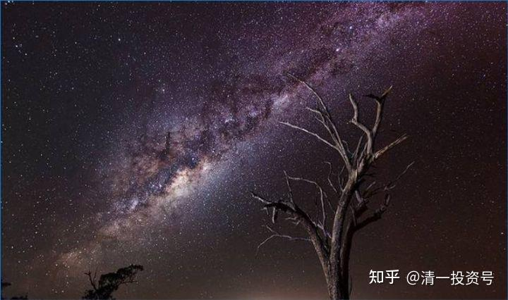
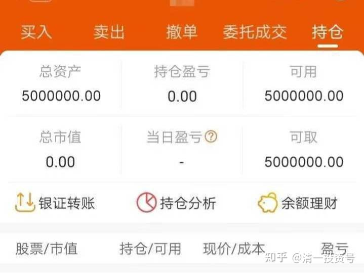
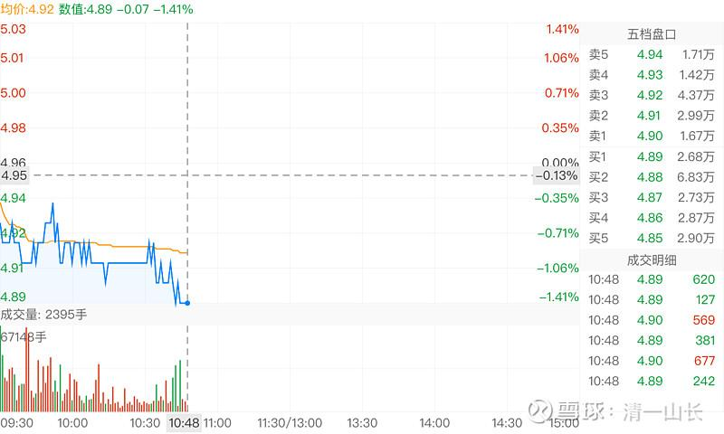
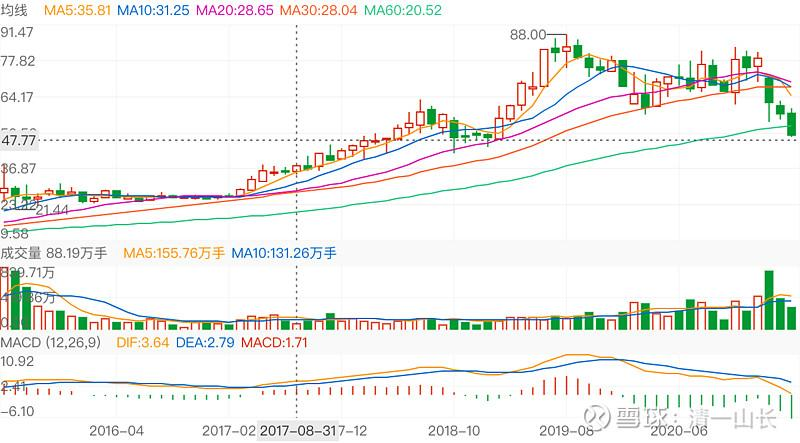

20篇.下岗程序员引发的对话

清一山长 2020年12月20日——2021年4月29日

**[下岗程序员](http://link.zhihu.com/?target=https%3A//xueqiu.com/7891182210)** **[发布于2020-12-18 13:14](http://link.zhihu.com/?target=https%3A//xueqiu.com/7891182210/166096681)**

和老婆大吵一架

昨天卖房的610万到账后，老婆得知我要放500万进股市，发脾气对我一顿臭骂，只允许我放300万进去。

本来连续几个月找工作失败，落得现在这样，心情一直都很抑郁，所以没忍住，也对老婆大发雷霆。搞得她伤伤心心哭了好几个小时，哎！

哭完后又哄了半天才哄好，最后我们达成协议，她同意我放500万进去，但是只要本金亏损达到100万就必须把全部钱取出来归她管。

之前的股票账户在网上随便开的，手续费万2.5有点偏高，所以在东方财富开了个新的，手续费谈到了万1.5，本想压到万1，实在压不下去。

业务员还怂恿我开通融资融券，没敢开通，怕自己忍不住满仓融资。

段永平说过：会投资的人不需要融资，不会投资的人更不能融资。

刚刚把钱转了进去，看待会建仓不，不的话就下周开始建仓。

**[清一山长](http://link.zhihu.com/?target=https%3A//xueqiu.com/9310099567)** **[2020-12-20 20:43 回复 下岗程序员：](http://link.zhihu.com/?target=https%3A//xueqiu.com/9310099567/166223430)**

给你一个建议：你现价都买中国建筑吧。涨不涨不知道。但是现价5.12元买入，你500万亏掉100万的可能性几乎没有。然后你就去学一些技术，再去找找别的合适的工作，干干别的有用的事情。千万别来炒股为生，别以为你可以在股市上轻易赚钱。如果你真是技术员出身，来这里很危险。你的技术素质，在这里毫无用处。你就每年拿股息，再去找工作，等十年看看账户会涨到多少钱，我认为你最终会有赚到八位数收益的。再加上你十年赚的工资，你的日子会过得很不错。但如果你来炒股，真心话：90%的概率是10年后你啥都没有赚到——没赚到钱，也没赚到技术，还是不懂炒股。我见过太多这样的人了。我是一个1993年入市的老股民，相信我说的话是真心话！

说明：我家老人的账户，从不到百万，这10年已经增值到过千万了。我都是买最保险的品种。**原来就买过中建，后来买招行，现在调仓持有的是三成的燕京，七成的中建。**燕京是6元进的，就不推荐了。中建离我新买入的成本线还很近。所以，我认为保险系数较高。**如果您还想分红多一点。可以买入三成的江苏银行，也是5元多。**也一样——每年拿分红就够了，别炒股！

当然，如果您认为：您就是剩下的10%。您不相信我是帮您的，您就留下来炒股。证明您自己的本事。

我是这个市场的万分之一，十万分之一的幸运儿。我的账户，用这27年时间，已经证明了我自己的本事和地位，我的账户是三位数的（说明我是券商的第一批股民），目前上市公司的这个营业部，这种数字的账户，只剩下我一个。也就是说:第一批的其他股民，全“阵亡”了。因为他们都是90%的人，市场就没他们的生存机会。

我教你这一招，是让你即使是股市的菜鸟，也保护你安全，让别人无法吃掉你，这是最保险的玩法。**就是你不下场玩！你只持有行业第一的股死守股息！**

**[来自星星的票友](http://link.zhihu.com/?target=http%3A//xueqiu.com/n/%25E6%259D%25A5%25E8%2587%25AA%25E6%2598%259F%25E6%2598%259F%25E7%259A%2584%25E7%25A5%25A8%25E5%258F%258B) 回复 [下岗程序员](http://link.zhihu.com/?target=http%3A//xueqiu.com/n/%25E4%25B8%258B%25E5%25B2%2597%25E7%25A8%258B%25E5%25BA%258F%25E5%2591%2598):**

建议你三年之内先用50万炒股吧，等收益稳定了再加仓。

**[清一山长](http://link.zhihu.com/?target=http%3A//xueqiu.com/n/%25E6%25B8%2585%25E4%25B8%2580%25E5%25B1%25B1%25E9%2595%25BF) 2020-12-20 20:46回复[来自星星的票友](http://link.zhihu.com/?target=http%3A//xueqiu.com/n/%25E6%259D%25A5%25E8%2587%25AA%25E6%2598%259F%25E6%2598%259F%25E7%259A%2584%25E7%25A5%25A8%25E5%258F%258B): **

【建议你三年之内先用50万炒股吧，等收益稳定了再加仓】

这个建议得到了最多的赞，其实，有点像进赌局之前，先拿10%来试水，赚了再继续玩。实际上，无论赔赚，最终他都要梭哈的！赌性上来了就收不住！

三年，菜鸟就能学会炒股？我是不相信的。只有10%的人能学会股市生存法，跟三年时间无关，跟他是不是该吃这碗饭有关！

**[Relax1216](http://link.zhihu.com/?target=http%3A//xueqiu.com/n/Relax1216) 回复 [清一山长](http://link.zhihu.com/?target=http%3A//xueqiu.com/n/%25E6%25B8%2585%25E4%25B8%2580%25E5%25B1%25B1%25E9%2595%25BF):**

但是山长如何判断是不是该吃这碗饭？好像生活中有很多人找工作也是这样，抱有先干着试试吧的心态。

**[清一山长](http://link.zhihu.com/?target=https%3A//xueqiu.com/9310099567)回复[Relax1216](http://link.zhihu.com/?target=http%3A//xueqiu.com/n/Relax1216):**

我的建议，90%是有效的，10%是错误的。不管对谁，都是有效的。这是概率！是科学，不是判断。我没有判断！

如果想证明自己是10%，就下场玩。输了认！

我也会认输的：也许这人，就是股神在世呢？概率对他就没用了。

**[晕娜](http://link.zhihu.com/?target=http%3A//xueqiu.com/n/%25E6%2599%2595%25E5%25A8%259C) 回复 [清一山长](http://link.zhihu.com/?target=http%3A//xueqiu.com/n/%25E6%25B8%2585%25E4%25B8%2580%25E5%25B1%25B1%25E9%2595%25BF):**

山兄：贴主也入市十年了，也不是新股民。投资的书也没少看。贴主就是客气一下，您还当真了……这么长篇的回复他，没必要啦！

**[清一山长](http://link.zhihu.com/?target=https%3A//xueqiu.com/9310099567) 回复[晕娜](http://link.zhihu.com/?target=http%3A//xueqiu.com/n/%25E6%2599%2595%25E5%25A8%259C):**

算我多管闲事[滴汗]。真玩了十年，拿着500万入场就晕菜，还到处问人该咋办？这证明跟菜鸟也差不多。我的账户时常一天就亏掉上千万，但我一点感觉都没有。没这种心态，就真别吃这碗饭。心脏病都要整出来的。不如学您拿股吃息，找份工作好好干算了！

**[清一山长](http://link.zhihu.com/?target=https%3A//xueqiu.com/9310099567)** **[修改于2021-01-11 11:02](http://link.zhihu.com/?target=https%3A//xueqiu.com/9310099567/168297523)**

[$中国建筑(SH601668)$](http://link.zhihu.com/?target=http%3A//xueqiu.com/S/SH601668)跌成这样子，真是疯狂。难道美股收盘创新高，中建就要这样子用吐血来表达吗？各位：有钱就买吧，没钱就看戏。死拿五年，看你还趴在地下玩。

**[下岗程序员](http://link.zhihu.com/?target=http%3A//xueqiu.com/n/%25E4%25B8%258B%25E5%25B2%2597%25E7%25A8%258B%25E5%25BA%258F%25E5%2591%2598)回复[清一山长](http://link.zhihu.com/?target=http%3A//xueqiu.com/n/%25E6%25B8%2585%25E4%25B8%2580%25E5%25B1%25B1%25E9%2595%25BF):**

幸好当初没听你的推荐满仓中国建筑，[捂脸]， 不然内裤都亏没了，玩笑话哈，不要介意。

**[清一山长](http://link.zhihu.com/?target=https%3A//xueqiu.com/9310099567)** **[2021-01-11 11:45](http://link.zhihu.com/?target=https%3A//xueqiu.com/9310099567/168308767)回复[下岗程序员](http://link.zhihu.com/?target=http%3A//xueqiu.com/n/%25E4%25B8%258B%25E5%25B2%2597%25E7%25A8%258B%25E5%25BA%258F%25E5%2591%2598):**

现价，跟我说的时候价格相比，只跌了6%吧？你的底裤就跌没了？[为什么]

我说的：你500万本金，跌破400万的可能性，几乎没有。这相当于中国建筑要跌破4.1元的价格。你的底裤有多浅呢？如果真跌破了，您就可以来笑话了：我承认经常被打脸的。

**中建就算将来真有一天，真的跌破了4.1元，我也不会逃跑的，我只会设法弄更多钱来买。**

**[清一山长](http://link.zhihu.com/?target=https%3A//xueqiu.com/9310099567)** **[2021-04-28 09:45](http://link.zhihu.com/?target=https%3A//xueqiu.com/9310099567/178433562)**

[$上海机场(SH600009)$](http://link.zhihu.com/?target=http%3A//xueqiu.com/S/SH600009)技术分析：月线图上，已经跌到19年年初的位置了。正常情况下，这是一个支撑位置，应该会有反弹。不过现在的情况应该很不正常。首先是基本面不正常，[上海机场](http://link.zhihu.com/?target=https%3A//xueqiu.com/S/SH600009%3Ffrom%3Dstatus_stock_match)的国际航班，今年内恢复的可能性不大。

第二是成交量显示的危险：**上一次的支撑位置和压力位，18年到19年的，成交其实很少。**可以说，主力没有卖出行为，筹码锁定良好。现在同样的位置，成交量很大。有人在不断的亏本跑路，当然，也有人不断接盘。但观察下来，散户接盘比较多。因为他们对[上海机场](http://link.zhihu.com/?target=https%3A//xueqiu.com/S/SH600009%3Ffrom%3Dstatus_stock_match)过去灌的迷魂汤很有效，依然认可当初的逻辑。寄希望于疫情消失后就恢复原状。**我看难，疫情一是：难以短期消失，中国只会继续严防死守。二是：疫情消失，上机也不会恢复原来的盛况。**上机的老总跟中免签约，已经说明市场逻辑改变了。现在还想好事？我看太不理智。所以，我认为是机构撤退，散户买入的。所以——未来可能会有反弹，但只是反弹而已。不是洗盘。从17年走上了的这波翻倍行情，成交都不大。原有的大主力都是长期持仓，现在就算下杀逻辑，止损卖出，都是有利润的。散户跟进时间短，应该都是赔本的。

当然，[上海机场](http://link.zhihu.com/?target=https%3A//xueqiu.com/S/SH600009%3Ffrom%3Dstatus_stock_match)作为免税天堂的逻辑终止了。但作为机场的逻辑还在。跌也跌不到多惨，最多跌回17年的平台。死拿五年，也许估值推动又涨上去了（我担心：也许五年内国际航班都开不了。因为疫苗没用,病毒不断变异），这种极端情况下，会让持有者抓狂的。希望不至于（我被困在泰国，其实很想正常回国，看看老人家，以及朋友们。我可不希望被疫情隔绝了，五年回不来）。

我就动动嘴巴，我不持有上机，就20多年前买过。我不对判断的结果负责。

刚看到：500万炒股的下岗程序员居然高位抢了上机，还全仓了[哭泣]。正在叫苦：说走在死亡的边缘！天天发文。我半年前劝他买入[中国建筑](http://link.zhihu.com/?target=https%3A//xueqiu.com/S/SH601668%3Ffrom%3Dstatus_stock_match)，说涨不涨不知道，跌20%的可能性几乎没有，现在果然跌了2%。

上机呢？**我全仓拿了也睡不着的。全仓[中国建筑](http://link.zhihu.com/?target=https%3A//xueqiu.com/S/SH601668%3Ffrom%3Dstatus_stock_match)可以安心睡**。这就是不同。

我猜他是想通过炒股，刷热点，通过实盘赚钱，成为影响力大V，以后可以发私募吧？下岗了，换个[金融行业](http://link.zhihu.com/?target=https%3A//xueqiu.com/S/SH510650%3Ffrom%3Dstatus_stock_match)的工作。其实他很勤奋，可惜——炒股不是技术活。炒股是技术和艺术、哲学的结合。想发私募，想吸引眼球。这个目的本身，就会导致操作的偏差，为了博热点，博眼球而操作。

我不在乎啥眼球，不求私募的目的。操作就是记录自己。也许心态上，已经赢在起点了。其实：我的账户比他惨，这几天，已经消失了千万资产。不过，**我有安魂大法——数数股票，一股未少。还多了一些。于是——安心继续睡！等分红！**

**[无昵称1900](http://link.zhihu.com/?target=http%3A//xueqiu.com/n/%25E6%2597%25A0%25E6%2598%25B5%25E7%25A7%25B01900)回复[清一山长](http://link.zhihu.com/?target=http%3A//xueqiu.com/n/%25E6%25B8%2585%25E4%25B8%2580%25E5%25B1%25B1%25E9%2595%25BF):**

他今年还赚了20多万，都要死要活了。前段时间都快自封股神了。

**[清一山长](http://link.zhihu.com/?target=https%3A//xueqiu.com/9310099567) 2021-04-28 10:02回复[无昵称1900](http://link.zhihu.com/?target=http%3A//xueqiu.com/n/%25E6%2597%25A0%25E6%2598%25B5%25E7%25A7%25B01900):**

别人也许是凡尔赛体[笑]。或者模仿买了阿胶那个天天叫苦的啥人。这种苦巴巴写作模式比较吸引国人同情关注。

我丢了千万，也云淡风轻，好好睡觉。这种态度就特别的招人恨！怪不得黑我的人多。[俏皮]幸亏我不想发私募！

**[Lu小俊](http://link.zhihu.com/?target=http%3A//xueqiu.com/n/Lu%25E5%25B0%258F%25E4%25BF%258A) 回复 无昵称1900:**

老师是中建代言人。[大笑]

**[清一山长](http://link.zhihu.com/?target=https%3A//xueqiu.com/9310099567)** **[2021-04-28 10:09](http://link.zhihu.com/?target=https%3A//xueqiu.com/9310099567/178438944)清一山长回复[Lu小俊](http://link.zhihu.com/?target=http%3A//xueqiu.com/n/Lu%25E5%25B0%258F%25E4%25BF%258A):**

我不是中建代言人，中建的代言人应该是[晕娜](http://link.zhihu.com/?target=http%3A//xueqiu.com/n/%25E6%2599%2595%25E5%25A8%259C)。他是全仓中建。守了7年的，我新买入中建也就半年多，不到一年。

其实，我买了不少其他股。推推跌破5元的中建，是这个价格最安全。我是当保险资金玩的。别的就算损失了，中建可以稳住我的账户。不至于亏惨了。不过，目前是我的风险股都在赚，甚至大赚（比如各种酒），中建却一直不涨，真的“够稳定”了。所以，其他我赚了钱，想要落袋为安的部分资金，就会转投中建了。所以越买越多。**总仓位上，中建的配比并不多，30%左右吧。**

**[我和你吻鳖](http://link.zhihu.com/?target=http%3A//xueqiu.com/n/%25E6%2588%2591%25E5%2592%258C%25E4%25BD%25A0%25E5%2590%25BB%25E9%25B3%2596)回复[清一山长](http://link.zhihu.com/?target=http%3A//xueqiu.com/n/%25E6%25B8%2585%25E4%25B8%2580%25E5%25B1%25B1%25E9%2595%25BF):**

你这个分析我个人认为是不对的，19年那个点不能作为支撑点，本来去年疫情航空股就应该大跌，但[上海机场](http://link.zhihu.com/?target=https%3A//xueqiu.com/S/SH600009%3Ffrom%3Dstatus_stock_match)有基金报团股没跌反涨，这就不正常。那么现在疫情因为阿三再度引爆，再加上抱团上机的基金和机构清仓撤资，很可能会低于你所谓的支撑点，这是正常逻辑。

**[清一山长](http://link.zhihu.com/?target=https%3A//xueqiu.com/9310099567)** **[2021-04-28 11:00](http://link.zhihu.com/?target=https%3A//xueqiu.com/9310099567/178449309) 回复 [我和你吻鳖](http://link.zhihu.com/?target=http%3A//xueqiu.com/n/%25E6%2588%2591%25E5%2592%258C%25E4%25BD%25A0%25E5%2590%25BB%25E9%25B3%2596):**

这样说，太残酷了[大笑]。持有的人，会受不了的。下岗程序员想死的心都有了，你还这样说，不是太没同情心了吗？

所以，我只谈技术支撑位，也许有点希望。你说的，是基本面改变，导致投资逻辑改变，所以技术支撑无效[俏皮]。两种不同的逻辑。

**[深圳属牛的金牛座](http://link.zhihu.com/?target=http%3A//xueqiu.com/n/%25E6%25B7%25B1%25E5%259C%25B3%25E5%25B1%259E%25E7%2589%259B%25E7%259A%2584%25E9%2587%2591%25E7%2589%259B%25E5%25BA%25A7)回复[清一山长](http://link.zhihu.com/?target=http%3A//xueqiu.com/n/%25E6%25B8%2585%25E4%25B8%2580%25E5%25B1%25B1%25E9%2595%25BF):**

山长，年报以后中建已经连跌了7日，能否给一些技术上的分析指导？[鲜花][鲜花][赞成]

**[清一山长](http://link.zhihu.com/?target=https%3A//xueqiu.com/9310099567)** **[2021-04-28 11:12](http://link.zhihu.com/?target=https%3A//xueqiu.com/9310099567/178451464)清一山长回复[深圳属牛的金牛座](http://link.zhihu.com/?target=http%3A//xueqiu.com/n/%25E6%25B7%25B1%25E5%259C%25B3%25E5%25B1%259E%25E7%2589%259B%25E7%259A%2584%25E9%2587%2591%25E7%2589%259B%25E5%25BA%25A7):**

**[中国建筑](http://link.zhihu.com/?target=https%3A//xueqiu.com/S/SH601668%3Ffrom%3Dstatus_stock_match)，有啥技术走势好谈的？**[捂脸]**说了，我都不看中建走势的，因为没必要看。**我连年报都不多看，关键指标没问题就行了。

你们想看中建技术走势的，自己看去，别找我看！

**[小散自由之路](http://link.zhihu.com/?target=http%3A//xueqiu.com/n/%25E5%25B0%258F%25E6%2595%25A3%25E8%2587%25AA%25E7%2594%25B1%25E4%25B9%258B%25E8%25B7%25AF) 回复 [清一山长](http://link.zhihu.com/?target=http%3A//xueqiu.com/n/%25E6%25B8%2585%25E4%25B8%2580%25E5%25B1%25B1%25E9%2595%25BF):**

这么重大的身家都全仓一只股，也太没有风险意识了。还想做私募，全仓一只股的，谁敢交钱给他？有点风险意识的、有点经验的应该都不敢。[吐血]

**[清一山长](http://link.zhihu.com/?target=https%3A//xueqiu.com/9310099567)** **[2021-04-28 12:06](http://link.zhihu.com/?target=https%3A//xueqiu.com/9310099567/178458853) 回复[小散自由之路](http://link.zhihu.com/?target=http%3A//xueqiu.com/n/%25E5%25B0%258F%25E6%2595%25A3%25E8%2587%25AA%25E7%2594%25B1%25E4%25B9%258B%25E8%25B7%25AF):**

真不能这样说:别人全仓茅台的（董宝珍），不照样做私募？

[晕娜](http://link.zhihu.com/?target=http%3A//xueqiu.com/n/%25E6%2599%2595%25E5%25A8%259C)全仓中建，他没风险意识？

看你全仓谁了。全仓高位的[上海机场](http://link.zhihu.com/?target=https%3A//xueqiu.com/S/SH600009%3Ffrom%3Dstatus_stock_match)，的确有点疯。但上海机场十几元、二十几元的时候，全仓没毛病。

**[萌虎下山b5k](http://link.zhihu.com/?target=http%3A//xueqiu.com/n/%25E8%2590%258C%25E8%2599%258E%25E4%25B8%258B%25E5%25B1%25B1b5k) 回复 [下岗程序员](http://link.zhihu.com/?target=http%3A//xueqiu.com/n/%25E4%25B8%258B%25E5%25B2%2597%25E7%25A8%258B%25E5%25BA%258F%25E5%2591%2598):**

不如把钱送人吧，你这么玩过不了几年老婆都要送人！

**[清一山长](http://link.zhihu.com/?target=https%3A//xueqiu.com/9310099567)** **[2021-04-28 12:33](http://link.zhihu.com/?target=https%3A//xueqiu.com/9310099567/178460921) 回复 [萌虎下山b5k](http://link.zhihu.com/?target=http%3A//xueqiu.com/n/%25E8%2590%258C%25E8%2599%258E%25E4%25B8%258B%25E5%25B1%25B1b5k): **

人性真有趣：本帖后面，我诚心诚意的回答，得到了300多个点赞，我以为已经相当不错了。但这个嘲笑奚落人的，其实没有啥实在内容的回答，居然是600多个点赞。说明：国人就喜欢看别人的笑话，不喜欢真诚的好话。

生活在这样的国家很幸福——赚钱很容易！

就像是生活在中东土豪堆里一样。身边都是消费者，都是些赔钱货，想不赚钱都难！[大笑]

感恩有你们！

**[51nxp](http://link.zhihu.com/?target=http%3A//xueqiu.com/n/51nxp) 回复 [清一山长](http://link.zhihu.com/?target=http%3A//xueqiu.com/n/%25E6%25B8%2585%25E4%25B8%2580%25E5%25B1%25B1%25E9%2595%25BF):**

谢谢山长！我们在人生的旅途中，活着活着会成为一个孤岛，感恩雪球，让我多了很多朋友，大多是热爱投资，并且有一定的估值能力的人。

2018年6月，当时我买[健康元](http://link.zhihu.com/?target=https%3A//xueqiu.com/S/SH600380%3Ffrom%3Dstatus_stock_match)，从10.9（除权价9.5）跌到9.6，在我非常迷茫的时刻，您发的那个帖带给我的开心至今难忘。

我发这个帖，本想评论那个程序员，看着他惨兮兮的，想着和当初您一样，说说自己的坚持。

昨天下午看隔壁单元加装电梯，造价50万，土建23万，承包工程的到完工才拿到17万，真的可怜，我是目睹了他们在高高的架管上作业了几个月的，他们5个江西宜春的农民工每个人凑8000元包的这个工程（进场要垫资买些档板，起降机等），赚钱是多么不易呀——对比他们，上帝对我真是太仁慈了。

再一次感谢您的回帖。[俏皮]

**[清一山长](http://link.zhihu.com/?target=https%3A//xueqiu.com/9310099567)** **[2021-04-29 08:52](http://link.zhihu.com/?target=https%3A//xueqiu.com/9310099567/178569782) 回复[51nxp](http://link.zhihu.com/?target=http%3A//xueqiu.com/n/51nxp):**

谢谢你的回复，你是一个很善良的人。

我在泰国建房子，已经花了两个多亿泰铢的投资来建房子。我每天看到泰国的工人，辛辛苦苦的帮我建房，一个月也就赚一万多泰铢。我每天啥活不干，天天睡觉，账上也要多几万人民币（分红）。所以，我觉得我已经太幸运了。有啥好埋怨的？这几天，股市调整，账面丢了上千万，这根本就算不了什么。**我一股未少，股息照样发。当这样去看问题的时候，就云淡风轻了。**账上的增增减减，就不会干扰我们的判断了。

您也一样：您无非是今年不赚钱罢了。假想时间拨回年初，您相当于一分钱没有少。干嘛要认为浮盈就是自己的？浮亏就应该是别人的？您现在，无非等于回到今年年初，再出发，重新规划您的投资规划，您根本没损失。**这就是佛家的“活在当下”，就是“不忘初心”**。这些都是很有智慧的语言。

下岗程序员也一样:与半年前他拿到房款相比，他不仅没少，还多了20万。但跟他期待的拿了上机，就赚千万相比，有较大心理差距。弄到现在就要死要活的。这种心态，就是输不起。也是对生命无知的表现。生命不是拿来玩这些数字游戏的。

所以，昨天看到你要用自己的生命和墓碑，来捍卫你现在投资的两个标的，我觉得你情重了。原来记得你让我鼓励粉丝去买[酒鬼酒](http://link.zhihu.com/?target=https%3A//xueqiu.com/S/SZ000799%3Ffrom%3Dstatus_stock_match)，当时这酒很低迷，我觉得你真是至情之人，很爱护你身边的一切。做你的孩子一定很幸福。不过，我还是告诉你，**我不跟标的谈恋爱，也不愿意推荐人买酒，因为我不认为酒有啥好处，自己也不喝。我想做“独立的投资人”。**情重的好处，就是能守护好股、好企业。运气好，可以获得超额的回报。就像一路守护茅台、五粮液下来，收获多多。

**独立的好处，就是能够摆脱[有色](http://link.zhihu.com/?target=https%3A//xueqiu.com/S/SZ159876%3Ffrom%3Dstatus_stock_match)眼镜，更理智地对待企业。**我相信：生命自有其意义。我不是公司的董事长，我们不能，也不需要为公司陪葬的。对企业，我们其实啥也没做。我们的资金，甚至根本就没帮公司做啥（没有进入公司运行的）。除非出钱参加定增、配股，所以别把自己看太重。我自己创建的企业，顶峰时期，我都可以放弃掉。因为我要做别的事情——办学教儿子。

因为**我自己有自己的生命目标，要关心家人、后代，不是仅仅去赚钱。**其实，现在赚钱多少，对我们都没意义了，我们已经圆满地完成任务了。如果现在赚钱就是为了要留给后代，这对他们就是生命的毒药。我们只能留机会给他们，不能留钱给后代。所以，钱能做的事情其实很少！我们更要关心用钱来做什么。这就是我现在的想法。多点钱，少点钱，其实真没啥的。**关键是我们的心，通过这多多少少的账户变化，获得了什么样的体验和提升！**祝福您，好人一生平安！

**[51nxp](http://link.zhihu.com/?target=https%3A//xueqiu.com/9203843585) 2021-04-29 09:55 回复[清一山长](http://link.zhihu.com/?target=http%3A//xueqiu.com/n/%25E6%25B8%2585%25E4%25B8%2580%25E5%25B1%25B1%25E9%2595%25BF):**

山长，您这篇文章可以当作投资者的心经。

我们做投资的，理性和善良是最重要的品格。而我，感性的成份多一些。[鲜花]
