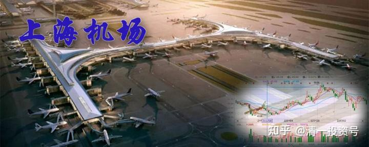
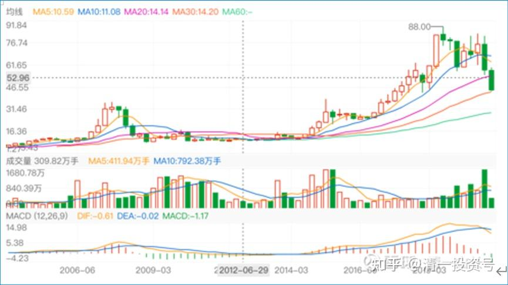
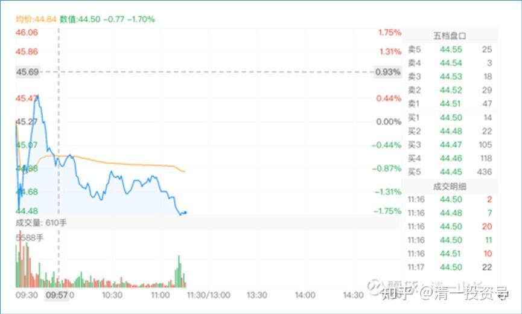
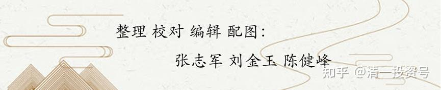

26篇.我不买上海机场的理由（一）

清一山长 2021年2月～2021年5月

**一、好股票涨多了，就不是好股票了**

**[清一山长](http://link.zhihu.com/?target=https%3A//xueqiu.com/9310099567)** 2021-02-02 11:24

一大堆吹股手，吹了一年的好票票，好不容易才合力抬到了80元，每天20-30亿的成交，其乐融融。现在才两天，就把一年的涨幅全跌掉了。估计还有第三个跌停。要不就必须找到50亿的资金来翘板。不过，我认为基金没这么傻的，估计这一年，原来的主力已经撤退了。小散以及准备滚地雷的新基金来接盘了。我认为真正套住的不是主力，应该是这一年通过各种媒体、自媒体、各路大V们吹嘘忽悠进来的小散户们。因为这一年时间太长了，足够运作的了。这群金融大鳄，绝对不会比我更傻的。

我喜欢上海机场，是个好股，但为什么不买？因为：**好股票涨多了，就不是好股票了**。如果低位持有的股，还可以装傻，继续持有，看他能有多傻。但如果没有持股的话，用现金买入，我要算的就是：如果跌了我是否受得了？**如果股息有5%以上，成长率有10%以上，跌多少我都不在意**，但是**上机才1个多点的股息率，我受不了，所以我不会买的**。

昨天买了一点华侨城A，第一次开仓，买了20多万股，持仓价6.59元。**理由就是：再跌我也不怕，股息率、成长速度放在这里。**我估计这家公司是不会垮的。如果再跌，我就装死算了，反正我就是不卖股。

这笔钱，是卖掉一部分万华化学买入的。**我认为：华侨城A涨到13元的概率，应该比万华涨到240元的概率高。**现在的股息率不如华侨城，ROE也是华侨城占优，更别说PB、PE了。万华是我卖掉56元的格力用40元买入的。可惜买少了。现在，万华似乎已经“走上赛道”了。[献花]，恭喜，我就不贪，逐步下车吧。好股，我也愿意在欢呼中慢慢离场。

**二、最基本的、底层的支撑逻辑，就是股息支撑**

[51nxp](http://link.zhihu.com/?target=https%3A//xueqiu.com/9203843585) [发布于2021-04-28 12:18](http://link.zhihu.com/?target=https%3A//xueqiu.com/9203843585/178459831)

[$上海机场(SH600009)$](http://link.zhihu.com/?target=http%3A//xueqiu.com/S/SH600009)至暗时刻，一直坚守。不用融资，分散持仓。今天，机场的浮亏已经创下我26年投资史上最大单笔亏损，论坛上杀逻辑杀估值鼓噪阵阵，内心肯定不舒服，想起去年底自己的选择——从医药股分仓一半买入因疫情影响还在底部的我认为最硬的资产，也就是[上海机场](http://link.zhihu.com/?target=https%3A//xueqiu.com/S/SH600009%3Ffrom%3Dstatus_stock_match)，4个月过去，命运给我开了个玩笑。

投资路上，总有一个你性格中的bug等着你！去年底，我的持仓萎靡不振，抱团股风起云涌，回想当时的我，失去了自2019年长持老窖后的云淡风轻心态，急着寻找股价在相对底部的基金报团股，机场就重回我的观察仓，开始只在73元买了1万股，很快涨到77，元旦节后我急吼吼地大规模建仓，除了[信立泰](http://link.zhihu.com/?target=https%3A//xueqiu.com/S/SZ002294%3Ffrom%3Dstatus_stock_match)，几乎所有的仓位都买进机场。

其实我当时也觉得有点反常，论坛里热帖都是张坤买入[上海机场](http://link.zhihu.com/?target=https%3A//xueqiu.com/S/SH600009%3Ffrom%3Dstatus_stock_match)的逻辑，股价走势却是没有蓝筹股的风范，元月14日涨5个多点，15日大跌5个多点，阴跌到70+，几个交易日拉到81，另外我和一个发帖重仓机场并截屏的球友私聊，他根本没有搭理我，然而这些都被我忽视，满脑子就是疫情过去，机场比老窖的逻辑还要硬——喝酒还可以选茅台、[五粮液](http://link.zhihu.com/?target=https%3A//xueqiu.com/S/SZ000858%3Ffrom%3Dstatus_stock_match)，机场是只要出国都得去。

机场目前亏损百分之32，[信立泰](http://link.zhihu.com/?target=https%3A//xueqiu.com/S/SZ002294%3Ffrom%3Dstatus_stock_match)的盈利今天都不能完全覆盖这笔亏损了，最近印度疫情让机场的前景更加黑暗，世界末日一样，疫情让无数人的生命都不能得到保障，而我只是承受一些浮亏，这么一想，心情好多了。

疫情越重，离峰点越近。疫情终将反转。现在回看三聚氰胺事件下的伊利，2013年的茅台，2018年的[中兴通讯](http://link.zhihu.com/?target=https%3A//xueqiu.com/S/SZ000063%3Ffrom%3Dstatus_stock_match)，我觉得现时的机场面临的考验比这三个案例都轻。

我说过，买机场就是用市场的盈利去换中国最顶级的铺面，我还说过，我希望自己离开这个世界，我的墓碑上刻着nxp，职业投资者，[上海机场](http://link.zhihu.com/?target=https%3A//xueqiu.com/S/SH600009%3Ffrom%3Dstatus_stock_match)[信立泰](http://link.zhihu.com/?target=https%3A//xueqiu.com/S/SZ002294%3Ffrom%3Dstatus_stock_match)的长期股东。真的，我用余生履行我的诺言。

[清一山长](http://link.zhihu.com/?target=https%3A//xueqiu.com/9310099567%2522%2520%255Ct%2520%2522_blank) 2021-04-28 18:27 回复[51nxp](http://link.zhihu.com/?target=https%3A//xueqiu.com/9203843585)

幸亏今天有信立泰托底。您单股32%不算啥的。完全在您的承受范围内。如果您是原来的习惯，单押上海机场，这个32%，就会给你带来巨大压力的。看样子你在70元前后买了不少。在投资顺鑫农业上认识了你，一路走来，都很成功。也许您太顺了，所以要遭遇一点磨难！[微笑]

**我有个习惯：凡是涨多了的股，再看好都放掉**。上海机场，就是这种。19年以来的涨幅，跟业绩的匹配度是跟不上的，我总会想：**如果最终我不能靠市场的估值吃饭，我持有的企业，能给我的回报我能不能接受？万一没人要我股票咋办？**所以，我的确放走了很多牛股。但也避过了更多大坑！小坑倒是不少，赌一下玩玩。大的投资，一定要有厚重的逻辑支持才敢买！**最基本的、底层的支撑逻辑，就是股息支撑。**

上海机场，其实就算免税这一块丢了，也不用太担忧的，她还是有其他支撑的。中国第一机场，这个业务平台维持下去，这家公司就垮不了，就会慢慢的增长。现在的麻烦，就是他的最基本的业务：机场业务，特别是国际机场业务，受到疫情巨大的冲击！所以需要时间恢复。而且恢复的时间非常不确定——变异的病毒，把免疫这一招给破了（其实感冒根本防范不了的原因，就是不断的变异，新冠就是大感冒吧？）。医疗机构原来就是：要防范疫情常态化。我不知道原来如何防范，只知道各国都寄希望于免疫针。但我猜测：很多原来持有的机构，未必会愿意坚持上机，赌这种不确定性。进入早一点的机构，他们现价依然是获利的（这是上机最不确定的因素）。这才导致现在大幅的下跌，叠加放量的效应。

如果您不在意时间成本，倒是可以坚持熬下去的。说不定机构重新报团。就算不抱团，我相信总有一天，机场也会恢复到你的成本以上的。如果您在意，恐怕需要选未来三五年更有确定性的品种了。

祝福您安康如意，投资开心。不要因为一两次的投资失误而难过。我的华融亏死了，比您的32%亏损要高得多，我也只好由她去。幸亏不是满仓，只是相对轻仓。单押华融，可能就完蛋了。感恩中国市场给我们的一切，**毕竟都是抢来的钱，还一点回去也应该。[微笑]**

[清一山长](http://link.zhihu.com/?target=https%3A//xueqiu.com/9310099567) 2021-05-10 17:32

[$上海机场(SH600009)$](http://link.zhihu.com/?target=http%3A//xueqiu.com/S/SH600009)以下是上机的季线图。用她来做上机的走势分析：持有上机，其实蛮煎熬的。05年价格11元左右，07年冲了一下顶，30多元，08年很快就跌下来，拿他十年都原地踏步，比拿中国建筑还惨（没见过拿中国建筑十年还原地踏步的人，除非再过五年，中国建筑依然不涨，但这种可能性，几乎没有。这时候市盈率就只剩2倍多了。）

但拿了上海机场，就是十年不涨，是不是要气死你了？分红也不高。但有意思的是，十年后，她终于涨了。2015涨起来之后，居然没回调。15和16年的股灾，也没有伤害到她，一路的上涨，从11元一直没有抛压地涨到了2019年最高的80多元。她十年不涨，一涨就八倍！我相信持有上机的人，终于扬眉吐气了。这期间，股票越来越集中，散户越来越少。现在，开始反转了：机构派发。你以为她要很快反弹了吗？我不知道。万一机构真走了，我看——再像原来一样趴着就是不动，你咋办？

所以，**我买股，股息率很看重。就算不涨也算了，股息拿着，想买啥就买啥，不至于生活艰难。也不需要变卖资产。没股息，日子就难过了。[得意]**

上机未来怎么走？不知道。只知道：这个股其实很磨人的。而且：您是上涨之后，才听说它有多好的。14年之前，难道上海机场就不是中国的系统性重要机场吗？这些逻辑为啥就无效呢?偏偏今天来保证她不会跌？我看靠不住。还是机构才有权力来这样说：它说有道理就该涨，我们小民，说啥都没用。

**三、不买任何一个机场股**

[清一山长](http://link.zhihu.com/?target=https%3A//xueqiu.com/9310099567) 2021-05-10 12:35

[$上海机场(SH600009)$](http://link.zhihu.com/?target=http%3A//xueqiu.com/S/SH600009)假如不用啥虚不拉几的免税概念（我根本弄不清这与上机的核心竞争力有啥必然的关联），只用企业的观点来看，上海机场的价值，就是一个交通枢纽。也许会有餐饮和购物服务等，但显然不能叠加餐饮估值，外加购物估值。你不能拿它跟中国中免去比。就算是中免，其实我也不会买。我看不懂他的长期经营，永续发展的企业价值。这些是很虚的，不太靠谱。**我认为上海机场应该享受的是公共服务资产的价格。不是啥高速成长股的价格。**上机的区位和市场地位，应该和上海在中国的城市价值匹配才对。

如果这样来看，其实就很简单了：北上广深的机场，应该是差不多一个档次的投资品。如果要我来评估未来的发展空间，我认为深圳应该排第一的。因为深圳的经济活力，中国是第一，或者应该排北京首都机场第一。因为北京是中国的政治经济文化中心。怎么都轮不到上海来排第一呀？

但事实上，深圳机场的市值排名，是最差的，才100多个亿。北京首都机场，才200多个亿。凭啥上海机场应该有1000亿，甚至有人叫出了目标——要实现万亿市值呢？真的因为是“机场茅”吗？

我无法理解这种逻辑。所以，**我的逻辑，肯定是不买上机的。但可以考虑买深圳机场。但是——深圳机场肯定没有中国建筑有成长性。有点像是周期股。严重受到经济周期的冷热制约。ROE也谈不上优秀，远远达不到稳定的15%收益。所以，机场我一个都不要**。

我认为：中国建筑的PPP，大约就有点像机场的公共产品属性。是属于无脑稳稳收钱的事情。但机场不能无限扩大，中国建筑的PPP还在外延扩张，收入会快速增加。真正的“机场茅”，应该给中建才对。特别是中国建筑每年的利润，以及最近十年，以及未来十年的成长率，真的跟茅台是高度接近的。

呵呵，虽然如此，我说了不算。市场先生说了才算，但是他很疯，我们就不理他。**只管买最便宜的。涨不涨，是天意了**。

**这就是价值投资的真意**。虽然我其实是投机派的，不是正宗的价值派。但既然号称价值投机，总要算算价值账，再谈投机的事情吧？

**从投机的概念来说：有人说买了上海机场就准备了拿五年不涨。好吧，既然你判断五年内都不会涨，现在急乎乎地买入，是不是有点找抽？你珍惜资金的使用效率了吗？这是投资，还是投机？别拿巴菲特买股要拿十年来说事。**就算您真的喜欢上海机场，就是要买的话，是不是等等再说，等飞刀先落地？起码等基本面有好转迹象。比如疫情，显然2023年都未必好转（我判断我明年都回不了国），机场不就一直亏下去吗？就算疫情开始恢复了。也不可能一下子就恢复到2019年的状态。就算恢复到2019年的状况了（不知道五年够不够），上海机场一年也不过赚区区50个亿。能匹配多少市值？20PE也就1000亿。当然，您希望她是60PE的货色。抱团股都这样——那我只能祝福你吉祥如意了。我可不敢有这么自恋的想法：我买啥股，机构都来捧我的小脚。我只想提醒你:上海机场是反抱团股——机构正在离开，遭遇的是双杀，杀业绩，也杀逻辑。小散户正在涌进来。机构原来长期投资的上海机场，成本大约是25元上下。从价格上看，现在依然是盈利的。你小散户一个，接飞刀干嘛？真以为自己是蜘蛛侠呀？

（标题为编者所加）

参考链接：

[清一投资号：27篇.我不买上海机场的理由（二）](https://zhuanlan.zhihu.com/p/492858365)（整理文）

